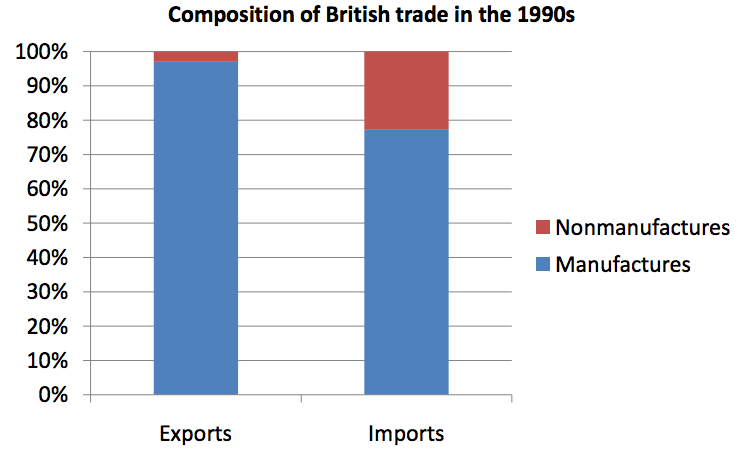
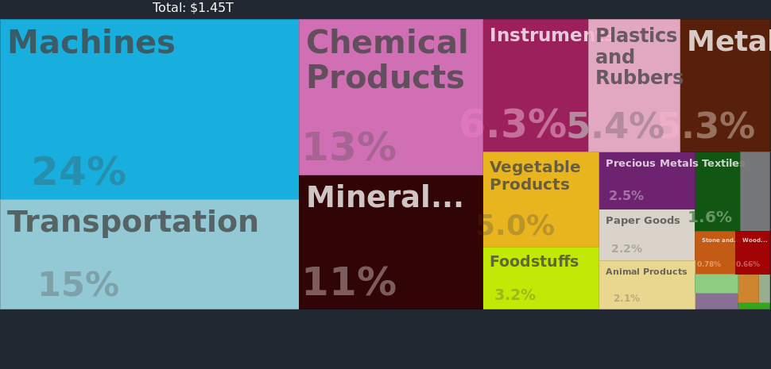
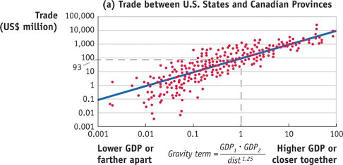

```{r setup, include=FALSE}
options(htmltools.dir.version = FALSE)
knitr::opts_chunk$set(echo=F,
                      message=F,
                      warning=F,
                      fig.retina = 3,
                      fig.align = "center")
library("tidyverse")
library("ggrepel")
library("fontawesome")
xaringanExtra::use_tile_view()
xaringanExtra::use_tachyons()
xaringanExtra::use_freezeframe()
xaringanExtra::use_progress_bar()

update_geom_defaults("label", list(family = "Fira Sans Condensed"))
update_geom_defaults("text", list(family = "Fira Sans Condensed"))

set.seed(256)

theme_slides <- theme_light() + 
  theme(
    text = element_text(family = "Fira Sans", size = 24)
  )

```

class: title-slide

# 1.11 — New Trade Theory

## ECON 324 • International Trade • Spring 2023

### Ryan Safner<br> Associate Professor of Economics <br> <a href="mailto:safner@hood.edu"><i class="fa fa-paper-plane fa-fw"></i>safner@hood.edu</a> <br> <a href="https://github.com/ryansafner/tradeS23"><i class="fa fa-github fa-fw"></i>ryansafner/tradeS23</a><br> <a href="https://tradeS23.classes.ryansafner.com"> <i class="fa fa-globe fa-fw"></i>tradeS23.classes.ryansafner.com</a><br>

---

class: inverse

# Outline

### [Trade Puzzles](#3)

### [The Gravity Model of Trade](#21)

### [New Trade Theory](#27)

### [Internal Economies of Scale](#41)

### [External Economies of Scale](#41)

---

class: inverse, center, middle

# Trade Puzzles

---

# Trade Puzzles

.pull-left[
.center[

]
]

.pull-right[
.center[


]
]

.center[
Ricardian comparative advantage
]

---

# Trade Puzzles

.pull-left[
.center[

]
]

.pull-right[
.center[


]
]

.center[
Hecksher-Ohlin factor endowments
]

---

# Upending the Classic Paradigm

.pull-left[
.center[


U.S. exports to Japan
]
]

.pull-right[
.center[


Japan exports to U.S.
]
]

.center[
???
]

---

# Intra-Industry Trade

.pull-left[

- .hi[Intra-industry trade]: share of international trade (exports + imports) that takes place *within* the same industry (across countries) rather than *across* industries

]

.pull-right[
.center[


]
]

---

# Intra-Industry Trade

.pull-left[

- .hi[Intra-industry trade]: share of international trade (exports + imports) that takes place *within* the same industry (across countries) rather than *across* industries

- Measured by the .hi-purple[Grubel-Lloyd Index (GLI)]:

$$GLI = 1 - \frac{\vert X_i - M_i \vert}{X_i + M_i}$$

where $X$ is exports, $M$ is imports, for industry $i$
]

.pull-right[
.center[


]
]

---

# Grubel-Lloyd Index

.pull-left[
$$GLI = 1 - \frac{\vert X_i - M_i \vert}{X_i + M_i}$$

.content-box-green[
.hi-green[Example:] suppose a country exports good $i$ but does not import good $i$:

$$GLI = 1 - 1 = 0$$

- No intra-industry trade; only inter-industry trade
]
]

.pull-right[
.center[

]
]
---

# Grubel-Lloyd Index

.pull-left[
$$GLI = 1 - \frac{\vert X_i - M_i \vert}{X_i + M_i}$$

.content-box-green[
.hi-green[Example:] same for a good a country imports but does not export:

$$GLI = 1 - 1 = 0$$

- No intra-industry trade; only inter-industry trade
]
]

.pull-right[
.center[

]
]

---

# Grubel-Lloyd Index

.pull-left[
$$GLI = 1 - \frac{\vert X_i - M_i \vert}{X_i + M_i}$$

.content-box-green[
.hi-green[Example:] what if a country’s exports of $i \approx$ its imports of $i$?

$$GLI = 1 - \frac{0}{X_i+M_i} = 1$$

- Only intra-industry trade, no inter-industry trade

]

]

.pull-right[
.center[

]
]

---

# Grubel-Lloyd Index

.pull-left[
$$GLI = 1 - \frac{\vert X_i - M_i \vert}{X_i + M_i}$$

- .hi-purple[GLI mesaures how closely exports & imports are *matched* within an industry]
]

.pull-right[
.center[

]
]

---
# Grubel-Lloyd Index: Example I

.pull-left[
$$GLI = 1 - \frac{\vert X_i - M_i \vert}{X_i + M_i}$$

.content-box-green[
.hi-green[Example:] In 2010, the U.S. exported $170 million and imported $1.9 billion worth of raw sugar cane.

$$GLI = 1 - \frac{\vert 0.170-1.900\vert}{0.170+1.900} = 0.164$$

- Little intra-industry trade

]
]

.pull-right[
.center[

]
]

---

# Grubel-Lloyd Index: Example II

.pull-left[
$$GLI = 1 - \frac{\vert X_i - M_i \vert}{X_i + M_i}$$

.content-box-green[
.hi-green[Example:] In 2010, the U.S. exported $1 billion and imported $1.2 billion worth of aircraft.

$$GLI = 1 - \frac{\vert 1.000-1.200\vert}{1.000+1.200} = 0.909$$

- Mostly intra-industry trade

]
]

.pull-right[
.center[

]
]

---

# The Dilemma of Similar Trade

.center[

]

.source[Brulhart, Marius, 2009, “An Account of Global Intra-industry Trade, 1962-2006,” *The World Economy* 32(2):401-459]

---

# The Dilemma of Similar Trade

.center[

]

.source[Krugman, Paul, Maurice Obstfeld, and Mark Melitz, 2011, *International Economics: Theory & Policy*, 9th ed., p.169]


---

# The Dilemma of Similar Trade

.center[

]

.source[Krugman, Paul, Maurice Obstfeld, and Mark Melitz, 2011, *International Economics: Theory & Policy*, 9th ed., p.169]

---

# The Dilemma of Similar Trade

.center[

]

.smallest[Total share of IIT by country (out of 100%): sum over all industries, weighing each industry by its share of total trade]

.source[Krugman, Paul, 2008, “The Increasing Returns Revolution in Trade and Geography,” *Nobel Prize Lecture*]

---

# The Dilemma of Similar Trade

.pull-left[
.center[

]
]

--

.pull-right[
.center[

]

]

.source[Krugman, Paul, 2008, “The Increasing Returns Revolution in Trade and Geography,” *Nobel Prize Lecture*, p. 336-7]

---

# The Dilemma of Similar Trade


.center[

]

.source[Krugman, Paul, 2008, “The Increasing Returns Revolution in Trade and Geography,” *Nobel Prize Lecture*, p.337]

---

# What We *Export*

.center[

]
.source[U.S. Exports: [MIT Observatory of Economic Complexity](http://atlas.media.mit.edu/en/profile/country/usa/)]

---

# What We *Import*

.center[

]
.source[U.S. Imports: [MIT Observatory of Economic Complexity](http://atlas.media.mit.edu/en/profile/country/usa/)]

---

# Who We Trade With (Exports) Has Changed

<iframe src="https://ourworldindata.org/grapher/merchandise-exports-by-continent?stackMode=relative&country=~USA" loading="lazy" style="width: 100%; height: 500px; border: 0px none;"></iframe>

---

class: inverse, center, middle

# The Gravity Model of Trade

---

# The Gravity Model of Trade

.pull-left[

- One way to estimate the volume of trade flows is with a .hi[gravity model of trade]

- Almost identically analogous to Newton’s model of gravitational attraction 

$$F_{1,2}=G\frac{m_1m_2}{r^2}$$

]

.pull-right[
.center[

]
]

---

# The Gravity Model of Trade

.pull-left[

$$Trade_{i,j}=A\frac{M_iM_j}{(D_{i,j})^n}$$
.smallest[

- Volume of trade estimated between country $i$ and country $j$
- $A$: a universal constant

- $M$: size of a country's economy (often GDP)

- $D$: distance between country $i$ and country $j$
  - Power of distance: distance becomes a hinderance to trade at an increasing rate
  - "Distance" need not be just length (e.g. miles, km), but relative to alternatives 
]

]

.pull-right[
.center[

]
]

---

# Gravity

.center[

]

.source[Krugman, Paul, Maurice Obstfeld, and Mark Melitz, 2011, *International Economics: Theory & Policy*, 9th ed., p.12]


---

# Gravity

.center[

]

.source[Krugman, Paul, Maurice Obstfeld, and Mark Melitz, 2011, *International Economics: Theory & Policy*, 9th ed., p.14]

---

# Gravity: Distance Matters

.pull-left[

- Consider trade between **Australia & New Zealand** and between **Austria & Portugal**

- Both pairs have roughly same distance apart and roughly same GDPs

- Trade between Australia and New Zealand is **9x higher** than trade between Austria & Portugal!

- Fewer alternatives in isolated Pacific Ocean relative to European countries with many trading partners

]


.pull-right[
.center[


]
]

---

# Gravity: Size & Distance Matters!

.center[

]

.source[Feenstra and Taylor (2017)]

---

# Gravity: Size & Distance Matters!

.center[

]

.source[Feenstra and Taylor (2017)]

---

# Gravity: Apparently Distance Matters *More Now!*

$$Trade_{i,j}=A\frac{M_iM_j}{(D_{i,j})^2}$$

.center[


.smallest[
Trade is becoming more sensitive to distance over time!
]]

.source[Krugman, Paul, 2008, “The Increasing Returns Revolution in Trade and Geography,” *Nobel Prize Lecture*]

---

# Gravity Always Wins

.center[

]
- **"The gravity equation is one of the best fitting and most established empirical relationships in all of Trade."** 

.source[Lai, Huiwen and Daniel Treffler, 2002, “The Gains from Trade with Monopolistic Competition: Specification, Estimation, and Mis-Specification”, *NBER Working Paper* 9169]

---

# Gravity

.pull-left[
- Implications of Gravity Models:

.hi-purple[1) Larger countries trade more with larger countries]

.hi-purple[2) Closer countries trade more than distant countries]

]

.pull-right[
.center[

]
]

---

# Gravity vs. H-O Theory

.pull-left[
.smallest[
- .hi-purple[Is gravity consistent with H-O theory?]
  - If trade drops off with distance, would require very strongly differentiated products to get trade off the ground

- It used to be that most international trade was between countries very far apart for different things
    - e.g. Britain imported wheat from Argentina, mutton from New Zealand

- Now it seems to be that trade is dominated by very close countries trading very similar goods!
    - Britain now both exports and imports airplanes to/from France and Germany
]
]

.pull-right[
.center[

]
]

---

class: inverse, center, middle

# New Trade Theory

---

# A New Paradigm in International Trade

.pull-left[
.smallest[
- In a **Neoclassical** world, only differences in **relative autarky prices** cause international trade via specialization by **comparative advantage**
  - **Ricardian** differences in labor productivity
  - **Hecksher-Ohlin** differences in factor endowments

- Suggests that:
  - "**Different**" countries should trade **more**
  - "**Different**" countries should specialize in "**different**" goods
  - Countries gain more from trading with **more-distant** countries 
]
]

.pull-right[
.center[


]
]

---

# A New Paradigm in International Trade

.pull-left[
- The **real world** (particularly last 50 years) shows:

- The bulk of international trade is between **similar** countries

- These countries tend to trade **similar** goods

- Countries are *more likely than ever before* to trade more with **less-distant** countries 
]

.pull-right[
.center[


]
]

---

# New Trade Theory

.pull-left[
.smallest[
- Explanations for similar trade and a "new paradigm" of trade are collectively called .hi[New Trade Theory (NTT)]

- Primarily rests upon the idea of .hi-purple[increasing returns to scale (IRS)] or .hi-purple[economies of scale (EOS)] as an alternative rationale for international trade
  - Countries can specialize in something, even if they have no *ex ante* comparative advantage
  - Large output creates a comparative advantage *ex post* due to lower costs than other countries 

]
]

.pull-right[
.center[

]
]

---

# New Trade Theory

.pull-left[

- .hi-purple[Division of labor] strikes back! 

- Importance is still .hi-purple[specialization], just not labor productivity, factor content, etc.
]


.pull-right[
.center[

]
]

---

# Economies of Scale

.pull-left[
.smaller[
- Economies of scale come in two flavors:

- .hi-purple[*Internal* economies]: firm-level features that improve a **firm's** productivity, often leading to market power for that firm 
  - e.g. firm produces more and lowers its average costs

- .hi-purple[*External* economies]: industry-wide features that spill over to the productivity **all** firms in the industry
  - e.g. more firms producing more lowers **all firms'** average costs

]
]

.pull-right[
.center[

]
]

---

class: inverse, center, middle

# Internal Economies of Scale

---

# Internal Economies of Scale I

.pull-left[
.smaller[
- Recall: .hi-purple[economies of scale]: as $\uparrow q$, $\downarrow AC(q)$

- .hi-purple[Minimum Efficient Scale (MES)]: $q$ with the lowest $AC(q)$
]
]

.pull-right[

```{r, fig.retina=3}
demand<-function(x){20-2*x}

mes_plot<-ggplot(data.frame(x=c(0,10)), aes(x=x))+
  stat_function(fun=demand, geom="line", size=2, color="blue")+
  geom_label(x = 9, y=demand(9), color = "blue", size = 5, label = "Demand")+
    scale_x_continuous(breaks=seq(0,10,1),
                     limits=c(0,10),
                     expand=expand_scale(mult=c(0,0.1)))+
  scale_y_continuous(breaks=seq(0,20,2),
                     limits=c(0,20),
                     labels=scales::dollar,
                     expand=expand_scale(mult=c(0,0.1)))+
  labs(x = "Quantity (thousands)",
       y = "Price")+
  theme_classic(base_family = "Fira Sans Condensed", base_size=20)+
  theme(legend.position = "bottom")
mes_plot
```
]

---

# Internal Economies of Scale I

.pull-left[
.smaller[
- Recall: .hi-purple[economies of scale]: as $\uparrow q$, $\downarrow AC(q)$

- .hi-purple[Minimum Efficient Scale (MES)]: $q$ with the lowest $AC(q)$

- If MES is small relative to market demand...
  - .orange[AC] hits .blue[Market demand] during **diseconomies of scale**...
]
]

.pull-right[

```{r, fig.retina=3}
tiny_mes<-function(x){(4*x-2)^(2)+12}

mes_plot+
  stat_function(fun=tiny_mes, geom="line", size=2, color="orange")+
  geom_segment(x=0, xend=4, y=12, yend=12, size=1, linetype="dashed")+
  geom_segment(x=4, xend=4, y=12, yend=0, size=1, linetype="dashed")+
  geom_label(x=2.5, y=12, label="MES (Competitive)", color="orange", size=5)
```
]

---

# Internal Economies of Scale

.pull-left[

- .hi[Minimum Efficient Scale]: $q$ with the lowest $AC(q)$

- .hi-green[Economies of Scale]: $\uparrow q$, $\downarrow AC(q)$

- .hi-red[Diseconomies of Scale]: $\uparrow q$, $\uparrow AC(q)$
]

.pull-right[

```{r, fig.retina=3}
ac_mes<-function(x){(x-5)^2+4}

ggplot(data.frame(x=c(0,10)), aes(x=x))+
  stat_function(fun=ac_mes, geom="line", size=2, color="orange")+
  geom_label(x=8, y=ac_mes(8), color="orange", size=6, label="AC(q)")+
  geom_segment(x=5, xend=5, y=0, yend=4, linetype="dotted", size =1)+
  geom_label(x=5, y=2, size=6, label="M.E.S.")+
    scale_x_continuous(breaks=seq(0,10,1),
                     limits=c(0,10),
                     expand=expand_scale(mult=c(0,0.1)))+
  scale_y_continuous(breaks=seq(0,20,2),
                     limits=c(0,20),
                     expand=expand_scale(mult=c(0,0.1)))+
  
  annotate("segment", x = 1, xend = 4, y = 14, yend = 2, color = "green", size=2, alpha=0.9, arrow=arrow(length=unit(0.5,"cm"), ends="last", type="closed"))+
    geom_label(x=2, y=4, size=6, label="Economies", color="green")+

  annotate("segment", x = 6, xend = 9, y = 2, yend = 14, color = "red", size=2, alpha=0.9, arrow=arrow(length=unit(0.5,"cm"), ends="last", type="closed"))+
    geom_label(x=8, y=4, size=6, label="Diseconomies", color="red")+
  labs(x = "Output, q",
       y = "Costs per Unit ($)")+
  theme_classic(base_family = "Fira Sans Condensed", base_size=20)+
  theme(legend.position = "bottom")
```
]


---

# Internal Economies of Scale I

.pull-left[
.smaller[
- If MES is small relative to market demand...
  - .orange[AC] hits .blue[Market demand] during **diseconomies of scale**...
  - .hi-purple[...can fit more identical firms into the industry!]
]

]

.pull-right[

```{r, fig.retina=3}
tiny_mes_2<-function(x){(4*x-4)^(2)+12}
tiny_mes_3<-function(x){(4*x-6)^(2)+12}
tiny_mes_4<-function(x){(4*x-8)^(2)+12}
tiny_mes_5<-function(x){(4*x-10)^(2)+12}
tiny_mes_6<-function(x){(4*x-12)^(2)+12}
tiny_mes_7<-function(x){(4*x-14)^(2)+12}
tiny_mes_8<-function(x){(4*x-16)^(2)+12}

mes_plot+
  stat_function(fun=tiny_mes, geom="line", size=2, color="orange")+
  stat_function(fun=tiny_mes_2, geom="line", size=2, color="orange")+
  stat_function(fun=tiny_mes_3, geom="line", size=2, color="orange")+
  stat_function(fun=tiny_mes_4, geom="line", size=2, color="orange")+
  stat_function(fun=tiny_mes_5, geom="line", size=2, color="orange")+
  stat_function(fun=tiny_mes_6, geom="line", size=2, color="orange")+
  stat_function(fun=tiny_mes_7, geom="line", size=2, color="orange")+
  stat_function(fun=tiny_mes_8, geom="line", size=2, color="orange")+
  geom_segment(x=0, xend=4, y=12, yend=12, size=1, linetype="dashed")+
  geom_segment(x=4, xend=4, y=12, yend=0, size=1, linetype="dashed")+
  
  geom_rect(xmin=0, xmax=0.5, ymin=0, ymax=12, alpha = 0.5, fill = "#F0F921FF")+
  geom_rect(xmin=0.5, xmax=1, ymin=0, ymax=12, alpha = 0.5, fill = "#FCA636FF")+
  geom_rect(xmin=1, xmax=1.5, ymin=0, ymax=12, alpha = 0.5, fill = "#E16462FF")+
  geom_rect(xmin=1.5, xmax=2, ymin=0, ymax=12, alpha = 0.5, fill = "#B12A90FF")+
  geom_rect(xmin=2.0, xmax=2.5, ymin=0, ymax=12, alpha = 0.5, fill = "#6A00A8FF")+
  geom_rect(xmin=2.5, xmax=3, ymin=0, ymax=12, alpha = 0.5, fill = "#0D0887FF")+
  geom_rect(xmin=3, xmax=3.5, ymin=0, ymax=12, alpha = 0.5, fill = "#7AD151FF")+
  geom_rect(xmin=3.5, xmax=4, ymin=0, ymax=12, alpha = 0.5, fill = "#2A788EFF")+
  
  geom_segment(x=0.5, xend=0.5, y=12, yend=0, linetype = "dotted", size = 1)+
  geom_segment(x=1.0, xend=1.0, y=12, yend=0, linetype = "dotted", size = 1)+
  geom_segment(x=1.5, xend=1.5, y=12, yend=0, linetype = "dotted", size = 1)+
  geom_segment(x=2.0, xend=2.0, y=12, yend=0, linetype = "dotted", size = 1)+
  geom_segment(x=2.5, xend=2.5, y=12, yend=0, linetype = "dotted", size = 1)+
  geom_segment(x=3.0, xend=3.0, y=12, yend=0, linetype = "dotted", size = 1)+
  geom_segment(x=3.5, xend=3.5, y=12, yend=0, linetype = "dotted", size = 1)+
  
  geom_text(x = 0.25, y = 5, label = "Firm 1", angle = 90, color = "white")+
  geom_text(x = 0.75, y = 5, label = "Firm 2", angle = 90, color = "white")+
  geom_text(x = 1.25, y = 5, label = "Firm 3", angle = 90, color = "white")+
  geom_text(x = 1.75, y = 5, label = "Firm 4", angle = 90, color = "white")+
  geom_text(x = 2.25, y = 5, label = "Firm 5", angle = 90, color = "white")+
  geom_text(x = 2.75, y = 5, label = "Firm 6", angle = 90, color = "white")+
  geom_text(x = 3.25, y = 5, label = "Firm 7", angle = 90, color = "white")+
  geom_text(x = 3.75, y = 5, label = "Firm 8", angle = 90, color = "white")+
  geom_label(x=2.5, y=12, label="MES (Competitive)", color="orange", size=5)+
  scale_x_continuous(breaks = c(4),
                     labels = c(expression(q[c])),
                     limits=c(0,10),
                     expand=expand_scale(mult=c(0,0.1)))+
  scale_y_continuous(breaks = c(12),
                     labels = c(expression(p[c])),
                     limits=c(0,20),
                     expand=expand_scale(mult=c(0,0.1)))
```
]

---

# Internal Economies of Scale I

.pull-left[

- If MES is *large* relative to market demand...
  - .red[AC] hits .blue[Market demand] during **_economies_ of scale**...
  - .hi-purple[likely to be a single firm in the industry!]

]

.pull-right[

```{r, fig.retina=3}
big_mes<-function(x){(0.25*x-2)^(2)+4}

mes_plot+
  stat_function(fun=tiny_mes, geom="line", size=2, color="orange")+
  stat_function(fun=tiny_mes_2, geom="line", size=2, color="orange")+
  stat_function(fun=tiny_mes_3, geom="line", size=2, color="orange")+
  stat_function(fun=tiny_mes_4, geom="line", size=2, color="orange")+
  stat_function(fun=tiny_mes_5, geom="line", size=2, color="orange")+
  stat_function(fun=tiny_mes_6, geom="line", size=2, color="orange")+
  stat_function(fun=tiny_mes_7, geom="line", size=2, color="orange")+
  stat_function(fun=tiny_mes_8, geom="line", size=2, color="orange")+
  geom_segment(x=0, xend=4, y=12, yend=12, size=1, linetype="dashed")+
  geom_segment(x=4, xend=4, y=12, yend=0, size=1, linetype="dashed")+
  geom_label(x=2.5, y=12, label="MES (Competitive)", color="orange", size=5)+
  stat_function(fun=big_mes, geom="line", size=2, color="red")+
  geom_segment(x=0, xend=8, y=4, yend=4, size=1, linetype="dashed")+
  geom_segment(x=8, xend=8, y=4, yend=0, size=1, linetype="dashed")+
  geom_label(x=2.5, y=4, label="MES (Monopoly)", color="red", size=5)
```
]


---

# Internal Economies of Scale I

.pull-left[

- If MES is *large* relative to market demand...
  - .red[AC] hits .blue[Market demand] during **_economies_ of scale**...
  - .hi-purple[likely to be a single firm in the industry!]

- A .hi[natural monopoly] that can produce higher $q^*$ and lower $p^*$ than a competitive industry!

]

.pull-right[

```{r, fig.retina=3}
big_mes<-function(x){(0.25*x-2)^(2)+4}

mes_plot+
  stat_function(fun=tiny_mes, geom="line", size=2, color="orange")+
  stat_function(fun=tiny_mes_2, geom="line", size=2, color="orange")+
  stat_function(fun=tiny_mes_3, geom="line", size=2, color="orange")+
  stat_function(fun=tiny_mes_4, geom="line", size=2, color="orange")+
  stat_function(fun=tiny_mes_5, geom="line", size=2, color="orange")+
  stat_function(fun=tiny_mes_6, geom="line", size=2, color="orange")+
  stat_function(fun=tiny_mes_7, geom="line", size=2, color="orange")+
  stat_function(fun=tiny_mes_8, geom="line", size=2, color="orange")+
  geom_segment(x=0, xend=4, y=12, yend=12, size=1, linetype="dashed")+
  geom_segment(x=4, xend=4, y=12, yend=0, size=1, linetype="dashed")+
  geom_label(x=2.5, y=12, label="MES (Competitive)", color="orange", size=5)+
  stat_function(fun=big_mes, geom="line", size=2, color="red")+
  geom_segment(x=0, xend=8, y=4, yend=4, size=1, linetype="dashed")+
  geom_segment(x=8, xend=8, y=4, yend=0, size=1, linetype="dashed")+
  geom_label(x=2.5, y=4, label="MES (Monopoly)", color="red", size=5)
```
]

---

# Internal Economies of Scale II

.pull-left[
.content-box-green[
.green[**Example**]: Imagine a single isolated condo complex with 1,000 units far from any other buildings or telco infrastructure

- **Fixed costs**: laying cable to the complex is $100,000
- **Marginal costs**: connecting each unit: $0
]
]

.pull-right[

.center[

]
]

---

# Internal Economies of Scale II

.pull-left[
- Suppose .hi-purple[10 providers] split the complex, each laying down their own cables, and each serving 100 units:

$$\mathbf{\text{Average cost}}=\frac{\$100,000}{100}=\$1,000 \text{/subscriber}$$

]
.pull-right[

.center[

]
]

---

# Internal Economies of Scale II

.pull-left[

- Suppose .hi-purple[1 provider] serves the complex serving all 1,000 units:

$$\mathbf{\text{Average cost}}=\frac{\$100,000}{1000}=\$100 \text{/subscriber}$$

]
.pull-right[

.center[

]
]

---

class: inverse, center, middle

# External Economies of Scale

---

# Entry/Exit Effects on Market Price

.pull-left[
.smallest[
- When **all firms produce more/less**; or **firms enter or exit** an industry, this .hi-purple[affects the equilibrium market price]

- Think about basic supply & demand graphs:
  - .hi-purple[Entry]: $\color{red}{\uparrow}$ .red[industry supply] $\implies$ $\uparrow q, \downarrow p$
  - .hi-purple[Exit]: $\color{red}{\downarrow}$ .red[industry supply] $\implies$ $\downarrow q, \uparrow p$

- If the size of the entire industry affects all individual firm’s costs, then there are .hi[*external* economies] effects
  - Cost externalities that spill over across all firms in an industry

]
]

.pull-right[
```{r}
demand_1=function(x){10-x}
supply_1=function(x){x}

changes<-ggplot(data.frame(x=c(0,10)), aes(x=x))+
  stat_function(fun=demand_1, geom="line", size=2, color = "blue")+
    geom_label(aes(x=9,y=demand_1(9)), color = "blue", label="Demand 1", size = 5)+
  stat_function(fun=supply_1, geom="line", size=2, color = "red")+
    geom_label(aes(x=9,y=supply_1(9)), color = "red", label="Supply 1", size = 5)+
  geom_segment(x=0, xend=5, y=5, yend=5, size=1, linetype="dotted")+
  geom_segment(x=5, xend=5, y=0, yend=5, size=1, linetype="dotted")+
    scale_x_continuous(breaks=seq(0,10,1),
                     limits=c(0,10),
                     expand=expand_scale(mult=c(0,0.1)))+
  scale_y_continuous(breaks=seq(0,10,1),
                     limits=c(0,10),
                     expand=expand_scale(mult=c(0,0.1)),
                     labels = function(x){paste("$", x, sep="")})+
  labs(x = "Quantity (q)",
       y = "Price (p)")+
  theme_classic(base_family = "Fira Sans Condensed", base_size=20)

supply_up=function(x){-2+x}
supply_down=function(x){x+2}

changes+
  stat_function(fun=supply_up, geom="line", size=2, color = "pink")+
    geom_label(aes(x=9,y=supply_up(9)), color = "pink", label="Supply 2", size = 5)+
  stat_function(fun=supply_down, geom="line", size=2, color = "darkred")+
    geom_label(aes(x=7,y=supply_down(7)), color = "darkred", label="Supply 3", size = 5)
```

]

---

# External Economies I

.pull-left[
.smallest[
- .shout[Decreasing cost industry] has *external economies*, costs fall for all firms in the industry as industry output increases (firms enter & incumbents produce more)

- A *downward sloping long-run industry supply curve*!

- Determinants:
  - High fixed costs, low marginal costs
  - Economies of scale

- Examples: geographic clusters, public utilities, infrastructure, entertainment

- **Tends towards "natural" monopoly**

]
]

.pull-right[
.center[


]
]

---

# Decreasing Cost Industry (External Economies) II

.pull-left[
```{r, fig.retina=3, fig.height=5}
demand<-function(x){10-x}
supply<-function(x){x}
demand_firm<-function(x){10}
mc_cc<-function(x){3*x^2-8*x+9}
ac_cc<-function(x){x^2-4*x+10+10/x}

ggplot(data.frame(x=c(0,10)), aes(x=x))+
  stat_function(fun=demand_firm, geom="line", size=2, color = "blue")+
  geom_label(aes(x=4.5,y=demand_firm(4.5)), color = "blue", label="Demand", size = 5)+
    stat_function(fun=mc_cc, geom="line", size=2, color = "red")+
  geom_label(aes(x=3.5,y=mc_cc(3.5)), color = "red", label="MC(q)", size = 5)+
    stat_function(fun=ac_cc, geom="line", size=2, color = "orange")+
  geom_label(aes(x=4.5,y=ac_cc(4.5)), color = "orange", label="MC(q)", size = 5)+
  geom_segment(x=2.8, xend=2.8, y=0, yend=10, size=1, linetype="dotted")+
    scale_x_continuous(breaks=NULL,
                     limits=c(0,5),
                     expand=expand_scale(mult=c(0,0.1)))+
  scale_y_continuous(breaks=NULL,
                     limits=c(0,20),
                     expand=expand_scale(mult=c(0,0.1)))+
  guides(fill=F)+
  labs(title = "Representative Firm",
       x = "Quantity",
       y = "Price")+
  theme_classic(base_family = "Fira Sans Condensed", base_size=20)
```
]

.pull-right[
```{r, fig.retina=3, fig.height=5}
ggplot(data.frame(x=c(0,10)), aes(x=x))+
  stat_function(fun=demand, geom="line", size=2, color = "blue")+
    geom_label(aes(x=9,y=demand(9)), color = "blue", label="Demand", size = 5)+
  stat_function(fun=supply, geom="line", size=2, color = "red")+
    geom_label(aes(x=9,y=supply(9)), color = "red", label="Supply", size = 5)+
  geom_segment(x=5, xend=5, y=0, yend=5, size=1, linetype="dotted")+
  geom_segment(x=0, xend=5, y=5, yend=5, size=1, linetype="dotted")+
  
  # point A
  geom_point(x = 5, y = 5, size=3)+
  geom_text(x = 5, y = 5.5, label = "A", size=5)+
  
    scale_x_continuous(breaks=NULL,
                     limits=c(0,10),
                     expand=expand_scale(mult=c(0,0.1)))+
  scale_y_continuous(breaks=NULL,
                     limits=c(0,10),
                     expand=expand_scale(mult=c(0,0.1)))+
  guides(fill=F)+
  labs(title = "Industry",
       x = "Quantity",
       y = "Price")+
  theme_classic(base_family = "Fira Sans Condensed", base_size=20)
```
]

- Industry equilibrium: firms earning normal $\pi=0, p=MC(q)=AC(q)$


---

# Decreasing Cost Industry (External Economies) III

.pull-left[
```{r, fig.retina=3, fig.height=5}
demand<-function(x){10-x}
supply<-function(x){x}
demand_firm<-function(x){10}
mc_cc<-function(x){3*x^2-8*x+9}
ac_cc<-function(x){x^2-4*x+10+10/x}

ggplot(data.frame(x=c(0,10)), aes(x=x))+
  stat_function(fun=demand_firm, geom="line", size=2, color = "blue")+
  geom_label(aes(x=4.5,y=demand_firm(4.5)), color = "blue", label="Demand", size = 5)+
    stat_function(fun=mc_cc, geom="line", size=2, color = "red")+
  geom_label(aes(x=3.5,y=mc_cc(3.5)), color = "red", label="MC(q)", size = 5)+
    stat_function(fun=ac_cc, geom="line", size=2, color = "orange")+
  geom_label(aes(x=4.5,y=ac_cc(4.5)), color = "orange", label="MC(q)", size = 5)+
  geom_segment(x=2.8, xend=2.8, y=0, yend=10, size=1, linetype="dotted")+
    scale_x_continuous(breaks=NULL,
                     limits=c(0,5),
                     expand=expand_scale(mult=c(0,0.1)))+
  scale_y_continuous(breaks=NULL,
                     limits=c(0,20),
                     expand=expand_scale(mult=c(0,0.1)))+
  guides(fill=F)+
  labs(title = "Representative Firm",
       x = "Quantity",
       y = "Price")+
  theme_classic(base_family = "Fira Sans Condensed", base_size=20)
```
]

.pull-right[
```{r, fig.retina=3, fig.height=5}
demand_new<-function(x){14-x}

ggplot(data.frame(x=c(0,10)), aes(x=x))+
  stat_function(fun=demand, geom="line", size=2, color = "blue")+
    geom_label(aes(x=9,y=demand(9)), color = "blue", label="Demand", size = 5)+
  stat_function(fun=demand_new, geom="line", size=2, color = "blue")+
    geom_label(aes(x=5,y=demand_new(5)), color = "blue", label="New Demand", size = 5)+
  stat_function(fun=supply, geom="line", size=2, color = "red")+
    geom_label(aes(x=9,y=supply(9)), color = "red", label="Supply", size = 5)+
  geom_segment(x=5, xend=5, y=0, yend=5, size=1, linetype="dotted")+
  geom_segment(x=0, xend=5, y=5, yend=5, size=1, linetype="dotted")+
  
  # new lines
  geom_segment(x=7, xend=7, y=0, yend=7, size=1, linetype="dotted")+
  geom_segment(x=0, xend=7, y=7, yend=7, size=1, linetype="dotted")+
  
  # point A
  geom_point(x = 5, y = 5, size=3)+
  geom_text(x = 5, y = 5.5, label = "A", size=5)+
  
  # point B
  geom_point(x = 7, y = 7, size=3)+
  geom_text(x = 7, y = 7.5, label = "B", size=5)+
    scale_x_continuous(breaks=NULL,
                     limits=c(0,10),
                     expand=expand_scale(mult=c(0,0.1)))+
  scale_y_continuous(breaks=NULL,
                     limits=c(0,10),
                     expand=expand_scale(mult=c(0,0.1)))+
  guides(fill=F)+
  labs(title = "Industry",
       x = "Quantity",
       y = "Price")+
  theme_classic(base_family = "Fira Sans Condensed", base_size=20)
```
]

- Industry equilibrium: firms earning normal $\pi=0, p=MC(q)=AC(q)$

- Exogenous increase in market demand

---

# Decreasing Cost Industry (External Economies) IV

.pull-left[
```{r, fig.retina=3, fig.height=5}
demand_firm_new=function(x){14}

ggplot(data.frame(x=c(0,10)), aes(x=x))+
  
  # profit
  geom_rect(xmin=0, xmax=3.225,ymin=10.75,ymax=14,fill="green",alpha=0.25)+

  
  stat_function(fun=demand_firm, geom="line", size=2, color = "blue")+
  geom_label(aes(x=4.5,y=demand_firm(4.5)), color = "blue", label="Demand", size = 5)+
  geom_segment(x=3.225, xend=3.225, y=0, yend=14, size=1, linetype="dotted")+

  # new demand
  stat_function(fun=demand_firm_new, geom="line", size=2, color = "blue")+
  geom_label(aes(x=2,y=demand_firm_new(2)), color = "blue", label="New Demand", size = 5)+
  geom_segment(x=2.8, xend=2.8, y=0, yend=10, size=1, linetype="dotted")+

    stat_function(fun=mc_cc, geom="line", size=2, color = "red")+
  geom_label(aes(x=3.5,y=mc_cc(3.5)), color = "red", label="MC(q)", size = 5)+
    stat_function(fun=ac_cc, geom="line", size=2, color = "orange")+
  geom_label(aes(x=4.5,y=ac_cc(4.5)), color = "orange", label="MC(q)", size = 5)+
  annotate("segment", x = 2.8, xend = 3.225, y = 3, yend = 3, color = "purple", size=2, alpha=0.9, arrow=arrow(length=unit(0.5,"cm"), ends="last", type="closed"))+
    scale_x_continuous(breaks=NULL,
                     limits=c(0,5),
                     expand=expand_scale(mult=c(0,0.1)))+
  scale_y_continuous(breaks=NULL,
                     limits=c(0,20),
                     expand=expand_scale(mult=c(0,0.1)))+
  guides(fill=F)+
  labs(title = "Representative Firm",
       x = "Quantity",
       y = "Price")+
  theme_classic(base_family = "Fira Sans Condensed", base_size=20)
```
]

.pull-right[
```{r, fig.retina=3, fig.height=5}
ggplot(data.frame(x=c(0,10)), aes(x=x))+
  stat_function(fun=demand, geom="line", size=2, color = "blue")+
    geom_label(aes(x=9,y=demand(9)), color = "blue", label="Demand", size = 5)+
  stat_function(fun=demand_new, geom="line", size=2, color = "blue")+
    geom_label(aes(x=5,y=demand_new(5)), color = "blue", label="New Demand", size = 5)+
  stat_function(fun=supply, geom="line", size=2, color = "red")+
    geom_label(aes(x=9,y=supply(9)), color = "red", label="Supply", size = 5)+
  geom_segment(x=5, xend=5, y=0, yend=5, size=1, linetype="dotted")+
  geom_segment(x=0, xend=5, y=5, yend=5, size=1, linetype="dotted")+
  
  # new lines
  geom_segment(x=7, xend=7, y=0, yend=7, size=1, linetype="dotted")+
  geom_segment(x=0, xend=7, y=7, yend=7, size=1, linetype="dotted")+
  
  # point A
  geom_point(x = 5, y = 5, size=3)+
  geom_text(x = 5, y = 5.5, label = "A", size=5)+
  
  # point B
  geom_point(x = 7, y = 7, size=3)+
  geom_text(x = 7, y = 7.5, label = "B", size=5)+
    scale_x_continuous(breaks=NULL,
                     limits=c(0,10),
                     expand=expand_scale(mult=c(0,0.1)))+
  scale_y_continuous(breaks=NULL,
                     limits=c(0,10),
                     expand=expand_scale(mult=c(0,0.1)))+
  guides(fill=F)+
  labs(title = "Industry",
       x = "Quantity",
       y = "Price")+
  theme_classic(base_family = "Fira Sans Condensed", base_size=20)
```
]

- **Short run $(A \rightarrow B)$**: industry reaches new equilibrium

- Firms charge higher $p^*$, produce more $q^*$, earn $\pi$

---

# Decreasing Cost Industry (External Economies) V

.pull-left[
```{r, fig.retina=3, fig.height=5}
lowered_mc=function(x){3*x^2-8*x+6}
lowered_ac=function(x){x^2-4*x+8+10/x}
final_demand_d=function(x){8}

ggplot(data.frame(x=c(0,10)), aes(x=x))+
  
  stat_function(fun=demand_firm, geom="line", size=2, color = "blue")+
  geom_label(aes(x=4.5,y=demand_firm(4.5)), color = "blue", label="Demand", size = 5)+
  geom_segment(x=3.225, xend=3.225, y=0, yend=14, size=1, linetype="dotted")+

  # new demand
  stat_function(fun=demand_firm_new, geom="line", size=2, color = "blue")+
  geom_label(aes(x=2,y=demand_firm_new(2)), color = "blue", label="New Demand", size = 5)+
  geom_segment(x=2.8, xend=2.8, y=0, yend=10, size=1, linetype="dotted")+
  geom_segment(x=0, xend=3.225, y=10.75, yend=10.75, size=1, linetype="dotted")+
  
    stat_function(fun=mc_cc, geom="line", size=2, color = "red")+
  geom_label(aes(x=3.5,y=mc_cc(3.5)), color = "red", label="MC(q)", size = 5)+
    stat_function(fun=ac_cc, geom="line", size=2, color = "orange")+
  geom_label(aes(x=4.5,y=ac_cc(4.5)), color = "orange", label="MC(q)", size = 5)+
  
  # increased costs
    stat_function(fun=lowered_mc, geom="line", size=2, color = "red", linetype="dashed")+
    stat_function(fun=lowered_ac, geom="line", size=2, color = "orange", linetype="dashed")+

      scale_x_continuous(breaks=NULL,
                     limits=c(0,5),
                     expand=expand_scale(mult=c(0,0.1)))+
  scale_y_continuous(breaks=NULL,
                     limits=c(0,20),
                     expand=expand_scale(mult=c(0,0.1)))+
  guides(fill=F)+
  labs(title = "Representative Firm",
       x = "Quantity",
       y = "Price")+
  theme_classic(base_family = "Fira Sans Condensed", base_size=20)
```
]

.pull-right[
```{r, fig.retina=3, fig.height=5}
supply_new=function(x){x-4}
ggplot(data.frame(x=c(0,10)), aes(x=x))+
  stat_function(fun=demand, geom="line", size=2, color = "blue")+
    geom_label(aes(x=9,y=demand(9)), color = "blue", label="Demand", size = 5)+
  stat_function(fun=demand_new, geom="line", size=2, color = "blue")+
    geom_label(aes(x=5,y=demand_new(5)), color = "blue", label="New Demand", size = 5)+
  stat_function(fun=supply, geom="line", size=2, color = "red")+
    geom_label(aes(x=9,y=supply(9)), color = "red", label="Supply", size = 5)+
  geom_segment(x=5, xend=5, y=0, yend=5, size=1, linetype="dotted")+
  geom_segment(x=0, xend=5, y=5, yend=5, size=1, linetype="dotted")+
  
  # new lines
  geom_segment(x=7, xend=7, y=0, yend=7, size=1, linetype="dotted")+
  geom_segment(x=0, xend=7, y=7, yend=7, size=1, linetype="dotted")+
  
  # point A
  geom_point(x = 5, y = 5, size=3)+
  geom_text(x = 5, y = 5.5, label = "A", size=5)+
  
  # point B
  geom_point(x = 7, y = 7, size=3)+
  geom_text(x = 7, y = 7.5, label = "B", size=5)+
  
    scale_x_continuous(breaks=NULL,
                     limits=c(0,10),
                     expand=expand_scale(mult=c(0,0.1)))+
  scale_y_continuous(breaks=NULL,
                     limits=c(0,10),
                     expand=expand_scale(mult=c(0,0.1)))+
  guides(fill=F)+
  labs(title = "Industry",
       x = "Quantity",
       y = "Price")+
  theme_classic(base_family = "Fira Sans Condensed", base_size=20)
```
]

- **Long run**: profit attracts entry $\implies$ industry supply will increase

- **But more production lowers costs $(MC, AC)$ for all firms in industry**

---

# Decreasing Cost Industry (External Economies) VI

.pull-left[
```{r, fig.retina=3, fig.height=5}
lowered_mc=function(x){3*x^2-8*x+6}
lowered_ac=function(x){x^2-4*x+8+10/x}
final_demand_d=function(x){8}

ggplot(data.frame(x=c(0,10)), aes(x=x))+
  
  stat_function(fun=demand_firm, geom="line", size=2, color = "blue")+
  geom_label(aes(x=4.5,y=demand_firm(4.5)), color = "blue", label="Demand", size = 5)+
  geom_segment(x=3.225, xend=3.225, y=0, yend=14, size=1, linetype="dotted")+

  # new demand
  stat_function(fun=demand_firm_new, geom="line", size=2, color = "blue")+
  geom_label(aes(x=2,y=demand_firm_new(2)), color = "blue", label="New Demand", size = 5)+
  geom_segment(x=2.8, xend=2.8, y=0, yend=10, size=1, linetype="dotted")+
  geom_segment(x=0, xend=3.225, y=10.75, yend=10.75, size=1, linetype="dotted")+
  
    stat_function(fun=mc_cc, geom="line", size=2, color = "red")+
  geom_label(aes(x=3.5,y=mc_cc(3.5)), color = "red", label="MC(q)", size = 5)+
    stat_function(fun=ac_cc, geom="line", size=2, color = "orange")+
  geom_label(aes(x=4.5,y=ac_cc(4.5)), color = "orange", label="MC(q)", size = 5)+
  
  # increased costs
    stat_function(fun=lowered_mc, geom="line", size=2, color = "red", linetype="dashed")+
    stat_function(fun=lowered_ac, geom="line", size=2, color = "orange", linetype="dashed")+

  # final demand
  stat_function(fun=final_demand_d, geom="line", size=2, color = "blue", linetype="dashed")+
  geom_label(aes(x=1,y=final_demand_d(1)), color = "blue", label="Final Demand", size = 5)+
  geom_segment(x=3, xend=3, y=0, yend=8, size=1, linetype="dotted")+
  annotate("segment", x = 3.225, xend = 3, y = 3, yend = 3, color = "purple", size=2, alpha=0.9, arrow=arrow(length=unit(0.5,"cm"), ends="last", type="closed"))+
      scale_x_continuous(breaks=NULL,
                     limits=c(0,5),
                     expand=expand_scale(mult=c(0,0.1)))+
  scale_y_continuous(breaks=NULL,
                     limits=c(0,20),
                     expand=expand_scale(mult=c(0,0.1)))+
  guides(fill=F)+
  labs(title = "Representative Firm",
       x = "Quantity",
       y = "Price")+
  theme_classic(base_family = "Fira Sans Condensed", base_size=20)
```
]

.pull-right[
```{r, fig.retina=3, fig.height=5}
supply_new_dec=function(x){x-6}

ggplot(data.frame(x=c(0,10)), aes(x=x))+
  stat_function(fun=demand, geom="line", size=2, color = "blue")+
    geom_label(aes(x=9,y=demand(9)), color = "blue", label="Demand", size = 5)+
  stat_function(fun=demand_new, geom="line", size=2, color = "blue")+
    geom_label(aes(x=5,y=demand_new(5)), color = "blue", label="New Demand", size = 5)+
  stat_function(fun=supply, geom="line", size=2, color = "red")+
    geom_label(aes(x=9,y=supply(9)), color = "red", label="Supply", size = 5)+
  stat_function(fun=supply_new_dec, geom="line", size=2, color = "red")+
    geom_label(aes(x=9,y=supply_new_dec(9)), color = "red", label="New Supply", size = 5)+
  geom_segment(x=5, xend=5, y=0, yend=5, size=1, linetype="dotted")+
  geom_segment(x=0, xend=5, y=5, yend=5, size=1, linetype="dotted")+
  
  # new lines
  geom_segment(x=7, xend=7, y=0, yend=7, size=1, linetype="dotted")+
  geom_segment(x=0, xend=7, y=7, yend=7, size=1, linetype="dotted")+
  
  # point A
  geom_point(x = 5, y = 5, size=3)+
  geom_text(x = 5, y = 5.5, label = "A", size=5)+
  
  # point B
  geom_point(x = 7, y = 7, size=3)+
  geom_text(x = 7, y = 7.5, label = "B", size=5)+
  
  # point C
  geom_point(x = 10, y = 4, size=3)+
  geom_text(x = 10, y = 4.5, label = "C", size=5)+
  
  # new lines C
  geom_segment(x=10, xend=10, y=0, yend=4, size=1, linetype="dotted")+
  geom_segment(x=0, xend=10, y=4, yend=4, size=1, linetype="dotted")+
  
    scale_x_continuous(breaks=NULL,
                     limits=c(0,10),
                     expand=expand_scale(mult=c(0,0.1)))+
  scale_y_continuous(breaks=NULL,
                     limits=c(0,10),
                     expand=expand_scale(mult=c(0,0.1)))+
  guides(fill=F)+
  labs(title = "Industry",
       x = "Quantity",
       y = "Price")+
  theme_classic(base_family = "Fira Sans Condensed", base_size=20)
```
]

- **Long run $(B \rightarrow C)$**: firms enter until $\pi=0$ at $p=AC(q)$

- Firms charge higher $p^*$, producer lower $q^*$, earn $\pi=0$

---

# Decreasing Cost Industry (External Economies) VII

.pull-left[
```{r, fig.retina=3, fig.height=5}
lowered_mc=function(x){3*x^2-8*x+6}
lowered_ac=function(x){x^2-4*x+8+10/x}
final_demand_d=function(x){8}

ggplot(data.frame(x=c(0,10)), aes(x=x))+
  
  stat_function(fun=demand_firm, geom="line", size=2, color = "blue")+
  geom_label(aes(x=4.5,y=demand_firm(4.5)), color = "blue", label="Demand", size = 5)+
  geom_segment(x=3.225, xend=3.225, y=0, yend=14, size=1, linetype="dotted")+

  # new demand
  stat_function(fun=demand_firm_new, geom="line", size=2, color = "blue")+
  geom_label(aes(x=2,y=demand_firm_new(2)), color = "blue", label="New Demand", size = 5)+
  geom_segment(x=2.8, xend=2.8, y=0, yend=10, size=1, linetype="dotted")+
  geom_segment(x=0, xend=3.225, y=10.75, yend=10.75, size=1, linetype="dotted")+
  
    stat_function(fun=mc_cc, geom="line", size=2, color = "red")+
  geom_label(aes(x=3.5,y=mc_cc(3.5)), color = "red", label="MC(q)", size = 5)+
    stat_function(fun=ac_cc, geom="line", size=2, color = "orange")+
  geom_label(aes(x=4.5,y=ac_cc(4.5)), color = "orange", label="MC(q)", size = 5)+
  
  # increased costs
    stat_function(fun=lowered_mc, geom="line", size=2, color = "red", linetype="dashed")+
    stat_function(fun=lowered_ac, geom="line", size=2, color = "orange", linetype="dashed")+

  # final demand
  stat_function(fun=final_demand_d, geom="line", size=2, color = "blue", linetype="dashed")+
  geom_label(aes(x=1,y=final_demand_d(1)), color = "blue", label="Final Demand", size = 5)+
  geom_segment(x=3, xend=3, y=0, yend=8, size=1, linetype="dotted")+
  annotate("segment", x = 3.225, xend = 3, y = 3, yend = 3, color = "purple", size=2, alpha=0.9, arrow=arrow(length=unit(0.5,"cm"), ends="last", type="closed"))+
      scale_x_continuous(breaks=NULL,
                     limits=c(0,5),
                     expand=expand_scale(mult=c(0,0.1)))+
  scale_y_continuous(breaks=NULL,
                     limits=c(0,20),
                     expand=expand_scale(mult=c(0,0.1)))+
  guides(fill=F)+
  labs(title = "Representative Firm",
       x = "Quantity",
       y = "Price")+
  theme_classic(base_family = "Fira Sans Condensed", base_size=20)
```
]

.pull-right[
```{r, fig.retina=3, fig.height=5}
lrs_dec=function(x){6-0.2*x}

ggplot(data.frame(x=c(0,10)), aes(x=x))+
  stat_function(fun=demand, geom="line", size=2, color = "blue")+
    geom_label(aes(x=9,y=demand(9)), color = "blue", label="Demand", size = 5)+
  stat_function(fun=demand_new, geom="line", size=2, color = "blue")+
    geom_label(aes(x=5,y=demand_new(5)), color = "blue", label="New Demand", size = 5)+
  stat_function(fun=supply, geom="line", size=2, color = "red")+
    geom_label(aes(x=9,y=supply(9)), color = "red", label="Supply", size = 5)+
  stat_function(fun=supply_new_dec, geom="line", size=2, color = "red")+
    geom_label(aes(x=9,y=supply_new_dec(9)), color = "red", label="New Supply", size = 5)+
  geom_segment(x=5, xend=5, y=0, yend=5, size=1, linetype="dotted")+
  geom_segment(x=0, xend=5, y=5, yend=5, size=1, linetype="dotted")+
  
  # new lines
  geom_segment(x=7, xend=7, y=0, yend=7, size=1, linetype="dotted")+
  geom_segment(x=0, xend=7, y=7, yend=7, size=1, linetype="dotted")+
  
  # point A
  geom_point(x = 5, y = 5, size=3)+
  geom_text(x = 5, y = 5.5, label = "A", size=5)+
  
  # point B
  geom_point(x = 7, y = 7, size=3)+
  geom_text(x = 7, y = 7.5, label = "B", size=5)+
  
  # point C
  geom_point(x = 10, y = 4, size=3)+
  geom_text(x = 10, y = 4.5, label = "C", size=5)+
  
  # new lines C
  geom_segment(x=10, xend=10, y=0, yend=4, size=1, linetype="dotted")+
  geom_segment(x=0, xend=10, y=4, yend=4, size=1, linetype="dotted")+
  
  stat_function(fun=lrs_dec, geom="line", size=4, color = "red")+
  geom_label(aes(x=2,y=lrs_dec(2)), color = "red", label="Long Run Supply", size = 5)+

    scale_x_continuous(breaks=NULL,
                     limits=c(0,10),
                     expand=expand_scale(mult=c(0,0.1)))+
  scale_y_continuous(breaks=NULL,
                     limits=c(0,10),
                     expand=expand_scale(mult=c(0,0.1)))+
  guides(fill=F)+
  labs(title = "Industry",
       x = "Quantity",
       y = "Price")+
  theme_classic(base_family = "Fira Sans Condensed", base_size=20)
```
]

- .red[Long run industry supply curve] is downward sloping!

---

# Internal vs. External Economies of Scale

.left-column[
.center[

.smallest[
Alfred Marshall

1842-1924
]]
]

.right-column[
.smallest[

- Internal economies of scale:

> “...are dependent on the resources of individual houses of business engaged in [the industry], on their organization and the efficiency of their management,” (p.220).

- External economies of scale:

> “...are dependent on the general development of the industry [some of which] depend on the aggregate volume of production of the kind in the neighborhood while others again, especially those connected with the growth of knowledge and the progress of the arts, depend chiefly on the aggregate volume of production in the whole civilized world,” (p.220).

]
.source[Marshall, Alfred, 1890, *Principles of Economics*]

]

---

# Internal vs. External Economies of Scale

.left-column[
.center[

.smallest[
Alfred Marshall

1842-1924
]]
]

.right-column[

- What are some common sources of *external* economies?
  - knowledge spillovers between firms
  - subsidiary supplier industries
  - local pools of skilled labor

> “The most important of these result from the growth of correlated branches of industry which mutually assist one another, perhaps being concentrated in the same localities, but anyhow availing themselves of the modern facilities for communication offered by steam transport, by the telegraph and by the printing press,” (p.264).

.source[Marshall, Alfred, 1890, *Principles of Economics*]

]

---

# External Economies: Geographic Clustering

.pull-left[

]
.pull-right[

]

.smaller[
150 Firms in Dalton, Georgia (pop. 33,000) supply over 70% of entire world’s carpet. Carpet has been made there since 1895.
]

---

# External Economies: Geographic Clustering

.center[

]

.smaller[
990 firms in Hangji China (pop. 36,000) produce 3 billion toothbrushes a year, 80% of Chinese toothbrush production. Toothbrushes have been made there since 1827.
]

---

# External Economies: Geographic Clustering

.pull-left[
.center[

]
]

--

.pull-right[
.center[

]
]

---

# External Economies

.left-column[
.center[

.smallest[
Alfred Marshall

1842-1924
]]
]

.right-column[

> “[G]reat are the advantages which people following the same trade get from near neighborhood...The mysteries of the trade become no mysteries; but are as it were in the air, and children learn many of them unconsciously. Good work is rightly appreciated, inventions and improvement in machinery, in process and the general organization of the business have their merits promptly discussed: if one man starts a new idea, it is taken up by others and combined with suggestions of their own; and thus it becomes the source of further new ideas.”

.source[Marshall, Alfred, 1890, *Principles of Economics*, Ch. 10]
]

---

# External Economies: Examples 

.smallest[
> “[In Silicon Valley] engineers left established semiconductor companies to start firms that manufactured capital goods such as diffusion ovens, step-and-repeat cameras, and testers, and materials and components such as photomasks, testing jigs, and specialized chemicals. . . . This independent equipment sector promoted the continuing formation of semiconductor firms by freeing individual producers from the expense of developing capital equipment internally and by spreading the costs of development. It also reinforced the tendency toward industrial localization, as most of these specialized inputs were not available elsewhere in the country.”
]

--

.smallest[
> “it wasn’t that big a catastrophe to quit your job on Friday and have another job on Monday. . . . You didn’t even necessarily have to tell your wife. You just drove off in another direction on Monday morning”

]

.source[Saxenian, Annalee, 1994, *Regional Advantage*. Cambridge: Harvard University Press, p.40 ]

---

# Division of Labor Strikes Back!

.center[


Adam Smith's pin factory illustration
]

---

# Division of Labor Strikes Back!

.left-column[
.center[


Adam Smith

1723-1790
]
]

.right-column[

> "As it is the power of exchanging that gives occasion to the division of labour, so .hi[the extent of this division must always be limited by...the extent of the market.] When the market is very small, no person can have any encouragement to dedicate himself entirely to one employment, for want of the power to exchange all that surplus part of the produce of his own labour, which is over and above his own consumption, for such parts of the produce of other men's labour as he has occasion for," (Book I, Chapter 3).
]

.source[Smith, Adam, 1776, [*An Enquiry into the Nature and Causes of the Wealth of Nations*](https://www.econlib.org/library/Smith/smWN.html)]

---

# From Perfect Competition to Monopolistic Competition

.pull-left[

- Economies of scale are *inconsistent* with perfect competition!

- Requires us to drop an assumption of perfectly competitive markets

- Instead, new trade theory begins with a foundation of .hi-purple[monopolistic competition]

- We will begin next class with a review of this
]

.pull-right[
.center[

]
]