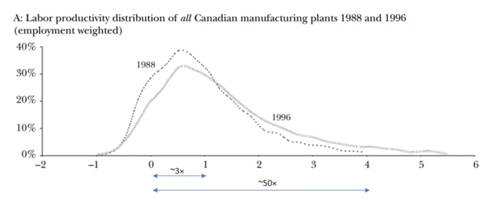

```{r setup, include=FALSE}
options(htmltools.dir.version = FALSE)
knitr::opts_chunk$set(echo=F,
                      message=F,
                      warning=F,
                      fig.retina=3,
                      fig.align="center")
library(tidyverse)
library(ggrepel)
library(mosaic)
set.seed(256)
update_geom_defaults("label", list(family = "Fira Sans Condensed"))
```

class: title-slide

# 1.12 — New Trade Theory II

## ECON 324 • International Trade • Spring 2023

### Ryan Safner<br> Associate Professor of Economics <br> <a href="mailto:safner@hood.edu"><i class="fa fa-paper-plane fa-fw"></i>safner@hood.edu</a> <br> <a href="https://github.com/ryansafner/tradeS23"><i class="fa fa-github fa-fw"></i>ryansafner/tradeS23</a><br> <a href="https://tradeS23.classes.ryansafner.com"> <i class="fa fa-globe fa-fw"></i>tradeS23.classes.ryansafner.com</a><br>

---

class: inverse

# Outline

### [Increasing Returns](#3)

### [Trade and Variety](#14)

### [Monopolistic Competition](#14)

---

class: inverse, center, middle

# Increasing Returns

---

# PPF: Decreasing Costs

.pull-left[

- Increasing returns $\iff$ decreasing costs

- PPF is *convex* to origin

- .hi[Marginal rate of transformation (MRT)] .hi-purple[*decreases*] as we produce more of a good
  - Again: .b[“slope”], .b[“relative price of x”], .b[“opportunity cost of x”]
  - Amount of y given up to get 1 more x

]

.pull-right[
```{r}
points<-tribble(
  ~x, ~y, ~letter,
  0.35, 2.25, "A",
  0, 9.5, "B'",
  4, 0, "B",
  2.125, 4.5, "C"
)
base_ppf_eq=function(x){1/(x+0.325)^2}

IC_1=function(x){0.8/x^{1}}
trade_line=function(x){9.5-2.35*x}
IC_2=function(x){9.75/x^{1}}

base_ppf<-ggplot(tibble(x=0:10), aes(x=x))+

  # PPF 
  stat_function(fun=base_ppf_eq, geom="line", size=2, color = "purple")+
  # annotate("text", x = (0.5*(m/px)+1.75), y = BC(0.5*(m/px)), label = expression(paste("slope =", - l[x]/l[y])), color="blue", size =7)+
  scale_x_continuous(breaks=NULL,
                     limits=c(0,4),
                     expand=expansion(mult=c(0,0.1))
                     )+
  scale_y_continuous(breaks=NULL,
                     limits=c(0,10),
                     expand=expansion(mult=c(0,0.1))
                     )+
  labs(x = "x",
       y = "y")+
  coord_cartesian(clip = "off")+
  theme_classic(base_family = "Fira Sans Condensed", base_size=20)
base_ppf
```

]

---


# PPF: Decreasing Costs

.pull-left[

- To simplify our graph, assume .blue[Home] and .red[Foreign] have identical preferences (same indifference curve), and identical endowments (both start at A)

]

.pull-right[
```{r}
base_ppf+
  stat_function(fun=IC_1, xlim=c(0.125,1.25), geom="line", size=2, color = "blue")+
  geom_point(data = subset(points, letter=="A"), aes(x = x, y = y), size = 5)+
  ggrepel::geom_label_repel(data = subset(points, letter=="A"), aes(x = x, y = y, label = letter), seed =2, hjust = 1.5, vjust = 1.5)
```
]

---

# PPF: Decreasing Costs

.pull-left[

- Countries open up trade, face same relative prices

- Each country exploits economies of scale, producing only one good
  - .blue[Home] produces x, .red[Foreign] produces y
  - Points B and B'
]

.pull-right[


```{r}
base_ppf+
  stat_function(fun=IC_1, xlim=c(0.125,1.25), geom="line", size=2, color = "blue")+
  stat_function(fun=trade_line, geom="line", size=2, linetype="dashed")+
  geom_point(data = subset(points, letter %in% c("A","B", "B'")), aes(x = x, y = y), size = 5)+
  ggrepel::geom_label_repel(data = subset(points, letter %in% c("A","B","B'")), aes(x = x, y = y, label = letter), seed =2, hjust = 1.5, vjust = 1.5)+
  
  annotate("segment", x = 0.5, xend = 3.75, y = 2.25, yend = 0.5, colour = "blue", size=2, alpha=1, arrow=arrow(length=unit(0.5,"cm"), ends="last", type="closed"))+
  annotate("segment", x = 0.35, xend = 0.05, y = 2.75, yend = 9, colour = "red", size=2, alpha=1, arrow=arrow(length=unit(0.5,"cm"), ends="last", type="closed"))
```
]
---

# PPF: Decreasing Costs

.pull-left[

- Countries open up trade, face same relative prices

- Each country exploits economies of scale, producing only one good
  - .blue[Home] produces x, .red[Foreign] produces y
  - Points B and B'

- Trade and reach a higher indifference curve at C
]

.pull-right[


```{r}
base_ppf+
  stat_function(fun=IC_1, xlim=c(0.125,1.25), geom="line", size=2, color = "blue")+
  stat_function(fun=trade_line, geom="line", size=2, linetype="dashed")+
  stat_function(fun=IC_2, geom="line", size=2, color = "darkblue")+
  geom_point(data = points, aes(x = x, y = y), size = 5)+
  ggrepel::geom_label_repel(data = points, aes(x = x, y = y, label = letter), seed =2, hjust = 1.5, vjust = 1.5)
```
]

---


# PPF: Decreasing Costs

.pull-left[

- Countries open up trade, face same relative prices

- Each country exploits economies of scale, producing only one good
  - .blue[Home] produces x, .red[Foreign] produces y
  - Points B and B'

- Trade and reach a higher indifference curve at C
]

.pull-right[


```{r}
base_ppf+
  stat_function(fun=IC_1, xlim=c(0.125,1.25), geom="line", size=2, color = "blue")+
  stat_function(fun=trade_line, geom="line", size=2, linetype="dashed")+
  stat_function(fun=IC_2, geom="line", size=2, color = "darkblue")+
  geom_point(data = points, aes(x = x, y = y), size = 5)+
  ggrepel::geom_label_repel(data = points, aes(x = x, y = y, label = letter), seed =2, hjust = 1.5, vjust = 1.5)+
  
  annotate("segment", x = 0, xend = 0, y = 9.5, yend = 4.5, colour = "magenta", size=2, alpha=1, arrow=arrow(length=unit(0.5,"cm"), ends="last", type="closed"))+

  annotate("segment", x = 4, xend = 2.125, y = 0, yend = 0, colour = "magenta", size=2, alpha=1, arrow=arrow(length=unit(0.5,"cm"), ends="last", type="closed"))
```
]

---

# PPF: Decreasing Costs

.pull-left[

- Countries open up trade, face same relative prices

- Each country exploits economies of scale, producing only one good
  - .blue[Home] produces x, .red[Foreign] produces y
  - Points B and B'

- Trade and reach a higher indifference curve at C
]

.pull-right[


```{r}
base_ppf+
  stat_function(fun=IC_1, xlim=c(0.125,1.25), geom="line", size=2, color = "blue")+
  stat_function(fun=trade_line, geom="line", size=2, linetype="dashed")+
  stat_function(fun=IC_2, geom="line", size=2, color = "darkblue")+
  geom_point(data = points, aes(x = x, y = y), size = 5)+
  ggrepel::geom_label_repel(data = points, aes(x = x, y = y, label = letter), seed =2, hjust = 1.5, vjust = 1.5)+
  
  annotate("segment", x = 0, xend = 0, y = 9.5, yend = 4.5, colour = "magenta", size=2, alpha=1, arrow=arrow(length=unit(0.5,"cm"), ends="last", type="closed"))+
  annotate("segment", x = 0, xend = 2.125, y = 4.5, yend = 4.5, colour = "green", size=2, alpha=1, arrow=arrow(length=unit(0.5,"cm"), ends="last", type="closed"))+
  
  annotate("segment", x = 4, xend = 2.125, y = 0, yend = 0, colour = "magenta", size=2, alpha=1, arrow=arrow(length=unit(0.5,"cm"), ends="last", type="closed"))+
  annotate("segment", x = 2.125, xend = 2.125, y = 0, yend = 4.5, colour = "green", size=2, alpha=1, arrow=arrow(length=unit(0.5,"cm"), ends="last", type="closed"))
```
]

---

# (Anti-)Competitive Implications of Economies of Scale

.pull-left[
### .hi-blue[U.S.]

```{r, fig.height=3.5}
usdemand=function(x){20-2*x}
us_ac=function(x){(0.25*x-2)^(2)+15}

ggplot(tibble(x=0:10), aes(x=x))+

  # PPF 
  stat_function(fun=usdemand, geom="line", size=2, color = "blue")+
  geom_label(x = 8, y = usdemand(8), color = "blue", label = "Demand")+
  stat_function(fun=us_ac, geom="line", size=2, color = "red")+
  geom_label(x = 8, y = us_ac(8), color = "red", label = "AC(q)")+
  
  geom_segment(x = 0, xend = 1, y = 18, yend = 18, size = 1, linetype="dashed")+
  geom_segment(x = 1, xend = 1, y = 18, yend = 0, size = 1, linetype="dashed")+

  scale_x_continuous(breaks=NULL,
                     limits=c(0,10),
                     expand=expansion(mult=c(0,0.1))
                     )+
  scale_y_continuous(breaks=NULL,
                     limits=c(0,20),
                     expand=expansion(mult=c(0,0.1))
                     )+
  labs(x = "Quantity",
       y = "Price")+
  coord_cartesian(clip = "off")+
  theme_classic(base_family = "Fira Sans Condensed", base_size=20)
```
]

.pull-right[
### .hi-red[China]

```{r, fig.height=3.5}
chinademand=function(x){14-2*x}
china_ac=function(x){(0.25*x-2)^(2)+7.75}

ggplot(tibble(x=0:10), aes(x=x))+

  # PPF 
  stat_function(fun=chinademand, geom="line", size=2, color = "blue")+
  geom_label(x = 6, y = chinademand(6), color = "blue", label = "Demand")+
  stat_function(fun=china_ac, geom="line", size=2, color = "red")+
  geom_label(x = 6, y = china_ac(6), color = "red", label = "AC(q)")+
  
  geom_segment(x = 0, xend = 2, y = 10, yend = 10, size = 1, linetype="dashed")+
  geom_segment(x = 2, xend = 2, y = 10, yend = 0, size = 1, linetype="dashed")+

  scale_x_continuous(breaks=NULL,
                     limits=c(0,10),
                     expand=expansion(mult=c(0,0.1))
                     )+
  scale_y_continuous(breaks=NULL,
                     limits=c(0,20),
                     expand=expansion(mult=c(0,0.1))
                     )+
  labs(x = "Quantity",
       y = "Price")+
  coord_cartesian(clip = "off")+
  theme_classic(base_family = "Fira Sans Condensed", base_size=20)
```
]

.smallest[
- Before trade, China has lower $AC$ and $p$ than U.S.
]

---

# (Anti-)Competitive Implications of Economies of Scale

.pull-left[
- Trade increases demand for China’s output

- Lowers $AC$ and $p$ even further, further outcompeting U.S.
]

.pull-right[
### .hi-red[China]

```{r, fig.height=5}
ggplot(tibble(x=0:10), aes(x=x))+

  # PPF 
  stat_function(fun=chinademand, geom="line", size=2, color = "blue")+
  geom_label(x = 6, y = chinademand(6), color = "blue", label = "Demand")+
  stat_function(fun=usdemand, geom="line", size=2, color = "darkblue")+
  geom_label(x = 8, y = usdemand(8), color = "darkblue", label = "Demand 2")+
  
  stat_function(fun=china_ac, geom="line", size=2, color = "red")+
  geom_label(x = 8, y = china_ac(8), color = "red", label = "AC(q)")+
  
  geom_segment(x = 0, xend = 2, y = 10, yend = 10, size = 1, linetype="dashed")+
  geom_segment(x = 2, xend = 2, y = 10, yend = 0, size = 1, linetype="dashed")+

  geom_segment(x = 0, xend = 6, y = 8, yend = 8, size = 1, linetype="dashed")+
  geom_segment(x = 6, xend = 6, y = 8, yend = 0, size = 1, linetype="dashed")+
  
  scale_x_continuous(breaks=NULL,
                     limits=c(0,10),
                     expand=expansion(mult=c(0,0.1))
                     )+
  scale_y_continuous(breaks=NULL,
                     limits=c(0,20),
                     expand=expansion(mult=c(0,0.1))
                     )+
  labs(x = "Quantity",
       y = "Price")+
  coord_cartesian(clip = "off")+
  theme_classic(base_family = "Fira Sans Condensed", base_size=20)
```
]

---

# (Anti-)Competitive Implications of Economies of Scale

.pull-left[
- Suppose .hi-orange[Vietnam] actually has lower $AC$ than .hi-red[China], once it gets up to scale (V1)

- Chinese economies of scale have world market price at C

- Current market price provides no profit to Vietnamese producers starting production at V0

- World is .hi-purple[inefficiently “locked in”] to Chinese production, .hi-purple[sub-optimal path dependence]
]

.pull-right[
### .hi-red[China] and .hi-orange[Vietnam]

```{r, fig.height=5}
vietnam=function(x){(0.25*x-2)^(2)+4}

vietnam_points<-tribble(
  ~x, ~y, ~letter,
  6, 8, "C",
  0, 8, "V0",
  8, 4, "V1"
)

v<-ggplot(tibble(x=0:10), aes(x=x))+

  # PPF 
  stat_function(fun=usdemand, geom="line", size=2, color = "blue")+
  geom_label(x = 2, y = usdemand(2), color = "blue", label = "Demand")+

  stat_function(fun=china_ac, geom="line", size=2, color = "red")+
  geom_label(x = 4, y = china_ac(4), color = "red", label = "China AC")+
  
  stat_function(fun=vietnam, geom="line", size=2, color = "orange")+
  geom_label(x = 4, y = vietnam(4), color = "orange", label = "Vietnam AC")+

  geom_segment(x = 0, xend = 8, y = 4, yend = 4, size = 1, linetype="dashed")+
  geom_segment(x = 8, xend = 8, y = 4, yend = 0, size = 1, linetype="dashed")+

  geom_segment(x = 0, xend = 6, y = 8, yend = 8, size = 1, linetype="dashed")+
  geom_segment(x = 6, xend = 6, y = 8, yend = 0, size = 1, linetype="dashed")+
  
  geom_point(data = vietnam_points, aes(x = x , y = y), size =3)+
  ggrepel::geom_label_repel(data = vietnam_points, aes(x = x , y = y, label = letter), seed =2)+
  scale_x_continuous(breaks=NULL,
                     limits=c(0,10),
                     expand=expansion(mult=c(0,0.1))
                     )+
  scale_y_continuous(breaks=NULL,
                     limits=c(0,20),
                     expand=expansion(mult=c(0,0.1))
                     )+
  labs(x = "Quantity",
       y = "Price")+
  coord_cartesian(clip = "off")+
  theme_classic(base_family = "Fira Sans Condensed", base_size=20)
v
```
]

---

# (Anti-)Competitive Implications of Economies of Scale

.pull-left[
- .b[Policy implication for Vietnam]: shut out imports from China with tariffs, and subsidize this industry to get it up to scale

- In the long run, Vietnam can become the least-cost producer, increasing welfare
]

.pull-right[
### .hi-red[China] and .hi-orange[Vietnam]

```{r, fig.height=5}
v
```
]

---

class: inverse, center, middle

# Trade and Variety

---

# Trade and Variety

.pull-left[

- Consumers are better off with more variety

- Two interpretations of why:
  1. .hi-purple[Love of variety]: consumers value variety for its own sake (directly enters utility function)
  2. .hi-purple[Ideal variety]: consumers have an ideal variety in mind, and having more varieties available increases probability that each consumer matches with their ideal variety
]

.pull-right[
.center[

]
]

---

# Trade & Variety: Tradeoff Between Variety & Cost

.pull-left[

- Why can’t consumers each always have their favorite variety?

- Tradeoff between variety and (average) cost
]

.pull-right[
```{r}
ac=function(x){10/x+2}

acp<-ggplot(tibble(x=0:10), aes(x=x))+

  # PPF 
  stat_function(fun=ac, geom="line", size=2, color = "orange")+
  geom_label(x = 8, y = ac(8), color = "orange", label = "AC(q)")+

  geom_hline(yintercept=2, size=2, color = "red")+
  geom_label(x = 8, y = 2, color = "red", label = "MC(q)")+
  
  scale_x_continuous(breaks=NULL,
                     limits=c(0,10),
                     expand=expansion(mult=c(0,0.1))
                     )+
  scale_y_continuous(breaks=NULL,
                     limits=c(0,15),
                     expand=expansion(mult=c(0,0.1))
                     )+
  labs(x = "Quantity",
       y = "Price")+
  coord_cartesian(clip = "off")+
  theme_classic(base_family = "Fira Sans Condensed", base_size=20)
acp
```
]

---

# Trade & Variety: Tradeoff Between Variety & Cost

.pull-left[

- Why can’t consumers each always have their favorite variety?

- Tradeoff between variety and (average) cost

- If every consumer had their favorite variety: many varieties, each firm produces very few units at a very high price $(Q_M, P_M)$
]

.pull-right[
```{r}
acp+
  geom_segment(x=0, xend=1, y=ac(1), yend=ac(1), size = 1, linetype="dotted")+
  geom_segment(x=1, xend=1, y=ac(1), yend=0, size = 1, linetype="dotted")+
  scale_x_continuous(breaks = c(1),
                     labels = c(expression(Q[M])),
                     limits=c(0,10),
                     expand=expansion(mult=c(0,0.1))
                     )+
  scale_y_continuous(breaks = c(ac(1)),
                     labels = c(expression(P[M])),
                     limits=c(0,15),
                     expand=expansion(mult=c(0,0.1))
                     )
```
]

---

# Trade & Variety: Tradeoff Between Variety & Cost

.pull-left[

- Why can’t consumers each always have their favorite variety?

- Tradeoff between variety and (average) cost

- If every consumer had their favorite variety: many varieties, each firm produces very few units at a very high price $(Q_M, P_M)$

- If there are only a few varieties, few firms produce many units at very low price $(Q_F, P_F)$
]

.pull-right[
```{r}
acp+
  geom_segment(x=0, xend=1, y=ac(1), yend=ac(1), size = 1, linetype="dotted")+
  geom_segment(x=1, xend=1, y=ac(1), yend=0, size = 1, linetype="dotted")+
  
  geom_segment(x=0, xend=7, y=ac(7), yend=ac(7), size = 1, linetype="dotted")+
  geom_segment(x=7, xend=7, y=ac(7), yend=0, size = 1, linetype="dotted")+
  scale_x_continuous(breaks = c(1,7),
                     labels = c(expression(Q[M]), expression(Q[F])),
                     limits=c(0,10),
                     expand=expansion(mult=c(0,0.1))
                     )+
  scale_y_continuous(breaks = c(ac(1), ac(7)),
                     labels = c(expression(P[M]), expression(P[F])),
                     limits=c(0,15),
                     expand=expansion(mult=c(0,0.1))
                     )
```
]

---

# International Trade and Variety

.pull-left[
.content-box-green[
.hi-green[Example]

- Suppose it takes 2 workers to design a motorcyle

- Once designed, it takes 1 worker to produce a motorcycle

- There are 2 countries, each with 10 workers
]

]

.pull-right[
.center[
Without trade, in each country:


8 units of 1 variety
]
]

---

# International Trade and Variety

.pull-left[
.content-box-green[
.hi-green[Example]

- Suppose it takes 2 workers to design a motorcyle

- Once designed, it takes 1 worker to produce a motorcycle

- There are 2 countries, each with 10 workers
]

]

.pull-right[
.center[
Alternatively:


3 units each of 2 varieties
]
]

---

# International Trade and Variety

.pull-left[
.content-box-green[
.hi-green[Example]

- Suppose it takes 2 workers to design a motorcyle

- Once designed, it takes 1 worker to produce a motorcycle

- There are 2 countries, each with 10 workers
]

]

.pull-right[
.center[
With trade:

 

Each country specializes in one variety
]
]

---

# International Trade and Variety

.pull-left[
.content-box-green[
.hi-green[Example]

- Suppose it takes 2 workers to design a motorcyle

- Once designed, it takes 1 worker to produce a motorcycle

- There are 2 countries, each with 10 workers
]

]

.pull-right[
.center[
With trade:


Each country specializes in one variety
]
]

---

# International Trade and Variety

.pull-left[
.content-box-green[
.hi-green[Example]

- Suppose it takes 2 workers to design a motorcyle

- Once designed, it takes 1 worker to produce a motorcycle

- There are 2 countries, each with 10 workers
]

- Suppose they trade 4 Harleys for 4 Kawasakis
]

.pull-right[
.center[
With trade:


Each country ends up with 4 units of 2 varieties
]
]

---

# International Trade and Variety

.pull-left[

- Globalization reduces geographic variation (more places look the same, have same amenities)

- But increases varieties available to individuals in each area
]

.pull-right[
.center[


.quitesmall[
A McDonalds in China, and a Chinese restaurant in the U.S.
]
]
]

---

class: inverse, center, middle

# Monopolistic Competition

---

# The Role of the Firm in Trade

.pull-left[
.smaller[
- Classical trade theory (Ricardo, Hecksher-Ohlin, etc) has no role for the firm!
  - might as well be people directly selling wheat or computers, etc.

- Once we jettison the unrealistic assumption of perfect competition $(p=MC)$, we can say a lot more about firms and trade

- We move to a theory of .hi[imperfect competition]: where firms have market power (but not full market power, as in a monopoly)

]
]

.pull-right[
.center[

]
]

---

# Imperfect Competition

.center[

]

---

# Imperfect Competition

.center[

]

---

# Imperfect Competition

.center[

]

---

# Imperfect Competition

.center[

]

---

class: inverse, center, middle

# Monopolistic Competition

---

# Monopolistic Competition

.pull-left[

- .hi[Monopolistic competition]: **each firm has _some_ market power**, but, the industry has .hi-purple[free entry and exit] (**no barriers to entry**)
  - Each firm faces its own downward-sloping demand
  - Firms are price-searchers

- Model as a hybrid of monopoly and perfect competition models

]

.pull-right[
.center[

]
]

---

# Monopolistic Competition: Product Differentiation

.pull-left[

- .hi[Product differentiation]: firms’ products are .hi-purple[imperfect substitutes]

- Consumers recognize **non-price differences** between sellers’ goods
  - Brand name & reputation
  - Customer service
  - Product features, shape, color, etc.
  - Marketing
  - Location, convenience
]

.pull-right[
.center[

]
]

---

# Monopolistic Competition: Residual Demand

.pull-left[
.smallest[
- Each firm faces own downward-sloping .hi-blue[“residual” demand] for each firm’s products
  - Firm faces market demand (for broad product) *leftover* from all other firms’ sales

- .hi-green[Example]: demand for *Lenovo* laptops $\approx$ demand for *laptops* minus laptops supplied by Acer, Asus, Apple, Dell, etc.
]
]

.pull-right[
```{r, fig.retina=3}

Demand_total = function(x){100-x}
Demand_resid=function(x){60-3*x}

ggplot(data.frame(x=c(0,12)), aes(x=x))+
  stat_function(fun=Demand_total, geom="line", color="darkblue", size=3)+
  geom_label(x=70,y=Demand_total(70), color = "darkblue", label="Total \n Market Demand")+
  stat_function(fun=Demand_resid, geom="line", color="lightblue", size=2)+
  geom_label(x=10,y=Demand_resid(10), color = "lightblue", label="Firm's \n Residual Demand")+
  
  annotate("segment", x = 75, xend = 15, y = 20, yend = 20, colour = "purple", size=2, alpha=1, arrow=arrow(length=unit(0.5,"cm"), ends="both", type="closed"))+
  geom_label(x=45,y=20, color = "purple", label="Demand for all \n other firms' products")+
  labs(x = "Quantity (q)",
       y = "Price (p)",
       title = "Total Market")+
  scale_x_continuous(breaks=NULL,
                     limits=c(0,100),
                     expand=c(0,0))+
  scale_y_continuous(breaks=NULL,
                     limits=c(0,100),
                     expand=c(0,0))+
  theme_classic(base_family = "Fira Sans Condensed", base_size=18)
```
]

---

# Monopolistic Competition Model: Short Run

.pull-left[
```{r, fig.retina=3}
MC=function(x){3*x^2-8*x+9}
AC=function(x){x^2-4*x+10+10/x}
AVC=function(x){10*x+200}
Demand=function(x){20-2.5*x}
MR=function(x){20-5*x}


mc_plot<-ggplot(data.frame(x=c(0,12)), aes(x=x))+
  stat_function(fun=MC, geom="line", color="red", size=2)+
  geom_label(x=3.5,y=MC(3.5), color = "red", label="MC(q)")+
  stat_function(fun=AC, geom="line", color="orange", size=2)+
  geom_label(x=4.5,y=AC(4.5), color = "orange", label="AC(q)")+
  stat_function(fun=Demand, geom="line", color="blue", size=2)+
  geom_label(x=4.5,y=Demand(4.5), color = "blue", label="Demand")+
  stat_function(fun=MR, geom="line", color="purple", size=2)+
  geom_label(x=3.5,y=MR(3.5), color = "purple", label="MR(q)")+
  geom_segment(aes(x=10,y=0),xend=10,yend=450,linetype=3, size=2)+
  geom_segment(aes(x=0,y=450),xend=10,yend=450, linetype=3, size=2)+
  labs(x = "Quantity (q)",
       y = "Price (p)",
       title = "Firm")+
  theme_classic(base_family = "Fira Sans Condensed", base_size=18)

mc_plot+
  scale_x_continuous(breaks=NULL,
                     limits=c(0,5),
                     expand=c(0,0))+
  scale_y_continuous(breaks=NULL,
                     limits=c(0,20),
                     expand=c(0,0))
```
]

.pull-right[

- **Short Run**: model firm as a price-searching monopolist:
]

---

# Monopolistic Competition Model: Short Run

.pull-left[
```{r, fig.retina=3}
mc_plot+
  geom_segment(x=2.48, xend=2.48, y=0, yend=8, size = 1, linetype="dotted")+
  scale_x_continuous(breaks=c(0,2.48),
                     labels=c(0,expression(q^"*")),
                     limits=c(0,5),
                     expand=c(0,0))+
  scale_y_continuous(breaks=NULL,
                     limits=c(0,20),
                     expand=c(0,0))
```
]

.pull-right[

- **Short Run**: model firm as a price-searching monopolist:

- $q^*$: where $\color{purple}{MR(q)}=\color{red}{MC(q)}$
]

---

# Monopolistic Competition Model: Short Run

.pull-left[
```{r, fig.retina=3}
mc_plot+
  geom_segment(x=2.48, xend=2.48, y=0, yend=Demand(2.48), size = 1, linetype="dotted")+
  geom_segment(x=0, xend=2.48, y=Demand(2.48), yend=Demand(2.48), size = 1, linetype="dotted")+
  scale_x_continuous(breaks=c(0,2.48),
                     labels=c(0,expression(q^"*")),
                     limits=c(0,5),
                     expand=c(0,0))+
  scale_y_continuous(breaks=c(0,Demand(2.48)),
                     labels=c(0,expression(p^"*")),
                     limits=c(0,20),
                     expand=c(0,0))
```
]

.pull-right[

- **Short Run**: model firm as a price-searching monopolist:

- $q^*$: where $\color{purple}{MR(q)}=\color{red}{MC(q)}$
- $p^*$: at .blue[market demand] for $q^*$
]

---

# Monopolistic Competition Model: Short Run

.pull-left[
```{r, fig.retina=3}
mc_plot+
  geom_rect(xmin=0, xmax=2.48, ymin=AC(2.48), ymax=Demand(2.48), fill="green", alpha=0.4)+
  geom_segment(x=2.48, xend=2.48, y=0, yend=Demand(2.48), size = 1, linetype="dotted")+
  geom_segment(x=0, xend=2.48, y=Demand(2.48), yend=Demand(2.48), size = 1, linetype="dotted")+
  geom_segment(x=0, xend=2.48, y=AC(2.48), yend=AC(2.48), size = 1, linetype="dotted")+
  scale_x_continuous(breaks=c(0,2.48),
                     labels=c(0,expression(q^"*")),
                     limits=c(0,5),
                     expand=c(0,0))+
  scale_y_continuous(breaks=c(0,AC(2.48),Demand(2.48)),
                     labels=c(0,expression(AC(q^"*")),expression(p^"*")),
                     limits=c(0,20),
                     expand=c(0,0))
```
]

.pull-right[

- **Short Run**: model firm as a price-searching monopolist:

- $q^*$: where $\color{purple}{MR(q)}=\color{red}{MC(q)}$
- $p^*$: at .blue[market demand] for $q^*$
- Earns $\color{green}{\pi} = [\color{blue}{p^*}-\color{orange}{AC(q^*)}]q^*$
]

---

# Monopolistic Competition Model: Long Run

.pull-left[
```{r, fig.retina=3}
mc_plot+
  geom_rect(xmin=0, xmax=2.48, ymin=AC(2.48), ymax=Demand(2.48), fill="green", alpha=0.4)+
  geom_segment(x=2.48, xend=2.48, y=0, yend=Demand(2.48), size = 1, linetype="dotted")+
  geom_segment(x=0, xend=2.48, y=Demand(2.48), yend=Demand(2.48), size = 1, linetype="dotted")+
  geom_segment(x=0, xend=2.48, y=AC(2.48), yend=AC(2.48), size = 1, linetype="dotted")+
  scale_x_continuous(breaks=c(0,2.48),
                     labels=c(0,expression(q^"*")),
                     limits=c(0,5),
                     expand=c(0,0))+
  scale_y_continuous(breaks=c(0,AC(2.48),Demand(2.48)),
                     labels=c(0,expression(AC(q^"*")),expression(p^"*")),
                     limits=c(0,20),
                     expand=c(0,0))

```
]

.pull-right[

- **Long Run**: market becomes competitive (**no barriers to entry!**)

- $\color{green}{\pi > 0}$ attracts **entry** into industry

]

---

# Monopolistic Competition Model: Long Run

.pull-left[
```{r, fig.retina=3}
mc_plot+
  geom_rect(xmin=0, xmax=2.48, ymin=AC(2.48), ymax=Demand(2.48), fill="green", alpha=0.4)+
  geom_segment(x=2.48, xend=2.48, y=0, yend=Demand(2.48), size = 1, linetype="dotted")+
  geom_segment(x=0, xend=2.48, y=Demand(2.48), yend=Demand(2.48), size = 1, linetype="dotted")+
  geom_segment(x=0, xend=2.48, y=AC(2.48), yend=AC(2.48), size = 1, linetype="dotted")+
  scale_x_continuous(breaks=c(0,2.48),
                     labels=c(0,expression(q^"*")),
                     limits=c(0,5),
                     expand=c(0,0))+
  scale_y_continuous(breaks=c(0,AC(2.48),Demand(2.48)),
                     labels=c(0,expression(AC(q^"*")),expression(p^"*")),
                     limits=c(0,20),
                     expand=c(0,0))+
  annotate("segment", x = 2, xend = 2, y = Demand(2), yend = (Demand(2)-2), colour = "black", size=2, alpha=1, arrow=arrow(length=unit(0.5,"cm"), ends="last", type="closed"))+
  annotate("segment", x = 4, xend = 4, y = Demand(4), yend = (Demand(4)-2), colour = "black", size=2, alpha=1, arrow=arrow(length=unit(0.5,"cm"), ends="last", type="closed"))

```
]

.pull-right[

- **Long Run**: market becomes competitive (**no barriers to entry!**)

- $\color{green}{\pi > 0}$ attracts **entry** into industry

- .blue[Residual demand] for each firm’s product:
  - **decreases** (more output by other firms)
  - become more **elastic** (more substitutes from new competitors)
  - until...

]

---

# Monopolistic Competition Model: Long Run

.pull-left[
```{r, fig.retina=3}
Demand2=function(x){15-2*x}
MR2=function(x){15-4.5*x}


mc_plot2<-ggplot(data.frame(x=c(0,12)), aes(x=x))+
  stat_function(fun=MC, geom="line", color="red", size=2)+
  geom_label(x=3.5,y=MC(3.5), color = "red", label="MC(q)")+
  stat_function(fun=AC, geom="line", color="orange", size=2)+
  geom_label(x=4.5,y=AC(4.5), color = "orange", label="AC(q)")+
  stat_function(fun=Demand2, geom="line", color="blue", size=2)+
  geom_label(x=4.5,y=Demand2(4.5), color = "blue", label="Demand (LR)")+
  stat_function(fun=MR2, geom="line", color="purple", size=2)+
  geom_label(x=3.25,y=MR2(3.25), color = "purple", label="MR(q) (LR)")+
  geom_segment(aes(x=10,y=0),xend=10,yend=450,linetype=3, size=2)+
  geom_segment(aes(x=0,y=450),xend=10,yend=450, linetype=3, size=2)+
  labs(x = "Quantity (q)",
       y = "Price (p)")+
  theme_classic(base_family = "Fira Sans Condensed", base_size=18)

mc_plot2+
  
  # old 
  stat_function(fun=Demand, geom="line", color="blue", size=2, alpha=0.25)+
  stat_function(fun=MR, geom="line", color="purple", size=2, alpha=0.25)+

  geom_segment(x=2.125, xend=2.125, y=0, yend=Demand2(2.125), size = 1, linetype="dotted")+
  geom_segment(x=0, xend=2.125, y=Demand2(2.125), yend=Demand2(2.125), size = 1, linetype="dotted")+
  scale_x_continuous(breaks=c(0,2.125),
                     labels=c(0,expression(q[LR])),
                     limits=c(0,5),
                     expand=c(0,0))+
  scale_y_continuous(breaks=c(0,Demand2(2.125)),
                     labels=c(0,expression(p[LR]==AC(q[LR]))),
                     limits=c(0,20),
                     expand=c(0,0))

```

.tiny[<sup>.magenta[†]</sup> Note it is *not* at the *minimum* of AC(q)!]

]

.pull-right[

- **Long Run**: market becomes competitive (**no barriers to entry!**)

- $\color{green}{\pi > 0}$ attracts **entry** into industry

- .blue[Residual demand] for each firm’s product:
  - **decreases** (more output by other firms)
  - become more **elastic** (more substitutes from new competitors)

- .hi-purple[Long run equilibrium]: firms earn $\color{green}{\pi=0}$ where $\color{blue}{p}=\color{orange}{AC(q)}$

]

---

# Monopolistic Competition vs. Perfect Competition

.pull-left[
```{r, fig.height = 5}
demand<-function(x){10-x}
supply<-function(x){x}
demand_firm<-function(x){10}
mc_cc<-function(x){3*x^2-8*x+9}
ac_cc<-function(x){x^2-4*x+10+10/x}

firm<-ggplot(data.frame(x=c(0,10)), aes(x=x))+
  stat_function(fun=demand_firm, geom="line", size=2, color = "blue")+
  geom_label(aes(x=4.5,y=demand_firm(4.5)), color = "blue", label="Demand", size = 5)+
    stat_function(fun=mc_cc, geom="line", size=2, color = "red")+
  geom_label(aes(x=3.5,y=mc_cc(3.5)), color = "red", label="MC(q)", size = 5)+
    stat_function(fun=ac_cc, geom="line", size=2, color = "orange")+
  geom_label(aes(x=4.5,y=ac_cc(4.5)), color = "orange", label="AC(q)", size = 5)+
  geom_segment(x=2.8, xend=2.8, y=0, yend=10, size=1, linetype="dotted")+
    scale_x_continuous(breaks=NULL,
                     limits=c(0,5),
                     expand=expand_scale(mult=c(0,0.1)))+
  scale_y_continuous(breaks=NULL,
                     limits=c(0,20),
                     expand=expand_scale(mult=c(0,0.1)))+
  guides(fill=F)+
  labs(title = "Representative Firm",
       x = "Quantity",
       y = "Price")+
  theme_classic(base_family = "Fira Sans Condensed", base_size=14)

cs_1<-tribble(
  ~x, ~y,
  0, 10,
  0, 5,
  5, 5
)
ps_1<-tribble(
  ~x, ~y,
  0, 0,
  0, 5,
  5, 5
)

industry<-ggplot(data.frame(x=c(0,10)), aes(x=x))+
  geom_polygon(data=cs_1, aes(x=x,y=y), fill="blue", alpha=0.5)+
  geom_polygon(data=ps_1, aes(x=x,y=y), fill="red", alpha=0.5)+
  stat_function(fun=demand, geom="line", size=2, color = "blue")+
    geom_label(aes(x=9,y=demand(9)), color = "blue", label="Demand", size = 5)+
  stat_function(fun=supply, geom="line", size=2, color = "red")+
    geom_label(aes(x=9,y=supply(9)), color = "red", label="Supply", size = 5)+
  geom_segment(x=5, xend=5, y=0, yend=5, size=1, linetype="dotted")+
  geom_segment(x=0, xend=5, y=5, yend=5, size=1, linetype="dotted")+
  
  # point A
  geom_point(x = 5, y = 5, size=3)+
  geom_text(x = 5, y = 5.5, label = "A", size=5)+
  
    scale_x_continuous(breaks=NULL,
                     limits=c(0,10),
                     expand=expand_scale(mult=c(0,0.1)))+
  scale_y_continuous(breaks=NULL,
                     limits=c(0,10),
                     expand=expand_scale(mult=c(0,0.1)))+
  guides(fill=F)+
  labs(title = "Industry",
       x = "Quantity",
       y = "Price")+
  theme_classic(base_family = "Fira Sans Condensed", base_size=14)

library(patchwork)
firm | industry

```
]


.pull-right[

.smaller[
- .hi[Perfect competition] $(q_c, p_c)$

- $q_c$ where $\color{blue}{P}=\color{red}{MC(q)}$

- $\color{blue}{p_c} = \color{orange}{AC(q)_{min}}$, .hi-orange[productively efficient]
  - Production at lowest average cost

- $\color{blue}{p_c} = \color{red}{MC(q)}$, .hi-purple[allocatively efficient]
  - Production until .blue[MB] = .red[MC]
  - Maximum .blue[consumer surplus] (and .red[producer surplus])
  - No **DWL**

]]


---

# Monopolistic Competition vs. Perfect Competition

.pull-left[
```{r, fig.retina=3}
cs_mc<-tribble(
  ~x, ~y,
  0, Demand2(0),
  0, Demand2(2.125),
  2.125, Demand2(2.125)
)

dwl<-tribble(
  ~x, ~y,
  2.125, Demand2(2.125),
  2.125, MC(2.125),
  2.75, Demand2(2.75)
)

mc_plot2+
  geom_polygon(data=cs_mc, aes(x=x,y=y), fill="blue",alpha=0.5)+
  geom_polygon(data=dwl, aes(x=x,y=y), fill="black",alpha=0.5)+
  geom_segment(x=2.125, xend=2.125, y=0, yend=Demand2(2.125), size = 1, linetype="dotted")+
  geom_segment(x=0, xend=2.125, y=Demand2(2.125), yend=Demand2(2.125), size = 1, linetype="dotted")+
  
  # pc
  geom_segment(x=2.75, xend=2.75, y=0, yend=Demand2(2.75), size = 1, linetype="dotted")+
  geom_segment(x=0, xend=2.75, y=Demand2(2.75), yend=Demand2(2.75), size = 1, linetype="dotted")+
  
  scale_x_continuous(breaks=c(0,2.125, 2.75),
                     labels=c(0,expression(q[m]), expression(q[c])),
                     limits=c(0,5),
                     expand=c(0,0))+
  scale_y_continuous(breaks=c(0,Demand2(2.125), Demand2(2.75)),
                     labels=c(0,expression(p[m]), expression(p[c])),
                     limits=c(0,20),
                     expand=c(0,0))

```

]

.pull-right[
.smaller[
- .hi[Monopolistic competition] $(q_m, p_m)$

- $q_c > q_m$, where $\color{purple}{MR(q)}=\color{red}{MC(q)}$

- $\color{blue}{p_m} = \color{orange}{AC(q)}$
  - but not $\color{orange}{AC_{min}}$, so some .hi-orange[productive .ul[inefficiency]]

- $\color{blue}{p_m} > \color{red}{MC(q)}$, .hi-purple[allocative .ul[inefficiency]]
  - Less .blue[Consumer Surplus]
  - Some **Deadweight loss**
  
]
]
---

# Monopolistic Competition vs. Perfect Competition

.pull-left[
```{r, fig.retina=3}
cs_mc<-tribble(
  ~x, ~y,
  0, Demand2(0),
  0, Demand2(2.125),
  2.125, Demand2(2.125)
)

dwl<-tribble(
  ~x, ~y,
  2.125, Demand2(2.125),
  2.125, MC(2.125),
  2.75, Demand2(2.75)
)

mc_plot2+
  geom_polygon(data=cs_mc, aes(x=x,y=y), fill="blue",alpha=0.5)+
  geom_polygon(data=dwl, aes(x=x,y=y), fill="black",alpha=0.5)+
  geom_segment(x=2.125, xend=2.125, y=0, yend=Demand2(2.125), size = 1, linetype="dotted")+
  geom_segment(x=0, xend=2.125, y=Demand2(2.125), yend=Demand2(2.125), size = 1, linetype="dotted")+
  
  # pc
  geom_segment(x=2.75, xend=2.75, y=0, yend=Demand2(2.75), size = 1, linetype="dotted")+
  geom_segment(x=0, xend=2.75, y=Demand2(2.75), yend=Demand2(2.75), size = 1, linetype="dotted")+
  
  scale_x_continuous(breaks=c(0,2.125, 2.75),
                     labels=c(0,expression(q[m]), expression(q[c])),
                     limits=c(0,5),
                     expand=c(0,0))+
  scale_y_continuous(breaks=c(0,Demand2(2.125), Demand2(2.75)),
                     labels=c(0,expression(p[m]), expression(p[c])),
                     limits=c(0,20),
                     expand=c(0,0))

```

]

.pull-right[

- Like a monopoly, produces less $q$ at a higher $p$ than competition, some **DWL**

- But like perfect competition, still **no $\pi$ in the long run**!

- Outcome is *between* perfect competition & monopoly in terms of efficiency & social welfare
]

---

# Monopolistic Competition in Autarky

.pull-left[

- Keep it simply, assume $MC(q)=0$

- In autarky, long-run equilibrium for firm is $p=AC$, $\pi=0$ at $q_1, p_1$
]

.pull-right[
```{r}
mon_d=function(x){20-2.5*x}
mon_mr=function(x){20-5*x}
mon_ac=function(x){41/x}

mon1<-ggplot(data.frame(x=c(0,12)), aes(x=x))+
  geom_hline(yintercept=0, geom="line", color="red", size=2)+
  geom_label(x=2.5,y=1, color = "red", label="MC(q)")+
  stat_function(fun=mon_ac, geom="line", color="orange", size=2)+
  geom_label(x=7,y=mon_ac(7), color = "orange", label="AC(q)")+
  stat_function(fun=mon_d, geom="line", color="blue", size=2)+
  geom_label(x=6,y=mon_d(6), color = "blue", label="Demand")+
  stat_function(fun=mon_mr, geom="line", color="purple", size=2)+
  geom_label(x=3,y=mon_mr(3), color = "purple", label="MR(q)")+
  
  
  geom_segment(x=4,y=0,xend=4,yend=10,linetype=3, size=1)+
  geom_segment(x=4,y=10,xend=0,yend=10, linetype=3, size=1)+
  
  scale_x_continuous(breaks = c(4),
                     labels = c(expression(q[1])),
                     limits = c(0,8),
                     expand=c(0,0))+
  scale_y_continuous(breaks = c(10),
                     labels = c(expression(p[1])),
                     limits = c(0,20),
                     expand=c(0,0))+
  labs(x = "Quantity (q)",
       y = "Price (p)")+
  theme_classic(base_family = "Fira Sans Condensed", base_size=18)
mon1
```
]

---

# Monopolistic Competition with Trade: Short-Run

.pull-left[

- Firm opens up to international trade, has two effects on demand for firm:
  - greater demand for firm’s products
  - more competition from other countries’ firms
  - overall, demand becomes .b[more elastic]

]

.pull-right[
```{r}
mon1
```
]

---

# Monopolistic Competition with Trade: Short-Run

.pull-left[

- Firm opens up to international trade, has two effects on demand for firm:
  - greater demand for firm’s products
  - more competition from other countries’ firms
  - overall, demand becomes .b[more elastic]

- Allows firm to lower price, produce more at $q_2, p_2$ and earn some .hi-green[profit]
]

.pull-right[
```{r}
mon_d2=function(x){14-1*x}
mon_mr2=function(x){14-2*x}
mon1+ 
  stat_function(fun=mon_d2, geom="line", color="darkblue", size=2.5)+
  geom_label(x=6,y=mon_d2(6), color = "darkblue", label="Demand (T)")+
  stat_function(fun=mon_mr2, geom="line", color="purple3", size=2.5)+
  geom_label(x=3,y=mon_mr2(3), color = "purple", label="MR(q) (T)")+

  geom_segment(x=7,y=0,xend=7,yend=7,linetype=3, size=1)+
  geom_segment(x=7,y=7,xend=0,yend=7, linetype=3, size=1)+

scale_x_continuous(breaks = c(4,7),
                     labels = c(expression(q[1]), expression(q[2])),
                     limits = c(0,8),
                     expand=c(0,0))+
  scale_y_continuous(breaks = c(7,10),
                     labels = c(expression(p[2]), expression(p[1])),
                     limits = c(0,20),
                     expand=c(0,0))
```
]

---

# Monopolistic Competition with Trade: Short-Run

.pull-left[

- Firm opens up to international trade, has two effects on demand for firm:
  - greater demand for firm’s products
  - more competition from other countries’ firms
  - overall, demand becomes .b[more elastic]

- Allows firm to lower price, produce more at $q_2, p_2$ and earn some .hi-green[profit]
]

.pull-right[
```{r}
mon2=mon1+ 
  stat_function(fun=mon_d2, geom="line", color="darkblue", size=2.5)+
  geom_label(x=6,y=mon_d2(6), color = "darkblue", label="Demand (T)")+
  stat_function(fun=mon_mr2, geom="line", color="purple3", size=2.5)+
  geom_label(x=3,y=mon_mr2(3), color = "purple", label="MR(q) (T)")+

  geom_rect(xmin=0, xmax=7, ymin=6, ymax=7, fill="green", alpha=0.5)+
  geom_segment(x=7,y=0,xend=7,yend=7,linetype=3, size=1)+
  geom_segment(x=7,y=7,xend=0,yend=7, linetype=3, size=1)+
  geom_segment(x=0,y=6,xend=7,yend=6, linetype=3, size=1)+
  
scale_x_continuous(breaks = c(4,7),
                     labels = c(expression(q[1]), expression(q[2])),
                     limits = c(0,8),
                     expand=c(0,0))+
  scale_y_continuous(breaks = c(6, 7,10),
                     labels = c("AC", expression(p[2]), expression(p[1])),
                     limits = c(0,20),
                     expand=c(0,0))
mon2
```
]

---

# Monopolistic Competition with Trade: Long-Run

.pull-left[

- In reality, the size of the world market (.blue[Home]+.red[Foreign]) has not changed

- Thus, not all firms can expand and survive in global market

- As all firms try to expand and compete, this .b[lowers demand] for each individual firm
]

.pull-right[
```{r}
mon2
```
]

---

# Monopolistic Competition with Trade: Long-Run

.pull-left[

- In reality, the size of the world market (.blue[Home]+.red[Foreign]) has not changed

- Thus, not all firms can expand and survive in global market

- As all firms try to expand and compete, this .b[lowers demand] for each individual firm

- This continues until new equilibrium, where $p=AC$, $\pi=0$ again, at $q_3, p_3$
]

.pull-right[
```{r}
d3=function(x){12.6-x}
mr3=function(x){12.6-2*x}
mon1+ 
  stat_function(fun=mon_d2, geom="line", color="darkblue", size=2.5, alpha=0.5)+
  stat_function(fun=mon_mr2, geom="line", color="purple3", size=2.5, alpha=-.5)+

  stat_function(fun=d3, geom="line", color="darkblue", size=2.5)+
  stat_function(fun=mr3, geom="line", color="purple3", size=2.5)+

  geom_segment(x=7,y=0,xend=7,yend=7,linetype=3, size=1)+
  geom_segment(x=7,y=7,xend=0,yend=7, linetype=3, size=1)+
  
  geom_segment(x=0,y=6,xend=6.3,yend=6, linetype=3, size=1)+
  geom_segment(x=6.3,y=0,xend=6.3,yend=6, linetype=3, size=1)+
  
scale_x_continuous(breaks = c(4,6.3,7),
                     labels = c(expression(q[1]), expression(q[3]),expression(q[2])),
                     limits = c(0,8),
                     expand=c(0,0))+
  scale_y_continuous(breaks = c(6, 7,10),
                     labels = c(expression(p[3]), expression(p[2]), expression(p[1])),
                     limits = c(0,20),
                     expand=c(0,0))
```
]

---

# Monopolistic Competition with Trade: Long-Run

.pull-left[

- In reality, the size of the world market (.blue[Home]+.red[Foreign]) has not changed

- Thus, not all firms can expand and survive in global market

- As all firms try to expand and compete, this .b[lowers demand] for each individual firm

- This continues until new equilibrium, where $p=AC$, $\pi=0$ again, at $q_3, p_3$
]

.pull-right[
```{r}
d3=function(x){12.6-x}
mr3=function(x){12.6-2*x}
mon3=mon1+ 
  stat_function(fun=d3, geom="line", color="darkblue", size=2.5)+
  stat_function(fun=mr3, geom="line", color="purple3", size=2.5)+

  geom_segment(x=7,y=0,xend=7,yend=7,linetype=3, size=1)+
  geom_segment(x=7,y=7,xend=0,yend=7, linetype=3, size=1)+
  
  geom_segment(x=0,y=6,xend=6.3,yend=6, linetype=3, size=1)+
  geom_segment(x=6.3,y=0,xend=6.3,yend=6, linetype=3, size=1)+
  
scale_x_continuous(breaks = c(4,6.3,7),
                     labels = c(expression(q[1]), expression(q[3]),expression(q[2])),
                     limits = c(0,8),
                     expand=c(0,0))+
  scale_y_continuous(breaks = c(6, 7,10),
                     labels = c(expression(p[3]), expression(p[2]), expression(p[1])),
                     limits = c(0,20),
                     expand=c(0,0))
mon3
```
]

---

# Monopolistic Competition with Trade: Long-Run

.pull-left[

- In autarky (before trade), suppose there were $2n$ firms $(n$ in each country)

- When trade opens, each firm tries to gain larger share (but not all can)

- Some firms exit; firms that remain will produce more than before $(q_1 \rightarrow q_3)$

- With trade, and after the shakeout, there are $n^\star$ firms, $n < n^\star < 2n$

- Price & AC fall, and product variety in each country rises from $n \rightarrow n^*$
]

.pull-right[
```{r}
mon3
```
]

---

# Monopolistic Competition with Trade: Long-Run

.pull-left[
.smallest[
- Which firms will survive and which will exit the market?

- Compare two firms, one with .red[high costs], $\color{red}{MC_H}$ and one with .orange[low costs] $\color{orange}{MC_L}$
  - .orange[Low cost firm] earns more .hi-green[profits] than .red[high cost firm]

- Opening up trade increases competition, lowering profits

- .orange[Low cost firms] better equipped to survive falling profits
  - .red[High cost firms] leave the market; allowing .orange[low cost firms] to expand output!
]
]

.pull-right[
```{r}
ggplot(data.frame(x=c(0,12)), aes(x=x))+
  
  geom_rect(xmin=0,xmax=2.25, ymin=8, ymax=10.25, fill="green", alpha=0.5)+
  geom_rect(xmin=0,xmax=5.25, ymin=2, ymax=7.25, fill="green", alpha=0.5)+
  
  stat_function(fun=d3, geom="line", color="darkblue", size=2.5)+
  geom_label(x = 6, y = d3(6), label = "Demand", color = "darkblue")+
  stat_function(fun=mr3, geom="line", color="purple3", size=2.5)+
  geom_label(x = 6, y = mr3(6), label = "MR(q)", color = "purple3")+
  
  geom_hline(yintercept=8, geom="line", color="red", size=2)+
  geom_label(x = 2, y = 8, label = expression(MC[H]), color = "red")+
  geom_hline(yintercept=2, geom="line", color="orange", size=2)+
  geom_label(x = 2, y = 2, label = expression(MC[L]), color = "orange")+
  
  geom_segment(x=0,y=10.250,xend=2.25,yend=10.250,linetype=3, size=1)+
  geom_segment(x=2.25,y=10.250,xend=2.25,yend=0,linetype=3, size=1)+
  
  geom_segment(x=5.25,y=0,xend=5.25,yend=7.25, linetype=3, size=1)+
  geom_segment(x=0,y=7.25,xend=5.25,yend=7.25, linetype=3, size=1)+
  
  scale_x_continuous(breaks = c(2.25,5.25),
                     labels = c(expression(q[H]),expression(q[L])),
                     limits = c(0,8),
                     expand=c(0,0))+
  scale_y_continuous(breaks = c(7.25,10.25),
                     labels = c(expression(p[L]),expression(p[H])),
                     limits = c(0,20),
                     expand=c(0,0))+
  labs(x = "Quantity (q)",
       y = "Price (p)")+
  theme_classic(base_family = "Fira Sans Condensed", base_size=18)
```
]

---

# Monopolistic Competition with Trade: Productivity

.pull-left[
- With fewer firms, the remaining .orange[(low cost)] firms can further increase their output

- Exploit economies of scale, moving down their average cost curves

- Implies lower costs, lower prices, and greater productivity for the incumbent firms remaining
]


.pull-right[

```{r, fig.height=5}
ggplot(tibble(x=0:10), aes(x=x))+

  # PPF 
  stat_function(fun=chinademand, geom="line", size=2, color = "blue")+
  geom_label(x = 6, y = chinademand(6), color = "blue", label = "Demand")+
  stat_function(fun=usdemand, geom="line", size=2, color = "darkblue")+
  geom_label(x = 8, y = usdemand(8), color = "darkblue", label = "Demand 2")+
  
  stat_function(fun=china_ac, geom="line", size=2, color = "red")+
  geom_label(x = 8, y = china_ac(8), color = "red", label = "AC(q)")+
  
  geom_segment(x = 0, xend = 2, y = 10, yend = 10, size = 1, linetype="dashed")+
  geom_segment(x = 2, xend = 2, y = 10, yend = 0, size = 1, linetype="dashed")+

  geom_segment(x = 0, xend = 6, y = 8, yend = 8, size = 1, linetype="dashed")+
  geom_segment(x = 6, xend = 6, y = 8, yend = 0, size = 1, linetype="dashed")+
  
  scale_x_continuous(breaks=NULL,
                     limits=c(0,10),
                     expand=expansion(mult=c(0,0.1))
                     )+
  scale_y_continuous(breaks=NULL,
                     limits=c(0,20),
                     expand=expansion(mult=c(0,0.1))
                     )+
  labs(x = "Quantity",
       y = "Price")+
  coord_cartesian(clip = "off")+
  theme_classic(base_family = "Fira Sans Condensed", base_size=20)
```
]

---

# Trade Agreements and Firm Productivity

.center[


.smallest[After Canadian free trade agreement with U.S., Canadian productivity increased rapidly by 8.4%, a huge increase over a short time period. Note this is a logarithmic scale!]
]

---

# What is at Stake in Competing Trade Theories?

.pull-left[
- H-O theory vs. increasing returns

- Ex ante vs. ex post comparative advantage

- Emphasize different causes of trade

- Imply very different policies
  - free trade vs. industrial policy?

- Cultural/aesthetic views of the world? Difference vs. sameness? 

]

.pull-right[
.center[


]
]