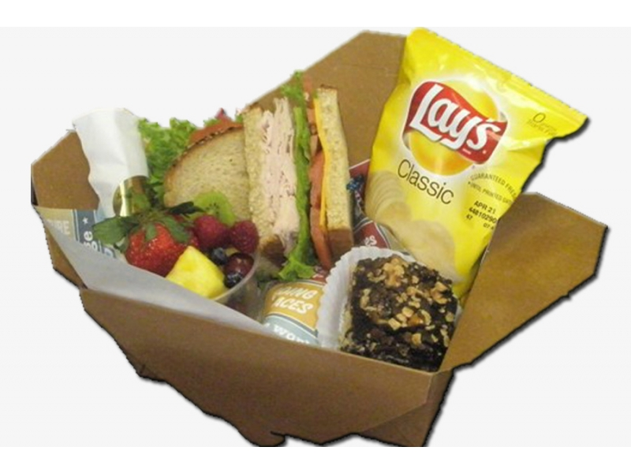
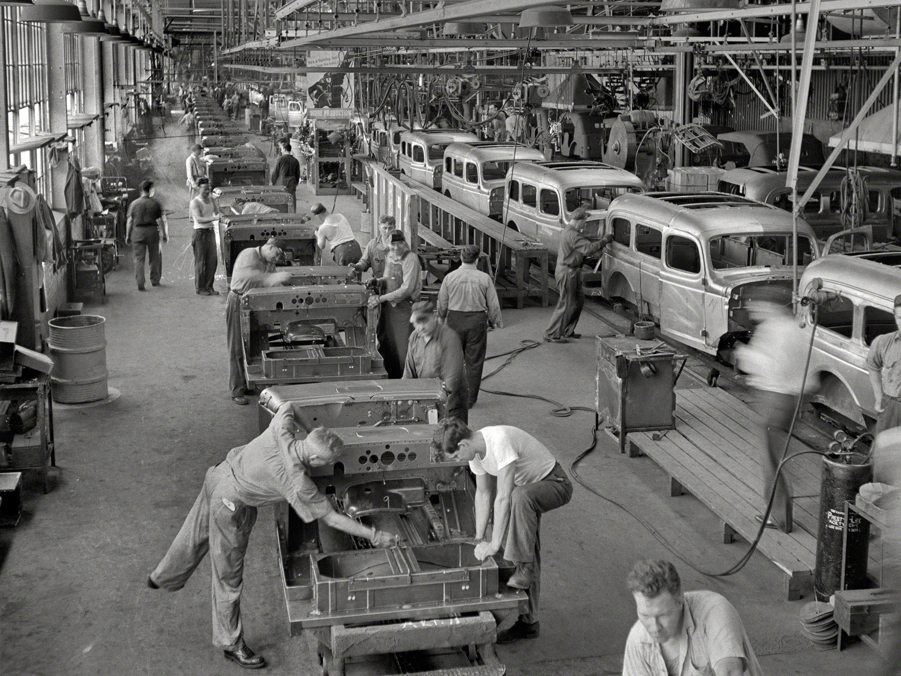

```{r setup, include=FALSE}
options(htmltools.dir.version = FALSE)
knitr::opts_chunk$set(echo=F,
                      message=F,
                      warning=F,
                      fig.retina = 3,
                      fig.align = "center")
library("tidyverse")
library("ggrepel")
library("fontawesome")
xaringanExtra::use_tile_view()
xaringanExtra::use_tachyons()
xaringanExtra::use_freezeframe()
xaringanExtra::use_progress_bar()

update_geom_defaults("label", list(family = "Fira Sans Condensed"))
update_geom_defaults("text", list(family = "Fira Sans Condensed"))

set.seed(256)

theme_slides <- theme_light() + 
  theme(
    text = element_text(family = "Fira Sans", size = 24)
  )

```

class: title-slide

# 1.3 — Comparative Advantage

## ECON 324 • International Trade • Spring 2023

### Ryan Safner<br> Associate Professor of Economics <br> <a href="mailto:safner@hood.edu"><i class="fa fa-paper-plane fa-fw"></i>safner@hood.edu</a> <br> <a href="https://github.com/ryansafner/tradeS23"><i class="fa fa-github fa-fw"></i>ryansafner/tradeS23</a><br> <a href="https://tradeS23.classes.ryansafner.com"> <i class="fa fa-globe fa-fw"></i>tradeS23.classes.ryansafner.com</a><br>
---

class: inverse

# Outline

### [Comparative Advantage](#10)
### [A Simple Exampel of Comparative Advantage](#19)
### [How Division of Labor Deepens Comparative Advantage](#47)

---

# The Origins of Exchange I

.pull-left[
- Why do we trade?

- .hi-purple[Resources are in the wrong place!]

- People have *better* uses of resources than they are currently being used! 

]

.pull-right[
.center[

]
]

---

# The Origins of Exchange II

.pull-left[
- *Why* are resources in the wrong place?

- .hi-purple[We have the same stuff but different preferences]


]

.pull-right[
.center[



]
]

---

# The Origins of Exchange III

.pull-left[
- *Why* are resources in the wrong place?

- .hi-purple[We have different stuff and/or different preferences]

]

.pull-right[
.center[


]
]

---

# Transaction Costs and Exchange I

.pull-left[
- But .hi[Transaction costs]!
  - .hi-purple[Search costs]: cost of finding trading partners
  - .hi-purple[Bargaining costs]: cost of reaching an agreement
  - .hi-purple[Enforcement costs]: **trust** between parties, cost of upholding agreement, dealing with unforeseen contingencies, punishing defection, using police and courts 
]

.pull-right[
.center[

]
]

---

# Transaction Costs and Exchange II

.pull-left[
- With high transaction costs, resources *cannot* be traded

- Resources *cannot* be switched to higher-valued uses

- If others value goods higher than their current owners, resources are *inefficiently* allocated!
]

.pull-right[
.center[

]
]

---

# Transaction Costs and Exchange III

.pull-left[
- .hi[Markets] are institutions that facilitate voluntary *impersonal* exchange and reduce transaction costs

- There's a lot of institutions in the “bundle” we call “markets”: 
  - Prices, profits & losses, property rights, rule of law, contract enforcement, dispute resolution, protection, trust

]

.pull-right[
.center[

]
]

---

# Transaction Costs and Exchange III

.pull-left[
- All of those things are *assumed* when we draw nice supply & demand graphs on the blackboard

- How do various *political institutions* enable these market institutions to succeed?
]

.pull-right[
.center[

]
]

---

class: inverse, center, middle

# Comparative Advantage

---

# Specialization

.left-column[
.center[


Adam Smith

1723-1790
]
]

.right-column[

> “It is the maxim of every prudent master of a family, never to attempt to make at home what it will cost him more to make than to buy...If a foreign country can supply us with a commodity cheaper than we ourselves can make it, better buy it of them with some part of the produce of our own industry, employed in a way in which we have some advantage,” (Book I, Chapter 2).
]

.source[Smith, Adam, 1776, [*An Enquiry into the Nature and Causes of the Wealth of Nations*](https://www.econlib.org/library/Smith/smWN.html)]

---

# Specialization in the Presence of Absolute Advantage

.pull-left[
- Martha Stewart is a world renowned decorator and designer

- She also claims to be able to iron a shirt better and faster than anyone else

- Should she iron her own shirts?

> “I don’t always do all of my own ironing, even though I wish that I could.”

]

.pull-right[


]

---

# Specialization in the Presence of Absolute Advantage

.center[

]

---

# Specialization in the Presence of Absolute Advantage

.center[

]

---
# Specialization in the Presence of Absolute Advantage

.pull-left[
.smallest[
- Even in the presence of .hi[absolute advantage] (one party is more efficient at producing *all* goods), it still often is better for them to specialize
  - A high opportunity cost of producing everything

- Pay others to perform a task, or purchase a good, and specialize in producing goods where you have the .hi-purple[lowest opportunity cost]

- This is the principle of .hi[comparative advantage]
]
]
.pull-right[
.center[

]
]

---

# Comparative Advantage

.left-column[
.center[


.smallest[
Paul Samuelson

1915-2009

Economics Nobel 1970
]
]
]

.right-column[

- Sanislaw Ulam once challenged Samuelson to “*name me one proposition in all of social sciences which is both true and non-trivial*”

- Samuelson’s answer: comparative advantage

> “That it is logically true need not be argued before a mathematician; that is is not trivial is attested by the thousands of important and intelligent men who have never been able to grasp the doctrine for themselves or to believe it after it was explained to them,”

]
.source[Samuelson, Paul A, 1969, “The Way of an Economist,” in P.A. Samuelson, ed. *International Economic Relations: Proceedings of the Third Congress of the International Economic Association*, London: Macmillan, p.11]

---

# Ricardian Comparative Advantage

.left-column[
.center[


David Ricardo

1772-1823
]
]

.right-column[

.smallest[

> “To produce the wine in Portugal, might require only the labour of 80 men for one year, and to produce the cloth in the same country, might require the labour of 90 men for the same time. It would therefore be advantageous for her to export wine in exchange for cloth. This exchange might even take place, notwithstanding that the commodity imported by Portugal could be produced there with less labour than in England. Though she could make the cloth with the labour of 90 men, she would import it from a country where it required the labour of 100 men to produce it, because it would be advantageous to her rather to employ her capital in the production of wine, for which she would obtain more cloth from England, than she could produce by diverting a portion of her capital from the cultivation of vines to the manufacture of cloth.”
]

.source[Ricardo, David, 1817, [*Principles of Political Economy and Taxation*](https://www.econlib.org/library/Ricardo/ricP.html?chapter_num=7#book-reader)]

]


---

# Ricardian Comparative Advantage

.left-column[
.center[


David Ricardo

1772-1823
]
]

.right-column[

- Sought to explain an apparent paradox: countries often produce & export goods they don’t seem to be “good at producing!”

- Answer: citizens of the importing country are *even better* at producing *something else* (in relative terms)
  - Worthwhile for the exporting country to buy this from abroad (with exports as payment)
]

.source[Ricardo, David, 1817, [*Principles of Political Economy and Taxation*](https://www.econlib.org/library/Smith/smWN.html)]

---

class: inverse, center, middle

# A Simple Example of Comparative Advantage

---

# A Simple Example of Comparative Advantage

.pull-left[

- Start with the simplest model of exchange

- A single person (Robinson Crusoe) marooned on a deserted island

- .hi[Autarky]: complete self-sufficiency (no exchange)
  - Must produce everything one consumes
]

.pull-right[
.center[

]
]

---

# A Simple Example of Comparative Advantage

.pull-left[

- Crusoe’s .hi-green[production set] represents the set of all possible production opportunities

- .hi-blue[Production possibilities frontier (PPF)] represents the subset of production opportunities that *use all available resources*
  - i.e. Crusoe uses all his available time to produce a combination on his PPF
]

.pull-right[

```{r}
points<-tribble(
  ~x, ~y, ~letter,
  0, 10, "A",
  1, 8, "B",
  2, 6, "C",
  3, 4, "D",
  4, 2, "E",
  5, 0, "F",
  2, 3, "G",
  6, 4, "H"
)

fill<-tribble(
  ~x, ~y,
  0, 0,
  0, 10,
  5, 0
)

PPF_Crusoe=function(x){10-2*x}

ppf<-ggplot(data = tibble(x=1:10), aes(x = x))+
  geom_polygon(data=fill, aes(x=x, y=y),fill="green", alpha=0.4)+
  stat_function(fun = PPF_Crusoe, geom="line", size=2, color = "blue")+
  geom_point(data = subset(points, letter %in% c("A", "B", "C", "D", "E", "F")),
             aes(x = x,
                 y = y),
             size = 4)+
  geom_text_repel(data = subset(points, letter %in% c("A", "B", "C", "D", "E", "F")),
             aes(x = x,
                 y = y,
                 label = letter),
             size = 5, hjust = 1.5, vjust = 1.5, seed = 1)+
  geom_label(x = 2.5, y = PPF_Crusoe(2.5), color = "blue", label = "PPF")+
  geom_label(x = 2.5, y = 1, color = "green", label = "Production Set")+
  scale_x_continuous(breaks = seq(0,10,1), 
                     limits = c(0,10),
                     expand = c(0,0))+
  scale_y_continuous(breaks = seq(0,10,1), 
                     limits = c(0,10),
                     expand=c(0,0))+
  theme_classic(base_family = "Fira Sans Condensed", base_size=20)
ppf
```
]

---

# A Simple Example of Comparative Advantage

.pull-left[

.smallest[
- Points .hi-blue[on the frontier] are efficient (uses all available labor supply)
  - Points A-F
]
]

.pull-right[

```{r}
ppf
```
]

---

# A Simple Example of Comparative Advantage

.pull-left[
.smallest[
- Points .hi-blue[on the frontier] are efficient (uses all available labor supply)
  - Points A-F

- Points .hi-green[beneath the frontier] are feasible (in .hi-green[production set]) but inefficient (does not use all available labor supply)
  - Point G

]

]

.pull-right[

```{r}
ppf+geom_point(data = subset(points, letter %in% c("G")),
             aes(x = x,
                 y = y),
             size = 4)+
  geom_text_repel(data = subset(points, letter %in% c("G")),
             aes(x = x,
                 y = y,
                 label = letter),
             size = 5, hjust = 1.5, vjust = 1.5, seed = 1)
```
]

---

# A Simple Example of Comparative Advantage

.pull-left[
.smallest[
- Points .hi-blue[on the frontier] are efficient (uses all available labor supply)
  - Points A-F

- Points .hi-green[beneath the frontier] are feasible (in .hi-green[production set]) but inefficient (does not use all available labor supply)
  - Point G

- Points .hi-red[above the frontier] are impossible with current constraints (endowment, technology, trading opportunities)
  - Point H
]
]

.pull-right[

```{r}
ppf+geom_point(data = subset(points, letter %in% c("G", "H")),
             aes(x = x,
                 y = y),
             size = 4)+
  geom_text_repel(data = subset(points, letter %in% c("G", "H")),
             aes(x = x,
                 y = y,
                 label = letter),
             size = 5, hjust = 1.5, vjust = 1.5, seed = 1)
```
]

---

# A Simple Example of Comparative Advantage

.pull-left[

- Slope of PPF: .hi[marginal rate of transformation (MRT)]

- Rate at which (domestic) market values .hi-purple[tradeoff] between goods x and y

- .hi-purple[Relative price of x] (in terms of y), or .hi-purple[opportunitiy cost of x]: how many units of y must be given up to produce one more unit of x

]

.pull-right[

```{r}
ggplot(data = tibble(x=1:10), aes(x = x))+
  stat_function(fun = PPF_Crusoe, geom="line", size=2, color = "blue")+
  geom_label(x = 2.5, y = PPF_Crusoe(2.5), color = "blue", label = expression(slope == MRT))+
  scale_x_continuous(breaks = seq(0,10,1), 
                     limits = c(0,10),
                     expand = c(0,0))+
  scale_y_continuous(breaks = seq(0,10,1), 
                     limits = c(0,10),
                     expand=c(0,0))+
  theme_classic(base_family = "Fira Sans Condensed", base_size=20)

```
]

---

# A Numerical Example

.pull-left[

- Suppose the two goods on the island are fish $(f)$ and berries $(b)$

]

.pull-right[

```{r}
ppf_Crusoe_2<-ggplot(data = tibble(x=1:10), aes(x = x))+
  stat_function(fun = PPF_Crusoe, geom="line", size=2, color = "blue")+
  labs(x = "Fish (f)",
       y = "Berries (b)")+
  scale_x_continuous(breaks = seq(0,10,1), 
                     limits = c(0,10),
                     expand = c(0,0))+
  scale_y_continuous(breaks = seq(0,10,1), 
                     limits = c(0,10),
                     expand=c(0,0))+
  theme_classic(base_family = "Fira Sans Condensed", base_size=20)
ppf_Crusoe_2
```
]

---

# A Numerical Example

.pull-left[

- Suppose the two goods on the island are fish $(f)$ and berries $(b)$

- Can represent the PPF as a linear function:

$$b = 10 - 2f$$

]

.pull-right[

```{r}
ppf_Crusoe_2
```
]

---

# A Numerical Example

.pull-left[

- Suppose the two goods on the island are fish $(f)$ and berries $(b)$

- Can represent the PPF as a linear function:

$$b = 10 - 2f$$

- Slope: $-2$
- Opportunity cost of $1f$: $2b$
]

.pull-right[

```{r}
ppf_Crusoe_2
```
]

---

# A Numerical Example

.pull-left[

- Suppose the two goods on the island are fish $(f)$ and berries $(b)$

- Can represent the PPF as a linear function:

$$b = 10 - 2f$$

- Slope: $-2$
- Opportunity cost of $1f$: $2b$
- Opportunity cost of $1b$: $\frac{1}{2}f$
- Hint: use the endpoints!
]

.pull-right[

```{r}
ppf_Crusoe_2
```
]

---

# A Numerical Example

.pull-left[

- Suppose the two goods on the island are fish $(f)$ and berries $(b)$

- Can represent the PPF as a linear function:

$$b = 10 - 2f$$

- Slope: $-2$
- Opportunity cost of $1f$: $2b$
- Opportunity cost of $1b$: $\frac{1}{2}f$

]

.pull-right[

```{r}
ppf_Crusoe_2
```
]

---

# Meeting Friday

.pull-left[

### .hi-blue[Crusoe]

```{r, fig.height=3.5}
ppf_Crusoe_2
```


]

.pull-right[

### .hi-red[Friday]

```{r, fig.height=3.5}
PPF_Friday=function(x){2-0.5*x}

ppf_Friday<-ggplot(data = tibble(x=1:10), aes(x = x))+
  stat_function(fun = PPF_Friday, geom="line", size=2, color = "red")+
  labs(x = "Fish (f)",
       y = "Berries (b)")+
  scale_x_continuous(breaks = seq(0,10,1), 
                     limits = c(0,10),
                     expand = c(0,0))+
  scale_y_continuous(breaks = seq(0,10,1), 
                     limits = c(0,10),
                     expand=c(0,0))+
  theme_classic(base_family = "Fira Sans Condensed", base_size=20)
ppf_Friday
```
]

---

# Meeting Friday

.pull-left[

### .hi-blue[Crusoe]

```{r, fig.height=3.5}
ppf_Crusoe_2
```

.blue[Crusoe’s PPF:] $b=10-2f$

]

.pull-right[

### .hi-red[Friday]

```{r, fig.height=3.5}
ppf_Friday
```
]

---

# Meeting Friday

.pull-left[

### .hi-blue[Crusoe]

```{r, fig.height=3.5}
ppf_Crusoe_2
```

.blue[Crusoe’s PPF:] $b=10-2f$

]

.pull-right[

### .hi-red[Friday]

```{r, fig.height=3.5}
ppf_Friday
```

.red[Friday’s PPF:] $b=2-\frac{1}{2}f$

]

---

# Meeting Friday

.pull-left[

### .hi-blue[Crusoe]

```{r, fig.height=3.5}
ppf_Crusoe_2
```

.blue[Crusoe’s PPF:] $b=10-2f$

.blue[Crusoe’s opportunity cost of 1f]: $2b$
]

.pull-right[

### .hi-red[Friday]

```{r, fig.height=3.5}
ppf_Friday
```

.red[Friday’s PPF:] $b=2-\frac{1}{2}f$

.red[Friday’s opportunity cost of 1f]: $\frac{1}{2}b$

]

---

# Meeting Friday

.pull-left[

### .hi-blue[Crusoe]

```{r, fig.height=3.5}
ppf_Crusoe_2
```

.blue[Crusoe’s PPF:] $b=10-2f$

.blue[Crusoe’s opportunity cost of 1f]: $2b$

.blue[Crusoe’s opportunity cost of 1b]: $\frac{1}{2}f$

]

.pull-right[

### .hi-red[Friday]

```{r, fig.height=3.5}
ppf_Friday
```

.red[Friday’s PPF:] $b=2-\frac{1}{2}f$

.red[Friday’s opportunity cost of 1f]: $\frac{1}{2}b$

.red[Friday’s  opportunity cost of 1b]: $2f$

]

---

# Production Potentials

.pull-left[
.center[
Maximum Possible Production
]

|    | Fish | Berries |
|----|-----:|--------:|
| .blue[Crusoe] | 5 | 10 |
| .red[Friday] | 4 | 2 |
| .b[TOTAL] | 9 | 12 |

]

--

.pull-right[

- Why should .red[Crusoe] trade with .blue[Friday]? .red[Crusoe] has an .hi[absolute advantage] in everything!
]

---

# Production Potentials

.pull-left[
.center[
Maximum Possible Production
]

|    | Fish | Berries |
|----|-----:|--------:|
| .blue[Crusoe] | 5 | 10 |
| .red[Friday] | 4 | 2 |
| .b[TOTAL] | 9 | 12 |

]

.pull-right[

.center[
Opportunity Costs
]

|    | 1 Fish | 1 Berry |
|----|-----:|--------:|
| .blue[Crusoe] | 2b | 0.5f |
| .red[Friday] | 0.5b | 2f |

- .hi-purple[Different opportunity costs imply differing comparative advantages!]

]


---

# Production Potentials

.pull-left[
.center[
Maximum Possible Production
]

|    | Fish | Berries |
|----|-----:|--------:|
| .blue[Crusoe] | 5 | 10 |
| .red[Friday] | 4 | 2 |
| .b[TOTAL] | 9 | 12 |

]


.pull-right[

.center[
Opportunity Costs
]

|    | 1 Fish | 1 Berry |
|----|-----:|--------:|
| .blue[Crusoe] | 2b | .b[0.5f] |
| .red[Friday] | .b[0.5b] | 2f |

- .hi-purple[Different opportunity costs imply differing comparative advantages!]

- Person (country) with lower opportunity cost of *a particular good* should specialize in producing *that* good
]

---

# Current Production & Consumption

.pull-left[

### .hi-blue[Crusoe]

```{r, fig.height=3.5}
ppf_Crusoe_2+
  geom_segment(x = 0, y = 6, xend = 2, yend = 6, size = 1, linetype = "dashed")+
  geom_segment(x = 2, y = 6, xend = 2, yend = 0, size = 1, linetype = "dashed")+
  geom_label(x = 2, y = 6, label = "A", color = "blue")
```

|    | Fish | Berries |
|----|-----:|--------:|
| .blue[Crusoe] | 2 | 6 |
| .red[Friday] | 2 | 1 |

]

.pull-right[

### .hi-red[Friday]

```{r, fig.height=3.5}
ppf_Friday+
  geom_segment(x = 0, y = 1, xend = 2, yend = 1, size = 1, linetype = "dashed")+
  geom_segment(x = 2, y = 1, xend = 2, yend = 0, size = 1, linetype = "dashed")+
  geom_label(x = 2, y = 1, label = "A'", color = "red")
```

- Each is producing & consuming at an (arbitrary) point on their PPFs (A and A')

]

---

# Specialization in Production

.pull-left[

### .hi-blue[Crusoe]

```{r, fig.height=3.5}
ppf_Crusoe_2+
  geom_segment(x = 0, y = 6, xend = 2, yend = 6, size = 1, linetype = "dashed", color = "gray")+
  geom_segment(x = 2, y = 6, xend = 2, yend = 0, size = 1, linetype = "dashed", color = "gray")+
  geom_label(x = 2, y = 6, label = "A", color = "blue")+
  geom_label(x = 0, y = 10, label = "B", color = "blue")+
  coord_cartesian(clip = "off")
```

|    | Fish | Berries |
|----|-----:|--------:|
| .blue[Crusoe] | 0 | 10 |
| .red[Friday] | 4 | 0 |
| .b[TOTAL] | 4 | 10 |


]

.pull-right[

### .hi-red[Friday]

```{r, fig.height=3.5}
ppf_Friday+
  geom_segment(x = 0, y = 1, xend = 2, yend = 1, size = 1, linetype = "dashed", color = "gray")+
  geom_segment(x = 2, y = 1, xend = 2, yend = 0, size = 1, linetype = "dashed", color = "gray")+
  geom_label(x = 2, y = 1, label = "A'", color = "red")+
  geom_label(x = 4, y = 0, label = "B'", color = "red")+
  coord_cartesian(clip = "off")

```

- Each then specializes in their comparative advantage (B and B')

]
---

# Specialization in Production

.pull-left[

### .hi-blue[Crusoe]

```{r, fig.height=3.5}
ppf_Crusoe_2+
  geom_segment(x = 0, y = 6, xend = 2, yend = 6, size = 1, linetype = "dashed", color = "gray")+
  geom_segment(x = 2, y = 6, xend = 2, yend = 0, size = 1, linetype = "dashed", color = "gray")+
  geom_label(x = 2, y = 6, label = "A", color = "blue")+
  geom_label(x = 0, y = 10, label = "B", color = "blue")+
    coord_cartesian(clip = "off")

```

|    | Fish | Berries |
|----|-----:|--------:|
| .blue[Crusoe] | 0 | 10 |
| .red[Friday] | 4 | 0 |
| .b[TOTAL] | 4 | 10 |


]

.pull-right[

### .hi-red[Friday]

```{r, fig.height=3.5}
ppf_Friday+
  geom_segment(x = 0, y = 1, xend = 2, yend = 1, size = 1, linetype = "dashed", color = "gray")+
  geom_segment(x = 2, y = 1, xend = 2, yend = 0, size = 1, linetype = "dashed", color = "gray")+
  geom_label(x = 2, y = 1, label = "A'", color = "red")+
  geom_label(x = 4, y = 0, label = "B'", color = "red")+
    coord_cartesian(clip = "off")


```

.quitesmall[
- Each then specializes in their comparative advantage (B and B')

- Suppose they agree on the following terms of trade: 1 fish for 1 berry
  - .blue[Crusoe] gives .red[Friday] .blue[2 berries] for .red[2 fish]
]
]

---

# The Terms of Trade

.pull-left[

- The .hi-purple[“terms of trade”] are also known as .hi-purple[exchange rates] or .hi-purple[relative prices]

- (Without money), there are two prices here:
  - .hi-turquoise[(berry) price of fish, `\\(p_f\\)`]: amount of *berries* given up for *1 fish*
  - .hi-turquoise[(fish) price of berries, `\\(p_b\\)`]: amount of *fish* given up for *1 berry*

]

.pull-right[
.center[

]
]

---

# The Terms of Trade

.pull-left[
.smallest[
- Each party wants to .hi-purple[buy] at a relative price .hi-purple[lower] than their own opportunity cost
  - Otherwise, “cheaper” to produce it yourself!

- Each party wants to .hi-purple[sell] at a relative price .hi-purple[higher] than their own opportunity cost
  - Otherwise, keep it!
]

]

.pull-right[
.center[
Opportunity Costs
]

|    | 1 Fish | 1 Berry |
|----|-----:|--------:|
| .blue[Crusoe] | 2b | .b[0.5f] |
| .red[Friday] | .b[0.5b] | 2f |
]

---

# The Terms of Trade

.pull-left[
.smallest[
- Each party wants to .hi-purple[buy] at a relative price .hi-purple[lower] than their own opportunity cost
  - Otherwise, “cheaper” to produce it yourself!

- Each party wants to .hi-purple[sell] at a relative price .hi-purple[higher] than their own opportunity cost
  - Otherwise, keep it!
]

`\\(\frac{1}{2}\\)` berry `\\(< p_f < 2\\)` berries

`\\(\frac{1}{2}\\)` fish `\\(< p_b < 2\\)` fish

]

.pull-right[
.center[
Opportunity Costs
]

|    | 1 Fish | 1 Berry |
|----|-----:|--------:|
| .blue[Crusoe] | 2b | .b[0.5f] |
| .red[Friday] | .b[0.5b] | 2f |
]

---

# Improvements in Post-Trade Consumption

.pull-left[

### .hi-blue[Crusoe]

```{r, fig.height=3.5}
ppf_Crusoe_2+
  geom_segment(x = 0, y = 6, xend = 2, yend = 6, size = 1, linetype = "dashed", color = "gray")+
  geom_segment(x = 2, y = 6, xend = 2, yend = 0, size = 1, linetype = "dashed", color = "gray")+
  geom_segment(x = 0, y = 8, xend = 2, yend = 8, size = 1, linetype = "dashed")+
  geom_segment(x = 2, y = 8, xend = 2, yend = 0, size = 1, linetype = "dashed")+
  geom_label(x = 2, y = 6, label = "A", color = "blue")+
  geom_label(x = 0, y = 10, label = "B", color = "blue")+
  geom_label(x = 2, y = 8, label = "C", color = "blue")+
  coord_cartesian(clip = "off")

```

|    | Fish | Berries |
|----|-----:|--------:|
| .blue[Crusoe] | 2 | 8 |
| .red[Friday] | 2 | 2 |
| .b[TOTAL] | 4 | 10 |


]

.pull-right[

### .hi-red[Friday]

```{r, fig.height=3.5}
ppf_Friday+
  geom_segment(x = 0, y = 1, xend = 2, yend = 1, size = 1, linetype = "dashed", color = "gray")+
  geom_segment(x = 2, y = 1, xend = 2, yend = 0, size = 1, linetype = "dashed", color = "gray")+
  geom_segment(x = 0, y = 2, xend = 2, yend = 2, size = 1, linetype = "dashed")+
  geom_segment(x = 2, y = 2, xend = 2, yend = 0, size = 1, linetype = "dashed")+
  geom_label(x = 2, y = 1, label = "A'", color = "red")+
  geom_label(x = 4, y = 0, label = "B'", color = "red")+
  geom_label(x = 2, y = 2, label = "C'", color = "red")+
  coord_cartesian(clip = "off")


```

- .hi-purple[Gains from exchange]: both Crusoe and Friday can consume more than they could possibly produce!

- At points above their PPFs

]

---

class: inverse, center, middle

# How Division of Labor Deepens Comparative Advantage

---

# Friday’s Productivity Increase

.pull-left[

- Recall, .blue[Crusoe] specialized in berry-gathering and .red[Friday] specialized in fishing

- Suppose .red[Friday] becomes better at fishing (Smith’s reasons):
  - Lower switching costs
  - Learning by doing
  - Creating specialized tools (a net)
]

.pull-right[
.center[

]
]

---

# New Opportunity Costs

.pull-left[
.center[
Original Maximum Possible Production
]

|    | Fish | Berries |
|----|-----:|--------:|
| .blue[Crusoe] | 5 | 10 |
| .red[Friday] | 4 | 2 |
| .b[TOTAL] | 9 | 12 |

]

--

.pull-right[
.center[
New Maximum Possible Production
]

|    | Fish | Berries |
|----|-----:|--------:|
| .blue[Crusoe] | 5 | 10 |
| .red[Friday] | .b[8] | 2 |
| .b[TOTAL] | .b[13] | 12 |

]

---

# New Opportunity Costs

.pull-left[
.center[
Original Maximum Possible Production
]

|    | Fish | Berries |
|----|-----:|--------:|
| .blue[Crusoe] | 5 | 10 |
| .red[Friday] | 4 | 2 |
| .b[TOTAL] | 9 | 12 |

.center[
Original Opportunity Costs
]

|    | 1 Fish | 1 Berry |
|----|-----:|--------:|
| .blue[Crusoe] | 2b | .b[0.5f] |
| .red[Friday] | .b[0.5b] | 2f |

]

--

.pull-right[
.center[
New Maximum Possible Production
]

|    | Fish | Berries |
|----|-----:|--------:|
| .blue[Crusoe] | 5 | 10 |
| .red[Friday] | .b[8] | 2 |
| .b[TOTAL] | .b[13] | 12 |

.center[
New Opportunity Costs
]

|    | 1 Fish | 1 Berry |
|----|-----:|--------:|
| .blue[Crusoe] | 2b | .b[0.5f] |
| .red[Friday] | .b[0.25b] | 4f |

]

---

# New Opportunity Costs Lead to New Prices

.pull-left[
.center[
Original Opportunity Costs
]

|    | 1 Fish | 1 Berry |
|----|-----:|--------:|
| .blue[Crusoe] | 2b | .b[0.5f] |
| .red[Friday] | .b[0.5b] | 2f |

`\\(\frac{1}{2}\\)` berry `\\(< p_f < 2\\)` berries

`\\(\frac{1}{2}\\)` fish `\\(< p_b < 2\\)` fish

]

--

.pull-right[

.center[
New Opportunity Costs
]

|    | 1 Fish | 1 Berry |
|----|-----:|--------:|
| .blue[Crusoe] | 2b | .b[0.5f] |
| .red[Friday] | .b[0.25b] | 4f |

`\\(\frac{1}{4}\\)` berry `\\(< p_f < 2\\)` berries

`\\(\frac{1}{2}\\)` fish `\\(< p_b < 4\\)` fish

]

---

# New Post-Trade Consumption

.pull-left[

### .hi-blue[Crusoe]

```{r, fig.height=3.5}
ppf_Crusoe_2+
  geom_segment(x = 0, y = 6, xend = 2, yend = 6, size = 1, linetype = "dashed", color = "gray")+
  geom_segment(x = 2, y = 6, xend = 2, yend = 0, size = 1, linetype = "dashed", color = "gray")+
  geom_segment(x = 0, y = 7, xend = 3, yend = 7, size = 1, linetype = "dashed")+
  geom_segment(x = 3, y = 7, xend = 3, yend = 0, size = 1, linetype = "dashed")+
  geom_label(x = 2, y = 6, label = "A", color = "blue")+
  geom_label(x = 0, y = 10, label = "B", color = "blue")+
  geom_label(x = 3, y = 7, label = "D", color = "blue")+
  coord_cartesian(clip = "off")

```

|    | Fish | Berries |
|----|-----:|--------:|
| .blue[Crusoe] | 3 | 7 |
| .red[Friday] | 5 | 3 |
| .b[TOTAL] | 8 | 10 |


]

.pull-right[

### .hi-red[Friday]

```{r, fig.height=3.5}

PPF_Friday2=function(x){2-0.25*x}

ppf_Friday2<-ggplot(data = tibble(x=1:10), aes(x = x))+
  stat_function(fun = PPF_Friday2, geom="line", size=2, color = "red")+
  labs(x = "Fish (f)",
       y = "Berries (b)")+
  scale_x_continuous(breaks = seq(0,10,1), 
                     limits = c(0,10),
                     expand = c(0,0))+
  scale_y_continuous(breaks = seq(0,10,1), 
                     limits = c(0,10),
                     expand=c(0,0))+
  theme_classic(base_family = "Fira Sans Condensed", base_size=20)

ppf_Friday2+
  geom_segment(x = 0, y = 1, xend = 4, yend = 1, size = 1, linetype = "dashed", color = "gray")+
  geom_segment(x = 4, y = 1, xend = 4, yend = 0, size = 1, linetype = "dashed", color = "gray")+
  geom_segment(x = 0, y = 3, xend = 5, yend = 3, size = 1, linetype = "dashed")+
  geom_segment(x = 5, y = 3, xend = 5, yend = 0, size = 1, linetype = "dashed")+
  geom_label(x = 4, y = 1, label = "A'", color = "red")+
  geom_label(x = 8, y = 0, label = "B'", color = "red")+
  geom_label(x = 5, y = 3, label = "D'", color = "red")+
  coord_cartesian(clip = "off")
```

- Keep same terms of trade (1b:1f)

- Crusoe gives Friday 3 berries for 3 fish

]

---

# Gains from Exchange and Productivity

.pull-left[
.smallest[
- Both exchange and increasing productivity here are .hi-purple[Pareto improvements]
  - At least one person made better off, and nobody worse off
  
- .red[Friday], by becoming more productive, has more fish
  - by becoming .hi-purple[comparatively better] at catching .red[fish], becomes .hi-purple[comparatively worse] at gathering .blue[berries]

- .hi[Trade becomes more important] 

- .blue[Crusoe] better off too, getting more .red[fish] in exchange for his .blue[berries]!
]
]

.pull-right[
.center[

]
]

---

# Trade as a Production Technology

Two ways to produce a car:

.pull-left[
.center[

]
]

--

.pull-right[
.center[

]

]

---

# Trade as a Production Technology

Two ways to produce a car:

--

.pull-left[
.center[

]
]

--

.pull-right[
.center[

]

]

---

# Trade as a Production Technology

Two ways to produce a car:

.pull-left[
.center[

]
]

--

.pull-right[
.center[

]

]

---

# Trade as a Production Technology

.pull-left[

- Trade is only a more roundabout way of producing for consumption
]

.pull-right[

```{r}
ppf_abst=function(x){2-0.5*x}

ppftrade<-ggplot(data = tibble(x=1:10), aes(x = x))+
  geom_point(x = 2, y = 2, size = 4)+
  geom_segment(x = 0, xend = 2, y = 2, yend = 2, size = 1, linetype = "dashed")+
  geom_segment(x = 2, xend = 2, y = 2, yend = 0, size = 1, linetype = "dashed")+
  stat_function(fun = ppf_abst, geom="line", size=2, color = "blue")+
  geom_label(x = 2.5, y = ppf_abst(2.5), color = "blue", label = "PPF")+
  scale_x_continuous(breaks = seq(0,5,1), 
                     limits = c(0,5),
                     expand = c(0,0))+
  scale_y_continuous(breaks = seq(0,5,1), 
                     limits = c(0,5),
                     expand=c(0,0))+
  theme_classic(base_family = "Fira Sans Condensed", base_size=20)
ppftrade
```
]

---

# Trade as a Production Technology

.pull-left[

- Trade is only a more roundabout way of producing for consumption

- .hi-purple[Direct]: increase own productivity & production
]

.pull-right[

```{r}
ppf_abst2=function(x){3-0.5*x}

ppftrade+
  stat_function(fun = ppf_abst2, geom="line", size=2, color = "darkblue", linetype = "dashed")+
  geom_label(x = 2.5, y = ppf_abst2(2.5), color = "blue", label = "PPF’")+
    annotate("segment", x = 1.5, xend = 2, y = ppf_abst(1.5), yend = ppf_abst2(2), colour = "purple", size=2, alpha=1, arrow=arrow(length=unit(0.5,"cm"), ends="last", type="closed"))

```
]

---

# Trade as a Production Technology

.pull-left[

- Trade is only a more roundabout way of producing for consumption

- .hi-purple[Direct]: increase own productivity & production

- .hi-purple[Indirect]: specializing in production & exchanging with others

- Extends division of labor & extent of the market!
]

.pull-right[

```{r}
ppf_abst2=function(x){3-0.5*x}

ppftrade+
  annotate("segment", x = 1, xend = 4, y = ppf_abst(1), yend = 0, colour = "purple", size=2, alpha=1, arrow=arrow(length=unit(0.5,"cm"), ends="last", type="closed"))+
  annotate("segment", x = 4, xend = 2, y = 0, yend = 2, colour = "purple", size=2, alpha=1, arrow=arrow(length=unit(0.5,"cm"), ends="last", type="closed"))
```
]