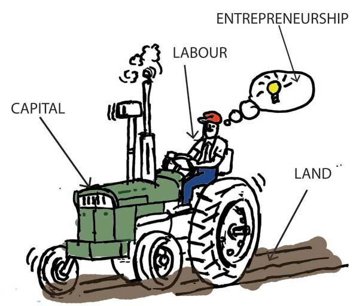
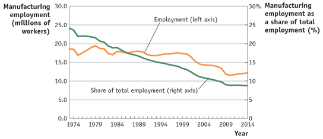
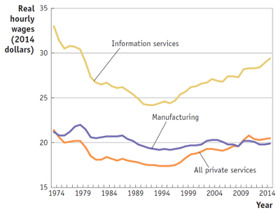
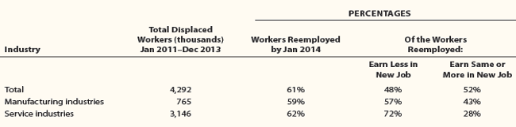

```{r setup, include=FALSE}
options(htmltools.dir.version = FALSE)
knitr::opts_chunk$set(echo=F,
                      message=F,
                      warning=F,
                      fig.retina = 3,
                      fig.align = "center")
library("tidyverse")
library("ggrepel")
library("fontawesome")
xaringanExtra::use_tile_view()
xaringanExtra::use_tachyons()
xaringanExtra::use_freezeframe()
xaringanExtra::use_progress_bar()

update_geom_defaults("label", list(family = "Fira Sans Condensed"))
update_geom_defaults("text", list(family = "Fira Sans Condensed"))

set.seed(256)

theme_slides <- theme_light() + 
  theme(
    text = element_text(family = "Fira Sans", size = 24)
  )

```

class: title-slide

# 1.8 — The Specific Factors Model

## ECON 324 • International Trade • Spring 2023

### Ryan Safner<br> Associate Professor of Economics <br> <a href="mailto:safner@hood.edu"><i class="fa fa-paper-plane fa-fw"></i>safner@hood.edu</a> <br> <a href="https://github.com/ryansafner/tradeS23"><i class="fa fa-github fa-fw"></i>ryansafner/tradeS23</a><br> <a href="https://tradeS23.classes.ryansafner.com"> <i class="fa fa-globe fa-fw"></i>tradeS23.classes.ryansafner.com</a><br>

---


class: inverse

# Outline

### [Assumptions of the Specific Factors Model](#3)

### [Allocating the Mobile Factor (Labor)](#11)

### [Distribution Effects Using our Two Country Trade Example](#23)

### [Takeaways from the Specific Factors Model](#44)

---

class: inverse, center, middle

# Assumptions of the Specific Factors Model

---

# Assumptions of the Specific Factors Model

.pull-left[

.smallest[
- Until now, we've assumed (within each country), factors are mobile

- But in truth, some factors are .hi[specific] or .hi[immobile]: can only be used for the production of a specific set of goods or industry
  - e.g. programmers can only work in software, not in pro-football
  - e.g. equipment used to make beer barrels cannot switch to producing computer chips

- .hi-purple[Opening up trade will affect the distribution of income between fixed and mobile factors]
]
]
.pull-right[
.center[

]
]

---

# Assumptions of the Specific Factors Model

.pull-left[

- Imagine 2 countries, .blue[Home] and .red[Foreign]

- Countries have three factors of production:
   - labor $(L)$
   - capital $(K)$
   - land $(T)$

]

.pull-right[
.center[

]
]

---

# Assumptions of the Specific Factors Model

.pull-left[

- Each country has two industries, .b[manufacturing (M)] and .b[agriculture (A)]

- .b[Manufacturing] is produced using *capital* $(K)$ and *labor* $(L)$

- .b[Agriculture] is produced using *land* $(T)$ and *labor* $(L)$

- Land $(T)$ and capital $(K)$ are .hi[specific factors], only used to produce one good

- Labor $(L)$ is a .hi[mobile factor] that can be used in *either* (or both) sectors

]
.pull-right[
.center[


]
]

---

# Setting up the Model: Production Function

.pull-left[

- An economy's production can be described as a set of production functions for manufacturing $(M)$ and agriculture $(A)$

$$\begin{align*}
Q_M&=Q_M(K,L_M)\\
Q_A&=Q_A(T,L_A)\\
\end{align*}$$

- Each country can only allocate its labor force between two industries

$$L_M+L_A=\bar{L}$$


]

.pull-right[
.center[


]
]

---

# Diminishing Marginal Product of Labor

.pull-left[

- Each industry exhibits .hi[diminishing returns to labor]

- .hi[Marginal product of labor in manufacturing `\\((MPL_{M})\\)`]: additional manufacturing output produced by adding one more unit of labor (holding $K$ constant)

$$MPL_{M} = \frac{\Delta Q_M}{\Delta L_M}$$

- Declines as more $L$ is added to manufacturing production

]

.pull-right[

```{r, fig.retina=3, fig.height=3.5}
prod_1=function(x){2*sqrt(x)}

ggplot(data.frame(x=c(0,6)), aes(x=x))+
  stat_function(fun=prod_1, geom="line", size=2, color="red")+
  geom_label(aes(x=5,y=prod_1(5)), color = "red", label=expression(Q[M]), size = 6)+
    scale_x_continuous(breaks=seq(0,6,1),
                     limits=c(0,6),
                     expand=expand_scale(mult=c(0,0.1)))+
  scale_y_continuous(breaks=seq(0,6,1),
                     limits=c(0,6),
                     expand=expand_scale(mult=c(0,0.1)))+
  scale_colour_manual("I.C. equations", values = colors)+
  guides(color = F)+
  labs(x = expression(paste("Labor in Manufacturing, ", L[M])),
       y = expression(paste("Manufacturing Output, ", Q[M])))+
  theme_classic(base_family = "Fira Sans Condensed", base_size=16)
```

```{r, fig.retina=3, fig.height=3.5}
mp=function(x){1/sqrt(x)}

ggplot(data.frame(x=c(0,10)), aes(x=x))+
  stat_function(fun=mp, geom="line", size=2, color="blue")+
  geom_label(aes(x=1,y=mp(1)), color = "blue", label=expression(MPL[M]), size = 4)+
    scale_x_continuous(breaks=seq(0,6,1),
                     limits=c(0,6),
                     expand=expand_scale(mult=c(0,0.1)))+
  scale_y_continuous(breaks=seq(0,6,1),
                     limits=c(0,6),
                     expand=expand_scale(mult=c(0,0.1)))+
  scale_colour_manual("I.C. equations", values = colors)+
  guides(color = F)+
  labs(x = expression(paste("Labor in Manufacturing, ", L[M])),
       y = expression(paste("Output per Worker, ", frac(Q[M],L[M]))))+
  theme_classic(base_family = "Fira Sans Condensed", base_size=16)
```

]

---

# Diminishing Marginal Product of Labor

.pull-left[

- Each industry exhibits .hi[diminishing returns to labor]

- .hi[Marginal product of labor in agriculture `\\((MPL_{A})\\)`]: additional agriculture output produced by adding one more unit of labor (holding $T$ constant)

$$MPL_{A} = \frac{\Delta Q_A}{\Delta L_A}$$

- Declines as more $L$ is added to agriculture production

]

.pull-right[

```{r, fig.retina=3, fig.height=3.5}
prod_1=function(x){2*sqrt(x)}

ggplot(data.frame(x=c(0,6)), aes(x=x))+
  stat_function(fun=prod_1, geom="line", size=2, color="red")+
  geom_label(aes(x=5,y=prod_1(5)), color = "red", label=expression(Q[A]), size = 6)+
    scale_x_continuous(breaks=seq(0,6,1),
                     limits=c(0,6),
                     expand=expand_scale(mult=c(0,0.1)))+
  scale_y_continuous(breaks=seq(0,6,1),
                     limits=c(0,6),
                     expand=expand_scale(mult=c(0,0.1)))+
  scale_colour_manual("I.C. equations", values = colors)+
  guides(color = F)+
  labs(x = expression(paste("Labor in Agriculture, ", L[A])),
       y = expression(paste("Agriculture Output, ", Q[A])))+
  theme_classic(base_family = "Fira Sans Condensed", base_size=16)
```

```{r, fig.retina=3, fig.height=3.5}
mp=function(x){1/sqrt(x)}

ggplot(data.frame(x=c(0,10)), aes(x=x))+
  stat_function(fun=mp, geom="line", size=2, color="blue")+
  geom_label(aes(x=1,y=mp(1)), color = "blue", label=expression(MPL[A]), size = 4)+
    scale_x_continuous(breaks=seq(0,6,1),
                     limits=c(0,6),
                     expand=expand_scale(mult=c(0,0.1)))+
  scale_y_continuous(breaks=seq(0,6,1),
                     limits=c(0,6),
                     expand=expand_scale(mult=c(0,0.1)))+
  scale_colour_manual("I.C. equations", values = colors)+
  guides(color = F)+
  labs(x = expression(paste("Labor in Agriculture, ", L[A])),
       y = expression(paste("Output per Worker, ", frac(Q[A],L[A]))))+
  theme_classic(base_family = "Fira Sans Condensed", base_size=16)
```

]

---

# PPF

.pull-left[

- We get a PPF with increasing costs again

- Let's examine more *why*

]

.pull-right[
```{r}
base_ppf_eq=function(x){sqrt(16-x^2)}

base_ppf<-ggplot(tibble(x=0:10), aes(x=x))+

  # PPF 
  stat_function(fun=base_ppf_eq, geom="line", size=2, color = "blue")+
  geom_label(x = 3.5, y = base_ppf_eq(3.5), label = "PPF", color = "blue")+

  
  # annotate("text", x = (0.5*(m/px)+1.75), y = BC(0.5*(m/px)), label = expression(paste("slope =", - l[x]/l[y])), color="blue", size =7)+
  scale_x_continuous(breaks=seq(0,5),
                     limits=c(0,5),
                     expand=expansion(mult=c(0,0.1))
                     )+
  scale_y_continuous(breaks=seq(0,5),
                     limits=c(0,5),
                     expand=expansion(mult=c(0,0.1))
                     )+
  labs(x = expression(paste("Manufacturing Output, ", Q[M])),
       y = expression(paste("Agriculture Output, ", Q[A])))+
  theme_classic(base_family = "Fira Sans Condensed", base_size=20)
base_ppf
```

]

---

class: inverse, center, middle

# Allocating the Mobile Factor (Labor)

---

# A Note About Labor

.pull-left[
.smaller[
- A simple (and very Ricardian) assumption about labor: it is measured in hours, and can equally be applied to each industry

$$\bar{L}=L_M+L_A$$

- Every labor hour allocated to agriculture is a labor hour *not* allocated to manufacturing, and vice versa
  - .hi-purple[Opportunity cost of labor]

- Visualize a “labor budget constraint” to understand movements along the PPF
]
]

.pull-right[
```{r}
labor_points<-tribble(
  ~x, ~y, ~letter,
  0, 4, "A",
  1, 3, "B",
  3, 1, "C",
  4, 0, "D"
)

labor_budget=function(x){4-x}

labor_constraint = ggplot(tibble(x=0:10), aes(x=x))+

  # PPF 
  stat_function(fun=labor_budget, geom="line", size=2, color = "red")+
  geom_label(x = 2, y = 2, color = "red", label = expression(L[A] == bar(L) - L[M]))+
  geom_point(data = labor_points,
               aes(x = x,
                   y = y),
             size = 3)+
  geom_text_repel(data = labor_points,
               aes(x = x,
                   y = y,
                   label = letter),
               seed = 4,
             size = 5)+
  scale_x_continuous(breaks=seq(0,5),
                     limits=c(0,5),
                     expand=expansion(mult=c(0,0.1))
                     )+
  scale_y_continuous(breaks=seq(0,5),
                     limits=c(0,5),
                     expand=expansion(mult=c(0,0.1))
                     )+
  labs(x = expression(paste("Labor in Manufacturing, ", L[M])),
       y = expression(paste("Labor in Agriculture, ", L[A])))+
  theme_classic(base_family = "Fira Sans Condensed", base_size=20)
labor_constraint
```
]

---

# Allocating Labor

.pull-left[
.smallest[
- Shows relationship of moving along PPF $\iff$ reallocating labor across industries

- If all labor in $A$ (point A), country only produces $A$, no $M$
- If all labor in $M$ (point D), country only produces $M$, no $A$

- Remember, each industry has diminishing returns to labor, and will have a particular $MPL$ depending on how much land or capital there are
  - Hence, a 1 unit $\uparrow \downarrow$ in $L$ in one industry *does not* imply a 1 unit increase in output

]

]

.pull-right[
```{r}
library(patchwork)
ppf_points<-tribble(
  ~x, ~y, ~letter,
  0, 4, "A",
  1, 3.9, "B",
  3.9, 1, "C",
  4, 0, "D"
)

ppf2 = base_ppf+geom_point(data = ppf_points,
               aes(x = x,
                   y = y),
             size = 3)+
  geom_text_repel(data = ppf_points,
               aes(x = x,
                   y = y,
                   label = letter),
               seed = 2,
             size = 5)
  
ppf2/labor_constraint

```
]

---

# Allocating Labor

.pull-left[
.smallest[
- As we move to the right of the PPF, we are pulling labor out of agriculture and into manufacturing

- Each single unit of labor we take out of $A$ and put into $M$ will:
  - Lower $\downarrow Q_A$ by $MPL_{A}$
  - Raise $\uparrow Q_M$ by $MPL_{M}$

- Or to put it inversely, to produce 1 more unit of $M$:
  - Reallocate $\downarrow L_A$ input by $\frac{1}{MPL_{A}}$
  - Reallocate $\uparrow L_M$ input by $\frac{1}{MPL_{M}}$
]
]

.pull-right[
```{r}
ppf2/labor_constraint
```
]

---

# Production Possibilities Frontier

.pull-left[
.smaller[
- .hi[Marginal rate of transformation (MRT)] .hi-purple[*increases*] as we produce more of a good
  - Again: .b[“slope”], .b[“relative price of M”], .b[“opportunity cost of M”]
  - Amount of $A$ given up for 1 more $M$

$$\underbrace{MRT}_{slope}=-\frac{MPL_A}{MPL_M}$$

- Note $A \, (y)$ on top and $M \, (x)$ on bottom!
    - if you think in our Ricardian terms, $l_x=\frac{1}{MPL_x}$ and $l_y=\frac{1}{MPL_y}$, so $\frac{l_x}{l_y} \implies \frac{MPL_y}{MPL_x}$

]
]

.pull-right[
```{r}
base_ppf+annotate("segment", x = 2, xend = 2, y = base_ppf_eq(2), yend = base_ppf_eq(3), colour = "red", size=2, alpha=1, arrow=arrow(length=unit(0.5,"cm"), ends="last", type="closed"))+
  geom_text(x = 1.75, y = 3.2, label = expression(-MPL[A]), color = "red")+
    annotate("segment", x = 2, xend = 3, y = base_ppf_eq(3), yend = base_ppf_eq(3), colour = "green", size=2, alpha=1, arrow=arrow(length=unit(0.5,"cm"), ends="last", type="closed"))+
  geom_text(x = 2.5, y = 2.3, label = expression(+MPL[M]), color = "green")
```

]

---

# Allocating Labor

.pull-left[
.smallest[

- Because of diminishing returns, as we move labor out of $A$ and into $M$, we lower $MPL_M$ and raise $MPL_A$

- This is why the PPF has increasing opportunity costs, and is bent inwards the way it is!

- For a given amount of $T$, $K$, and $L$, we can determine the economy's output bundle $(Q_M, Q_A)$ by knowing how much labor is allocated across $(L_M, L_A)$

- Now let's find how labor is allocated across industries
]

]

.pull-right[
```{r}
ppf2/labor_constraint

```
]

---

# The Demand for Labor in Competitive Industries

.pull-left[
.quitesmall[
- Profit-maximizing firms in competitive labor markets will hire labor (hours) up to the point where the marginal benefit of hiring labor equals the marginal cost
  - .red[Marginal cost per labor-hour]: wage $w$
  - .blue[Marginal benefit per labor-hour]: marginal revenue product (marginal product $\times$ price of output)

- In manufacturing:

$$w = MPL_M * P_M$$

- In agriculture:

$$w = MPL_A * P_A$$

- Again, if you want to remember why, see my slides on [Factor Markets](https://ios23.classes.ryansafner.com/slides/1.8-slides.html#20)
]
]

.pull-right[
```{r}
demand<-function(x){10-x}
supply<-function(x){x}
supply_firm<-function(x){5}
Demand=function(x){10-2*x}

ggplot(data.frame(x=c(0,10)), aes(x=x))+
  stat_function(fun=Demand, geom="line", size=2, color="blue")+
  stat_function(fun=supply_firm, geom="line", size=2, color = "red")+
    geom_label(aes(x=9,y=supply_firm(9)), color = "red", label=expression("Supply"==w), size = 5)+
  annotate(geom = "label", x = 2, y = Demand(2), label = expression("Demand"==MP[L] %*% P),
           color = "blue", size = 6) +
    scale_x_continuous(breaks=c(0),
                       labels=c(0),
                     limits=c(0,10),
                     expand=expand_scale(mult=c(0,0.1)))+
  scale_y_continuous(breaks=c(0,5),
                     labels=c(0,"w*"),
                     limits=c(0,10),                   
                     expand=expand_scale(mult=c(0,0.1)))+
  guides(fill=F)+
  labs(title = "Representative Firm in Competitive Labor Market",
       x = "Quantity of Labor (L)",
       y = "Price of Labor, (w)")+
  theme_classic(base_family = "Fira Sans Condensed", base_size=20)
```

]

---

# The Demand for Labor in Both Industries

.pull-left[

- Because we have assumed .hi-purple[labor is mobile] (and homogenous “labor hours”), workers will always move out of a lower-paying industry and into a higher-paying industry

- Thus, in equilibrium, .hi-turquoise[wages `\\(w\\)` must equalize across both industries], with the implication:

$$\begin{align*}
(w =) \quad MPL_M * P_M &= MPL_A * P_A \quad(= w)\\
-\frac{MPL_A}{MPL_M} &= - \frac{P_M}{P_A}\\
\end{align*}$$

]

.pull-right[
.center[

]
]

---

# Labor and the PPF

.pull-left[

- Thus, we finally see how it is that the slope of the PPF is equivalent to the relative price of $M:$

$$MRT = -\frac{p_M}{p_A}$$
  - Opportunity cost of $M$, slope is amount of $A$ given up for $1 M$
  - (Back to $x$ on top, $y$ on bottom!)
  
- At the optimum production, PPF is tangent to a value line with slope the relative price of $M$
]

.pull-right[
```{r}
base_ppf+
  stat_function(fun = function(x){5.66-x}, geom = "line", size = 1, color = "purple", linetype = "dashed")+
  geom_label(x = 1.5, y = 4.16, label = expression(paste("slope = ", -frac(p[M],p[A]))), color = "purple")+
  geom_point(x = 2.75, y = base_ppf_eq(2.75), size = 3)
    
```

]

---

# Labor Allocation

.pull-left[
.smallest[
- We can also visualize the allocation of labor in the country

- Recall both industries in equilibrium must charge the same wage $w_M=w_A=w^{\star}$

- Moving from left to right, <span style="color:#000066">labor allocated to manufacturing</span>, $L_M$

- Moving from right to left, <span style="color:#33CCFF">labor allocated to agriculture</span>, $L_A$
]
]
.pull-right[
```{r}
M_demand = function(x){10-x}
A_demand = function(x){x}

ggplot(data = tibble(x = 1:10), aes(x = x))+
  stat_function(fun=M_demand, geom="line", size=2, color="darkblue")+
  stat_function(fun=A_demand, geom="line", size=2, color = "skyblue")+
  annotate(geom = "label", x = 2, y = M_demand(2), label = expression(paste("M Labor Demand: ", MPL[M] %*% p[M])), color = "darkblue", size = 4) +
  annotate(geom = "label", x = 8, y = A_demand(8), label = expression(paste("A Labor Demand: ", MPL[A] %*% p[A])), color = "skyblue", size = 4) +
  geom_segment(x = 0, y = 5, xend = 10, yend = 5, size = 1, linetype = "dotted")+
  geom_segment(x = 5, y = 5, xend = 5, yend = 0, size = 1, linetype = "dotted")+
  
annotate("segment", x = 0, xend = 4.95, y = 1, yend = 1, colour = "darkblue", size=2, arrow=arrow(length=unit(0.5,"cm"), ends="last", type="closed"))+
  geom_label(x = 2.5, y = 1, label = expression(paste("Labor used in M, ", L[M])), color = "darkblue")+
annotate("segment", x = 10, xend = 5.05, y = 1, yend = 1, colour = "skyblue", size=2, arrow=arrow(length=unit(0.5,"cm"), ends="last", type="closed"))+
  geom_label(x = 7.5, y = 1, label = expression(paste("Labor used in A, ", L[A])), color = "skyblue")+

  scale_x_continuous(breaks=c(0,5,10),
                       labels=c(expression(0[M]),"", expression(0[A])),
                     limits=c(0,10),
                     expand=expand_scale(mult=c(0,0.0)))+
  scale_y_continuous(breaks=c(0,5),
                     labels=c(0,"w*"),
                     limits=c(0,10),                   
                     expand=expand_scale(mult=c(0,0.1)),
                     sec.axis = sec_axis(trans=~.*1, name=expression(paste("Agriculture Wage ", w[A])),
                                         breaks = c(0,5),
                                         labels = c(0, "w*")))+
  guides(fill=F)+
  labs(x = expression(paste("Allocation of Labor Supply ", bar(L))),
       y = expression(paste("Manufacturing Wage ", w[M])))+
  theme_classic(base_family = "Fira Sans Condensed", base_size=20)
```

]

---

# A Change in Relative Prices on Labor Allocation

.pull-left[
.smaller[
- An increase in the relative price of manufacturing $\left(\frac{p_M}{p_A}\right)$ will increase the demand for labor in manufacturing

- Because both industries have to compete for labor, wages do increase, but not as much as the increase in the relative price of manufacturing

- More labor will be used in manufacturing than in agriculture, and thus, the economy will produce more manufacturing and less agriculture
]
]
.pull-right[
```{r}
M_demand_2 = function(x){12-x}

new_labor_demand_M=ggplot(data = tibble(x = 1:10), aes(x = x))+
  stat_function(fun=M_demand, geom="line", size=2, color="darkblue", alpha=0.6)+
  stat_function(fun=M_demand_2, geom="line", size=2, color="darkblue", linetype = "dashed")+
  stat_function(fun=A_demand, geom="line", size=2, color = "skyblue")+
  annotate(geom = "label", x = 2, y = M_demand(2), label = "M Labor \n Demand", color = "darkblue", size = 4) +
  annotate(geom = "label", x = 8, y = A_demand(8), label = "A Labor \n Demand", color = "skyblue", size = 4) +
  geom_segment(x = 0, y = 5, xend = 10, yend = 5, size = 1, linetype = "dotted")+
  geom_segment(x = 5, y = 5, xend = 5, yend = 0, size = 1, linetype = "dotted")+
  
  annotate(geom = "label", x = 4, y = M_demand_2(4), label = "New M Labor \n Demand", color = "darkblue", size = 4) +
  geom_segment(x = 0, y = 6, xend = 10, yend = 6, size = 1, linetype = "dotted")+
  geom_segment(x = 6, y = 6, xend = 6, yend = 0, size = 1, linetype = "dotted")+
  
annotate("segment", x = 0, xend = 5.95, y = 1, yend = 1, colour = "darkblue", size=2, arrow=arrow(length=unit(0.5,"cm"), ends="last", type="closed"))+
  geom_label(x = 2.5, y = 1, label = expression(paste("Labor used in M, ", L[M])), color = "darkblue")+
annotate("segment", x = 10, xend = 6.05, y = 1, yend = 1, colour = "skyblue", size=2, arrow=arrow(length=unit(0.5,"cm"), ends="last", type="closed"))+
  geom_label(x = 8, y = 1, label = expression(paste("Labor used in A, ", L[A])), color = "skyblue")+

  scale_x_continuous(breaks=c(0,5,6,10),
                       labels=c(expression(0[M]),"","", expression(0[A])),
                     limits=c(0,10),
                     expand=expand_scale(mult=c(0,0.0)))+
  scale_y_continuous(breaks=c(0,5, 6),
                     labels=c(0,expression(w[1]), expression(w[2])),
                     limits=c(0,10),                   
                     expand=expand_scale(mult=c(0,0.1)),
                     sec.axis = sec_axis(trans=~.*1, name=expression(paste("Agriculture Wage ", w[A])),
                                         breaks = c(0,5, 6),
                                         labels = c(0, expression(w[1]), expression(w[2]))))+
  guides(fill=F)+
  labs(x = expression(paste("Allocation of Labor Supply ", bar(L))),
       y = expression(paste("Manufacturing Wage ", w[M])))+
  theme_classic(base_family = "Fira Sans Condensed", base_size=20)
new_labor_demand_M+annotate("segment", x = 5, xend = 5, y = 5, yend = 7, colour = "purple", size=2, alpha=1, arrow=arrow(length=unit(0.5,"cm"), ends="last", type="closed"))

```

]

---

# A Change in Relative Prices on PPF

.pull-left[

- We can equivalently see this on the PPF

- Increase in the relative price of manufacturing

$$\bigg(\displaystyle\frac{p_M}{p_A}\bigg)^1 \rightarrow \bigg(\displaystyle\frac{p_M}{p_A}\bigg)^2$$

- Moving from $A \rightarrow B$
  - Slope steepens
  - Country will produce less agriculture, more manufacturing

]

.pull-right[
```{r}
points_slope<-tribble(
  ~x, ~y, ~letter,
  1.75, 3.625, "A",
  3.325, 2.25, "B"
)

slope_A=function(x){4.5-0.5*x}
slope_B=function(x){7.25-1.5*x}

base_ppf+
  stat_function(fun = slope_A, geom="line", linetype = "dashed", color = "red", size = 1)+
  stat_function(fun = slope_B, geom="line", linetype = "dashed", color = "darkred", size = 1)+
  geom_label(x = 4.5, y=slope_A(4.5), label = expression(frac(p[M],p[A])^{1}), color = "red")+
  geom_label(x = 4.5, y=slope_B(4.5), label = expression(frac(p[M],p[A])^{2}), color = "darkred")+
  geom_point(data = points_slope,
             aes(x = x,
                 y = y),
             size = 3)+
  geom_text_repel(data = points_slope,
             aes(x = x,
                 y = y,
                 label = letter),
             seed = 4,
             size = 4)+
  annotate("segment", x = 1.75, xend = 3.325, y = 3.625, yend = 2.25, colour = "purple", size=2, alpha=1, arrow=arrow(length=unit(0.5,"cm"), ends="last", type="closed"))
```

]

---

class: inverse, center, middle

# Distribution Effects Using our Two Country Trade Example

---

# Our Two Country Trade Example: Autarky

.pull-left[

### .hi-blue[Home]

```{r, fig.height=3.5}
home_point<-tribble(
  ~x, ~y, ~letter,
  2, 2.75, "A"
)

home_ppf_eq =function(x){sqrt(9-(x-0.75)^2)}
home_IC_1 = function(x){1.75+(2/x)}
home_price_1 = function(x){3.75-0.5*x}

home_ppf_1<-ggplot(data.frame(x=c(0,10)), aes(x=x))+
  stat_function(fun = home_ppf_eq, geom = "line", color = "blue", size = 1)+
  geom_label(x = 3.5, y = home_ppf_eq(3.5), label = "PPF", size = 3, color = "blue")+
  
  stat_function(fun = home_IC_1, geom = "line", color = "green", size = 1)+
  geom_label(x = 3.5, y = home_IC_1(3.5), label = "IC", size = 3, color = "green")+
  stat_function(fun = home_price_1, geom = "line", color = "purple", size = 1, linetype = "dashed")+
  geom_segment(x = 0, xend = 2, y = 2.75, yend = 2.75, linetype = "dotted", size = 1)+
  geom_segment(x = 2, xend = 2, y = 2.75, yend = 0, linetype = "dotted", size = 1)+
  geom_point(data = home_point,
             mapping=aes(x=x, y=y),
             size = 3)+
  geom_text_repel(data = home_point,
             mapping=aes(x=x, y=y,
             label = letter),
             seed = 4,
             size = 4)+
  labs(x = expression(paste("Manufacturing Output ", Q[M])),
       y = expression(paste("Agriculture Output ", Q[A])))+
  scale_x_continuous(breaks=c(0,2),
                     labels=c(0, expression(M[1])),
                     limits=c(0,5),
                     expand=expand_scale(mult=c(0,0.1)))+
  scale_y_continuous(breaks=c(0,2.75),
                     labels=c(0, expression(A[1])),
                     limits=c(0,5),
                     expand=expand_scale(mult=c(0,0.1)))+
  theme_classic(base_family = "Fira Sans Condensed", base_size=20)
home_ppf_1
```

]

.pull-right[

### .hi-red[Foreign]

```{r, fig.height=3.5}
foreign_point<-tribble(
  ~x, ~y, ~letter,
  2.55, 3, "A'"
)

foreign_ppf_eq =function(x){sqrt(25-x^3)}
foreign_IC_1 = function(x){4/(x-1.575)-1}
foreign_price_1 = function(x){12.5-3.75*x}

foreign_ppf_1<-ggplot(data.frame(x=c(0,10)), aes(x=x))+
  stat_function(fun = foreign_ppf_eq, geom = "line", color = "red", size = 1, xlim=c(0,4.1))+
  geom_label(x = 3.5, y = foreign_ppf_eq(3.5), label = "PPF", size = 3, color = "blue")+
  geom_segment(x = 2.91, y = 0.6, xend = 2.93, yend = 0, color = "red", size = 1)+
  
  stat_function(fun = foreign_IC_1, geom = "line", color = "green", size = 1)+
  geom_label(x = 3.5, y = foreign_IC_1(3.5), label = "IC", size = 3, color = "green")+
  stat_function(fun = foreign_price_1, geom = "line", color = "purple", size = 1, linetype = "dashed")+
  geom_segment(x = 0, xend = 2.55, y = 3, yend = 3, linetype = "dotted", size = 1)+
  geom_segment(x = 2.55, xend = 2.55, y = 3, yend = 0, linetype = "dotted", size = 1)+
  geom_point(data = foreign_point,
             mapping=aes(x=x, y=y),
             size = 3)+
  geom_text_repel(data = foreign_point,
             mapping=aes(x=x, y=y,
             label = letter),
             seed = 4,
             size = 4)+
  labs(x = expression(paste("Manufacturing Output ", Q[M])),
       y = expression(paste("Agriculture Output ", Q[A])))+
  scale_x_continuous(breaks=c(0,2.55),
                     labels=c(0, expression(M[1]*minute)),
                     limits=c(0,5),
                     expand=expand_scale(mult=c(0,0.1)))+
  scale_y_continuous(breaks=c(0,3),
                     labels=c(0, expression(A[1]*minute)),
                     limits=c(0,5),
                     expand=expand_scale(mult=c(0,0.1)))+
  theme_classic(base_family = "Fira Sans Condensed", base_size=20)
foreign_ppf_1
```

]

.smallest[
- Countries begin in .hi[autarky] optimum with different relative prices
  - A is optimum for .blue[Home]
  - A' is optimum for .red[Foreign]
]

---

# Our Two Country Trade Example: Specialization

.pull-left[

### .hi-blue[Home]

```{r, fig.height=3.5}
home_point<-tribble(
  ~x, ~y, ~letter,
  2, 2.75, "A"
)

home_ppf_eq =function(x){sqrt(9-(x-0.75)^2)}
home_IC_1 = function(x){1.75+(2/x)}
home_price_1 = function(x){3.75-0.5*x}

home_ppf_1<-ggplot(data.frame(x=c(0,10)), aes(x=x))+
  stat_function(fun = home_ppf_eq, geom = "line", color = "blue", size = 1)+
  geom_label(x = 3.5, y = home_ppf_eq(3.5), label = "PPF", size = 3, color = "blue")+
  
  stat_function(fun = home_IC_1, geom = "line", color = "green", size = 1)+
  geom_label(x = 3.5, y = home_IC_1(3.5), label = "IC", size = 3, color = "green")+
  stat_function(fun = home_price_1, geom = "line", color = "purple", size = 1, linetype = "dashed")+
  geom_segment(x = 0, xend = 2, y = 2.75, yend = 2.75, linetype = "dotted", size = 1)+
  geom_segment(x = 2, xend = 2, y = 2.75, yend = 0, linetype = "dotted", size = 1)+
  geom_point(data = home_point,
             mapping=aes(x=x, y=y),
             size = 3)+
  geom_text_repel(data = home_point,
             mapping=aes(x=x, y=y,
             label = letter),
             seed = 4,
             size = 4)+
  labs(x = expression(paste("Manufacturing Output ", Q[M])),
       y = expression(paste("Agriculture Output ", Q[A])))+
  scale_x_continuous(breaks=c(0,2),
                     labels=c(0, expression(M[1])),
                     limits=c(0,5),
                     expand=expand_scale(mult=c(0,0.1)))+
  scale_y_continuous(breaks=c(0,2.75),
                     labels=c(0, expression(A[1])),
                     limits=c(0,5),
                     expand=expand_scale(mult=c(0,0.1)))+
  theme_classic(base_family = "Fira Sans Condensed", base_size=20)
home_ppf_1
```

]

.pull-right[

### .hi-red[Foreign]

```{r, fig.height=3.5}
foreign_point<-tribble(
  ~x, ~y, ~letter,
  2.55, 3, "A'"
)

foreign_ppf_eq =function(x){sqrt(25-x^3)}
foreign_IC_1 = function(x){4/(x-1.575)-1}
foreign_price_1 = function(x){12.5-3.75*x}

foreign_ppf_1<-ggplot(data.frame(x=c(0,10)), aes(x=x))+
  stat_function(fun = foreign_ppf_eq, geom = "line", color = "red", size = 1, xlim=c(0,4.1))+
  geom_label(x = 3.5, y = foreign_ppf_eq(3.5), label = "PPF", size = 3, color = "blue")+
  geom_segment(x = 2.91, y = 0.6, xend = 2.93, yend = 0, color = "red", size = 1)+
  
  stat_function(fun = foreign_IC_1, geom = "line", color = "green", size = 1)+
  geom_label(x = 3.5, y = foreign_IC_1(3.5), label = "IC", size = 3, color = "green")+
  stat_function(fun = foreign_price_1, geom = "line", color = "purple", size = 1, linetype = "dashed")+
  geom_segment(x = 0, xend = 2.55, y = 3, yend = 3, linetype = "dotted", size = 1)+
  geom_segment(x = 2.55, xend = 2.55, y = 3, yend = 0, linetype = "dotted", size = 1)+
  geom_point(data = foreign_point,
             mapping=aes(x=x, y=y),
             size = 3)+
  geom_text_repel(data = foreign_point,
             mapping=aes(x=x, y=y,
             label = letter),
             seed = 4,
             size = 4)+
  labs(x = expression(paste("Manufacturing Output ", Q[M])),
       y = expression(paste("Agriculture Output ", Q[A])))+
  scale_x_continuous(breaks=c(0,2.55),
                     labels=c(0, expression(M[1]*minute)),
                     limits=c(0,5),
                     expand=expand_scale(mult=c(0,0.1)))+
  scale_y_continuous(breaks=c(0,3),
                     labels=c(0, expression(A[1]*minute)),
                     limits=c(0,5),
                     expand=expand_scale(mult=c(0,0.1)))+
  theme_classic(base_family = "Fira Sans Condensed", base_size=20)
foreign_ppf_1
```

]

.smallest[
- .blue[Home] has comparative advantage in manufacturing
- .red[Foreign] has comparative advantage in agriculture
]

---

```{r}
export_b=tribble(
  ~x, ~y, ~letter,
  3.15, 1.8, "B"
)

home_ppf_world_price = function(x){6.6-1.5*x}

home_exp<-ggplot(data.frame(x=c(0,10)), aes(x=x))+
  
  stat_function(fun = home_ppf_eq, geom = "line", color = "blue", size = 1)+
  geom_label(x = 3.5, y = home_ppf_eq(3.5), label = "PPF", size = 3, color = "blue")+
  
  stat_function(fun = home_IC_1, geom = "line", color = "green", size = 1)+
  geom_label(x = 3.5, y = home_IC_1(3.5), label = "IC", size = 3, color = "green")+
  stat_function(fun = home_price_1, geom = "line", color = "purple", size = 1, linetype = "dashed")+
  geom_segment(x = 0, xend = 2, y = 2.75, yend = 2.75, linetype = "dotted", size = 1)+
  geom_segment(x = 2, xend = 2, y = 2.75, yend = 0, linetype = "dotted", size = 1)+
  geom_point(data = home_point,
             mapping=aes(x=x, y=y),
             size = 3)+
  geom_text_repel(data = home_point,
             mapping=aes(x=x, y=y,
             label = letter),
             seed = 4,
             size = 4)+
geom_point(data = export_b,
             aes(x = x,
                 y = y),
             size = 3)+
  geom_text_repel(data = export_b,
             aes(x = x,
                 y = y,
                 label = letter),
             seed = 4, 
             size = 4)+
  labs(x = expression(paste("Manufacturing Output ", Q[M])),
       y = expression(paste("Agriculture Output ", Q[A])))+
  stat_function(fun = home_ppf_world_price, geom = "line", size = 1, linetype = "dashed", color = "darkorchid4")+ 
  geom_segment(x = 0, xend = 3.15, y = 1.8, yend = 1.8, linetype = "dotted", size = 1)+
  geom_segment(x = 3.15, xend = 3.15, y = 1.8, yend = 0, linetype = "dotted", size = 1)+
  scale_x_continuous(breaks=c(0,2,3.15),
                     labels=c(0, expression(M[1]), expression(M[2])),
                     limits=c(0,5),
                     expand=expand_scale(mult=c(0,0.1)))+
  scale_y_continuous(breaks=c(0,1.8, 2.75),
                     labels=c(0, expression(A[2]), expression(A[1])),
                     limits=c(0,5),
                     expand=expand_scale(mult=c(0,0.1)))+
  theme_classic(base_family = "Fira Sans Condensed", base_size=20)

import_b=tribble(
  ~x, ~y, ~letter,
  1.95, 4.2, "B'"
)

import_b=tribble(
  ~x, ~y, ~letter,
  1.95, 4.2, "B'"
)

foreign_ppf_world_price = function(x){7.15-1.5*x}

foreign_imp<-ggplot(data.frame(x=c(0,10)), aes(x=x))+
  stat_function(fun = foreign_ppf_eq, geom = "line", color = "red", size = 1, xlim=c(0,4.1))+
  geom_label(x = 3.5, y = foreign_ppf_eq(3.5), label = "PPF", size = 3, color = "blue")+
  geom_segment(x = 2.91, y = 0.6, xend = 2.93, yend = 0, color = "red", size = 1)+
  
  stat_function(fun = foreign_IC_1, geom = "line", color = "green", size = 1)+
  geom_label(x = 3.5, y = foreign_IC_1(3.5), label = "IC", size = 3, color = "green")+
  stat_function(fun = foreign_price_1, geom = "line", color = "purple", size = 1, linetype = "dashed")+
  geom_segment(x = 0, xend = 2.55, y = 3, yend = 3, linetype = "dotted", size = 1)+
  geom_segment(x = 2.55, xend = 2.55, y = 3, yend = 0, linetype = "dotted", size = 1)+
  geom_point(data = foreign_point,
             mapping=aes(x=x, y=y),
             size = 3)+
  geom_text_repel(data = foreign_point,
             mapping=aes(x=x, y=y,
             label = letter),
             seed = 4,
             size = 4)+
geom_point(data = import_b,
             aes(x = x,
                 y = y),
             size = 3)+
  geom_text_repel(data = import_b,
             aes(x = x,
                 y = y,
                 label = letter),
             seed = 4, 
             size = 4)+
  labs(x = expression(paste("Manufacturing Output ", Q[M])),
       y = expression(paste("Agriculture Output ", Q[A])))+
  stat_function(fun = foreign_ppf_world_price, geom = "line", size = 1, linetype = "dashed", color = "darkorchid4")+
  geom_segment(x = 0, xend = 1.95, y = 4.2, yend = 4.2, linetype = "dotted", size = 1)+
  geom_segment(x = 1.95, xend = 1.95, y = 4.2, yend = 0, linetype = "dotted", size = 1)+
  scale_x_continuous(breaks=c(0,1.95, 2.55),
                     labels=c(0, expression(M[2]*minute), expression(M[1]*minute)),
                     limits=c(0,5),
                     expand=expand_scale(mult=c(0,0.1)))+
  scale_y_continuous(breaks=c(0,3, 4.2),
                     labels=c(0, expression(A[1]*minute), expression(A[2]*minute)),
                     limits=c(0,5),
                     expand=expand_scale(mult=c(0,0.1)))+
  theme_classic(base_family = "Fira Sans Condensed", base_size=20)

```

# Our Two Country Trade Example: Specialization

.pull-left[

### .hi-blue[Home]

```{r, fig.height=3.5}
home_exp+
  annotate("segment", x = 2, xend = 3.15, y = 2.75, yend = 1.8, colour = "purple", size=2, alpha=1, arrow=arrow(length=unit(0.5,"cm"), ends="last", type="closed"))
```
]

.pull-right[

### .hi-red[Foreign]


```{r, fig.height=3.5}
foreign_imp+
  annotate("segment", x = 2.55, xend = 1.95, y = 3, yend = 4.2, colour = "purple", size=2, alpha=1, arrow=arrow(length=unit(0.5,"cm"), ends="last", type="closed"))

```
]

.smallest[
- Countries .hi[specialize]: produce *more* of comparative advantaged good, *less* of disadvantaged good
  - .blue[Home]: A $\rightarrow$ B: produces more M, less A 
  - .red[Foreign]: A' $\rightarrow$ B': produces less M, more A

]

---

# Relative Price Changes in Home

.pull-left[

- Let's look at three groups at .blue[Home]:
  - Laborers $(L)$
  - Capitalists (owners of $K)$
  - Landowners (owners of $T)$

- Increase in the relative price of manufacturing from trade
  - decrease in relative price of agriculture
]

.pull-right[
```{r}
home_exp
```
]

---

# Effects of Trade on Home's Income Distribution: L

.pull-left[
.quitesmall[
- Workers find their wage has increased (but less than increase in relative price of M)
$$\frac{\Delta w}{w_1} < \cfrac{\Delta \left(\frac{P_M}{P_A}\right)}{\left(\frac{P_M}{P_A}\right)_1}$$

- Amount of manufactures $Q_M$ that can be purchased with wages has *fallen*!
  - .hi-purple[Real wage in terms of manufacturing, `\\(\downarrow \frac{w}{p_M}\\)`]

- Amount of agriculture $Q_A$ that can be purchased with wages has *risen*!
  - .hi-purple[Real wage in terms of agriculture, `\\(\uparrow \frac{w}{p_A}\\)`]

- .hi-purple[Effect on workers is ambiguous]
  - Depends on their consumption preferences between $M$ and $A$
]
]
.pull-right[
```{r}
new_labor_demand_M+
    annotate("segment", x = 5, xend = 5, y = 5, yend = 7, colour = "purple", size=2, alpha=1, arrow=arrow(length=unit(0.5,"cm"), ends="last", type="closed"))

```
]

---

# Effects of Trade on Home's Income Distribution: K

.pull-left[
.smallest[
- What about capital owners?

- Total income to capitalists $= \underbrace{(P_M * Q_M)}_{\text{Revenues in M}} - \underbrace{(W * L_M)}_{\text{Labor costs}}$

- As more labor used in manufacturing, $\uparrow MP_K$: Each machine has more workers to work it.

- .hi-purple[Capital owners gain]
  - We saw (1) $\uparrow$ relative price of manufacturing and (2) $\downarrow$ real wage in terms of manufacturing
  - Thus, income to capital will rise more than proportionately to the rise in relative price of manufacturing

]
]

.pull-right[
```{r}
home_exp
```
]

---

# Advanced Explanation for Capital

.pull-left[
.smallest[
- Manufacturing is produced with capital and labor, $Q_M = Q_M(K,L_M)$

- Total output $Q_M$ using $L_M$ is equal to the area under the $MPL_M$ curve up to $L_M$

- Labor is paid $w = MPL_M * p_M$
  - Rewrite as real wage (in terms of $M)$: $\frac{w}{P_M}$
  - This times the total number of workers $L_M$ equals the .blue[total wages paid]

- All .green[residual income] goes to capital owners
]
]

.pull-right[
```{r}

k_fill<-tibble(fx=seq(0,0.5,0.1),
             fymin=rep(mp(0.5),length(fx)),
             ymax=1/sqrt(fx))

ggplot(data.frame(x=c(0,10)), aes(x=x))+
  geom_rect(xmin=0, xmax=0.5, ymin=0, ymax=mp(0.5), fill="blue", alpha=0.5)+
  geom_ribbon(data=k_fill,aes(x=fx,ymin=fymin,ymax=ymax),fill="green", alpha=0.4)+
  geom_label(x=0.25, y=0.5, label="Wages", color = "blue")+
  geom_label(x=0.125, y=2, label="Capital \n Income", color = "green", size = 2.5)+
  stat_function(fun=mp, geom="line", size=2, color="blue")+
  geom_label(aes(x=1.5,y=mp(1.5)), color = "blue", label=expression(MPL[M]), size = 4)+
  geom_segment(x=0, xend = 0.5, y=mp(0.5), yend=mp(0.5), size = 1, linetype="dotted")+
  geom_segment(x=0.5, xend = 0.5, y=mp(0.5), yend=0, size = 1, linetype="dotted")+
    scale_x_continuous(breaks=c(0,0.5),
                       labels=c(0,expression(L[M])),
                     limits=c(0,2),
                     expand=expand_scale(mult=c(0,0.1)))+
  scale_y_continuous(breaks=c(mp(0.5)),
                     labels=c(expression(W/p[M]^{1})),
                     limits=c(0,5),
                     expand=expand_scale(mult=c(0,0)))+
  scale_colour_manual("I.C. equations", values = colors)+
  guides(color = F)+
  coord_cartesian(clip = "off")+
  labs(x = expression(paste("Labor in Manufacturing, ", L[m])),
       y = expression(paste("Output per Worker, ", frac(Q[M],L[M]))))+
  theme_classic(base_family = "Fira Sans Condensed", base_size=14)

```
]

---

# Advanced Explanation for Capital

.pull-left[
.smallest[
- Because trade raises the relative price of manufacturing, $\frac{p_M}{p_A}$, we saw:
  - Increase in labor $L_M$, and increase in *nominal* wage $w$, but
  - Decrease in real wage in terms of $m$, $\frac{w}{p_M}$

- .hi-green[Capital owners gain]
]
]

.pull-right[
```{r}

k_fill2<-tibble(fx=seq(0.5,1,0.1),
             fymin=rep(1,length(fx)),
             ymax=1/sqrt(fx))

ggplot(data.frame(x=c(0,10)), aes(x=x))+
  geom_rect(xmin=0, xmax=1, ymin=0, ymax=mp(1), fill="blue", alpha=0.25)+
  geom_ribbon(data=k_fill,aes(x=fx,ymin=fymin,ymax=ymax),fill="green", alpha=0.25)+
  geom_rect(xmin=0, xmax=0.5, ymin=mp(0.5), ymax=mp(1), fill="green", alpha=1)+
  geom_ribbon(data=k_fill2,aes(x=fx,ymin=fymin,ymax=ymax),fill="green", alpha=1)+
  geom_label_repel(data=tibble(x=1),aes(x=x),x=0.05, y=1.25, label="Gain to K Owners", color = "green", nudge_x = 0.5, nudge_y=0.75)+
  stat_function(fun=mp, geom="line", size=2, color="blue")+
  geom_label(aes(x=1.5,y=mp(1.5)), color = "blue", label=expression(MPL[M]), size = 4)+
  geom_segment(x=0, xend = 0.5, y=mp(0.5), yend=mp(0.5), size = 1, linetype="dotted")+
  geom_segment(x=0.5, xend = 0.5, y=mp(0.5), yend=0, size = 1, linetype="dotted")+
  geom_segment(x=0, xend = 1, y=mp(1), yend=mp(1), size = 1, linetype="dotted")+
  geom_segment(x=1, xend = 1, y=mp(1), yend=0, size = 1, linetype="dotted")+
    scale_x_continuous(breaks=c(0,0.5,1),
                       labels=c(0,expression(L[M]^{1}),expression(L[M]^{2})),
                     limits=c(0,2),
                     expand=expand_scale(mult=c(0,0.1)))+
  scale_y_continuous(breaks=c(mp(0.5),1),
                     labels=c(expression(W/p[M]^{1}), expression(W/p[M]^{2})),
                     limits=c(0,5),
                     expand=expand_scale(0,0))+
  scale_colour_manual("I.C. equations", values = colors)+
  guides(color = F)+
  labs(x = expression(paste("Labor in Manufacturing, ", L[m])),
       y = expression(paste("Output per Worker, ", frac(Q[M],L[M]))))+
  theme_classic(base_family = "Fira Sans Condensed", base_size=14)

```
]

---

# Effects of Trade on Home's Income Distribution: T

.pull-left[
.smallest[
- What about land owners?

- Total income to landowners $= \underbrace{(P_AM * Q_A)}_{\text{Revenues in A}} - \underbrace{(W * L_A)}_{\text{Labor costs}}$

- As less labor used in agriculture, $\downarrow MP_T$: Each piece of land has fewer workers to work it.

- .hi-purple[Land owners lose]
  - We saw (1) $\downarrow$ relative price of agriculture and (2) $\uparrow$ real wage in terms of agriculture
  - Thus, income to landowners will fall more than proportionately to the fall in relative price of agriculture

]
]

.pull-right[
```{r}
home_exp
```
]

---

# Advanced Explanation for Land

.pull-left[
.smallest[
- Agriculture is produced with land and labor, $Q_A = Q_A(T,L_A)$

- Total output $Q_A$ using $L_A$ is equal to the area under the $MPL_A$ curve up to $L_A$

- Labor is paid $w = MPL_A * p_A$
  - Rewrite as real wage (in terms of $A)$: $\frac{w}{P_A}$
  - This times the total number of workers $L_A$ equals the total wages paid

- All .green[residual income] goes to land owners (as rent)
]
]

.pull-right[
```{r}
a_fill<-tibble(fx=seq(0,1,0.1),
             fymin=rep(1,length(fx)),
             ymax=1/sqrt(fx))


ggplot(data.frame(x=c(0,10)), aes(x=x))+
  geom_rect(xmin=0, xmax=1, ymin=0, ymax=mp(1), fill="blue", alpha=0.5)+
  geom_ribbon(data=a_fill,aes(x=fx,ymin=fymin,ymax=ymax),fill="green", alpha=0.4)+
  geom_label(x=0.25, y=0.5, label="Wages", color = "blue")+
  geom_label(x=0.125, y=2, label="Land \n Rent", color = "green", size = 2.5)+
  stat_function(fun=mp, geom="line", size=2, color="blue")+
  geom_label(aes(x=1.5,y=mp(1.5)), color = "blue", label=expression(MPL[A]), size = 4)+
  geom_segment(x=0, xend = 1, y=mp(1), yend=mp(1), size = 1, linetype="dotted")+
  geom_segment(x=1, xend = 1, y=mp(1), yend=0, size = 1, linetype="dotted")+
    scale_x_continuous(breaks=c(0,1),
                       labels=c(0,expression(L[A])),
                     limits=c(0,2),
                     expand=expand_scale(mult=c(0,0.1)))+
  scale_y_continuous(breaks=c(mp(1)),
                     labels=c(expression(W/p[A]^{1})),
                     limits=c(0,5),
                     expand=expand_scale(c(0,0)))+
  scale_colour_manual("I.C. equations", values = colors)+
  guides(color = F)+
  labs(x = expression(paste("Labor in Agriculture, ", L[A])),
       y = expression(paste("Output per Worker, ", frac(Q[A],L[A]))))+
  theme_classic(base_family = "Fira Sans Condensed", base_size=14)

```
]

---

# Advanced Explanation for Land

.pull-left[
.smallest[
- Because trade lowers the relative price of agriculture, $\frac{p_A}{p_M}$, we saw:
  - Decrease in labor $L_A$, but increase in *nominal* wage $w$, so
  - Increase in real wage in terms of $A$, $\frac{w}{p_A}$

- .b[Land owners lose]
]
]

.pull-right[
```{r}
k_fill2<-tibble(fx=seq(0.5,1,0.1),
             fymin=rep(1,length(fx)),
             ymax=1/sqrt(fx))

ggplot(data.frame(x=c(0,10)), aes(x=x))+
  geom_rect(xmin=0, xmax=0.5, ymin=0, ymax=mp(0.5), fill="blue", alpha=0.25)+
  geom_ribbon(data=k_fill,aes(x=fx,ymin=fymin,ymax=ymax),fill="green", alpha=0.25)+
  geom_rect(xmin=0, xmax=0.5, ymin=mp(0.5), ymax=mp(1), fill="black", alpha=1)+
  geom_ribbon(data=k_fill2,aes(x=fx,ymin=fymin,ymax=ymax),fill="black", alpha=1)+
  geom_label_repel(data=tibble(x=1),aes(x=x),x=0.05, y=1.25, label="Loss to T Owners", color = "black", nudge_x = 0.5, nudge_y=0.75)+
  stat_function(fun=mp, geom="line", size=2, color="blue")+
  geom_label(aes(x=1.5,y=mp(1.5)), color = "blue", label=expression(MPL[A]), size = 4)+
  geom_segment(x=0, xend = 0.5, y=mp(0.5), yend=mp(0.5), size = 1, linetype="dotted")+
  geom_segment(x=0.5, xend = 0.5, y=mp(0.5), yend=0, size = 1, linetype="dotted")+
  geom_segment(x=0, xend = 1, y=mp(1), yend=mp(1), size = 1, linetype="dotted")+
  geom_segment(x=1, xend = 1, y=mp(1), yend=0, size = 1, linetype="dotted")+
    scale_x_continuous(breaks=c(0,0.5,1),
                       labels=c(0,expression(L[A]^{2}),expression(L[A]^{1})),
                     limits=c(0,2),
                     expand=expand_scale(mult=c(0,0.1)))+
  scale_y_continuous(breaks=c(mp(0.5),1),
                     labels=c(expression(W/p[A]^{2}), expression(W/p[A]^{1})),
                     limits=c(0,5),
                     expand=expand_scale(c(0,0)))+
  scale_colour_manual("I.C. equations", values = colors)+
  guides(color = F)+
  labs(x = expression(paste("Labor in Agriculture, ", L[A])),
       y = expression(paste("Output per Worker, ", frac(Q[A],L[A]))))+
  theme_classic(base_family = "Fira Sans Condensed", base_size=14)

```
]

---

# Effects of Trade on Home's Income Distribution

.pull-left[

EFfects of trade on .blue[Home]'s:

- .b[Labor]: ambiguous
  - real wage rises in terms of $M$, falls in terms of $A$
  
- .b[Capital]: income rises more than proportionate to $M$ relative price increase

- .b[Land]: income falls more than proportionate to $A$ relative price fall

]

.pull-right[
```{r}
home_exp
```
]

---

# Effects of Trade on Home Income Distribution

.pull-left[
.smallest[

- .hi-purple[Factor specific to the sector whose relative price rises is *better off* with trade]
  - Capital for manufacturing
  
- .hi-purple[Factor specific to the sector whose relative price falls is *worse off* with trade]
  - Land for agriculture

- .hi-purple[The mobile factor is *not clearly* better or worse off with trade.]
  - Labor

]
]

.pull-right[
```{r}
home_exp
```
]

---

# Specialization (Again)

.pull-left[

### .hi-blue[Home]

```{r, fig.height=3.5}
home_exp+
  annotate("segment", x = 2, xend = 3.15, y = 2.75, yend = 1.8, colour = "purple", size=2, alpha=1, arrow=arrow(length=unit(0.5,"cm"), ends="last", type="closed"))
```
]

.pull-right[

### .hi-red[Foreign]


```{r, fig.height=3.5}
foreign_imp+
  annotate("segment", x = 2.55, xend = 1.95, y = 3, yend = 4.2, colour = "purple", size=2, alpha=1, arrow=arrow(length=unit(0.5,"cm"), ends="last", type="closed"))

```
]

.smallest[
- Countries .hi[specialize]: produce *more* of comparative advantaged good, *less* of disadvantaged good
  - .blue[Home]: A $\rightarrow$ B: produces more M, less A 
  - .red[Foreign]: A' $\rightarrow$ B': produces less M, more A

]

---

# Relative Price Changes in Foreign

.pull-left[

- Let's look at three groups at .red[Foreign]:
  - Laborers $(L)$
  - Capitalists (owners of $K)$
  - Landowners (owners of $T)$

- Decrease in the relative price of manufacturing from trade
  - increase in relative price of agriculture
]

.pull-right[
```{r}
foreign_imp
```
]

---

# Effects of Trade on Foreign's Income Distribution: L

.pull-left[
.quitesmall[
- Workers find their wage has increased (but less than increase in relative price of A)
$$\frac{\Delta w}{w_1} < \cfrac{\Delta \left(\frac{P_A}{P_M}\right)}{\left(\frac{P_A}{P_M}\right)_1}$$

- Amount of manufactures $Q_M$ that can be purchased with wages has *risen*!
  - .hi-purple[Real wage in terms of manufacturing, `\\(\uparrow \frac{w}{p_M}\\)`]

- Amount of agriculture $Q_A$ that can be purchased with wages has *fallen*!
  - .hi-purple[Real wage in terms of agriculture, `\\(\downarrow \frac{w}{p_A}\\)`]

- .hi-purple[Effect on workers is ambiguous]
  - Depends on their consumption preferences between $M$ and $A$
]
]
.pull-right[
```{r}
A_demand_2 = function(x){2+x}

new_labor_demand_A=ggplot(data = tibble(x = 1:10), aes(x = x))+
  stat_function(fun=M_demand, geom="line", size=2, color="darkblue", alpha=0.6)+
  stat_function(fun=A_demand_2, geom="line", size=2, color="skyblue", linetype = "dashed")+
  stat_function(fun=A_demand, geom="line", size=2, color = "skyblue")+
  annotate(geom = "label", x = 2, y = M_demand(2), label = "M Labor \n Demand", color = "darkblue", size = 4) +
  annotate(geom = "label", x = 8, y = A_demand(8), label = "A Labor \n Demand", color = "skyblue", size = 4) +
  geom_segment(x = 0, y = 5, xend = 10, yend = 5, size = 1, linetype = "dotted")+
  geom_segment(x = 5, y = 5, xend = 5, yend = 0, size = 1, linetype = "dotted")+
  
  annotate(geom = "label", x = 6, y = A_demand_2(6), label = "New A Labor \n Demand", color = "skyblue", size = 4) +
  geom_segment(x = 0, y = 6, xend = 10, yend = 6, size = 1, linetype = "dotted")+
  geom_segment(x = 4, y = 6, xend = 4, yend = 0, size = 1, linetype = "dotted")+
  
annotate("segment", x = 0, xend = 3.95, y = 1, yend = 1, colour = "darkblue", size=2, arrow=arrow(length=unit(0.5,"cm"), ends="last", type="closed"))+
  geom_label(x = 2, y = 1, label = expression(paste("Labor used in M, ", L[M])), color = "darkblue")+
annotate("segment", x = 10, xend = 4.05, y = 1, yend = 1, colour = "skyblue", size=2, arrow=arrow(length=unit(0.5,"cm"), ends="last", type="closed"))+
  geom_label(x = 7.5, y = 1, label = expression(paste("Labor used in A, ", L[A])), color = "skyblue")+

  scale_x_continuous(breaks=c(0,4,5,10),
                       labels=c(expression(0[M]),"","", expression(0[A])),
                     limits=c(0,10),
                     expand=expand_scale(mult=c(0,0.0)))+
  scale_y_continuous(breaks=c(0,5, 6),
                     labels=c(0,expression(w[1]), expression(w[2])),
                     limits=c(0,10),                   
                     expand=expand_scale(mult=c(0,0.1)),
                     sec.axis = sec_axis(trans=~.*1, name=expression(paste("Agriculture Wage ", w[A])),
                                         breaks = c(0,5, 6),
                                         labels = c(0, expression(w[1]), expression(w[2]))))+
  guides(fill=F)+
  labs(x = expression(paste("Allocation of Labor Supply ", bar(L))),
       y = expression(paste("Manufacturing Wage ", w[M])))+
  theme_classic(base_family = "Fira Sans Condensed", base_size=20)
new_labor_demand_A+ annotate("segment", x = 5, xend = 5, y = 5, yend = 7, colour = "purple", size=2, alpha=1, arrow=arrow(length=unit(0.5,"cm"), ends="last", type="closed"))

```

]

---

# Effects of Trade on Foreign's Income Distribution: K

.pull-left[
.smallest[
- What about capital owners?

- Total income to capitalists $= \underbrace{(P_M * Q_M)}_{\text{Revenues in M}} - \underbrace{(W * L_M)}_{\text{Labor costs}}$

- As less labor used in manufacturing, $\downarrow MP_K$: Each machine has fewer workers to work it.

- .hi-purple[Capital owners lose]
  - We saw (1) $\downarrow$ relative price of manufacturing and (2) $\uparrow$ real wage in terms of manufacturing
  - Thus, income to capital will fall more than proportionately to the fall in relative price of manufacturing

]
]

.pull-right[
```{r}
foreign_imp
```
]

---

# Effects of Trade on Foreign's Income Distribution: T

.pull-left[
.smallest[
- What about land owners?

- Total income to landowners $= \underbrace{(P_A * Q_A)}_{\text{Revenues in A}} - \underbrace{(W * L_A)}_{\text{Labor costs}}$

- As more labor used in agriculture, $\uparrow MP_T$: Each piece of land has more workers to work it.

- .hi-purple[Land owners gain]
  - We saw (1) $\uparrow$ relative price of agriculture and (2) $\downarrow$ real wage in terms of agriculture
  - Thus, income to landowners will rise more than proportionately to the rise in relative price of agriculture

]
]

.pull-right[
```{r}
foreign_imp
```
]

---

# Effects of Trade on Foreign's Income Distribution

.pull-left[

EFfects of trade on .red[Foreign]'s:

- .b[Labor]: ambiguous
  - real wage rises in terms of $M$, falls in terms of $A$
  
- .b[Capital]: income falls more than proportionate to $M$ relative price fall

- .b[Land]: income rises more than proportionate to $A$ relative price increase

]

.pull-right[
```{r}
foreign_imp
```
]

---

# Effects of Trade on Foreign's Income Distribution

.pull-left[
.smallest[

- .hi-purple[Factor specific to the sector whose relative price rises is *better off* with trade.]
  - Land for agriculture
  
- .hi-purple[Factor specific to the sector whose relative price falls is *worse off* with trade.]
  - Capital for manufacturing

- .hi-purple[The mobile factor is *not clearly* better or worse off with trade.]
  - Labor

]
]

.pull-right[
```{r}
foreign_imp
```
]

---

class: inverse, center, middle

# Takeways from The Specific Factors Model

---

# Takeways from The Specific Factors Model

.pull-left[

- .hi-purple[Changes in trade fall mainly upon the fixed/specific factors of production]
  - Increase in relative prices (exports) benefit fixed factor producing exports
  - Decrease in relative prices (imports) harm fixed factor competing with imports

- .hi-purple[Mobile factors face ambiguous change]
  - Can move from low-income industries to high-income industries
  
]

.pull-right[
.center[

]

]

---

# Takeways from The Specific Factors Model

.pull-left[

- Of course, our simple model aggregates labor into a single mobile factor

- In reality, different types of labor, some may be .hi[mobile] and some may be .hi[immoble] and .hi[specific]

- .hu-purple[Changes in trade patterns and relative prices will affect specific and mobile factors differently]
]

.pull-right[
.center[

]

]

---

# Example of Mobile vs. Specific Labor

.pull-left[

.content-box-green[
.hi-green[Example]: Auto-workers in Detroit in the 1980s were a relatively specific and immobile factor

- Geographically concentrated

- Skills specific to car assembly-lines
]
]

.pull-right[
.center[


]
]

---

# Example of Mobile vs. Specific Labor

.pull-left[
.quitesmall[
- Japan begins exporting cheap cars in 1980s, U.S. consumers import them

- Relative price of cars falls in U.S., U.S. factories produce fewer cars, wages & jobs in U.S. auto manufacturing diminish

- More .hi-purple[mobile] and .hi-purple[nonspecific] workers left Detroit for other industries
  - e.g. maybe they went to Texas to work in booming oil industry

- More .hi-purple[immobile] and .hi-purple[specific] workers lost jobs
  - Maybe geographically stuck in Detroit
  - Skills were too specific to auto industry, not transferrable to other industries
]
]

.pull-right[
.center[


]
]

---

# Some More Examples

.center[


.source[Source: Feenstra & Taylor (2017)]
]

---

# Some More Examples

.center[


.source[Source: Feenstra & Taylor (2017)]
]

---

# Some More Examples

.center[


.source[Source: Feenstra & Taylor (2017)]
]

---

# Takeways from The Specific Factors Model

.pull-left[
.smallest[
- Again, .hi-purple[changes in trade fall mainly upon the fixed/specific factors of production]
  - Increase in relative prices (exports) benefit fixed factor producing exports
  - Decrease in relative prices (imports) harm fixed factor competing with imports

- .hi-purple[Mobile factors face ambiguous change]
  - Can move from low-income industries to high-income industries

- .hi[Policy implication]: if governments wish to protect domestic groups from adverse trade shocks, increase mobility and non-specific skills/uses
  - make labor, capital, land markets *more flexible* to reduce shocks from trade on domestic workers, capital-, & land-owners

]
]
.pull-right[
.center[

]

]
