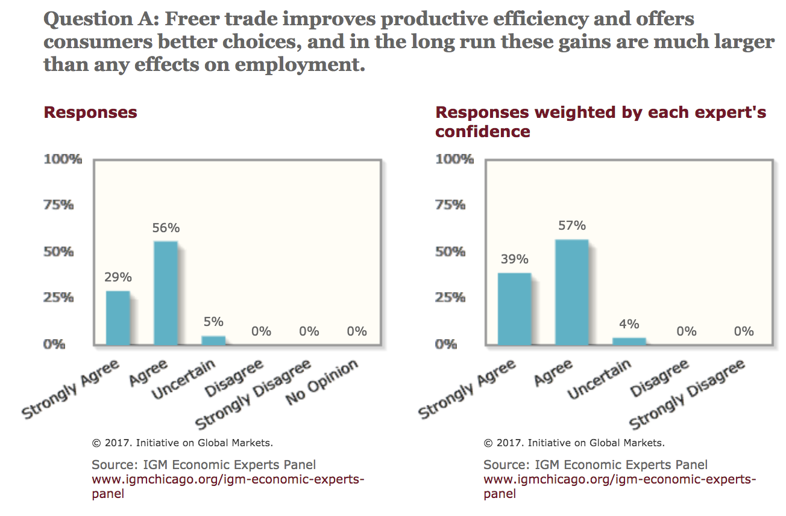

```{r setup, include=FALSE}
options(htmltools.dir.version = FALSE)
knitr::opts_chunk$set(echo=F,
                      message=F,
                      warning=F,
                      fig.retina=3,
                      fig.align="center")
library(tidyverse)
library(ggrepel)
library(mosaic)
set.seed(256)
update_geom_defaults("label", list(family = "Fira Sans Condensed"))
```

class: title-slide

# 2.1 — Tariffs

## ECON 324 • International Trade • Spring 2023

### Ryan Safner<br> Associate Professor of Economics <br> <a href="mailto:safner@hood.edu"><i class="fa fa-paper-plane fa-fw"></i>safner@hood.edu</a> <br> <a href="https://github.com/ryansafner/tradeS23"><i class="fa fa-github fa-fw"></i>ryansafner/tradeS23</a><br> <a href="https://tradeS23.classes.ryansafner.com"> <i class="fa fa-globe fa-fw"></i>tradeS23.classes.ryansafner.com</a><br>

---
class: inverse

# Outline

### [Tariffs](#3)

### [Effects of an Import Tariff in a Small Country](#14)

### [Effects of an Import Tariff in a Large Country](#14)

### [Optimal Tariff Theory](#14)

### [The Effective Rate of Protection](#14)

---

class: inverse, center, middle

# Tariffs

---

# Tariffs, According to POTUS 45

.pull-left[
.center[

]
]

.pull-right[
.center[

]
]

---

# But It's Not Just a Trump Thing...

.center[


]

---

# ...Or Just A Recent Thing

.center[

]

---

# Tariffs, According to Professional Economists

.pull-left[
.center[


.source[Source: [IGA Experts Poll (2012)](http://www.igmchicago.org/surveys/free-trade)]
]
]

--

.pull-right[
.center[

]
]

---

# International Trade Policies

.pull-left[
- Economists generally agree that free trade best enhances overall social welfare

- Yet free trade is rare in the world 

- Two questions:
    1. Why is free trade rare? Or, why are trade restrictions common?
    2. What are the consequences of restricting trade? 

]

.pull-right[
.center[

]
]

---

# International Trade Policies

.center[


.smallest[
This was in 2015, before the Trump Administration!
]
]

---

class: inverse, center, middle

# Tariffs

---

# Tariffs

.pull-left[
.smallest[
- Most common way to restrict trade is through a .hi[tariff] (historically called a .hi[“duty”]), a tax specifically targeted towards internationally-traded goods

- .hi[Import tariff]: tax on imported goods
	- This is by far the most common type of trade restriction

- .hi[Export tariff]: tax on exported goods
  - Rare in developed countries but sometimes occurs in developing countries as a way to generate government revenue

]
]

.pull-right[
.center[

]
]

---

# Types of Tariffs

.pull-left[
.smallest[
- .hi-purple[Ad valorem tariff] taxes a fixed percentage of the value of a good
  - e.g. 25% U.S. tariff on (prices of) imported trucks

- .hi-purple[Specific tariff] taxes a fixed sum per unit of a good
  - e.g. $3/barrel of oil

- .hi-purple[Compound tariff] combines ad valorem and specific tariffs
  - Rare in developed countries but sometimes occurs in developing countries as a way to generate government revenue
]
]

.pull-right[
.center[

]
]

---

# Tariff Schedule

.center[

.smallest[
U.S. tariff schedule on imported woven flax fabrics, [Harmonized Tariff Schedule](https://hts.usitc.gov/current), United States International Trade Commission Chapter 53, p. 53-4
]]
---

# Tariff History

.center[

]

---

# Tariff History

.center[

]

---

class: inverse, center, middle

# Effects of an Import Tariff in a Small Country

---

# Import Tariff Effects in a Small Country

.pull-left[
.smallest[
- To analyze effects of a tariff (on imports), need to compare two cases:

1. Effect of a tariff in a .hi[“small” country]
  - “Small” $\implies$ its domestic market is too small to affect world prices
  - Effectively, it is a .hi-purple[price-taker]: it can import as much as it wants and not drive up the price

2. Effect of a tariff in a .hi[“large” nation]
  - “Large” $\implies$ changes in the country’s domestic market *can* affect world prices 

]
]
.pull-right[
.center[

]
]

---

# Import Tariff Effects in a Small Country

.pull-left[
.smaller[
- Consider, for example, the sugar market in Belgium

]
]


.pull-right[
```{r}
Demand=function(x){20-x}
Supply=function(x){x}

g<-ggplot(data.frame(x=c(0,12)), aes(x=x))+
  labs(x = "Quantity (Billions of lbs)",
       y = "Price (Cents per lb)")+
  scale_x_continuous(breaks=seq(0,20,2),
                     limits=c(0,22),
                     expand=c(0,0))+
  scale_y_continuous(breaks=seq(0,20,2),
                     labels = function(x){paste0(x,"¢")},
                     limits=c(0,22),
                     expand=c(0,0))+
  theme_bw(base_family = "Fira Sans Condensed", base_size=18)

g
```
]

---

# Import Tariff Effects in a Small Country

.pull-left[
.smaller[
- Consider, for example, the sugar market in Belgium

- .hi-blue[Domestic Demand] for sugar in Belgium
]
]

.pull-right[
```{r}
g<-g+
  stat_function(fun=Demand, geom="line", color="blue", size=2)+
  geom_label(x=18,y=Demand(18), color = "blue", label="Demand (Domestic)")
g
```
]

---
# Import Tariff Effects in a Small Country

.pull-left[
.smaller[
- Consider, for example, the sugar market in Belgium

- .hi-blue[Domestic Demand] for sugar in Belgium

- .hi-red[Domestic Supply] of sugar in Belgium

]
]

.pull-right[
```{r}
g<-g+
  stat_function(fun=Supply, geom="line", color="red", size=2)+
  geom_label(x=18,y=Supply(18), color = "red", label="Supply (Domestic)")
g
```
]

---

# Import Tariff Effects in a Small Country

.pull-left[
.smaller[
- Consider, for example, the sugar market in Belgium

- .hi-blue[Domestic Demand] for sugar in Belgium

- .hi-red[Domestic Supply] of sugar in Belgium

- Autarky price: 10¢/lb, 10 billion lbs exchanged within Belgium
]
]

.pull-right[
```{r}
g+
  geom_segment(x = 0, y = 10, xend=10, yend=10, linetype="dotted", size=1)+
  geom_segment(x = 10, y = 10, xend=10, yend=0, linetype="dotted", size=1)

```
]


---

# Import Tariff Effects in a Small Country

.pull-left[
.smaller[
- Consider, for example, the sugar market in Belgium

- .hi-blue[Domestic Demand] for sugar in Belgium
  - .blue[Consumer surplus] = WTP - p*

- .hi-red[Domestic Supply] of sugar in Belgium

- Autarky price: 10¢/lb, 10 billion lbs exchanged within Belgium
]
]

.pull-right[
```{r}
cs_a<-tribble(
  ~x, ~y,
  0, 10,
  0, 20,
  10, 10
)
g+
  geom_polygon(data = cs_a, aes(x = x, y = y), fill = "blue", alpha = 0.2)+
  geom_segment(x = 0, y = 10, xend=10, yend=10, linetype="dotted", size=1)+
  geom_segment(x = 10, y = 10, xend=10, yend=0, linetype="dotted", size=1)

```
]

---

# Import Tariff Effects in a Small Country

.pull-left[
.smaller[
- Consider, for example, the sugar market in Belgium

- .hi-blue[Domestic Demand] for sugar in Belgium
  - .blue[Consumer surplus] = WTP - p*
  - = 0.5(10-0)($0.20-$0.10) = $0.5 billion

- .hi-red[Domestic Supply] of sugar in Belgium

- Autarky price: 10¢/lb, 10 billion lbs exchanged within Belgium
]
]

.pull-right[
```{r}
g+
  geom_polygon(data = cs_a, aes(x = x, y = y), fill = "blue", alpha = 0.2)+
  geom_segment(x = 0, y = 10, xend=10, yend=10, linetype="dotted", size=1)+
  geom_segment(x = 10, y = 10, xend=10, yend=0, linetype="dotted", size=1)

```
]

---

# Import Tariff Effects in a Small Country

.pull-left[
.smaller[
- Consider, for example, the sugar market in Belgium

- .hi-blue[Domestic Demand] for sugar in Belgium
  - .blue[Consumer surplus] = WTP - p*
  - = 0.5(10-0)($0.20-$0.10) = $0.5 billion

- .hi-red[Domestic Supply] of sugar in Belgium
  - .red[Producer surplus] = p* - WTA

- Autarky price: 10¢/lb, 10 billion lbs exchanged within Belgium
]

]
.pull-right[
```{r}
ps_a<-tribble(
  ~x, ~y,
  0, 0,
  0, 10,
  10, 10
)
g+
  geom_polygon(data = cs_a, aes(x = x, y = y), fill = "blue", alpha = 0.2)+
  geom_polygon(data = ps_a, aes(x = x, y = y), fill = "red", alpha = 0.2)+
  geom_segment(x = 0, y = 10, xend=10, yend=10, linetype="dotted", size=1)+
  geom_segment(x = 10, y = 10, xend=10, yend=0, linetype="dotted", size=1)

```
]

---

# Import Tariff Effects in a Small Country

.pull-left[
.smaller[
- Consider, for example, the sugar market in Belgium

- .hi-blue[Domestic Demand] for sugar in Belgium
  - .blue[Consumer surplus] = WTP - p*
  - = 0.5(10-0)($0.20-$0.10) = $0.5 billion

- .hi-red[Domestic Supply] of sugar in Belgium
  - .red[Producer surplus] = p* - WTA
  - = 0.5(10-0)($0.10-$0.00) = $0.5 billion
  
- Autarky price: 10¢/lb, 10 billion lbs exchanged within Belgium
]
]

.pull-right[
```{r}
ps_a<-tribble(
  ~x, ~y,
  0, 0,
  0, 10,
  10, 10
)
g+
  geom_polygon(data = cs_a, aes(x = x, y = y), fill = "blue", alpha = 0.2)+
  geom_polygon(data = ps_a, aes(x = x, y = y), fill = "red", alpha = 0.2)+
  geom_segment(x = 0, y = 10, xend=10, yend=10, linetype="dotted", size=1)+
  geom_segment(x = 10, y = 10, xend=10, yend=0, linetype="dotted", size=1)

```
]

---

# Import Tariff Effects in a Small Country

.pull-left[
.smaller[
- Consider, for example, the sugar market in Belgium

- .hi-blue[Domestic Demand] for sugar in Belgium

- .hi-red[Domestic Supply] of sugar in Belgium

- Suppose Belgium opens up to international trade

- .hi-orange[World Supply] of sugar at 4¢/lb
]
]

.pull-right[
```{r}
g+
  geom_hline(yintercept = 4, size = 2, color = "orange")+
  geom_label(x = 10, y = 4, color = "orange", label = "World Supply")

```
]

---

# Import Tariff Effects in a Small Country

.pull-left[

.smaller[
- At 4¢/lb:
  - .blue[Belgian consumers] want to consume 16 bn lbs
]
]

.pull-right[
```{r}
g+
  geom_hline(yintercept = 4, size = 2, color = "orange")+
  geom_label(x = 10, y = 4, color = "orange", label = "World Supply")+
  geom_segment(x = 16, y = 4, xend=16, yend=0, linetype="dotted", size=1)
```
]

---

# Import Tariff Effects in a Small Country

.pull-left[

.smaller[
- At 4¢/lb:
  - .blue[Belgian consumers] want to consume 16 bn lbs
  - .red[Belgian producers] will produce 4 bn lbs
]
]

.pull-right[
```{r}
g+
  geom_hline(yintercept = 4, size = 2, color = "orange")+
  geom_label(x = 10, y = 4, color = "orange", label = "World Supply")+
  geom_segment(x = 16, y = 4, xend=16, yend=0, linetype="dotted", size=1)+
  geom_segment(x = 4, y = 4, xend=4, yend=0, linetype="dotted", size=1)
```
]

---

# Import Tariff Effects in a Small Country

.pull-left[
.smaller[
- At 4¢/lb:
  - .blue[Belgian consumers] want to consume 16 bn lbs
  - .red[Belgian producers] will produce 4 bn lbs
  - Belgium will .orange[import] 12 bn lbs from the .orange[rest of the world]
]
]

.pull-right[
```{r}
g+
  geom_hline(yintercept = 4, size = 2, color = "orange")+
  geom_label(x = 8, y = 4, color = "orange", label = "World Supply")+
  geom_segment(x = 16, y = 4, xend=16, yend=0, linetype="dotted", size=1)+
  geom_segment(x = 4, y = 4, xend=4, yend=0, linetype="dotted", size=1)+
  annotate("segment", x = 4, xend = 16, y = 2, yend = 2, color = "orange", size=2, alpha=1, arrow=arrow(length=unit(0.5,"cm"), ends="both", type="closed"))+
  geom_label(x = 10, y = 2, color = "orange", label = "Imports")
```
]

---

# Import Tariff Effects in a Small Country

.pull-left[
.smaller[
- Under international trade:

- .blue[Consumer surplus] = WTP - p*
  - = 0.5(16-0)($0.20-$0.04) = $1.280 billion

]
]

.pull-right[
```{r}
cs_t<-tribble(
  ~x, ~y,
  0, 20,
  0, 4,
  16, 4
)
g+
  geom_polygon(data = cs_t, aes(x = x, y = y), fill = "blue", alpha = 0.2)+
  geom_hline(yintercept = 4, size = 2, color = "orange")+
  geom_label(x = 10, y = 4, color = "orange", label = "World Supply")+
  geom_segment(x = 16, y = 4, xend=16, yend=0, linetype="dotted", size=1)+
  geom_segment(x = 4, y = 4, xend=4, yend=0, linetype="dotted", size=1)+
  annotate("segment", x = 4, xend = 16, y = 2, yend = 2, color = "orange", size=2, alpha=1, arrow=arrow(length=unit(0.5,"cm"), ends="both", type="closed"))+
  geom_label(x = 10, y = 2, color = "orange", label = "Imports")
```
]

---

# Import Tariff Effects in a Small Country

.pull-left[

.smaller[
- Under international trade:

- .blue[Consumer surplus] = WTP - p*
  - = 0.5(16-0)($0.20-$0.04) = $1.280 billion

- .red[Producer surplus] = p* - WTA
  - = 0.5(4-0)($0.04-$0.00) = $0.080 billion

]
]

.pull-right[
```{r}
ps_t<-tribble(
  ~x, ~y,
  0, 0,
  0, 4,
  4, 4
)
g+
  geom_polygon(data = cs_t, aes(x = x, y = y), fill = "blue", alpha = 0.2)+
  geom_polygon(data = ps_t, aes(x = x, y = y), fill = "red", alpha = 0.2)+
  geom_hline(yintercept = 4, size = 2, color = "orange")+
  geom_label(x = 10, y = 4, color = "orange", label = "World Supply")+
  geom_segment(x = 16, y = 4, xend=16, yend=0, linetype="dotted", size=1)+
  geom_segment(x = 4, y = 4, xend=4, yend=0, linetype="dotted", size=1)+
  annotate("segment", x = 4, xend = 16, y = 2, yend = 2, color = "orange", size=2, alpha=1, arrow=arrow(length=unit(0.5,"cm"), ends="both", type="closed"))+
  geom_label(x = 10, y = 2, color = "orange", label = "Imports")
```
]

---

# Import Tariff Effects in a Small Country

.pull-left[

.smaller[
- Under international trade:

- .blue[Consumer surplus] = WTP - p*
  - = 0.5(16-0)($0.20-$0.04) = $1.280 billion

- .red[Producer surplus] = p* - WTA
  - = 0.5(4-0)($0.04-$0.00) = $0.080 billion

- Trade benefits .blue[Belgian consumers] at expense of .red[Belgian sugar producers]
  - But gain is much bigger than loss!
]
]
.pull-right[
```{r}
ps_t<-tribble(
  ~x, ~y,
  0, 0,
  0, 4,
  4, 4
)
g+
  geom_polygon(data = cs_t, aes(x = x, y = y), fill = "blue", alpha = 0.2)+
  geom_polygon(data = ps_t, aes(x = x, y = y), fill = "red", alpha = 0.2)+
  geom_hline(yintercept = 4, size = 2, color = "orange")+
  geom_label(x = 10, y = 4, color = "orange", label = "World Supply")+
  geom_segment(x = 16, y = 4, xend=16, yend=0, linetype="dotted", size=1)+
  geom_segment(x = 4, y = 4, xend=4, yend=0, linetype="dotted", size=1)+
  annotate("segment", x = 4, xend = 16, y = 2, yend = 2, color = "orange", size=2, alpha=1, arrow=arrow(length=unit(0.5,"cm"), ends="both", type="closed"))+
  geom_label(x = 10, y = 2, color = "orange", label = "Imports")
```
]

---

# Import Tariff Effects in a Small Country

.pull-left[
```{r, fig.height=4}
g+
  geom_hline(yintercept = 4, size = 2, color = "orange")+
  geom_label(x = 10, y = 4, color = "orange", label = "World Supply")+
  geom_segment(x = 16, y = 4, xend=16, yend=0, linetype="dotted", size=1)+
  geom_segment(x = 4, y = 4, xend=4, yend=0, linetype="dotted", size=1)+
  annotate("segment", x = 4, xend = 16, y = 2, yend = 2, color = "orange", size=2, alpha=1, arrow=arrow(length=unit(0.5,"cm"), ends="both", type="closed"))+
  geom_label(x = 10, y = 2, color = "orange", label = "Imports")+
  labs(title = "Belgian Sugar Market")
```

]

.pull-right[
```{r, fig.height=4}
imp_demand=function(x){10-0.5*x}

imp<-ggplot(data.frame(x=c(0,12)), aes(x=x))+
  stat_function(fun = "imp_demand", size = 2, color = "blue")+
  geom_label(x = 16, y = imp_demand(16), color = "blue", label = "Belgian Import Demand")+
  labs(x = "Quantity (Billions of lbs)",
       y = "Price (Cents per lb)",
       title = "Sugar Import Market")+
  scale_x_continuous(breaks=seq(0,20,2),
                     limits=c(0,22),
                     expand=c(0,0))+
  scale_y_continuous(breaks=seq(0,20,2),
                     labels = function(x){paste0(x,"¢")},
                     limits=c(0,22),
                     expand=c(0,0))+
  theme_bw(base_family = "Fira Sans Condensed", base_size=18)
imp
```

]

.smallest[
- We can trace Belgium’s import demand from the world based on the world price

- Note at a price of ¢10 there is no import demand, all sugar can be produced in Belgium

]

---

# Import Tariff Effects in a Small Country

.pull-left[
```{r, fig.height=4}
g+
  geom_hline(yintercept = 4, size = 2, color = "orange")+
  geom_label(x = 10, y = 4, color = "orange", label = "World Supply")+
  geom_segment(x = 16, y = 4, xend=16, yend=0, linetype="dotted", size=1)+
  geom_segment(x = 4, y = 4, xend=4, yend=0, linetype="dotted", size=1)+
  annotate("segment", x = 4, xend = 16, y = 2, yend = 2, color = "orange", size=2, alpha=1, arrow=arrow(length=unit(0.5,"cm"), ends="both", type="closed"))+
  geom_label(x = 10, y = 2, color = "orange", label = "Imports")+
    labs(title = "Belgian Sugar Market")
```

]

.pull-right[
```{r, fig.height=4}

imp+
  geom_hline(yintercept = 4, size = 2, color = "orange")+
  geom_label(x = 16, y = 4, color = "orange", label = "World Supply")+
  geom_segment(x = 12, y = 4, xend = 12, yend = 0, size = 1, linetype = "dotted")
```

]

.smallest[
- We can trace Belgium’s import demand from the world based on the world price

- Note at a price of ¢10 there is no import demand, all sugar can be produced in Belgium

- We have been assuming the world supply of sugar is perfectly elastic at 4¢

- Sets equilibrium amount of imports in Belgium, 12 bn lbs imported

]

---

# Import Tariff Effects in a Small Country

.pull-left[
.smaller[
- Suppose the government levies a 4¢/lb .hi-purple[tariff] on sugar imports
]
]
.pull-right[
```{r}
g+
  geom_hline(yintercept = 4, size = 2, color = "orange", alpha = 0.5)+
  geom_label(x = 10, y = 4, color = "orange", label = "World Supply")+
  geom_hline(yintercept = 8, size = 2, color = "orange")+
  geom_label(x = 10, y = 8, color = "orange", label = "World Supply + t")+
  annotate("segment", x = 10, xend = 10, y = 4, yend = 8, color = "black", size=2, alpha=1, arrow=arrow(length=unit(0.5,"cm"), ends="both", type="closed"))+
  geom_label(x = 10, y = 6, label = "t=4¢")
```
]

---

# Import Tariff Effects in a Small Country

.pull-left[
.smaller[
- Suppose the government levies a 4¢/lb .hi-purple[tariff] on sugar imports

- At new domestic sugar price of 8¢/lb
]
]
.pull-right[
```{r}
g+
  geom_hline(yintercept = 4, size = 2, color = "orange", alpha = 0.5)+
  geom_label(x = 10, y = 4, color = "orange", label = "World Supply")+
  geom_hline(yintercept = 8, size = 2, color = "orange")+
  geom_label(x = 10, y = 8, color = "orange", label = "World Supply + t")

```
]

---

# Import Tariff Effects in a Small Country

.pull-left[
.smaller[
- Suppose the government levies a 4¢/lb .hi-purple[tariff] on sugar imports

- At new domestic sugar price of 8¢/lb
  - .blue[Belgian consumers] want to consume 12 bn lbs (less than before)
]
]
.pull-right[
```{r}
g+
  geom_hline(yintercept = 4, size = 2, color = "orange", alpha = 0.5)+
  geom_label(x = 10, y = 4, color = "orange", label = "World Supply")+
  geom_hline(yintercept = 8, size = 2, color = "orange")+
  geom_label(x = 10, y = 8, color = "orange", label = "World Supply + t")+
  geom_segment(x = 12, y = 8, xend = 12, yend = 0, linetype="dotted", size = 1)+
  geom_segment(x = 16, y = 4, xend=16, yend=0, linetype="dotted", size=1)+
  annotate("segment", x = 16, xend = 12, y = 2, yend = 2, color = "black", size=2, alpha=1, arrow=arrow(length=unit(0.5,"cm"), ends="last", type="closed"))

```
]

---

# Import Tariff Effects in a Small Country

.pull-left[
.smaller[
- Suppose the government levies a 4¢/lb .hi-purple[tariff] on sugar imports

- At new domestic sugar price of 8¢/lb
  - .blue[Belgian consumers] want to consume 12 bn lbs (less than before)
  - .red[Belgian producers] will produce 8 bn lbs (more than before)
]
]
.pull-right[
```{r}
g+
  geom_hline(yintercept = 4, size = 2, color = "orange", alpha = 0.5)+
  geom_label(x = 10, y = 4, color = "orange", label = "World Supply")+
  geom_hline(yintercept = 8, size = 2, color = "orange")+
  geom_label(x = 10, y = 8, color = "orange", label = "World Supply + t")+
  geom_segment(x = 4, y = 4, xend = 4, yend = 0, linetype="dotted", size =1)+
  geom_segment(x = 8, y = 8, xend = 8, yend = 0, linetype="dotted", size = 1)+
  annotate("segment", x = 4, xend = 8, y = 2, yend = 2, color = "black", size=2, alpha=1, arrow=arrow(length=unit(0.5,"cm"), ends="last", type="closed"))

```
]

---

# Import Tariff Effects in a Small Country

.pull-left[
.smaller[
- Suppose the government levies a 4¢/lb .hi-purple[tariff] on sugar imports

- At new domestic sugar price of 8¢/lb
  - .blue[Belgian consumers] want to consume 12 bn lbs (less than before)
  - .red[Belgian producers] will produce 8 bn lbs (more than before)
  - Belgium will .orange[import] 4 bn lbs from the .orange[rest of the world] (less than before)
]
]
.pull-right[
```{r}
g+
  geom_hline(yintercept = 4, size = 2, color = "orange", alpha = 0.5)+
  geom_label(x = 10, y = 4, color = "orange", label = "World Supply")+
  geom_hline(yintercept = 8, size = 2, color = "orange")+
  geom_label(x = 10, y = 8, color = "orange", label = "World Supply + t")+
  geom_segment(x = 12, y = 8, xend = 12, yend = 0, linetype="dotted", size = 1)+
  geom_segment(x = 8, y = 8, xend = 8, yend = 0, linetype="dotted", size = 1)+
  annotate("segment", x = 8, xend = 12, y = 2, yend = 2, color = "orange", size=2, alpha=1, arrow=arrow(length=unit(0.5,"cm"), ends="both", type="closed"))+
  geom_label(x = 10, y = 2, color = "orange", label = "Imports")

```

]
---

# Import Tariff Effects in a Small Country

.pull-left[
.smaller[
- Suppose the government levies a 4¢/lb .hi-purple[tariff] on sugar imports

- At new domestic sugar price of 8¢/lb
  - .blue[Belgian consumers] want to consume 12 bn lbs (less than before)
  - .red[Belgian producers] will produce 8 bn lbs (more than before)
  - Belgium will .orange[import] 4 bn lbs from the .orange[rest of the world] (less than before)

- Tariff is a tax, so government earns revenue:
  - 4 bn lbs $\times $ 0.04/lb = $0.160 bn
]
]
.pull-right[
```{r}
g+
  geom_rect(xmin = 8, xmax = 12, ymin = 4, ymax = 8, fill ="green", alpha = 0.5)+
  geom_hline(yintercept = 4, size = 2, color = "orange", alpha = 0.5)+
  geom_label(x = 10, y = 4, color = "orange", label = "World Supply")+
  geom_hline(yintercept = 8, size = 2, color = "orange")+
  geom_label(x = 10, y = 8, color = "orange", label = "World Supply + t")+
  geom_segment(x = 12, y = 8, xend = 12, yend = 0, linetype="dotted", size = 1)+
  geom_segment(x = 8, y = 8, xend = 8, yend = 0, linetype="dotted", size = 1)+
  annotate("segment", x = 8, xend = 12, y = 2, yend = 2, color = "orange", size=2, alpha=1, arrow=arrow(length=unit(0.5,"cm"), ends="both", type="closed"))+
  geom_label(x = 10, y = 2, color = "orange", label = "Imports")
```

]

---

# Import Tariff Effects in a Small Country

.pull-left[
.smaller[
- Under the tariff:

- .blue[Consumer surplus] = WTP - p*
  - = 0.5(12-0)($0.20-$0.08) = $0.720 billion
  - Less than before (free trade)
]
]

.pull-right[
```{r}
cs_tar<-tribble(
  ~x, ~y,
  0, 20,
  0, 8,
  12, 8
)
g+
  geom_polygon(data = cs_tar, aes(x = x, y = y), fill = "blue", alpha = 0.2)+
  geom_rect(xmin = 8, xmax = 12, ymin = 4, ymax = 8, fill ="green", alpha = 0.5)+
  geom_hline(yintercept = 4, size = 2, color = "orange", alpha = 0.5)+
  geom_label(x = 10, y = 4, color = "orange", label = "World Supply")+
  geom_hline(yintercept = 8, size = 2, color = "orange")+
  geom_label(x = 10, y = 8, color = "orange", label = "World Supply + t")+
  geom_segment(x = 12, y = 8, xend = 12, yend = 0, linetype="dotted", size = 1)+
  geom_segment(x = 8, y = 8, xend = 8, yend = 0, linetype="dotted", size = 1)+
  annotate("segment", x = 8, xend = 12, y = 2, yend = 2, color = "orange", size=2, alpha=1, arrow=arrow(length=unit(0.5,"cm"), ends="both", type="closed"))+
  geom_label(x = 10, y = 2, color = "orange", label = "Imports")
```

]

---

# Import Tariff Effects in a Small Country

.pull-left[
.smaller[
- Under the tariff:

- .blue[Consumer surplus] = WTP - p*
  - = 0.5(12-0)($0.20-$0.08) = $0.720 billion
  - Less than before (free trade)

- .red[Producer surplus] = p* - WTA
  - = 0.5(8-0)($0.08-$0.00) = $0.320 billion
  - More than before (free trade)
]
]

.pull-right[
```{r}
ps_tar<-tribble(
  ~x, ~y,
  0, 0,
  0, 8,
  8, 8
)
g+
  geom_polygon(data = cs_tar, aes(x = x, y = y), fill = "blue", alpha = 0.2)+
  geom_polygon(data = ps_tar, aes(x = x, y = y), fill = "red", alpha = 0.2)+
  geom_rect(xmin = 8, xmax = 12, ymin = 4, ymax = 8, fill ="green", alpha = 0.5)+
  geom_hline(yintercept = 4, size = 2, color = "orange", alpha = 0.5)+
  geom_label(x = 10, y = 4, color = "orange", label = "World Supply")+
  geom_hline(yintercept = 8, size = 2, color = "orange")+
  geom_label(x = 10, y = 8, color = "orange", label = "World Supply + t")+
  geom_segment(x = 12, y = 8, xend = 12, yend = 0, linetype="dotted", size = 1)+
  geom_segment(x = 8, y = 8, xend = 8, yend = 0, linetype="dotted", size = 1)+
  annotate("segment", x = 8, xend = 12, y = 2, yend = 2, color = "orange", size=2, alpha=1, arrow=arrow(length=unit(0.5,"cm"), ends="both", type="closed"))+
  geom_label(x = 10, y = 2, color = "orange", label = "Imports")
```

]

---

# Import Tariff Effects in a Small Country

.pull-left[
.smaller[
- Under the tariff:

- Two new sources of market inefficiency created, .b[“deadweight loss (DWL)”]

]
]
.pull-right[
```{r}
ps_tar<-tribble(
  ~x, ~y,
  0, 0,
  0, 8,
  8, 8
)
g+
  geom_polygon(data = cs_tar, aes(x = x, y = y), fill = "blue", alpha = 0.2)+
  geom_polygon(data = ps_tar, aes(x = x, y = y), fill = "red", alpha = 0.2)+
  geom_rect(xmin = 8, xmax = 12, ymin = 4, ymax = 8, fill ="green", alpha = 0.5)+
  geom_hline(yintercept = 4, size = 2, color = "orange", alpha = 0.5)+
  geom_label(x = 10, y = 4, color = "orange", label = "World Supply")+
  geom_hline(yintercept = 8, size = 2, color = "orange")+
  geom_label(x = 10, y = 8, color = "orange", label = "World Supply + t")+
  geom_segment(x = 12, y = 8, xend = 12, yend = 0, linetype="dotted", size = 1)+
  geom_segment(x = 8, y = 8, xend = 8, yend = 0, linetype="dotted", size = 1)+
  annotate("segment", x = 8, xend = 12, y = 2, yend = 2, color = "orange", size=2, alpha=1, arrow=arrow(length=unit(0.5,"cm"), ends="both", type="closed"))+
  geom_label(x = 10, y = 2, color = "orange", label = "Imports")
```

]

---

# Import Tariff Effects in a Small Country

.pull-left[
.smaller[
- Under the tariff:

- Two new sources of market inefficiency created, .b[“deadweight loss (DWL)”]
  1. Inefficient domestic production (cheaper for foreigners to produce sugar)
    - 0.5(8-4)($0.08-$0.04) = $0.080 Billion

]
]
.pull-right[
```{r}
dwl_l<-tribble(
  ~x, ~y,
  4, 4,
  8, 8,
  8, 4
)
g+
  geom_polygon(data = dwl_l, aes(x = x, y = y), fill = "black", alpha = 0.4)+
  geom_polygon(data = cs_tar, aes(x = x, y = y), fill = "blue", alpha = 0.2)+
  geom_polygon(data = ps_tar, aes(x = x, y = y), fill = "red", alpha = 0.2)+
  geom_rect(xmin = 8, xmax = 12, ymin = 4, ymax = 8, fill ="green", alpha = 0.5)+
  geom_hline(yintercept = 4, size = 2, color = "orange", alpha = 0.5)+
  geom_label(x = 10, y = 4, color = "orange", label = "World Supply")+
  geom_hline(yintercept = 8, size = 2, color = "orange")+
  geom_label(x = 10, y = 8, color = "orange", label = "World Supply + t")+
  geom_segment(x = 12, y = 8, xend = 12, yend = 0, linetype="dotted", size = 1)+
  geom_segment(x = 8, y = 8, xend = 8, yend = 0, linetype="dotted", size = 1)+
  annotate("segment", x = 8, xend = 12, y = 2, yend = 2, color = "orange", size=2, alpha=1, arrow=arrow(length=unit(0.5,"cm"), ends="both", type="closed"))+
  geom_label(x = 10, y = 2, color = "orange", label = "Imports")
```

]

---

# Import Tariff Effects in a Small Country

.pull-left[
.smaller[
- Under the tariff:

- Two new sources of market inefficiency created, .b[“deadweight loss (DWL)”]
  1. Inefficient domestic production (cheaper for foreigners to produce sugar)
    - 0.5(8-4)($0.08-$0.04) = $0.080 Billion
  2. Lost gains from exchange (consumers wanted to buy more from world)
    - 0.5(16-12)($0.08-$0.04) = $0.080 Billion
]
]
.pull-right[
```{r}
dwl_r<-tribble(
  ~x, ~y,
  12, 4,
  12, 8,
  16, 4
)
dwl<-g+
  geom_polygon(data = dwl_l, aes(x = x, y = y), fill = "black", alpha = 0.4)+
  geom_polygon(data = dwl_r, aes(x = x, y = y), fill = "black", alpha = 0.4)+
  geom_polygon(data = cs_tar, aes(x = x, y = y), fill = "blue", alpha = 0.2)+
  geom_polygon(data = ps_tar, aes(x = x, y = y), fill = "red", alpha = 0.2)+
  geom_rect(xmin = 8, xmax = 12, ymin = 4, ymax = 8, fill ="green", alpha = 0.5)+
  geom_hline(yintercept = 4, size = 2, color = "orange", alpha = 0.5)+
  geom_label(x = 10, y = 4, color = "orange", label = "World Supply")+
  geom_hline(yintercept = 8, size = 2, color = "orange")+
  geom_label(x = 10, y = 8, color = "orange", label = "World Supply + t")+
  geom_segment(x = 12, y = 8, xend = 12, yend = 0, linetype="dotted", size = 1)+
  geom_segment(x = 8, y = 8, xend = 8, yend = 0, linetype="dotted", size = 1)+
  annotate("segment", x = 8, xend = 12, y = 2, yend = 2, color = "orange", size=2, alpha=1, arrow=arrow(length=unit(0.5,"cm"), ends="both", type="closed"))+
  geom_label(x = 10, y = 2, color = "orange", label = "Imports")
dwl
```

]

---

# Import Tariff Effects in a Small Country

.pull-left[
```{r, fig.height=4}
dwl+
    labs(title = "Belgian Sugar Market")
```

]

.pull-right[
```{r, fig.height=4}
imp_dwl<-tribble(
  ~x, ~y,
  4, 8,
  4, 4,
  12,4
)
imp+
  geom_polygon(data = imp_dwl, aes(x = x, y = y), fill = "black", alpha = 0.4)+
  geom_hline(yintercept = 4, size = 2, color = "orange", alpha = 0.5)+
  geom_label(x = 16, y = 4, color = "orange", label = "World Supply")+
  geom_hline(yintercept = 8, size = 2, color = "orange", alpha = 1)+
  geom_label(x = 16, y = 8, color = "orange", label = "World Supply + t")+
  geom_segment(x = 12, y = 4, xend = 12, yend = 0, size = 1, linetype = "dotted")+
  geom_segment(x = 4, y = 8, xend = 4, yend = 0, size = 1, linetype = "dotted")
```

]

.smallest[
- Can also see this in the import market

- Decline of imports at higher price in Belgium

- Size of DWL in import market = sum of both DWL triangles in Belgian market ($0.160 bn)
]

---

# Import Tariff Effects in a Small Country

.pull-left[
.smallest[
- Domestic consequences of tariff:

1. .blue[Decrease in consumer surplus]:
  - $0.720 bn-$1.280 bn = .blue[-$0.460 bn]
  
2. .red[Increase in producer surplus]:
  - $0.320 bn-$0.080 bn = .red[$0.240 bn]

3. .green[Government tax revenue]:
  - .green[$0.160 bn]

4. .b[Deadweight losses]
  - $-0.080 bn - $0.080 bn = .b[-$0.160 bn]
]
]

.pull-right[
```{r}
dwl
```

]

---

# Import Tariff Effects in a Small Country

.pull-left[
.smaller[
- Domestic consequences of tariff:

- A $240m gain to a small group of domestic sugar producers at a $460m expense to consumers

- Concentrated benefit, dispersed cost each consumer pays $0.04/lb more for sugar

- Harm to foreigners: hurts exporters and consumers in other countries from lost trade
]
]

.pull-right[
```{r}
dwl
```

]

---

class: inverse, center, middle

# Tariff Effects in a Large Country

---

# Large Countries in International Trade

.pull-left[
.smallest[
- A .hi-purple[“large country”] has a sufficiently large domestic demand to affect international prices

- The decrease in domestic demand from an import tariff (from higher import price) is sufficiently large to .hi-purple[lower the world price of the good]

- This is called the .hi[“terms of trade effect”] of a tariff
  - can provide a *benefit* to domestic country
  - harms foreign exporters due to lower world price
]

]

.pull-right[
.center[

]
]

---

# Import Tariff Effects in a Large Country

.pull-left[

.smaller[
- Consider, for example, the sugar market in the U.S.

- Autarky price: 10¢/lb, 10 billion lbs exchanged within U.S.
]
]

.pull-right[
```{r}
l<-ggplot(data.frame(x=c(0,12)), aes(x=x))+
  stat_function(fun=Demand, geom="line", color="blue", size=2)+
  geom_label(x=12,y=Demand(12), color = "blue", label="Demand (U.S.)")+
  stat_function(fun=Supply, geom="line", color="red", size=2)+
  geom_label(x=8,y=Supply(8), color = "red", label="Supply (U.S.)")+
  geom_segment(x = 0, y = 10, xend = 10, yend = 10, size = 1, linetype = "dotted")+
  geom_segment(x = 10, y = 10, xend = 10, yend = 0, size = 1, linetype = "dotted")+
  labs(x = "Quantity (Billions of lbs)",
       y = "Price (Cents per lb)")+
  scale_x_continuous(breaks=seq(0,20,2),
                     limits=c(0,22),
                     expand=c(0,0))+
  scale_y_continuous(breaks=seq(0,10,1),
                     labels = function(x){paste0(x,"¢")},
                     limits=c(0,12),
                     expand=c(0,0))+
  theme_bw(base_family = "Fira Sans Condensed", base_size=18)

l
```
]

---

# Import Tariff Effects in a Large Country

.pull-left[
.smaller[
- Suppose U.S. opens up to international trade

- .hi-orange[World Supply] of sugar at 4¢/lb:
]
]


.pull-right[
```{r}
ggplot(data.frame(x=c(0,12)), aes(x=x))+
  stat_function(fun=Demand, geom="line", color="blue", size=2)+
  geom_label(x=12,y=Demand(12), color = "blue", label="Demand (U.S.)")+
  stat_function(fun=Supply, geom="line", color="red", size=2)+
  geom_label(x=8,y=Supply(8), color = "red", label="Supply (U.S.)")+
  geom_hline(yintercept = 4, size = 2, color = "orange")+
  geom_label(x = 10, y = 4, color = "orange", label = "World Supply")+
  labs(x = "Quantity (Billions of lbs)",
       y = "Price (Cents per lb)")+
  scale_x_continuous(breaks=seq(0,20,2),
                     limits=c(0,22),
                     expand=c(0,0))+
  scale_y_continuous(breaks=seq(0,10,1),
                     labels = function(x){paste0(x,"¢")},
                     limits=c(0,12),
                     expand=c(0,0))+
  theme_bw(base_family = "Fira Sans Condensed", base_size=18)
```
]

---

# Import Tariff Effects in a Large Country

.pull-left[
.smaller[
- Suppose U.S. opens up to international trade

- .hi-orange[World Supply] of sugar at 4¢/lb:
  - .blue[U.S. consumers] want to consume 16 bn lbs
  - .red[U.S. producers] will produce 4 bn lbs
  - U.S. will .orange[import] 12 bn lbs from the .orange[rest of the world]
]
]

.pull-right[
```{r}
ggplot(data.frame(x=c(0,12)), aes(x=x))+
  stat_function(fun=Demand, geom="line", color="blue", size=2)+
  geom_label(x=12,y=Demand(12), color = "blue", label="Demand (U.S.)")+
  stat_function(fun=Supply, geom="line", color="red", size=2)+
  geom_label(x=8,y=Supply(8), color = "red", label="Supply (U.S.)")+
  geom_hline(yintercept = 4, size = 2, color = "orange")+
  geom_label(x = 10, y = 4, color = "orange", label = "World Supply")+
  geom_segment(x = 16, y = 4, xend=16, yend=0, linetype="dotted", size=1)+
  geom_segment(x = 4, y = 4, xend=4, yend=0, linetype="dotted", size=1)+
  annotate("segment", x = 4, xend = 16, y = 2, yend = 2, color = "orange", size=2, alpha=1, arrow=arrow(length=unit(0.5,"cm"), ends="both", type="closed"))+
  geom_label(x = 10, y = 2, color = "orange", label = "Imports")+
  labs(x = "Quantity (Billions of lbs)",
       y = "Price (Cents per lb)")+
  scale_x_continuous(breaks=seq(0,20,2),
                     limits=c(0,22),
                     expand=c(0,0))+
  scale_y_continuous(breaks=seq(0,10,1),
                     labels = function(x){paste0(x,"¢")},
                     limits=c(0,12),
                     expand=c(0,0))+
  theme_bw(base_family = "Fira Sans Condensed", base_size=18)
```
]

---

# Import Tariff Effects in a Large Country

.pull-left[
```{r, fig.height=4}
ggplot(data.frame(x=c(0,12)), aes(x=x))+
  stat_function(fun=Demand, geom="line", color="blue", size=2)+
  geom_label(x=12,y=Demand(12), color = "blue", label="Demand (U.S.)")+
  stat_function(fun=Supply, geom="line", color="red", size=2)+
  geom_label(x=8,y=Supply(8), color = "red", label="Supply (U.S.)")+
  geom_hline(yintercept = 4, size = 2, color = "orange")+
  geom_label(x = 10, y = 4, color = "orange", label = "World Supply")+
  geom_segment(x = 16, y = 4, xend=16, yend=0, linetype="dotted", size=1)+
  geom_segment(x = 4, y = 4, xend=4, yend=0, linetype="dotted", size=1)+
  annotate("segment", x = 4, xend = 16, y = 2, yend = 2, color = "orange", size=2, alpha=1, arrow=arrow(length=unit(0.5,"cm"), ends="both", type="closed"))+
  geom_label(x = 10, y = 2, color = "orange", label = "Imports")+
  labs(x = "Quantity (Billions of lbs)",
       y = "Price (Cents per lb)",
       title = "U.S. Sugar Market")+
  scale_x_continuous(breaks=seq(0,20,2),
                     limits=c(0,22),
                     expand=c(0,0))+
  scale_y_continuous(breaks=seq(0,10,1),
                     labels = function(x){paste0(x,"¢")},
                     limits=c(0,12),
                     expand=c(0,0))+
  theme_bw(base_family = "Fira Sans Condensed", base_size=18)
```

]

.pull-right[
```{r, fig.height=4}
exp_supply=function(x){0.1625*x+2}
exp_supply2=function(x){0.1625*x+6}

imp_tt<-ggplot(data.frame(x=c(0,12)), aes(x=x))+
  stat_function(fun = "imp_demand", size = 2, color = "blue")+
  geom_label(x = 16, y = imp_demand(16), color = "blue", label = "U.S. Import Demand")+
  stat_function(fun = "exp_supply", size = 2, color = "orange")+
  geom_label(x = 16, y = exp_supply(16), color = "orange", label = "World Export (to U.S.) Supply")+
  
  geom_segment(x = 12, y = 4, xend = 12, yend = 0, size = 1, linetype = "dotted")+
  geom_segment(x = 0, y = 4, xend = 12, yend = 4, size = 1, linetype = "dotted")+
  labs(x = "Quantity (Billions of lbs)",
       y = "Price (Cents per lb)",
       title = "World Sugar Market")+
  scale_x_continuous(breaks=seq(0,20,2),
                     limits=c(0,22),
                     expand=c(0,0))+
  scale_y_continuous(breaks=seq(0,10,1),
                     labels = function(x){paste0(x,"¢")},
                     limits=c(0,12),
                     expand=c(0,0))+
  theme_bw(base_family = "Fira Sans Condensed", base_size=18)
imp_tt
```

]

.quitesmall[
- We can trace U.S.’s import demand from the world based on the world price

- Because U.S. is a large country, the world supply curve (exports from other countries) to U.S. is *upward* sloping
  - sufficiently high demand from U.S. stimulates production abroad for export to U.S.

- Imagine autarky equilibrium price in exporting countries is 2¢; once they can get higher price in U.S., start exporting

- Sets equilibrium amount of imports in U.S., 12 bn lbs imported at 4¢

]

---

# Import Tariff Effects in a Large Country

.pull-left[
.quitesmall[
- Now suppose U.S. imposes a 4¢/lb tariff on imported sugar

- Increase in costs to world sugar exporters decreases world export supply by 4¢/lb

- New equilibrium is for U.S. to import 6 bn lbs at 7¢/lb
  - But 4¢/lb of the imports are paid to U.S. government as tariffs

- Exporters to U.S. recieve *net price* (after taxes) of 3¢/lb

- Important: raise in price to U.S. consumers is less than the full 4¢/lb!
  - Tariff on the massive U.S. market has lowered the *world* price of sugar because of decreased world supply, the .hi-purple[terms of trade effect]
]

]

.pull-right[
```{r}
exp_supply=function(x){0.1625*x+2}
exp_supply2=function(x){0.1625*x+6}

imp_tt2<-ggplot(data.frame(x=c(0,12)), aes(x=x))+
  stat_function(fun = "imp_demand", size = 2, color = "blue")+
  geom_label(x = 16, y = imp_demand(16), color = "blue", label = "U.S. Import Demand")+
  stat_function(fun = "exp_supply", size = 2, color = "orange", alpha = 0.5)+
  geom_label(x = 16, y = exp_supply(16), color = "orange", label = "World Export (to U.S.) Supply")+
  
    stat_function(fun = "exp_supply2", size = 2, color = "orange")+
  geom_label(x = 16, y = exp_supply2(16), color = "orange", label = "World Export (to U.S.) Supply + t")+

  geom_segment(x = 12, y = 4, xend = 12, yend = 0, size = 1, linetype = "dotted")+
  geom_segment(x = 0, y = 4, xend = 12, yend = 4, size = 1, linetype = "dotted")+

  geom_segment(x = 6, y = 7, xend = 6, yend = 0, size = 1, linetype = "dotted")+
  geom_segment(x = 0, y = 7, xend = 6, yend = 7, size = 1, linetype = "dotted")+
  geom_segment(x = 0, y = 3, xend = 6, yend = 3, size = 1, linetype = "dotted")+

  annotate("segment", x = 12, xend = 12, y = 4, yend = 8, color = "black", size=2, alpha=1, arrow=arrow(length=unit(0.5,"cm"), ends="both", type="closed"))+
  geom_label(x = 12, y = 6, label = "t=4¢")+

  labs(x = "Quantity (Billions of lbs)",
       y = "Price (Cents per lb)",
       title = "World Sugar Market")+
  scale_x_continuous(breaks=seq(0,20,2),
                     limits=c(0,22),
                     expand=c(0,0))+
  scale_y_continuous(breaks=seq(0,10,1),
                     labels = function(x){paste0(x,"¢")},
                     limits=c(0,12),
                     expand=c(0,0))+
  theme_bw(base_family = "Fira Sans Condensed", base_size=18)
imp_tt2
```

]

---

# Import Tariff Effects in a Large Country

.pull-left[

.smaller[
- Now suppose U.S. imposes a 4¢/lb tariff on imported sugar

- Due to the terms of trade effect, world price of sugar will fall from less U.S. demand (to 3¢/lb)
]
]

.pull-right[
```{r}
ggplot(data.frame(x=c(0,12)), aes(x=x))+
  stat_function(fun=Demand, geom="line", color="blue", size=2)+
  geom_label(x=12,y=Demand(12), color = "blue", label="Demand (U.S.)")+
  stat_function(fun=Supply, geom="line", color="red", size=2)+
  geom_label(x=8,y=Supply(8), color = "red", label="Supply (U.S.)")+
  geom_hline(yintercept = 4, size = 2, color = "orange", alpha = 0.25)+
  geom_label(x = 10, y = 4, color = "orange", label = "World Supply")+
  geom_hline(yintercept = 3, size = 2, color = "orange", alpha = 1)+
  geom_label(x = 10, y = 3, color = "orange", label = "World Supply’")+
  geom_segment(x = 16, y = 4, xend=16, yend=0, linetype="dotted", size=1)+
  geom_segment(x = 4, y = 4, xend=4, yend=0, linetype="dotted", size=1)+
  annotate("segment", x = 10, xend = 10, y = 4, yend = 3, color = "black", size=2, alpha=1, arrow=arrow(length=unit(0.5,"cm"), ends="last", type="closed"))+
  labs(x = "Quantity (Billions of lbs)",
       y = "Price (Cents per lb)")+
  scale_x_continuous(breaks=seq(0,20,2),
                     limits=c(0,22),
                     expand=c(0,0))+
  scale_y_continuous(breaks=seq(0,10,1),
                     labels = function(x){paste0(x,"¢")},
                     limits=c(0,12),
                     expand=c(0,0))+
  theme_bw(base_family = "Fira Sans Condensed", base_size=18)
```
]

---

# Import Tariff Effects in a Large Country

.pull-left[
.smaller[
- Now suppose U.S. imposes a 4¢/lb tariff on imported sugar

- Due to the terms of trade effect, world price of sugar will fall from less U.S. demand (to 3¢/lb)

- The 4¢/lb is levied on this *new, lower* world price of sugar, raising price of sugar in U.S. to 7¢/lb
]
]

.pull-right[
```{r}
ggplot(data.frame(x=c(0,12)), aes(x=x))+
  stat_function(fun=Demand, geom="line", color="blue", size=2)+
  geom_label(x=12,y=Demand(12), color = "blue", label="Demand (U.S.)")+
  stat_function(fun=Supply, geom="line", color="red", size=2)+
  geom_label(x=8,y=Supply(8), color = "red", label="Supply (U.S.)")+
  geom_hline(yintercept = 4, size = 2, color = "orange", alpha = 0.25)+
  geom_label(x = 10, y = 4, color = "orange", label = "World Supply")+
  geom_hline(yintercept = 3, size = 2, color = "orange", alpha = 0.5)+
  geom_label(x = 10, y = 3, color = "orange", label = "World Supply’")+
  geom_hline(yintercept = 7, size = 2, color = "orange", alpha = 1)+
  geom_label(x = 10, y = 7, color = "orange", label = "World Supply’ + t")+
  geom_segment(x = 16, y = 4, xend=16, yend=0, linetype="dotted", size=1)+
  geom_segment(x = 4, y = 4, xend=4, yend=0, linetype="dotted", size=1)+
  annotate("segment", x = 10, xend = 10, y = 3, yend = 7, color = "black", size=2, alpha=1, arrow=arrow(length=unit(0.5,"cm"), ends="last", type="closed"))+
  geom_label(x=10, y =5, label = "t=4¢")+
  labs(x = "Quantity (Billions of lbs)",
       y = "Price (Cents per lb)")+
  scale_x_continuous(breaks=seq(0,20,2),
                     limits=c(0,22),
                     expand=c(0,0))+
  scale_y_continuous(breaks=seq(0,10,1),
                     labels = function(x){paste0(x,"¢")},
                     limits=c(0,12),
                     expand=c(0,0))+
  theme_bw(base_family = "Fira Sans Condensed", base_size=18)
```
]

---

# Import Tariff Effects in a Large Country

.pull-left[

.smaller[
- At new domestic price of 7¢/lb:
  - .blue[U.S. consumers] want to consume 13 bn lbs (less than before)
]
]

.pull-right[
```{r}
ggplot(data.frame(x=c(0,12)), aes(x=x))+
  stat_function(fun=Demand, geom="line", color="blue", size=2)+
  geom_label(x=12,y=Demand(12), color = "blue", label="Demand (U.S.)")+
  stat_function(fun=Supply, geom="line", color="red", size=2)+
  geom_label(x=8,y=Supply(8), color = "red", label="Supply (U.S.)")+
  geom_hline(yintercept = 4, size = 2, color = "orange", alpha = 0.25)+
  geom_label(x = 10, y = 4, color = "orange", label = "World Supply")+
  geom_hline(yintercept = 3, size = 2, color = "orange", alpha = 0.5)+
  geom_label(x = 10, y = 3, color = "orange", label = "World Supply’")+
  geom_hline(yintercept = 7, size = 2, color = "orange", alpha = 1)+
  geom_label(x = 10, y = 7, color = "orange", label = "World Supply’ + t")+
  geom_segment(x = 16, y = 4, xend=16, yend=0, linetype="dotted", size=1)+
  geom_segment(x = 4, y = 4, xend=4, yend=0, linetype="dotted", size=1)+
  geom_segment(x = 13, y = 7, xend=13, yend=0, linetype="dotted", size=1)+
  annotate("segment", x = 16, xend = 13, y = 2, yend = 2, color = "black", size=2, alpha=1, arrow=arrow(length=unit(0.5,"cm"), ends="last", type="closed"))+
  labs(x = "Quantity (Billions of lbs)",
       y = "Price (Cents per lb)")+
  scale_x_continuous(breaks=seq(0,20,2),
                     limits=c(0,22),
                     expand=c(0,0))+
  scale_y_continuous(breaks=seq(0,10,1),
                     labels = function(x){paste0(x,"¢")},
                     limits=c(0,12),
                     expand=c(0,0))+
  theme_bw(base_family = "Fira Sans Condensed", base_size=18)
```
]

---

# Import Tariff Effects in a Large Country

.pull-left[
.smaller[
- At new domestic price of 7¢/lb:
  - .blue[U.S. consumers] want to consume 13 bn lbs (less than before)
  - .red[U.S. producers] will produce 7 bn lbs (more than before)
]
]

.pull-right[
```{r}
ggplot(data.frame(x=c(0,12)), aes(x=x))+
  stat_function(fun=Demand, geom="line", color="blue", size=2)+
  geom_label(x=12,y=Demand(12), color = "blue", label="Demand (U.S.)")+
  stat_function(fun=Supply, geom="line", color="red", size=2)+
  geom_label(x=8,y=Supply(8), color = "red", label="Supply (U.S.)")+
  geom_hline(yintercept = 4, size = 2, color = "orange", alpha = 0.25)+
  geom_label(x = 10, y = 4, color = "orange", label = "World Supply")+
  geom_hline(yintercept = 3, size = 2, color = "orange", alpha = 0.5)+
  geom_label(x = 10, y = 3, color = "orange", label = "World Supply’")+
  geom_hline(yintercept = 7, size = 2, color = "orange", alpha = 1)+
  geom_label(x = 10, y = 7, color = "orange", label = "World Supply’ + t")+
  geom_segment(x = 16, y = 4, xend=16, yend=0, linetype="dotted", size=1)+
  geom_segment(x = 4, y = 4, xend=4, yend=0, linetype="dotted", size=1)+
  geom_segment(x = 13, y = 7, xend=13, yend=0, linetype="dotted", size=1)+
  geom_segment(x = 7, y = 7, xend=7, yend=0, linetype="dotted", size=1)+
  annotate("segment", x = 4, xend = 7, y = 2, yend = 2, color = "black", size=2, alpha=1, arrow=arrow(length=unit(0.5,"cm"), ends="last", type="closed"))+
  labs(x = "Quantity (Billions of lbs)",
       y = "Price (Cents per lb)")+
  scale_x_continuous(breaks=seq(0,20,2),
                     limits=c(0,22),
                     expand=c(0,0))+
  scale_y_continuous(breaks=seq(0,10,1),
                     labels = function(x){paste0(x,"¢")},
                     limits=c(0,12),
                     expand=c(0,0))+
  theme_bw(base_family = "Fira Sans Condensed", base_size=18)
```
]

---

# Import Tariff Effects in a Large Country

.pull-left[
.smaller[
- At new domestic price of 7¢/lb:
  - .blue[U.S. consumers] want to consume 13 bn lbs (less than before)
  - .red[U.S. producers] will produce 7 bn lbs (more than before)
  - U.S. will .orange[import] 6 bn lbs from .orange[rest of the world] (less than before)

- Note the changes are not as much as it was to the small country
  - U.S. “market power” forces down world price
]
]
.pull-right[
```{r}
tt<-ggplot(data.frame(x=c(0,12)), aes(x=x))+
  stat_function(fun=Demand, geom="line", color="blue", size=2)+
  geom_label(x=12,y=Demand(12), color = "blue", label="Demand (U.S.)")+
  stat_function(fun=Supply, geom="line", color="red", size=2)+
  geom_label(x=8,y=Supply(8), color = "red", label="Supply (U.S.)")+
  geom_hline(yintercept = 4, size = 2, color = "orange", alpha = 0.25)+
  geom_label(x = 10, y = 4, color = "orange", label = "World Supply")+
  geom_hline(yintercept = 3, size = 2, color = "orange", alpha = 0.5)+
  geom_label(x = 10, y = 3, color = "orange", label = "World Supply’")+
  geom_hline(yintercept = 7, size = 2, color = "orange", alpha = 1)+
  geom_label(x = 10, y = 7, color = "orange", label = "World Supply’ + t")+
  geom_segment(x = 13, y = 7, xend=13, yend=0, linetype="dotted", size=1)+
  geom_segment(x = 7, y = 7, xend=7, yend=0, linetype="dotted", size=1)+
  annotate("segment", x = 7, xend = 13, y = 2, yend = 2, color = "orange", size=2, alpha=1, arrow=arrow(length=unit(0.5,"cm"), ends="both", type="closed"))+
  geom_label(x = 10, y = 2, color = "orange", label = "Imports")+
  labs(x = "Quantity (Billions of lbs)",
       y = "Price (Cents per lb)")+
  scale_x_continuous(breaks=seq(0,20,2),
                     limits=c(0,22),
                     expand=c(0,0))+
  scale_y_continuous(breaks=seq(0,10,1),
                     labels = function(x){paste0(x,"¢")},
                     limits=c(0,12),
                     expand=c(0,0))+
  theme_bw(base_family = "Fira Sans Condensed", base_size=18)
tt
```
]

---

# Import Tariff Effects in a Large Country

.pull-left[
.smaller[
- **Loss** to .blue[U.S. consumer surplus] (but less than for small country)

- Gain to .red[U.S. producer surplus] (but less than for small country)
  - .purple[Transfer of some CS to PS]
]

]

.pull-right[
```{r}
cs_tt<-tribble(
  ~x, ~y,
  0, 4,
  0, 7,
  13, 7,
  16, 4
)

ps_tt<-tribble(
  ~x, ~y,
  0, 4,
  0, 7,
  7, 7,
  4, 4
)

tt+
  geom_polygon(data = cs_tt, aes(x = x, y =y), fill = "blue", alpha = 0.2)+
  geom_polygon(data = ps_tt, aes(x = x, y =y), fill = "red", alpha = 0.2)
```
]

---

# Import Tariff Effects in a Large Country

.pull-left[

.smaller[
- Tariff will collect revenue for government
  - 4¢/lb $\times$ 6 bn lbs = $0.240 bn
]
]

.pull-right[
```{r}
tt+
  geom_rect(xmin = 7, xmax = 13, ymin = 3, ymax = 7, fill = "green", alpha = 0.2)
```
]

---

# Import Tariff Effects in a Large Country

.pull-left[

.smaller[
- Tariff will collect revenue for government
  - 4¢/lb $\times$ 6 bn lbs = .green[$0.240 bn]

- DWLs from productive and consumption inefficiencies
  - 2 $\times$ $-0.045 bn = .b[-$0.090 bn]
]
]

.pull-right[
```{r}
dwl_tt_l<-tribble(
  ~x, ~y,
  4, 4,
  7, 7,
  7, 4
)

dwl_tt_r<-tribble(
  ~x, ~y,
  13, 4,
  13, 7,
  16, 4
)

tt+
  geom_polygon(data = dwl_tt_l, aes(x = x, y =y), fill = "black", alpha = 0.4)+
  geom_polygon(data = dwl_tt_r, aes(x = x, y =y), fill = "black", alpha = 0.4)+
  geom_rect(xmin = 7, xmax = 13, ymin = 3, ymax = 7, fill = "green", alpha = 0.2)
```
]

---

# Import Tariff Effects in a Large Country

.pull-left[
.smaller[
- Tariff will collect revenue for government
  - 4¢/lb $\times$ 6 bn lbs = .green[$0.240 bn]

- DWLs from productive and consumption inefficiencies
  - 2 $\times$ $-0.045 bn = .b[-$0.090 bn]

- But: .hi-purple[gain in tariff revenue exceeds inefficiency (DWL)!]
  - .hi-purple[Tariff brings a net increase in U.S. national welfare!]
]
]

.pull-right[
```{r}
dwl_tt_l<-tribble(
  ~x, ~y,
  4, 4,
  7, 7,
  7, 4
)

dwl_tt_r<-tribble(
  ~x, ~y,
  13, 4,
  13, 7,
  16, 4
)

tt+
  geom_polygon(data = dwl_tt_l, aes(x = x, y =y), fill = "black", alpha = 0.4)+
  geom_polygon(data = dwl_tt_r, aes(x = x, y =y), fill = "black", alpha = 0.4)+
  geom_rect(xmin = 7, xmax = 13, ymin = 3, ymax = 7, fill = "green", alpha = 0.2)
```
]

---

# Import Tariff Effects in a Large Country

.pull-left[
```{r, fig.height=4}
tt+
  geom_polygon(data = dwl_tt_l, aes(x = x, y =y), fill = "black", alpha = 0.4)+
  geom_polygon(data = dwl_tt_r, aes(x = x, y =y), fill = "black", alpha = 0.4)+
  geom_rect(xmin = 7, xmax = 13, ymin = 3, ymax = 7, fill = "green", alpha = 0.2)+
  geom_rect(xmin = 7, xmax = 13, ymin = 3, ymax = 4, fill = "purple", alpha = 0.5)+
  geom_label(x = 6, y =5, label = "A")+
  geom_label(x = 14, y =5, label = "B")+
  geom_label(x = 10, y =5, label = "C", color = "green")+
  geom_label(x = 10, y =3.5, label = "D", color = "purple", size = 2)+
  labs(title = "U.S. Sugar Market")


```

]

.pull-right[
```{r, fig.height=4}
imp_tt_dwl<-tribble(
  ~x, ~y,
  6, 3,
  6, 7,
  12, 4
)

imp_tt2+
  geom_polygon(data = imp_tt_dwl, aes(x = x, y =y), fill = "black", alpha = 0.4)+
  geom_rect(xmin = 0, xmax = 6, ymin = 3, ymax = 4, fill = "purple", alpha = 0.5)+
  geom_segment(x = 0, y = 4, xend = 12, yend = 4, size = 1, linetype = "dotted")+
  geom_label(x = 3, y =3.5, label = "D", color = "purple", size = 2)+
  geom_label(x = 8, y =3.5, label = "E", color = "black", size = 2)+
  geom_label(x = 8, y = 5, label = "A+B", size = 2)
```

]

.smallest[
- Area .hi-purple[D] is the .hi-purple[Terms of trade] gain for U.S. (loss to world) due to tariff

- U.S. deadweight loss (A+B) $<$ U.S. tariff revenue (.green[C]+.purple[D])

- Foreign loses deadweight loss (F) from lost export opportunities
]

---

# Import Tariff Effects in a Large Country

.pull-left[
```{r, fig.height=4}
tt+
  geom_polygon(data = dwl_tt_l, aes(x = x, y =y), fill = "black", alpha = 0.4)+
  geom_polygon(data = dwl_tt_r, aes(x = x, y =y), fill = "black", alpha = 0.4)+
  geom_rect(xmin = 7, xmax = 13, ymin = 3, ymax = 7, fill = "green", alpha = 0.2)+
  geom_rect(xmin = 7, xmax = 13, ymin = 3, ymax = 4, fill = "purple", alpha = 0.5)+
  geom_label(x = 6, y =5, label = "A")+
  geom_label(x = 14, y =5, label = "B")+
  geom_label(x = 10, y =5, label = "C", color = "green")+
  geom_label(x = 10, y =3.5, label = "D", color = "purple", size = 2)+
  labs(title = "U.S. Sugar Market")


```

]

.pull-right[
```{r, fig.height=4}
imp_tt_dwl<-tribble(
  ~x, ~y,
  6, 3,
  6, 7,
  12, 4
)

imp_tt2+
  geom_polygon(data = imp_tt_dwl, aes(x = x, y =y), fill = "black", alpha = 0.4)+
  geom_rect(xmin = 0, xmax = 6, ymin = 3, ymax = 4, fill = "purple", alpha = 0.5)+
  geom_segment(x = 0, y = 4, xend = 12, yend = 4, size = 1, linetype = "dotted")+
  geom_label(x = 3, y =3.5, label = "D", color = "purple", size = 2)+
  geom_label(x = 8, y =3.5, label = "E", color = "black", size = 2)+
  geom_label(x = 8, y = 5, label = "A+B", size = 2)
```

]

.smallest[

- Welfare changes:
  - To US: (.green[C]+.purple[D])-(A+B), net gain!
  - To Rest of World: -(.purple[D]+E), net loss
  - Whole World: .green[C]-(A+B+E), net loss

- A “beggar thy neighbor” approach to increasing national welfare
]

---

# Big vs. Small Comparisons

.smallest[
- Both countries start out with same world price, imports, domestic demand and supply

- With free trade:

| Country | $p^*$ | $q^*$ | Domestic $q$ | .orange[Imports] | .blue[CS] | .red[PS] | .green[Tax Revenue] | .b[DWL] |
|---------|------:|------:|----:|--------:|---:|---:|---:|---:|
| Both | $0.04 | 16 bn | 4 bn | 12 bn | $1.280 bn | $0.080 bn | $0 | $0 |
]

--

.smaller[
- With same 4¢ tariff on imports:
]

.quitesmall[
| Country | $p^*$ | $q^*$ | Domestic $q$ | .orange[Imports] | $\Delta$ .blue[CS] | $\Delta$ .red[PS] | .green[Tax Revenue] | .b[DWL] | $\Delta$ Net Welfare |
|---------|------:|------:|----:|--------:|---:|---:|---:|---:|----:|
| Small (Belgium) | $0.08 | 12 bn | 8 bn | 4 bn | -$0.560 bn | $0.240 bn | $0.160 bn | -$0.160 bn | -$0.160 bn |
| Large (U.S.) | $0.07 | 13 bn | 7 bn | 6 bn | -$0.435 bn | $0.165 bn | $0.240 bn | -$0.090 bn | $0.030 bn|

]

---

class: inverse, center, middle

# Optimal Tariff Theory

---

# Optimal Tariff Theory

.pull-left[
.smallest[
- For a large country, a tariff decreases volume of trade but improves country’s terms of trade
  - Gain of tariff revenue (.green[C]+.purple[D])
  - Loss of deadweight loss (A+B)

- Net effect is a slight increase in (big) country’s welfare
  - Note tariffs always are a net harm to a small nation!

- Thus, there exists some .hi[optimal tariff] $\tau > 0$ that maximizes net gains from tradeoff between terms of trade improvements against decline in trade
]


]

.pull-right[
.center[

]
]

---

# Optimal Tariff Theory (in a Large Country)

.pull-left[
.smallest[
- $\tau = 0$: free trade

- For low levels of $\tau$, terms of trade gain exceed deadweight loss
  - (.green[C]+.purple[D]) > (A+B)

- For high levels of $\tau$, deadweight loss exceeds terms of trade gain
  - (.green[C]+.purple[D]) < (A+B)

- Extremely high levels of $\tau$ will close off trade completely

- Some optimal $\tau^{\star}$ that maximizes welfare gain to importer

]
]

.pull-right[
```{r}
opt_t=function(x){-(0.5*x-2)^2+10}
ggplot(data.frame(x=c(0,12)), aes(x=x))+
  stat_function(fun=opt_t, xlim=c(0,8.925), geom="line", color="blue", size=2)+
  geom_segment(x = 8.925, y = 4, xend=20, yend=4, size=2, color = "blue")+
  geom_label(x=7,y=opt_t(7), color = "blue", label="Tariff")+
  geom_segment(x = 9, y = 0, xend=9, yend=4, linetype="dotted", size=1)+
  geom_segment(x = 0, y = 4, xend=9, yend=4, linetype="dotted", size=1)+
  geom_segment(x = 0, y = 6, xend=8, yend=6, linetype="dotted", size=1)+
  geom_segment(x = 4, y = 10, xend=4, yend=0, linetype="dotted", size=1)+
  geom_segment(x = 0, y = 10, xend=4, yend=10, linetype="dotted", size=1)+
  labs(x = expression(paste("Tariff Level, ", tau)),
       y = "Importing Country Welfare")+
  scale_x_continuous(breaks=c(0,4,9),
                     labels = c(expression(tau==0), expression(paste(tau,"*")), expression(tau[prohibitive])),
                     limits=c(0,14),
                     expand=c(0,0))+
  scale_y_continuous(breaks=c(4,6, 10),
                     labels = c("Autarky", "Free Trade", "Max Welfare"),
                     limits=c(0,12),
                     expand=c(0,0))+
  theme_bw(base_family = "Fira Sans Condensed", base_size=18)
```
]

---

Optimal Tariff: Inversely Related to Supply Elasticity
.pull-left[
.smallest[
$\tau^{\star} = \frac{1}{\varepsilon_{x}}$$

- .hi-turquoise[The optimal tariff is inversely related to the price elasticity of foreign export supply]
$$\varepsilon_{x} = \frac{\% \Delta q_s}{\% \Delta p}$$
  - More elastic: flatter curve, lower tariff
  - Less elastic: steeper curve, higher tariff
- Note: for a small country, foreign export supply is perfectly elastic $(\varepsilon_x = \infty)$, so no tariff is optimal

]
]

.pull-right[
```{r}
opt_t=function(x){-(0.5*x-2)^2+10}
ggplot(data.frame(x=c(0,12)), aes(x=x))+
  stat_function(fun=opt_t, xlim=c(0,8.925), geom="line", color="blue", size=2)+
  geom_segment(x = 8.925, y = 4, xend=20, yend=4, size=2, color = "blue")+
  geom_label(x=7,y=opt_t(7), color = "blue", label="Tariff")+
  geom_segment(x = 9, y = 0, xend=9, yend=4, linetype="dotted", size=1)+
  geom_segment(x = 0, y = 4, xend=9, yend=4, linetype="dotted", size=1)+
  geom_segment(x = 0, y = 6, xend=8, yend=6, linetype="dotted", size=1)+
  geom_segment(x = 4, y = 10, xend=4, yend=0, linetype="dotted", size=1)+
  geom_segment(x = 0, y = 10, xend=4, yend=10, linetype="dotted", size=1)+
  labs(x = expression(paste("Tariff Level, ", tau)),
       y = "Importing Country Welfare")+
  scale_x_continuous(breaks=c(0,4,9),
                     labels = c(expression(tau==0), expression(paste(tau,"*")), expression(tau[prohibitive])),
                     limits=c(0,14),
                     expand=c(0,0))+
  scale_y_continuous(breaks=c(4,6, 10),
                     labels = c("Autarky", "Free Trade", "Max Welfare"),
                     limits=c(0,12),
                     expand=c(0,0))+
  theme_bw(base_family = "Fira Sans Condensed", base_size=18)
```
]

---

# Optimal Tariff: Inversely Related to Supply Elasticity

.pull-left[
```{r}
exp_supply3=function(x){0.1625*x+2.49}
opt_t_elastic_dwl<-tribble(
  ~x, ~y,
  11.34, 4.33,
  11.34, 3.84,
  12, 4
)

ggplot(data.frame(x=c(0,12)), aes(x=x))+
  stat_function(fun = "imp_demand", size = 2, color = "blue")+
  geom_label(x = 16, y = imp_demand(16), color = "blue", label = "U.S. Import Demand")+
  stat_function(fun = "exp_supply", size = 2, color = "orange")+
  geom_label(x = 16, y = exp_supply(16), color = "orange", label = "World Export (to U.S.) Supply")+
  stat_function(fun = "exp_supply3", size = 2, color = "orange")+
  geom_label(x = 18, y = exp_supply3(18), color = "orange", label = "World Export (to U.S.) Supply + t")+
  geom_segment(x = 12, y = 4, xend = 12, yend = 0, size = 1, linetype = "dotted")+
  geom_segment(x = 0, y = 4, xend = 12, yend = 4, size = 1, linetype = "dotted")+
    geom_polygon(data = opt_t_elastic_dwl, aes(x = x, y =y), fill = "black", alpha = 0.4)+
  geom_rect(xmin = 0, xmax = 11.34, ymin = 3.84, ymax = 4, fill = "purple", alpha = 0.5)+
  geom_segment(x = 0, y = 4, xend = 12, yend = 4, size = 1, linetype = "dotted")+
  
    geom_segment(x = 11.34, y = 0, xend = 11.34, yend = 4.33, size = 1, linetype = "dotted")+
    geom_segment(x = 0, y = 4.33, xend = 11.34, yend = 4.33, size = 1, linetype = "dotted")+
    geom_segment(x = 0, y = 3.84, xend = 11.34, yend = 3.84, size = 1, linetype = "dotted")+
  labs(x = "Quantity (Billions of lbs)",
       y = "Price (Cents per lb)",
       title = "More Elastic World Export Supply",
       subtitle = expression(paste(epsilon[x]==-2.051, " optimal tariff = 0.49¢")))+
  scale_x_continuous(breaks=seq(0,20,2),
                     limits=c(0,22),
                     expand=c(0,0))+
  scale_y_continuous(breaks=seq(0,10,1),
                     labels = function(x){paste0(x,"¢")},
                     limits=c(0,12),
                     expand=c(0,0))+
  theme_bw(base_family = "Fira Sans Condensed", base_size=18)

#1/.1625 * 0.04/12 = 2.051

#0.4875 cents

#1/
```

]

.pull-right[
```{r}
exp_supply4=function(x){0.65*x-3.75}
exp_supply5=function(x){0.65*x-1.8}
opt_t_inelastic_dwl<-tribble(
  ~x, ~y,
  10.26, 4.87,
  10.26, 2.92,
  12, 4
)

ggplot(data.frame(x=c(0,12)), aes(x=x))+
  stat_function(fun = "imp_demand", size = 2, color = "blue")+
  geom_label(x = 16, y = imp_demand(16), color = "blue", label = "U.S. Import Demand")+
  stat_function(fun = "exp_supply4", size = 2, color = "orange")+
  geom_label(x = 16, y = exp_supply4(16), color = "orange", label = "World Export (to U.S.) Supply")+
  stat_function(fun = "exp_supply5", size = 2, color = "orange")+
  geom_label(x = 18, y = exp_supply5(18), color = "orange", label = "World Export (to U.S.) Supply + t")+
  geom_segment(x = 12, y = 4, xend = 12, yend = 0, size = 1, linetype = "dotted")+
  geom_segment(x = 0, y = 4, xend = 12, yend = 4, size = 1, linetype = "dotted")+
    geom_polygon(data = opt_t_inelastic_dwl, aes(x = x, y =y), fill = "black", alpha = 0.4)+
  geom_rect(xmin = 0, xmax = 10.26, ymin = 2.92, ymax = 4, fill = "purple", alpha = 0.5)+
  geom_segment(x = 0, y = 4, xend = 12, yend = 4, size = 1, linetype = "dotted")+
  
    geom_segment(x = 10.26, y = 0, xend = 10.26, yend = 4.87, size = 1, linetype = "dotted")+
    geom_segment(x = 0, y = 4.87, xend = 10.26, yend = 4.87, size = 1, linetype = "dotted")+
    geom_segment(x = 0, y = 2.92, xend = 10.26, yend = 2.92, size = 1, linetype = "dotted")+
  labs(x = "Quantity (Billions of lbs)",
       y = "Price (Cents per lb)",
       title = "Less Elastic World Export Supply",
       subtitle = expression(paste(epsilon[x]==-0.512, " optimal tariff = 1.95¢")))+
  scale_x_continuous(breaks=seq(0,20,2),
                     limits=c(0,22),
                     expand=c(0,0))+
  scale_y_continuous(breaks=seq(0,10,1),
                     labels = function(x){paste0(x,"¢")},
                     limits=c(0,12),
                     expand=c(0,0))+
  theme_bw(base_family = "Fira Sans Condensed", base_size=18)

#1/.65 * 0.04/12 = 0.512

#1.95 cents

#1/

```

]

---

# Optimal Tariff Theory vs. the Real World

.pull-left[
.smaller[
- Economic theory shows the .hi-purple[theoretical possibility] of how tariffs might increase national welfare

- Regardless, tariffs harm welfare of trading partners (exporting countries)

- Politically and practically, trading partners might .hi[retaliate] against tariffs with their own tariffs
  - Might degenerate into a .hi-purple[trade war] where potential gains from trade are lost
]
]
.pull-right[
.center[

]
]

---

class: inverse, center, middle

# The Effective Rate of Protection

---

# The Effective Rate of Protection

.pull-left[
.smaller[
- .hi-purple[How much do tariffs protect domestic industry?]

- Seems logical to just count the percent an *ad valorem* tariff raises price over free trade price
  - This is the .hi[nominal rate of protection]: the % increase in price
  - e.g. a 50% *ad valorem* tariff raises price 50%
  - for specific tariffs, divide $\frac{\text{price with tariff}}{\text{price without tariff}}$
]
]
.pull-right[
.center[

]
]

---

# The Effective Rate of Protection

.pull-left[
.smaller[
- Two problems with nominal rate of protection:

1. If the country is “large”, part of the tariff’s effect will be to *lower foreign export prices* rather than just raise domestic prices

2. Tariffs may have different effects on different *stages* of production for a good
]
]
.pull-right[
.center[

]
]

---

# The Effective Rate of Protection

.pull-left[
.smaller[
- Better to think about the .hi[effective rate of protection] as the percent change in .hi-purple[domestic value added]

- .content-box-green[
.hi-green[Example]: Suppose **cars** sell on world market for $8,000, and **car parts** sell for $6,000. If a country buys car parts and assembles them into cars, the .hi-purple[domestic value added] is:
$$\$8,000-\$6,000=\$2,000$$

]
]
]
.pull-right[
.center[


]
]

---

# The Effective Rate of Protection: Example

.pull-left[
.quitesmall[
- Suppose .blue[Home] wants to develop a domestic **auto assembly** industry
  - .pink[Domestic value] added from .green[imports] is:
$$\$8,000-\color{green}{\$6,000}=\color{red}{\$2,000}$$

- .blue[Home] places a **25% tariff** on **imported cars**, raising the price of cars in .blue[Home] to $10,000
  - .pink[Domestic value] added from .green[imports] is:
$$\$10,000-\color{green}{\$6,000}=\color{red}{\$4,000}$$

- .hi[Domestic value added] changes by:
$$\frac{\$4,000-\$2,000}{\$2,000} \times 100 = 100\%$$
]
]

.pull-right[
```{r}
bars<-tibble(x = c("Free Trade", "Free Trade", "Tariff", "Tariff"),
            y = c(6000, 2000, 6000, 4000),
            type = factor(c("Import", "VA", "Import", "VA"), levels = c("VA", "Import")))

colors<-c("Import" = "turquoise", "VA" = "red")

ggplot(data = bars)+
  geom_col(aes(x = x, y = y, fill = type, order = type), stat = "identity", position = "stack", alpha = 0.75)+
  annotate("segment", x = 2, xend = 2, y = 8000, yend = 10000, color = "black", size=2, alpha=1, arrow=arrow(length=unit(0.5,"cm"), ends="both", type="closed"))+
  geom_label(x = 2, y = 9000, color = "black", label = "+100%")+
  geom_label(x = 1, y = 3000, label = "Car Parts", color = "green", alpha = 0.75)+
  geom_label(x = 1, y = 7000, label = "Car Assembly", color = "red", alpha = 0.75)+
  geom_label(x = 2, y = 3000, label = "Car Parts", color = "green", alpha = 0.75)+
  geom_label(x = 2, y = 7000, label = "Car Assembly", color = "red", alpha = 0.75)+
  labs(x = "",
       y = "Price")+
  scale_y_continuous(breaks = seq(0,10000,1000),
                     labels = scales::dollar)+
  scale_fill_manual(values = colors)+
  guides(fill = F)+
  theme_bw(base_family = "Fira Sans Condensed", base_size = 16)
```
]

---

# The Effective Rate of Protection: Example

.pull-left[
.quitesmall[
- Suppose .blue[Home] instead wants to develop a domestic **car parts** industry
  - .pink[Domestic value] added from .green[imports] is:
$$\$8,000-\color{green}{\$6,000}=\color{red}{\$2,000}$$

- .blue[Home] places a **25% tariff** on **imported car _parts_**, raising the price of car parts in .blue[Home] to $7,500
  - .pink[Domestic value added] for **car parts manufacturers** is:
$$\$\color{red}{\$7,500}$$
- Changes by:
$$\frac{\$7,500-\$6,000}{\$6,000} \times 100% = 25\%$$

]
]
.pull-right[
```{r}
bars2<-tibble(x = c("Free Trade", "Free Trade", "Tariff", "Tariff"),
            y = c(6000, 2000, 7500, 500),
            type = factor(c("Import", "VA", "Import", "VA"), levels = c("VA", "Import")))

colors<-c("Import" = "turquoise", "VA" = "red")

ggplot(data = bars2)+
  geom_col(aes(x = x, y = y, fill = type, order = type), stat = "identity", position = "stack", alpha = 0.75)+
  annotate("segment", x = 2, xend = 2, y = 8000, yend = 7500, color = "black", size=1, alpha=1, arrow=arrow(length=unit(0.1,"cm"), ends="both", type="closed"))+
  geom_label(x = 1.75, y = 8000, label = "+25%", color = "green", alpha =0.75)+
  geom_label(x = 1, y = 3000, label = "Car Parts", color = "green", alpha = 0.75)+
  geom_label(x = 1, y = 7000, label = "Car Assembly", color = "red", alpha = 0.75)+
  geom_label(x = 2, y = 3000, label = "Car Parts", color = "green", alpha = 0.75)+
  geom_label(x = 2, y = 8500, label = "Car Assembly", color = "red", alpha = 0.75)+
  labs(x = "",
       y = "Price")+
  scale_y_continuous(breaks = seq(0,10000,1000),
                     labels = scales::dollar,
                     limits = c(0,10000))+
  scale_fill_manual(values = colors)+
  guides(fill = F)+
  theme_bw(base_family = "Fira Sans Condensed", base_size = 16)
```
]

---

# The Effective Rate of Protection: Example

.pull-left[
.quitesmall[
- Suppose .blue[Home] instead wants to develop a domestic **car parts** industry
  - .pink[Domestic value] added from .green[imports] is:
$$\$8,000-\color{green}{\$6,000}=\color{red}{\$2,000}$$

- What about for **assemblers** of cars? 
  - .pink[Domestic value added] for **car assemblers** is:
$$\$8,000-\color{green}{\$7,500}=\color{red}{\$500}$$
- Changes by:
$$\frac{\$500-\$2,000}{\$2,000} \times 100% = -75\%$$
]
]

.pull-right[
```{r}
bars2<-tibble(x = c("Free Trade", "Free Trade", "Tariff", "Tariff"),
            y = c(6000, 2000, 7500, 500),
            type = factor(c("Import", "VA", "Import", "VA"), levels = c("VA", "Import")))

colors<-c("Import" = "turquoise", "VA" = "red")

ggplot(data = bars2)+
  geom_col(aes(x = x, y = y, fill = type, order = type), stat = "identity", position = "stack", alpha = 0.75)+
  annotate("segment", x = 2, xend = 2, y = 8000, yend = 7500, color = "black", size=1, alpha=1, arrow=arrow(length=unit(0.1,"cm"), ends="both", type="closed"))+
  geom_label(x = 1.75, y = 8000, label = "+25%", color = "green", alpha =0.75)+
  geom_label(x = 2.25, y = 8000, label = "-75%", color = "red", alpha =0.75)+
  geom_label(x = 1, y = 3000, label = "Car Parts", color = "green", alpha = 0.75)+
  geom_label(x = 1, y = 7000, label = "Car Assembly", color = "red", alpha = 0.75)+
  geom_label(x = 2, y = 3000, label = "Car Parts", color = "green", alpha = 0.75)+
  geom_label(x = 2, y = 8500, label = "Car Assembly", color = "red", alpha = 0.75)+
  labs(x = "",
       y = "Price")+
  scale_y_continuous(breaks = seq(0,10000,1000),
                     labels = scales::dollar,
                     limits = c(0,10000))+
  scale_fill_manual(values = colors)+
  guides(fill = F)+
  theme_bw(base_family = "Fira Sans Condensed", base_size = 16)
```
]

---

# The Effective Rate of Protection: Example

.pull-left[

- We can see that the .hi-purple[structure of tariffs] often impact different stages of the production process differently

- Here, a tariff on car parts gave 25% more protection to domestic car parts producers, at the expense of a 75% loss to domestic car assemblers

]

.pull-right[
```{r}
bars2<-tibble(x = c("Free Trade", "Free Trade", "Tariff", "Tariff"),
            y = c(6000, 2000, 7500, 500),
            type = factor(c("Import", "VA", "Import", "VA"), levels = c("VA", "Import")))

colors<-c("Import" = "turquoise", "VA" = "red")

ggplot(data = bars2)+
  geom_col(aes(x = x, y = y, fill = type, order = type), stat = "identity", position = "stack", alpha = 0.75)+
  annotate("segment", x = 2, xend = 2, y = 8000, yend = 7500, color = "black", size=1, alpha=1, arrow=arrow(length=unit(0.1,"cm"), ends="both", type="closed"))+
  geom_label(x = 1.75, y = 8000, label = "+25%", color = "green", alpha =0.75)+
  geom_label(x = 2.25, y = 8000, label = "-75%", color = "red", alpha =0.75)+
  geom_label(x = 1, y = 3000, label = "Car Parts", color = "green", alpha = 0.75)+
  geom_label(x = 1, y = 7000, label = "Car Assembly", color = "red", alpha = 0.75)+
  geom_label(x = 2, y = 3000, label = "Car Parts", color = "green", alpha = 0.75)+
  geom_label(x = 2, y = 8500, label = "Car Assembly", color = "red", alpha = 0.75)+
  labs(x = "",
       y = "Price")+
  scale_y_continuous(breaks = seq(0,10000,1000),
                     labels = scales::dollar,
                     limits = c(0,10000))+
  scale_fill_manual(values = colors)+
  guides(fill = F)+
  theme_bw(base_family = "Fira Sans Condensed", base_size = 16)
```
]

---

# The Effective Rate of Protection

.pull-left[
.smaller[
- In general, we see that effective rate of protection $\neq$ nominal tariff rate
  - May be higher or lower, or even negative

- Tariffs on foreign inputs generate *negative* effective rates of protection, and tariffs on final products generate *positive* eeffective rates of protection for a country’s domestic industry

]
]
.pull-right[
.center[

]
]
