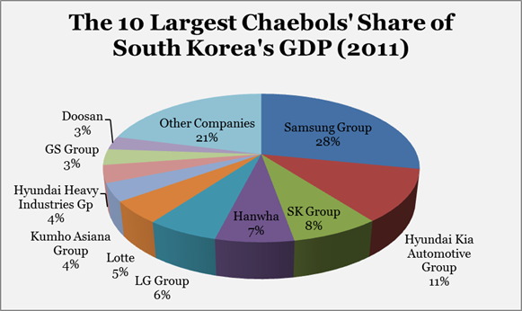

```{r setup, include=FALSE}
options(htmltools.dir.version = FALSE)
knitr::opts_chunk$set(echo=F,
                      message=F,
                      warning=F,
                      fig.retina=3,
                      fig.align="center")
library(tidyverse)
library(ggrepel)
library(mosaic)
set.seed(256)
update_geom_defaults("label", list(family = "Fira Sans Condensed"))
```

class: title-slide

# 2.6 — Industrial Policy

## ECON 324 • International Trade • Spring 2023

### Ryan Safner<br> Associate Professor of Economics <br> <a href="mailto:safner@hood.edu"><i class="fa fa-paper-plane fa-fw"></i>safner@hood.edu</a> <br> <a href="https://github.com/ryansafner/tradeS23"><i class="fa fa-github fa-fw"></i>ryansafner/tradeS23</a><br> <a href="https://tradeS23.classes.ryansafner.com"> <i class="fa fa-globe fa-fw"></i>tradeS23.classes.ryansafner.com</a><br>

---

class: inverse

# Outline

## [Graham & The Increasing Returns Argument](#3)

## [Responses to Graham](#13)

## [Endogenous Growth & The Economics of Ideas](#26)

## [Evidence for Industrial Policy Success?](#45)

## [Modern Protectionism](#60)

---

class: inverse, center, middle

# Graham & The Increasing Returns Argument

---

# Graham: Increasing Returns Argument

.left-column[
.center[


Frank D. Graham

1890—1949
]
]

.right-column[

- Princeton economist that argued comparative advantage is not an “infallable principle” for commercial policy

- Argued that some industries might warrant *permanent* protection
  - recall infant industries argument is just about *temporary* protection

- Main argument hinges on .hi[increasing returns to scale] (decreasing cost industry)

.source[Graham, Frank D, 1923, “Some Aspects of Protection Further Considered,” *The Quarterly Journal of Economics*, 199–227.]
]

---

# Graham: Increasing Returns Argument

.left-column[
.center[


Frank D. Graham

1890—1949
]
]

.right-column[

.smaller[
- If manufacturing has increasing returns to scale:

> “protection to manufactures may advantageously be continued much longer than would seem adequate to cover the infant stage, whether or not the industry could maintain itself without such aid,” (p.200).

> “[I]t may be to a country’s economic advantage to protect an industry which could not grow up or survive without protection and which never will be able to survive without it, an industry which has no comparative advantage when the protective duty is first levied nor ever attains one under it,” (pp.202-203).

]

.source[Graham, Frank D, 1923, “Some Aspects of Protection Further Considered,” *The Quarterly Journal of Economics*, 199–227.]
]

---

# Graham: Increasing Returns Argument

.left-column[
.center[


Frank D. Graham

1890—1949
]
]

.right-column[

- Graham’s numerical example (essentially):

- Suppose two countries have two industries:
  - agriculture (diminishing returns)
  - manufacturing (increasing returns)
  
- Suppose labor is the main input in each industry


.source[Graham, Frank D, 1923, “Some Aspects of Protection Further Considered,” *The Quarterly Journal of Economics*, 199–227.]
]

---

# Graham: Increasing Returns Argument

.pull-left[

- Country A specializes in agriculture

- More labor allocated to agriculture, lowers $MP_L$ in agriculture

- Less labor allocated to manufacturing, *also* lowers $MP_L$ in manufacturing

- Consumers in $A$ can consume *less* agriculture and *less* manufacturing goods

]

.pull-right[

```{r}
prod_1=function(x){2*sqrt(x)}

a_tp<-ggplot(data.frame(x=c(0,6)), aes(x=x))+
  stat_function(fun=prod_1, geom="line", size=2, color="red")+
  geom_label(aes(x=5,y=prod_1(5)), color = "red", label="TP", size = 6)+
    scale_x_continuous(breaks=seq(0,6,1),
                     limits=c(0,6),
                     expand=expand_scale(mult=c(0,0.1)))+
  scale_y_continuous(breaks=seq(0,6,1),
                     limits=c(0,6),
                     expand=expand_scale(mult=c(0,0.1)))+
  scale_colour_manual("I.C. equations", values = colors)+
  guides(color = F)+
  labs(x = "Input (l)",
       y = "Output (q)",
       title = "Agriculture")+
  theme_classic(base_family = "Fira Sans Condensed", base_size=14)

mp=function(x){1/sqrt(x)}

a_mp<-ggplot(data.frame(x=c(0,10)), aes(x=x))+
  stat_function(fun=mp, geom="line", size=2, color="blue")+
  geom_label(aes(x=1,y=mp(1)), color = "blue", label=expression(MP[l]), size = 4)+
    scale_x_continuous(breaks=seq(0,6,1),
                     limits=c(0,6),
                     expand=expand_scale(mult=c(0,0.1)))+
  scale_y_continuous(breaks=seq(0,6,1),
                     limits=c(0,6),
                     expand=expand_scale(mult=c(0,0.1)))+
  scale_colour_manual("I.C. equations", values = colors)+
  guides(color = F)+
  labs(x = "Input (l)",
       y = "Output per Worker (q/l)")+
  theme_classic(base_family = "Fira Sans Condensed", base_size=14)

prod_2=function(x){0.5*x^3}

m_tp<-ggplot(data.frame(x=c(0,6)), aes(x=x))+
  stat_function(fun=prod_2, geom="line", size=2, color="red")+
  geom_label(aes(x=2,y=prod_2(2)), color = "red", label="TP", size = 6)+
    scale_x_continuous(breaks=seq(0,6,1),
                     limits=c(0,6),
                     expand=expand_scale(mult=c(0,0.1)))+
  scale_y_continuous(breaks=seq(0,6,1),
                     limits=c(0,6),
                     expand=expand_scale(mult=c(0,0.1)))+
  guides(color = F)+
  labs(x = "Input (l)",
       y = "Output (q)",
       title = "Manufacturing")+
  theme_classic(base_family = "Fira Sans Condensed", base_size=14)

mp_2=function(x){x^2}

m_mp<-ggplot(data.frame(x=c(0,10)), aes(x=x))+
  stat_function(fun=mp_2, geom="line", size=2, color="blue")+
  geom_label(aes(x=1,y=mp(1)), color = "blue", label=expression(MP[l]), size = 4)+
    scale_x_continuous(breaks=seq(0,6,1),
                     limits=c(0,6),
                     expand=expand_scale(mult=c(0,0.1)))+
  scale_y_continuous(breaks=seq(0,6,1),
                     limits=c(0,6),
                     expand=expand_scale(mult=c(0,0.1)))+
  guides(color = F)+
  labs(x = "Input (l)",
       y = "Output per Worker (q/l)")+
  theme_classic(base_family = "Fira Sans Condensed", base_size=14)


library(patchwork)

(a_tp+m_tp)/(a_mp+m_mp)
```

]

---

# Graham: Increasing Returns Argument

.pull-left[

- Country B specializes in manufacturing

- Less labor allocated to agriculture, *raises* $MP_L$ in agriculture

- More labor allocated to manufacturing, *also raises* $MP_L$ in manufacturing

- Consumers in $B$ can consume *more* agriculture and *more* manufacturing goods

]

.pull-right[

```{r}
prod_1=function(x){2*sqrt(x)}

a_tp<-ggplot(data.frame(x=c(0,6)), aes(x=x))+
  stat_function(fun=prod_1, geom="line", size=2, color="red")+
  geom_label(aes(x=5,y=prod_1(5)), color = "red", label="TP", size = 6)+
    scale_x_continuous(breaks=seq(0,6,1),
                     limits=c(0,6),
                     expand=expand_scale(mult=c(0,0.1)))+
  scale_y_continuous(breaks=seq(0,6,1),
                     limits=c(0,6),
                     expand=expand_scale(mult=c(0,0.1)))+
  scale_colour_manual("I.C. equations", values = colors)+
  guides(color = F)+
  labs(x = "Input (l)",
       y = "Output (q)",
       title = "Agriculture")+
  theme_classic(base_family = "Fira Sans Condensed", base_size=14)

mp=function(x){1/sqrt(x)}

a_mp<-ggplot(data.frame(x=c(0,10)), aes(x=x))+
  stat_function(fun=mp, geom="line", size=2, color="blue")+
  geom_label(aes(x=1,y=mp(1)), color = "blue", label=expression(MP[l]), size = 4)+
    scale_x_continuous(breaks=seq(0,6,1),
                     limits=c(0,6),
                     expand=expand_scale(mult=c(0,0.1)))+
  scale_y_continuous(breaks=seq(0,6,1),
                     limits=c(0,6),
                     expand=expand_scale(mult=c(0,0.1)))+
  scale_colour_manual("I.C. equations", values = colors)+
  guides(color = F)+
  labs(x = "Input (l)",
       y = "Output per Worker (q/l)")+
  theme_classic(base_family = "Fira Sans Condensed", base_size=14)

prod_2=function(x){0.5*x^3}

m_tp<-ggplot(data.frame(x=c(0,6)), aes(x=x))+
  stat_function(fun=prod_2, geom="line", size=2, color="red")+
  geom_label(aes(x=2,y=prod_2(2)), color = "red", label="TP", size = 6)+
    scale_x_continuous(breaks=seq(0,6,1),
                     limits=c(0,6),
                     expand=expand_scale(mult=c(0,0.1)))+
  scale_y_continuous(breaks=seq(0,6,1),
                     limits=c(0,6),
                     expand=expand_scale(mult=c(0,0.1)))+
  guides(color = F)+
  labs(x = "Input (l)",
       y = "Output (q)",
       title = "Manufacturing")+
  theme_classic(base_family = "Fira Sans Condensed", base_size=14)

mp_2=function(x){x^2}

m_mp<-ggplot(data.frame(x=c(0,10)), aes(x=x))+
  stat_function(fun=mp_2, geom="line", size=2, color="blue")+
  geom_label(aes(x=1,y=mp(1)), color = "blue", label=expression(MP[l]), size = 4)+
    scale_x_continuous(breaks=seq(0,6,1),
                     limits=c(0,6),
                     expand=expand_scale(mult=c(0,0.1)))+
  scale_y_continuous(breaks=seq(0,6,1),
                     limits=c(0,6),
                     expand=expand_scale(mult=c(0,0.1)))+
  guides(color = F)+
  labs(x = "Input (l)",
       y = "Output per Worker (q/l)")+
  theme_classic(base_family = "Fira Sans Condensed", base_size=14)


library(patchwork)

(a_tp+m_tp)/(a_mp+m_mp)
```

]

---

# Graham: Increasing Returns Argument

.left-column[
.center[


Frank D. Graham

1890—1949
]
]

.right-column[
.smallest[
- The more the countries specialize and trade:
  - the more *both* goods become *more expensive* for the country specializing in the diminishing returns industry (agriculture)
  - and the *both* goods become *cheaper* for the country specializing in the increasing returns industry (manufacturing)

> “The final result of the specialization is to bring about a situation in which the citizens of the [country specializing in agriculture] get less reward for their efforts than if they had never carried on international trade at all,” (p.207).

]
.source[Graham, Frank D, 1923, “Some Aspects of Protection Further Considered,” *The Quarterly Journal of Economics*, 199–227.]
]

---

# Graham: Increasing Returns Argument

.left-column[
.center[


Frank D. Graham

1890—1949
]
]

.right-column[

> “The conclusion that [the] country under the conditions assumed [specializing in agriculture] must lose by free trade is inevitable...[instead it requires] advantageous permanent protection [since the country is better off in autarky, or with less trade, it is] economically benefitted by protection and may do well to keep it indefinitely,” (p.208).

.source[Graham, Frank D, 1923, “Some Aspects of Protection Further Considered,” *The Quarterly Journal of Economics*, 199–227.]
]

---

# Graham: Increasing Returns Argument

.left-column[
.center[


Frank D. Graham

1890—1949
]
]

.right-column[

> “It may well be disadvantageous for a nation to concentrate in production of commodities of increasing cost despite a comparative advantage in those lines; it will the more probably be disadvantageous to do so if the world demand for goods produced at decreasing cost is growing in volume more rapidly than that for goods produced at increasing cost,” (p.210).

.source[Graham, Frank D, 1923, “Some Aspects of Protection Further Considered,” *The Quarterly Journal of Economics*, 199–227.]
]

---

# Graham: Terms of Trade?

.left-column[
.center[


Frank D. Graham

1890—1949
]
]

.right-column[

- But wouldn’t the country specializing in agriculture obtain more favorable terms of trade??
  - More manufacturing available (imported) for fewer agriculture (exports)

> “There is no reason for supposing that this would happen,” (p.210).

- No explanation given 🤷

.source[Graham, Frank D, 1923, “Some Aspects of Protection Further Considered,” *The Quarterly Journal of Economics*, 199–227.]
]

---

class: inverse, center, middle

# Response to Graham

---

# Knight’s Response

.left-column[
.center[


.smallest[
Frank H. Knight

1885-1972
]
]
]

.right-column[

.smallest[
- Counter against Graham’s “ingenious” but “fallacious” argument

- Took major issue with a footnote in Graham:

> “The reasoning in the text simply assumes that a decreasing [average] cost is obtained by an expansion of the production of [manufacturing]; whether the cause of it be external or internal economies is immaterial to the theory, though it would, of course, affect the degree of its applicability,” (p.204n).

- It turns out it makes all the difference whether we are talking about internal economies of scale or external economies of scale!
]
]

---

# Knight’s Response

.left-column[
.center[


.smallest[
Frank H. Knight

1885-1972
]
]
]

.right-column[

.smallest[
- Knight: increasing returns *internal* to the firm are not compatible with competition
  - if a single firm has significant economies of scale, it would serve the entire industry and become a monopoly!

> “If competition is effective, the size of the production unit will tend to grow until *either* no further economies are obtainable, *or* there is only one establishment left and the idnustry is a monopoly...When all establishments have been brought to the efficient size, variation in total output is a matter of changing their *number*, in which no technical economies are involved...an increase in the output of a commodity must increase its cost of production unless the industry is, or becomes, a monopoly,” (p.597)

]

.source[Knight, Frank H, 1924, “Some Fallacies in the Interpretation of Social Cost,” *The Quarterly Journal of Economics* 38 (4): 582–606.]
]

---

# Knight’s Response

.left-column[
.center[


.smallest[
Frank H. Knight

1885-1972
]
]
]

.right-column[

> “The rejoinder to [this] argument is the doctrine of ‘external economies’ [but] this surely rests upon a misconception. External economies in one [firm] are internal economies in some other, within the industry. Any branch or stage in the creation of a product which offers continuously a chance for [internal] economies [of scale] with increase in the scale of operations must eventuate either in monopoly or in leaving the tendency behind and establishing the normal relation of increasing cost with increasing size,” (p.597)

.source[Knight, Frank H, 1924, “Some Fallacies in the Interpretation of Social Cost,” *The Quarterly Journal of Economics* 38 (4): 582–606.]
]

---

# Knight’s Response

.left-column[
.center[


.smallest[
Frank H. Knight

1885-1972
]
]
]

.right-column[
.smallest[
> “What Professor Graham has to do to establish his theoretica lposition is to show that...industry really operates under decreasing cost, *without tending toward monopoly*...if one can make his assumptions in regard to decreasing cost, his conclusion is correct. [However] to vindicate decreasing costs in the sense required, it must be shown that there are, or may be, industries, in a condition of stable competition, in which no producer already engaged could decrease his real costs by expandind his output at the expense of other producers, and yet in which real costs would be decreased all around by new producers entering the industry in competition with those already there.” (p.331)

]
.source[Knight, Frank H, 1925, “On Decreasing and Comparative Costs: A Rejoinder,” *The Quarterly Journal of Economics* 39: 331-333.]
]

---

# Knight’s Response

.left-column[
.center[


.smallest[
Frank H. Knight

1885-1972
]
]
]

.right-column[

.smallest[
- New entrants would bid factors of production away from established firms, raise their price, or use lesser quality 

> “These inevitable sources of increasing cost must be more than offset by some kind of purely ‘external’ economies in organization. In spite of the weight of authority which may be cited for such economies [i.e. Marshall], I have never succeeded in picturing in them in my mind, or finding any convincing reason to believe they exist; and the hypothetical examples cited by Professor Graham...has not assisted me in doing so. I cannot believe such conditions general enough to justify a special law in economic theory, or a special provision in tariff legislation,” (p.331).

]
.source[Knight, Frank H, 1925, “On Decreasing and Comparative Costs: A Rejoinder,” *The Quarterly Journal of Economics* 39: 331-333.]
]

---

# Viner on Technological vs. Pecuniary Externalities

.left-column[
.center[

.smallest[
Jacob Viner

1892-1970
]]
]

.right-column[

.smaller[
> “These extraordinary results are the consequence, and wholly the consequence, of value-theory reasoning, implicit or explicit in Graham's argument, which is either unambiguously erroneous or is of very limited practical significance,” (p.478).

- Implications of trade policies depend on whether external economies depend on *domestic* output or *world* output (to lower all firms’ costs)
  - If world output, would not matter much if domestic firms reduced their output (other foreign firms would expand), domestic firms would still get the benefit of external economies (from foreign firms)

]

.source[Viner, Jacob, 1937, *Studies in The Theory of International Trade*]

]

---

# Viner on Technological vs. Pecuniary Externalities

.left-column[
.center[

.smallest[
Jacob Viner

1892-1970
]]
]

.right-column[

- Also depends on whether external economies are:
  - .hi-purple[technical economies]: interdependence between each firm’s *production function* and output of whole industry (as whole industry $\uparrow Q$, each individual firm $i$’s $\downarrow C(q_i))$
  - .hi-purple[pecuniary economies]: interdependence between each firm’s *profits* depend on activities of other (upstream or downstream) firms in the industry

> “[If the external economies are pecuniary] then they are not real national economies and nothing is lost to the country when they disappear,” (p.480).

.source[Viner, Jacob, 1937, *Studies in The Theory of International Trade*]


]

---

# Viner on Technological vs. Pecuniary Externalities

.left-column[
.center[

.smallest[
Jacob Viner

1892-1970
]]
]

.right-column[

.smallest[
> “A concievable case for protection on the basis of the existence of external economies in an industry which from the individual producer’s point of view is at a comparative disadvantage in costs can be made out, therefore, only where these external economies are (a) dependent on the size of the national and not the world industry and (b) are technological rather than pecuniary, or if pecuniary, are not at the expense of domestic sellers or services or materials to the industry. The scope for application of the argument is extremely limited, especially as it seems difficult even to suggest plausible hypothetical cases of the existence of genuine technological external economies...[Graham’s increasing returns argument for protectionism is] little more than a theoretical curiosity” (pp.480-481).

]

.source[Viner, Jacob, 1937, *Studies in The Theory of International Trade*]
]

---

# Recall: Internal vs. External Economies of Scale

.pull-left[
.smaller[
- Economies of scale come in two flavors:

- .hi-purple[*Internal* economies]: firm-level features that improve a **firm's** productivity, often leading to market power for that firm 
  - e.g. firm produces more and lowers its average costs

- .hi-purple[*External* economies]: industry-wide features that spill over to the productivity **all** firms in the industry
  - e.g. more firms producing more lowers **all firms'** average costs

]
]

.pull-right[
.center[

]
]

---

# Recall: Internal vs. External Economies of Scale

.left-column[
.center[

.smallest[
Alfred Marshall

1842-1924
]]
]

.right-column[
.smallest[

- Internal economies of scale:

> “...are dependent on the resources of individual houses of business engaged in [the industry], on their organization and the efficiency of their management,” (p.220).

- External economies of scale:

> “...are dependent on the general development of the industry [some of which] depend on the aggregate volume of production of the kind in the neighborhood while others again, especially those connected with the growth of knowledge and the progress of the arts, depend chiefly on the aggregate volume of production in the whole civilized world,” (p.220).

]
.source[Marshall, Alfred, 1890, *Principles of Economics*]

]

---

# Recall: Internal vs. External Economies of Scale

.left-column[
.center[

.smallest[
Alfred Marshall

1842-1924
]]
]

.right-column[

- What are some common sources of *external* economies?
  - knowledge spillovers between firms
  - subsidiary supplier industries
  - local pools of skilled labor

> “The most important of these result from the growth of correlated branches of industry which mutually assist one another, perhaps being concentrated in the same localities, but anyhow availing themselves of the modern facilities for communication offered by steam transport, by the telegraph and by the printing press,” (p.264).

.source[Marshall, Alfred, 1890, *Principles of Economics*]

]

---

# Summing Up

.pull-left[
- It must be proven that there are genuine **external** and **technological** economies of scale in order for it to make sense to abandon free trade & protect a domestic industry with increasing returns

- A search for *sources* of increasing returns
  - Ideas
  - knowledge spillovers
  - “learning by doing”
]

.pull-right[
.center[

]
]

---

class: inverse, center, middle

# Endogeneous Growth & The Economics of Ideas

---

# The Economic *Problem* with Ideas I

.pull-left[

.center[

]

]

--

.pull-right[

```{r, results="asis"}
library(kableExtra)

publicgoods<-tribble(
  ~"", ~Rivalrous, ~Nonrival,
  "Excludable", "PRIVATE GOODS", "COMMON RESOURCES",
  "Excludable", "(Houses, Jeans)", "(Fisheries, Environment)",
  "Nonexcludable", "CLUB GOODS", "PUBLIC GOODS",
  "Nonexcludable", "(Wifi, Cable TV)", "(Asteroid Defense)"
)

kable(publicgoods, format="html") %>%
  kable_styling(full_width=F) %>%
  #add_header_above(c(" " = 1, "Column" = 2)) %>%
  column_spec(c(1,1), bold=T) %>%
  collapse_rows(columns = 1, latex_hline = "major", valign = "middle")
```
]

---

# The Economic *Problem* with Ideas II


.left-column[

.center[


Thomas Jefferson

(1743-1826)
]
]

.right-column[

.smallest[
> "He who receives an idea from me, receives instruction himself without lessening mine; as he who lights his taper at mine, receives light without darkening me. That ideas should freely spread from one to another over the globe, for the moral and mutual instruction of man, and improvement of his condition, seems to have been peculiarly and benevolently designed by nature, when she made them, like fire, expansible over all space, without lessening their density in any point, and like the air in which we breathe, move, and have our physical being, incapable of confinement or exclusive appropriation."

]
]

.source[Jefferson, Thomas, 13 Aug 1813, "Letter to Isaac MacPherson," ]


---

# The Economic *Problem* with Ideas II

.left-column[

.center[


Thomas Macaulay

(1800-1859)
]
]

.right-column[

.smallest[

> "It is then on men whose profession is literature, and whose private means are not ample, that you must rely for a supply of valuable books. Such men must be remunerated for their literary labour...It is desirable that we should have a supply of good books; we cannot have such a supply unless men of letters are liberally remunerated, and the least objectionable way of remunerating them is by means of copyright...The system of copyright has great advantages, and great disadvantages...Copyright is monopoly, and produces all the effects which the general voice of mankind attributes to monopoly...Monopoly is an evil...For the sake of the good we must submit to the evil; but the evil ought not to last a day longer than is necessary for the purpose of securing the good..."

]

.source[Macaulay, Thomas, 1841 Parliamentay speech against Serjeant Talfourd's 1841 Copyright Bill]
]

---

# High Fixed Costs, Low Marginal Costs I

.pull-left[

.center[

]
]

.pull-right[
.center[

]
]

- It costs about $1,000,000,000 and 10 years on average to create a new drug. Once discovered, it costs the firm (or it's competitors!) about $0.50/pill to manufacture.

---

# High Fixed Costs, Low Marginal Costs II

.pull-left[

.center[

]
]

--

.pull-right[
.center[


Source: [Washington Post (Sept 8, 2017)](https://www.washingtonpost.com/news/morning-mix/wp/2017/09/08/game-of-thrones-was-pirated-more-than-a-billion-times-far-more-than-it-was-watched-legally/)
]
]

---

# Positive Spillovers

.left-column[

.center[


.smallest[
William Nordhaus

(1941-)

Economics Nobel 2018
]
]
]

.right-column[

> "We conclude that [about 2.2%] of the social returns from technological advances over the 1948-2001 period was captured by producers, indicating that most of the benefits of technological change are passed on to consumers rather than captured by producers," (p.1)

]

.source[Nordhaus, William, 2004, ["Schumpeterian Profits in the American Economy: Theory and Measurement,"](https://www.nber.org/papers/w10433) *NBER Working Paper* 10433]

---

# Property Rights in Innovation

.pull-left[

- For these economic reasons, .hi[patent] (for ideas and inventions) and .hi[copyright] (for expressions) laws exist

- Grant *temporary* monopoly to holder in order to recover their fixed costs and provide incentive to undertake (risky and expensive) research/creativity

- A utilitarian *tradeoff* between incentives and access

]

.pull-right[

.center[


]

]

---

# Endogeneous Growth Theory

.pull-left[

- Some macroeconomic background:

- Famous .hi[Solow (1956, 1957) model] of economic growth
  - Sought to show that capital accumulation leads to economic growth
  - Empirically found that *most* growth is explained by an unexplainable **exogenous** .hi-purple[“residual”] (technology, ideas, institutions that we cannot measure)
  
]

.pull-right[
.center[

]
]

---

# Endogeneous Growth Theory

.pull-left[

- .hi[Endogenous growth theory] seeks to **endogenize** that residual and explain growth by explaining how *technology* grows
  - Technology/knowledge/ideas described as $A$
  - $A$ grows proportional to the *existing* stock of knowledge $\frac{\partial A}{\partial t} \propto A$
  - $A$ is non-rival and exhibits increasing returns

- Paul Romer and others
]

.pull-right[
.center[

]
]

---

# Knowledge is Nonrival

.left-column[

.center[


Paul Romer

(1955-)

Economics Nobel 2018
]
]

.right-column[

> "Although other assumptions about secrecy and property rights could be considered, the equilibrium here is based on the assumption that anyone engaged in research has free access to the entire stock of knowledge. This is feasible because knowledge is a nonrival input. All researchers can take advantage of $A$ at the same time," (p.S83).

]

.source[Romer, Paul M, 1990, "Endogenous Technological Change," *Journal of Political EConomy* 98(5-2): S71-S102]

---

# The Nature of "Knowledge" II

.pull-left[

.smallest[
> "[A] college-educated engineer working today and one working 100 years ago have the same human capital, which is measured in terms of years of forgone participation in the labor market. The engineer working today is more productive because he or she can take advantage of all of the additional knowledge accumulated as design problems were solved during the last 100 years," (pp. S83-S84).

]
]

.pull-right[

.center[

]

]

---

# This Implies Market Power

.left-column[

.center[


Paul Romer

(1955-)

Economics Nobel 2018
]
]

.right-column[

.smallest[
> "If all inputs were paid their value marginal product, the firm would suffer losses," (p.S76).

> "There is little doubt that much of the value to society of any given innovation or discovery is not captured by the inventor, and any model that missed these spillovers would miss important elements of the growth process. Yet it is still the case that private, profit-maximizing agents make investments in the creation of new knowledge and that they earn a return on these investments by charging a price for the resulting goods that is greater than the marginal cost of producing the goods," (p.S90).

]
]

.source[Romer, Paul M, 1990, "Endogenous Technological Change," *Journal of Political EConomy* 98(5-2): S71-S102]

---

# Romer Model Implication I - R&D Is Critical

.smallest[
- Economies tend to undersupply human capital to research:
]

.quitesmall[
> The most obvious reason is that research has positive external effects. An additional design raises the productivity of all future individuals who do research, but because this benefit is nonexcludable, it is not reflected at all in the market price for designs. The second and an equally important reason...is that research produces an input that is purchased by a sector that engages in monopoly pricing. The markup of price over marginal cost forces a wedge between the marginal social product of an input used in this sector and its market compensation," (p.S96)

]

--

.smallest[
- Policy implications:
]

.quitesmall[
> "Within the confines of the model, the social optimum can be achieved by subsidizing the accumulation of A," (p.S97)

> "A subsidy to physical capital accumulation may be a very poor substitute for direct subsidies that increase the incentive to undertake research. In the absence of feasible policies that can remove the divergence between the social and private returns to research, a second-best policy would be to subsidize the accumulation of total human capital," (p.S99)

]

---

# Romer Model Implication II - Trade Liberalization

.smallest[
- A large population is *not* sufficient for greater technology (and thus, economic growth), it requires access to a *larger market* (division of labor)!
]

.quitesmall[
> If access to a large number of workers or consumers were all that mattered, having a large population would be a good substitute for trade with other nations. The model here suggests that what is important for growth is integration not into an economy with a large number of people but rather into one with a large amount of human capital, (p.S98)

> "The most interesting positive implication of the model is that an economy with a larger total stock of human capital will experience faster growth. This finding suggests that free international trade can act to speed up growth. It also suggests a way to understand what it is about developed economies in the twentieth century that permitted rates of growth of income per capita that are unprecedented in human history. The model also suggests that low levels of human capital may help explain why growth is not observed in underdeveloped economies that are closed and why a less developed economy with a very large population can still benefit from economic integration with the rest of the world," (p.S99)

]

---

# Market Failure in R&D

.left-column[
.center[


.smallest[
Joseph Stiglitz

1943—

Economics Nobel 2001
]
]
]

.right-column[
.smallest[
- Because of their strange public good properties, there is a market failure in the production of ideas and entrepreneurship

- Society underinvests in entrepreneurship and innovation

- Government intervention via well-calibrated industrial policy can fix the market failure
]

.quitesmall[
> “Industrial policies – in which governments intervene in the allocation of resources among sectors or favor some technologies over others – can help ”infant economies” learn. Learning may be more marked in some sectors (such as industrial manufacturing) than in others, and the benefits of that learning, including the institutional development required for success, may spill over to other economic activities,” 

]

.source[Stiglitz, Joseph, and Bruce C. Greenwald, 2014, *Creating a Learning Society*]
]

---

class: inverse, center, middle

# Evidence for Industrial Policy Success?

---

# Political vs. Economic Freedom I

```{r, load-data, echo=F}
polfreedom<-read.csv("~/Dropbox/Teaching/Hood College/ECON 324 - International Trade/freedomhouse2018.csv")
econfreedom<-read.csv("~/Dropbox/Teaching/Hood College/ECON 205 - Principles of Macroeconomics/econfreedom.csv") 

suppressPackageStartupMessages(library("tidyverse"))
```

```{r, data-wrangle,echo=F}

polfreedom2<-polfreedom %>%
  select(Country.Territory, Total)

polfreedom2<-rename(polfreedom2,Country=Country.Territory)

# combine datasets
freedom<-left_join(econfreedom, polfreedom2, by="Country")

#add korea
korea<-data.frame(X=113,
                  Country=as.factor("South Korea"),
                  ISO=as.factor("KOR"),
                  ef=7.40,
                  gdp=25022.8023,
                  continent=as.factor("Asia"),
                  Total=84)
freedom<-rbind(freedom,korea)

tigers<-filter(freedom, ISO %in% c("SGP", "KOR", "JPN", "USA"))

notigers<-filter(freedom, !ISO %in% c("SGP", "KOR", "JPN", "USA"))
```

```{r, plot1, echo=F, fig.width=14}
ggplot(data=freedom, aes(x=ef,y=Total))+
  geom_point(aes(fill=continent), size = 4, pch = 21, color = "white")+
  geom_smooth(data=freedom,method="lm")+
  ggrepel::geom_text_repel(data=tigers,
                            aes(ef, Total, label=ISO, color = continent),
                            alpha = 1.00,
                            box.padding = 0.75,
                            show.legend = F)+
  xlab("Economic Freedom Score")+ylab("Political Freedom Score")+
  theme_bw(base_family = "Fira Sans Condensed", base_size = 16)+
  scale_color_manual(values = c("Americas" = "#0D0887FF",
                                "Europe" = "#6A00A8ff",
                                "Asia" = "#B12A90FF",
                                "Africa" = "#E16462FF",
                                "Oceania" = "#FCA636FF"))+
  scale_fill_manual(values = c("Americas" = "#0D0887FF",
                                "Europe" = "#6A00A8ff",
                                "Asia" = "#B12A90FF",
                                "Africa" = "#E16462FF",
                                "Oceania" = "#FCA636FF"))+
  labs(fill = "Continent",
       caption="Economic Freedom Score (2016) from Frasier Institute [1], Political Freedom Score from FreedomHouse (2017) [2]")+
  theme(legend.position="bottom")
```

.source[
1: [Fraser Institute Data](https://www.fraserinstitute.org/economic-freedom/dataset?geozone=world&year=2016&page=dataset)
2: [FreedomHouse Data](https://freedomhouse.org/content/freedom-world-data-and-resources)
]
---

# Economic Freedom vs. GDP Per Capita

```{r, plot2, echo=F, fig.width=14}
ggplot(data=freedom, aes(x=ef,y=gdp))+
  geom_point(aes(fill=continent), size = 4, pch = 21, color = "white")+
  #geom_smooth(data=freedom,method="lm")+
  ggrepel::geom_text_repel(data=tigers,
                            aes(ef, gdp, label=ISO, color = continent),
                            alpha = 1.00,
                            box.padding = 0.75,
                            show.legend = F)+
  scale_y_continuous(name="GDP per Capita ($)", labels=scales::dollar, breaks=seq(0,100000,20000))+
  xlab("Economic Freedom Score")+ylab("GDP per Capita")+  theme_bw(base_family = "Fira Sans Condensed", base_size = 16)+
  scale_color_manual(values = c("Americas" = "#0D0887FF",
                                "Europe" = "#6A00A8ff",
                                "Asia" = "#B12A90FF",
                                "Africa" = "#E16462FF",
                                "Oceania" = "#FCA636FF"))+
  scale_fill_manual(values = c("Americas" = "#0D0887FF",
                                "Europe" = "#6A00A8ff",
                                "Asia" = "#B12A90FF",
                                "Africa" = "#E16462FF",
                                "Oceania" = "#FCA636FF"))+
  labs(fill = "Continent",
       caption="Economic Freedom Score (2016) from Frasier Institute [1], GDP per Capita from Gapminder (2018) [2]")+
  theme(legend.position="bottom")
```

.source[
1: [Fraser Institute Data](https://www.fraserinstitute.org/economic-freedom/dataset?geozone=world&year=2016&page=dataset)
2: [Gapminder](https://gapminder.org/tools)
]

---

# Political Freedom vs. GDP per Capita

```{r, plot3, echo=F, fig.width=14}
ggplot(data=freedom, aes(x=Total,y=gdp))+
  geom_point(aes(fill=continent), size = 4, pch = 21, color = "white")+
  #geom_smooth(data=freedom,method="lm")+
  ggrepel::geom_text_repel(data=tigers,
                            aes(Total, gdp, label=ISO, color = continent),
                            alpha = 1.00,
                            box.padding = 0.75,
                            show.legend = F)+
  scale_y_continuous(name="GDP per Capita ($)", labels=scales::dollar, breaks=seq(0,100000,20000))+
  xlab("Political Freedom Score")+ylab("GDP per Capita")+  theme_bw(base_family = "Fira Sans Condensed", base_size = 16)+
  scale_color_manual(values = c("Americas" = "#0D0887FF",
                                "Europe" = "#6A00A8ff",
                                "Asia" = "#B12A90FF",
                                "Africa" = "#E16462FF",
                                "Oceania" = "#FCA636FF"))+
  scale_fill_manual(values = c("Americas" = "#0D0887FF",
                                "Europe" = "#6A00A8ff",
                                "Asia" = "#B12A90FF",
                                "Africa" = "#E16462FF",
                                "Oceania" = "#FCA636FF"))+
  labs(fill = "Continent",
       caption="Political Freedom Score (2017) from FreedomHouse [1], GDP per Capita from Gapminder (2018) [2]")+
  theme(legend.position="bottom")
```

.source[
1: [FreedomHouse Data](https://freedomhouse.org/content/freedom-world-data-and-resources)
2: [Gapminder](https://gapminder.org/tools)
]

---

# The Rapid Growth of the “Asian Tigers”

.center[


]

---

# South Korea: A Case Study

.center[

]

---

# South Korea: A Case Study

.left-column[
.center[


.smallest[
Park Chung Hee 

Ruler/President of South Korea

1961—1979
]
]
]
.right-column[

- Korea in 1960: As poor as Africa

- Today: As wealthy as Japan

- Korean War: 1950-1953 devastates country

- Military Coup in 1961, repressive dictatorship until 1979
]

---

# South Korea: A Case Study

.pull-left[

- From 1963-1973: exports grow almost 2,000%

- Government sponsors and protects family-run industrial conglomerates (.hi-purple[“chaebols”])
  - Primarily shipbuilding (largest in world), manufacturing

- Frequent high-level corruption
]

.pull-right[
.center[


]
]

---

# South Korea: A Case Study

.pull-left[
.center[


Source: [BBC](http://bbc.com/news/world-asia-43666134)
]
]

.pull-right[
.center[


Source: [Washington Post](http://washingtonpost.com/world/asia_pacific/another-former-south-korea-president-jailed-for-corruption/2018/10/05/7e216cc6-c866-11e8-9158-09630a6d8725_story.html)
]
]

---

# South Korea: A Case Study

.center[

]

---

# South Korea: A Case Study

.center[

]

---

# South Korea: A Case Study

.center[

]

---

# South Korea: How Did it Work?

.pull-left[
.smaller[
- Change in institutions: land reform for middle class (less for elites), more property rights, (export-oriented) markets

- World class primary education

- Ethic of discipline and hard work

- Rode Japan's 1960s-1970s economic miracle (a nearby lower-wage country for Japanese manufacturing)
]
]

.pull-right[
.center[

]
]

---

# Is This Industrial Policy?

.pull-left[

.quitesmall[
- Government was very active in promoting South Korean business and export-focused industries

- Moved **away** from **import-substitution** (the classic industrial policy recipe)!

- Allowed international markets to dictate relative prices (did not try to distort markets)
  - *Chaebols'* .hi-purple[“export discipline”]: exporting companies expected to compete on their own in world markets
  - Losers that failed the market test were not bailed out, allowed to fail!
  
- Most policy measures were providing low-interest subsidized loans for exporting companies
  - Amasses large amounts of capital for exporting companies
]
]

.pull-right[
.center[

]
]

---

# Is This Industrial Policy?

.pull-left[
.smallest[
- Often lead(s) to corruption
  - South Korea ranks 52<sup>nd</sup> on Transparency International's [Corruption Perceptions Index](http://transparency.org) with a score of 53 (1 is most corrupt, 100 is least corrupt)
  - Ranked near Mauritius, Rwanda, Namibia, Slovakia
  - Comparison: Denmark is 1<sup>st</sup> (90), Singapore is 7<sup>th</sup> (84), U.S. is 19<sup>th</sup> (74)
  
- Most corruption is usually *growth-blocking* by incumbents and elites

- But in Korea a **growth-promoting corruption**!

]
]

.pull-right[
.center[

]
]

---

class: inverse, center, middle

# Modern Protectionism

---

# What Undergrads Need to Know About Trade

.left-column[
.center[


.smallest[
Paul Krugman

1953—

Economics Nobel 2008
]
]
]

.right-column[
> “The problem is that .hi[most of what a student is likely to read or hear about international economics is nonsense]. What I want to argue in this paper is that .hi[the most important thing to teach our undergrads about trade is how to detect that nonsense]. That is, our primary mission should be to vaccinate the minds of our undergraduates against the misconceptions that are so predominant in what passes for educated discussion about international trade.”

.source[Krugman, Paul, 1993, “What Do Undergrads Need to Know About Trade?”]
]

---

# Mercantilism Always Lurked in the Background

.pull-left[
.center[

]
]

.pull-right[
.center[

]
]

---

# Tariffs, According to the President of the United States

.pull-left[
.center[

]
]

.pull-right[
.center[

]
]

---

# The Effects of Trump’s Tariffs

.pull-left[
.center[
Source: [WSJ](https://www.wsj.com/graphics/us-china-tariffs-industries/?mod=article_inline?mod=hp_lead_pos3)


]

]

---

# The Effects of Trump’s Tariffs

.pull-left[
.center[

]

.source[Source: [WSJ](https://www.wsj.com/articles/tariffs-didnt-fuel-revival-for-american-steel-11603877400?mod=hp_lead_pos11)]
]

.pull-right[
.quitesmall[
> President Trump made good on his 2016 campaign pledge to the steel industry, slapping 25% tariffs on foreign-made steel...

> The tariffs succeeded in pushing down steel imports and—for a short time—resulted in higher prices for domestic steelmakers...

> Yet the tariffs haven’t produced the steelmaking renaissance and robust job growth in America’s industrial heartland that Mr. Trump promised. What’s more, the tariffs have hurt U.S. manufacturers, including those in the automotive and appliance sectors, who say the duties on steel and aluminum continue to keep their metal costs higher than what overseas competitors pay.

> “The government picked winners and losers here,”...

]

]


---

# The Effects of Trump’s Tariffs

.pull-left[
.center[

]

.source[Source: [WSJ](https://www.wsj.com/articles/tariffs-didnt-fuel-revival-for-american-steel-11603877400?mod=hp_lead_pos11)]
]

.pull-right[
.smallest[
> With the expanded production, about 6,000 jobs were added to the U.S. steel industry’s workforce after tariffs started in 2018, according to the Census Bureau. By the end of 2019, though, those gains evaporated as steel demand and prices sank [but h]igher prices also made steel more expensive for manufacturers that buy it, leading to the loss of about 75,000 U.S. manufacturing jobs, according to a study released late last year by the Federal Reserve Board of Governors.

]

]

---

# Who Pays for Tariffs?

<blockquote class="twitter-tweet"><p lang="en" dir="ltr">....I am a Tariff Man. When people or countries come in to raid the great wealth of our Nation, I want them to pay for the privilege of doing so. It will always be the best way to max out our economic power. We are right now taking in $billions in Tariffs. MAKE AMERICA RICH AGAIN</p>&mdash; Donald J. Trump (@realDonaldTrump) <a href="https://twitter.com/realDonaldTrump/status/1069970500535902208?ref_src=twsrc%5Etfw">December 4, 2018</a></blockquote> <script async src="https://platform.twitter.com/widgets.js" charset="utf-8"></script>

---

# Who Pays for Tariffs?

.pull-left[
.center[

]

.source[Source: [Reuters](https://www.reuters.com/article/us-usa-trade-china-tariffs-explainer/who-pays-trumps-tariffs-china-or-u-s-customers-and-companies-idUSKCN1SR1UI)]
]

.pull-right[
.smallest[
> U.S. President Donald Trump says China pays the tariffs he has imposed on $250 billion of Chinese exports to the United States. 

> But that is not how tariffs work. China’s government and companies in China do not pay tariffs directly. Tariffs are a tax on imports. They are paid by U.S.-registered firms to U.S. customs for the goods they import into the United States.

> Importers often pass the costs of tariffs on to customers - manufacturers and consumers in the United States - by raising their prices.

]
]
---

# What’s The Government Doing with the Tariff Revenue?

.center[

Source: [Council on Foreign Relations](https://www.cfr.org/blog/92-percent-trumps-china-tariff-proceeds-has-gone-bail-out-angry-farmers)


]

---

# Tariffs, According to Professional Economists

.pull-left[
.center[


.source[Source: [IGA Experts Poll (2012)](http://www.igmchicago.org/surveys/free-trade)]
]
]

--

.pull-right[
.center[


.source[Source: [IGA Experts Poll (2012)](http://www.igmchicago.org/surveys/free-trade)]

]
]

---

# Industrial Policy, According Professional to Economists

.pull-left[
.center[


.source[Source: [IGA Experts Poll (2016)](https://www.igmchicago.org/surveys/import-duties/)]
]
]

--

.pull-right[
.center[


.source[Source: [IGA Experts Poll (2018)](https://www.igmchicago.org/surveys/increasing-returns/)]
]
]

---

# Trade Deficits and Trade “Toughness”

.pull-left[
.center[


.source[Source: [IGA Experts Poll (2014)](https://www.igmchicago.org/surveys/trade-balances/)]
]
]

--

.pull-right[
.center[


.source[Source: [IGA Experts Poll (2016)](https://www.igmchicago.org/surveys/trade-and-toughness/)]
]
]

---

# So Once Again

.center[

]

