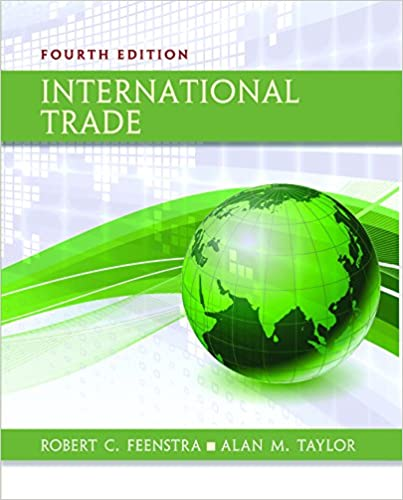

```{r setup, include=FALSE}
options(htmltools.dir.version = FALSE)
knitr::opts_chunk$set(echo=F,
                      message=F,
                      warning=F,
                      fig.retina = 3,
                      fig.align = "center")
library("tidyverse")
library("ggrepel")
library("fontawesome")
xaringanExtra::use_tile_view()
xaringanExtra::use_tachyons()
xaringanExtra::use_freezeframe()
xaringanExtra::use_progress_bar()

update_geom_defaults("label", list(family = "Fira Sans Condensed"))
update_geom_defaults("text", list(family = "Fira Sans Condensed"))

set.seed(256)

theme_slides <- theme_light() + 
  theme(
    text = element_text(family = "Fira Sans", size = 24)
  )

```

class: title-slide

# 1.4 — Ricardian One-Factor Model

## ECON 324 • International Trade • Spring 2023

### Ryan Safner<br> Associate Professor of Economics <br> <a href="mailto:safner@hood.edu"><i class="fa fa-paper-plane fa-fw"></i>safner@hood.edu</a> <br> <a href="https://github.com/ryansafner/tradeS23"><i class="fa fa-github fa-fw"></i>ryansafner/tradeS23</a><br> <a href="https://tradeS23.classes.ryansafner.com"> <i class="fa fa-globe fa-fw"></i>tradeS23.classes.ryansafner.com</a><br>
---

class: inverse

# Outline

## [Assumptions of the Ricardian One-Factor Model](#4)
## [Absolute and Comparative Advantages (Autarky)](#14)
## [An Example in Autarky](#20)
## [The Example with International Trade](#39)

---

# A Note of Caution and A Judgment Call

.pull-left[
.smallest[
- Feenstra and Taylor dive right into a Ricardian model in Ch. 2 with some advanced features; Ch. 4 is H-O Model
  - A lot of moving parts are thrown at you rather quickly

- In my experience (and from using other textbooks), it's better to build up slowly:
  1. Simplified Ricardian model
  2. Standard "neoclassical model" (not in F&T)
  3. H-O Model

- So if you are reading the textbook, it won't exactly match up to class for 1-2 weeks 😕
]
]
.pull-right[
.center[

]
]

---

class: inverse, center, middle

# Assumptions of the Ricardian One-Factor Model

---

# Assumptions of the One-Factor Model

.pull-left[
.smaller[
1. Markets (both output and factors) are perfectly competitive
2. “Labor” is homogenous and non-specific
3. Labor is mobile *domestically*, but *not internationally*
4. Production of goods requires only varying amounts of labor as an input
  - The “one factor”
  - The marginal product of labor is constant
5. No barriers to trade or transactions costs
6. Technology is constant within each country
7. Resource endowments are fixed
]
]
.pull-right[
.center[

]
]

---

# Setting up the Model

.pull-left[

- Imagine 2 countries, .blue[Home] and .red[Foreign]

- Each country can produce two goods, .pink[xylophones (x)] and .purple[yams (y)]

- Each country has a fixed total supply of labor
  - $\color{blue}{L}$ for .blue[Home] and $\color{red}{L'}$ for .red[Foreign]

- Let:
  - $\color{magenta}{l_x}$: amount of labor to make 1 $\color{magenta}{x}$
  - $\color{purple}{l_y}$: amount of labor to make 1 $\color{purple}{y}$
]

.pull-right[
.center[

]
]

---

# Setting up the Model: Home

.pull-left[

- .blue[Home's] .hi[production set] and total possible allocations of labor within a country is:

$$l_x x + l_y y \leq L$$

- To find the .hi[frontier (PPF)], assume Labor Demand (left) and Labor Supply (right) are equal:
$$l_x x + l_y y = L$$

]

.pull-right[

]

---

# Setting up the Model: Home

.pull-left[

$$l_x x + l_y y = L$$

- Solve for y to graph

$$y=\frac{L}{l_y}-\frac{l_x}{l_y}x$$

]

.pull-right[
```{r BC-setup}
library("mosaic")
px<-2.5
py<-5
m<-20

ends<-tribble(
  ~x, ~y,
  0, (m/py),
  (m/px), 0
)
BC=function(x){(m/py)-(px/py)*x}
line_colors <- c("BC" = "blue")
```

```{r BC-plot0, fig.retina=3, fig.align="center", fig.width=6}
ggplot(data.frame(x=c(0,m/px)), aes(x=x))+
  scale_x_continuous(breaks = NULL)+
  scale_y_continuous(breaks = NULL)+
  labs(x = "x",
       y = "y")+
  theme_classic(base_family = "Fira Sans Condensed", base_size=20)
```
]

---

# Setting up the Model: Home

.pull-left[

$$l_x x + l_y y = L$$

- Solve for y to graph

$$y=\frac{L}{l_y}-\frac{l_x}{l_y}x$$

- $y$-intercept: $\frac{L}{l_y}$ (max y production)
- $x$-intercept: $\frac{L}{l_x}$ (max x production)
]

.pull-right[

```{r BC-plot1, echo=F, message = F, warning = F, fig.retina=3, fig.align="center", fig.width=6}
ggplot(data.frame(x=c(0,m/px)), aes(x=x))+
  geom_point(data = ends,
             mapping = aes(x = x,
                           y = y),
             size=3)+
  #stat_function(fun=BC, geom="line", size=1, aes(color="BC"))+
  scale_x_continuous(breaks = c(0,(m/px)),
                     labels = c(0,expression(L/l[x])),
                     expand=expand_scale(mult=c(0,0.1)))+
  scale_y_continuous(breaks = c(0,(m/py)),
                     labels = c(0,expression(L/l[y])),
                     expand=expand_scale(mult=c(0,0.1)))+
   coord_cartesian(clip = 'off')+ # show points on edge
  labs(x = "x",
       y = "y")+
  theme_classic(base_family = "Fira Sans Condensed", base_size=20)
```
]

---

# Setting up the Model: Home

.pull-left[

$$l_x x + l_y y = L$$

- Solve for y to graph

$$y=\frac{L}{l_y}-\frac{l_x}{l_y}x$$

- $y$-intercept: $\frac{L}{l_y}$ (max y production)
- $x$-intercept: $\frac{L}{l_x}$ (max x production)
- slope: $-\frac{l_x}{l_y}$

]

.pull-right[
```{r BC-plot2, echo=F, message = F, warning = F, fig.retina=3, fig.align="center", fig.width=6}
ggplot(data.frame(x=c(0,m/px)), aes(x=x))+
  geom_point(data = ends,
             mapping = aes(x = x,
                           y = y))+
  stat_function(fun=BC, geom="line", size=2, aes(color="BC"))+
  scale_x_continuous(breaks = c(0,(m/px)),
                     labels = c(0,expression(L/l[x])),
                     expand=expand_scale(mult=c(0,0.1)))+
  scale_y_continuous(breaks = c(0,(m/py)),
                     labels = c(0,expression(L/l[y])),
                     expand=expand_scale(mult=c(0,0.1)))+
  scale_colour_manual("Curves", values = line_colors, guide=F)+
  labs(x = "x",
       y = "y")+
  theme_classic(base_family = "Fira Sans Condensed", base_size=20)
```
]

---

# Setting up the Model: Home

.pull-left[

$$l_x x + l_y y = L$$

- Solve for y to graph

$$y=\frac{L}{l_y}-\frac{l_x}{l_y}x$$

- $y$-intercept: $\frac{L}{l_y}$ (max y production)
- $x$-intercept: $\frac{L}{l_x}$ (max x production)
- slope: $-\frac{l_x}{l_y}$

]

.pull-right[
```{r BC-plot3, fig.retina=3, fig.align="center", fig.width=6}
fill<-tribble(
  ~x, ~y,
  0, (m/py),
  (m/px), 0,
  0,0
)

home_ppf<-ggplot(data.frame(x=c(0,m/px)), aes(x=x))+
  geom_polygon(data=fill, aes(x=x, y=y),fill="green", alpha=0.4)+
  stat_function(fun=BC, geom="line", size=2, aes(color="BC"))+
  annotate("text", x = (0.5*(m/px)+1.75), y = BC(0.5*(m/px)), label = expression(paste("slope =", - l[x]/l[y])), color="blue", size =7)+
  geom_label(x = 2, y = BC(2), color = "blue", label = "PPF")+
  geom_label(x = 2, y = 1, color = "green", label = "Production Set")+
  scale_x_continuous(breaks = c(0,(m/px)),
                     labels = c(0,expression(L/l[x])),
                     expand=expand_scale(mult=c(0,0.1)))+
  scale_y_continuous(breaks = c(0,(m/py)),
                     labels = c(0,expression(L/l[y])),
                     expand=expand_scale(mult=c(0,0.1)))+
  scale_colour_manual("Curves", values = line_colors, guide=F)+
  labs(x = "x",
       y = "y")+
  theme_classic(base_family = "Fira Sans Condensed", base_size=20)
home_ppf
```
]

---

# Same As Before

.pull-left[
.smallest[
- Points .hi-blue[on the frontier] are efficient (uses all available labor supply)

- Points .hi-green[beneath the frontier] are feasible (in .hi-green[production set]) but inefficient (does not use all available labor supply)

- Points .hi-red[above the frontier] are impossible with current constraints (labor supply, technology, trading opportunities)
]
]

.pull-right[

```{r}
home_ppf
```
]

---

# Understanding the Tradeoff

.pull-left[

- Slope of PPF: .hi[marginal rate of transformation (MRT)]

- Rate at which (domestic) market values .hi-purple[tradeoff] between goods x and y

- .hi-purple[Relative price of x] (in terms of y), or .hi-purple[opportunity cost of x]: how many units of y must be given up to produce one more unit of x

]

.pull-right[
```{r}
home_ppf
```

]

---

class: inverse, center, middle

# Absolute and Comparative Advantages (Autarky)

---


# Absolute Advantage

.pull-left[

- A country has an .hi-purple[absolute advantage] if it requires less labor to produce (a unit of) a good

- .hi-green[Examples:]
  - if $\color{blue}{l_x} < \color{red}{l_x'}$, then .blue[Home] has an absolute advantage in producing x
  - if $\color{blue}{l_y} > \color{red}{l_y'}$, then .red[Foreign] has an absolute advantage in producing *y*

]

.pull-right[
.center[

]
]

---

# *Comparative* Advantage

.pull-left[
.smallest[
- A country has a .hi[*comparative* advantage] in a producing a good if the opportunity cost of producing that good is *lower* than other countries

- Recall the slope of PPF (the MRT) is the relative price (opp. cost) of $x$

- .hi-green[Examples:]
  - if $\color{blue}{\frac{l_x}{l_y}} < \color{red}{\frac{l_x'}{l_y'}}$, then .blue[Home] has a comparative advantage in producing x
  - if $\color{blue}{\frac{l_x}{l_y}} > \color{red}{\frac{l_x'}{l_y'}}$, then .red[Foreign] has a comparative advantage in producing x

]
]
.pull-right[
.center[

]
]

---

# *Comparative* Advantage, Some Hints


- PPF slope $=$ opportunity cost of good x (amount of y given up per 1 x)

- If countries have different PPF slopes, have different opportunity costs

--

- Country with .hi[flatter slope (smaller magnitude)] has .hi[lower opportunity cost of x] (or .hi-purple[higher cost of y]) implies a .hi[comparative advantage in x]

--

- Country with .hi-purple[steeper slope (larger magnitude)] has .hi[higher opportunity cost of x] (or .hi-purple[lower cost of y)] implies a .hi-purple[comparative advantage in y]

---

class: inverse, center, middle

# An Example in Autarky

---

# Ricardian One-Factor Model Example

.pull-left[
.content-box-green[
.hi-green[Example]: Suppose the following facts to set up:

- .blue[Home] has 100 Laborers
  - Requires 1 worker to make .pink[x]
  - Requires 2 workers to make .purple[y]
  
- .red[Foreign] has 100 Laborers
  - Requires 1 worker to make .pink[x]
  - Requires 4 workers to make .purple[y]
]

]

--

.pull-right[
1. For each country, find the equation of the PPF and graph it.

2. Which country has an *absolute* advantage in producing $x$ and $y$?

3. Which country has an *comparative* advantage in producing $x$ and $y$?
]

---

# Ricardian One-Factor Model Example: Solving for PPFs

.pull-left[
### .hi-blue[Home]

$$\begin{align*}
l_xx+l_yy & =L\\
\end{align*}$$

]

.pull-right[
### .hi-red[Foreign]

]

---

# Ricardian One-Factor Model Example: Solving for PPFs

.pull-left[
### .hi-blue[Home]

$$\begin{align*}
l_xx+l_yy & =L\\
1x+2y & = 100 \\
\end{align*}$$

]

.pull-right[
### .hi-red[Foreign]

]

---

# Ricardian One-Factor Model Example: Solving for PPFs

.pull-left[
### .hi-blue[Home]

$$\begin{align*}
l_xx+l_yy & =L\\
1x+2y & = 100 \\
2y &= 100 - x \\
\end{align*}$$

]

.pull-right[
### .hi-red[Foreign]

]

---

# Ricardian One-Factor Model Example: Solving for PPFs

.pull-left[
### .hi-blue[Home]

$$\begin{align*}
l_xx+l_yy & =L\\
1x+2y & = 100 \\
2y &= 100 - x \\
y &= 50 - 0.5x \\
\end{align*}$$

]

.pull-right[
### .hi-red[Foreign]

]

---

# Ricardian One-Factor Model Example: Solving for PPFs

.pull-left[
### .hi-blue[Home]

$$\begin{align*}
l_xx+l_yy & =L\\
1x+2y & = 100 \\
2y &= 100 - x \\
y &= 50 - 0.5x \\
\end{align*}$$

]

.pull-right[
### .hi-red[Foreign]

$$\begin{align*}
l_x'x+l_y'y & =L'\\
\end{align*}$$

]

---

# Ricardian One-Factor Model Example: Solving for PPFs

.pull-left[
### .hi-blue[Home]

$$\begin{align*}
l_xx+l_yy & =L\\
1x+2y & = 100 \\
2y &= 100 - x \\
y &= 50 - 0.5x \\
\end{align*}$$

]

.pull-right[
### .hi-red[Foreign]

$$\begin{align*}
l_x'x+l_y'y & =L'\\
1x+4y &= 100\\
\end{align*}$$

]

---

# Ricardian One-Factor Model Example: Solving for PPFs

.pull-left[
### .hi-blue[Home]

$$\begin{align*}
l_xx+l_yy & =L\\
1x+2y & = 100 \\
2y &= 100 - x \\
y &= 50 - 0.5x \\
\end{align*}$$

]

.pull-right[
### .hi-red[Foreign]

$$\begin{align*}
l_x'x+l_y'y & =L'\\
1x+4y &= 100\\
4y &= 100 - x\\
\end{align*}$$

]

---

# Ricardian One-Factor Model Example: Solving for PPFs

.pull-left[
### .hi-blue[Home]

$$\begin{align*}
l_xx+l_yy & =L\\
1x+2y & = 100 \\
2y &= 100 - x \\
y &= 50 - 0.5x \\
\end{align*}$$

]

.pull-right[
### .hi-red[Foreign]

$$\begin{align*}
l_x'x+l_y'y & =L'\\
1x+4y &= 100\\
4y &= 100 - x\\
y &= 25 - 0.25x\\
\end{align*}$$

]

---

# Ricardian One-Factor Model Example: Graphing PPFs

.pull-left[

### .hi-blue[Home]

```{r, fig.height=4}
Home_PPF=function(x){50-0.5*x}

home_ppf<-ggplot(data = tibble(x=1:10), aes(x = x))+
  stat_function(fun = Home_PPF, geom="line", size=2, color = "blue")+
  scale_x_continuous(breaks = seq(0,100,10), 
                     limits = c(0,100),
                     expand = c(0,0))+
  scale_y_continuous(breaks = seq(0,100,10), 
                     limits = c(0,100),
                     expand=c(0,0))+
  theme_classic(base_family = "Fira Sans Condensed", base_size=20)
home_ppf
```

$$\color{blue}{y = 50 - 0.5x}$$

]

.pull-right[

### .hi-red[Foreign]

```{r, fig.height=4}
Foreign_PPF=function(x){25-0.25*x}

foreign_ppf<-ggplot(data = tibble(x=1:10), aes(x = x))+
  stat_function(fun = Foreign_PPF, geom="line", size=2, color = "red")+
  scale_x_continuous(breaks = seq(0,100,10), 
                     limits = c(0,100),
                     expand = c(0,0))+
  scale_y_continuous(breaks = seq(0,100,10), 
                     limits = c(0,100),
                     expand=c(0,0))+
  theme_classic(base_family = "Fira Sans Condensed", base_size=20)
foreign_ppf
```

$$\color{red}{y=25-0.25x}$$

]

---

# Example: Absolute Advantage

.pull-left[

### .hi-blue[Home]

```{r, fig.height=4}
home_ppf
```

.center[
$\color{blue}{l_x}=1$

$\color{blue}{l_y}=2$
]
]

.pull-right[

### .hi-red[Foreign]

```{r, fig.height=4}
foreign_ppf
```

.center[
$\color{blue}{l_x'}=1$

$\color{blue}{l_y'}=4$

]
]
---

# Example: Absolute Advantage

.pull-left[

### .hi-blue[Home]

```{r, fig.height=4}
home_ppf
```

.center[
$\color{blue}{l_x}=1$ (Equal)

$\color{blue}{l_y}=2$ (.hi[Absolute advantage])

]

]

.pull-right[

### .hi-red[Foreign]

```{r, fig.height=4}
foreign_ppf
```

.center[

$\color{blue}{l_x'}=1$ (Equal)

$\color{blue}{l_y'}=4$ (Absolute disadvantage)

]

]

---

# Comparative Advantage and Autarky Relative Prices

.pull-left[

- So far, we assume countries are in .hi[autarky], they are not trading with one another

- To find .hi[comparative advantage] for each country, we need to compare .hi-purple[opportunity costs] of producing each good in each country, or .hi-purple[relative prices in autarky]

- A country with a .hi-turquoise[lower autarky relative price of a good] than another country has a comparative advantage in producing that good
]

.pull-right[
.center[

]
]

---

# Example: Comparative Advantage

.pull-left[

### .hi-blue[Home]

```{r, fig.height=4}
home_ppf+
  geom_label(x = 50, y =25, label = "Slope = -0.5", color = "blue")
```

Autarky relative price of .pink[x]: 0.5.purple[y] [PPF slope!]

Autarky relative price of .purple[y]: 2.pink[x]
]

.pull-right[

### .hi-red[Foreign]

```{r, fig.height=4}
foreign_ppf+
  geom_label(x = 50, y =12.5, label = "Slope = -0.25", color = "red")
```

Autarky relative price of .pink[x]: 0.25.purple[y] [PPF slope!]

Autarky relative price of .purple[y]: 4.pink[x]
]

---

# Example: Comparative Advantage

.pull-left[
.center[
Autarky Relative Prices (Opportunity Costs)
]

|    | .pink[1x] | .purple[1y] |
|----|-----:|--------:|
| .blue[Home] | 0.5y | 2x |
| .red[Foreign] | 0.25y | 4x |
]

--

.pull-right[

- .blue[Home] has a comparative advantage in producing .purple[y] 

- .red[Foreign] has a comparative advantage in producing .pink[x]

]

---

# Example: Opening up Trade

.pull-left[
.center[
Autarky Relative Prices (Opportunity Costs)
]

|    | .pink[1x] | .purple[1y] |
|----|-----:|--------:|
| .blue[Home] | 0.5y | .b[2x] |
| .red[Foreign] | .b[0.25y] | 4x |
]

.pull-right[

- Suppose now countries open up trade

- We considered the relative prices .hi[in autarky]

- We next need to consider what might relative prices be .hi[under international trade]

]

---

class: inverse, center, middle

# The Example with International Trade

---

# Example: Opening up Trade

.pull-left[
.center[
Autarky Relative Prices (Opportunity Costs)
]

|    | .pink[1x] | .purple[1y] |
|----|-----:|--------:|
| .blue[Home] | 0.5y | .b[2x] |
| .red[Foreign] | .b[0.25y] | 4x |

]

.pull-right[
.quitesmall[
- A bit of handwaiving here: 

- Ricardo assumes a .hi[labor theory of value] and constant marginal products of labor

- We have hidden the $MPL$<sup>.magenta[†]</sup> for simplicity here

- We are also in direct exchange (barter) between goods, there is no money here

- Suffice it to say that we can show that the ratio of labor requirements (PPF slope) is equal to the ratio of prices of the final goods:
$$\underbrace{\frac{l_x}{l_y}}_{slope}=\frac{p_x}{p_y}$$
  - a clearer explanation of this with our next model!

]
]


---

# Example: Opening up Trade

.pull-left[
.center[
Autarky Relative Prices (Opportunity Costs)
]

|    | .pink[1x] | .purple[1y] |
|----|-----:|--------:|
| .blue[Home] | 0.5y | .b[2x] |
| .red[Foreign] | .b[0.25y] | 4x |
]

.pull-right[
.smaller[
- .blue[Home] will:
  - buy .pink[x] if $p_x < 0.5y$
  - sell .purple[y] if $p_y > 2x$

- The autarky price of .purple[y]:
  - At .blue[Home]: 2x
  - In .red[Foreign]: 4x

- .blue[Home] can export .purple[y] to .red[Foreign] and sell at higher price!
  - All .blue[L] in .blue[Home] will move to (higher-paying) .purple[y] industry
]
]
---

# Example: Opening up Trade

.pull-left[
.center[
Autarky Relative Prices (Opportunity Costs)
]

|    | .pink[1x] | .purple[1y] |
|----|-----:|--------:|
| .blue[Home] | 0.5y | .b[2x] |
| .red[Foreign] | .b[0.25y] | 4x |
]

.pull-right[
.smaller[
- .red[Foreign] will:
  - sell .pink[x] if $p_x > 0.25y$
  - buy .purple[y] if $p_y < 4x$

- The autarky price of .pink[x]:
  - At .blue[Home]: 0.5y
  - In .red[Foreign]: 0.25y

- .red[Foreign] can export .pink[x] to .home[Home] and sell at higher price!
  - All .red[L'] in .red[Foreign] will move to (higher-paying) .pink[x] industry
]
]
---

# Example: Opening up Trade

.pull-left[
.center[
Autarky Relative Prices (Opportunity Costs)
]

|    | .pink[1x] | .purple[1y] |
|----|-----:|--------:|
| .blue[Home] | 0.5y | .b[2x] |
| .red[Foreign] | .b[0.25y] | 4x |
]

.pull-right[

Possible range of .hi[*world* relative prices]:

$$\color{purple}{0.25y} < \color{magenta}{p_x} < \color{purple}{0.5 y}$$

$$\color{magenta}{2x} < \color{purple}{p_y} < \color{magenta}{4x}$$
]

---

# Example: Specialization


.pull-left[

### .hi-blue[Home]

```{r, fig.height=4}
home_ppf+
  geom_label(x = 0, y = 50, label = "A", color = "blue", alpha=1)+
  coord_cartesian(clip = "off")
```

.blue[Home] specializes in only producing .purple[y] at point A
]

.pull-right[

### .hi-red[Foreign]

```{r, fig.height=4}
foreign_ppf+
  geom_label(x = 100, y = 0, label = "A'", color = "red")+
  coord_cartesian(clip = "off")
```

.red[Foreign] specializes in only producing .pink[x] at point A'
]


---

# International Trade Equilibrium: Price Adjustments

- .blue[Home] exports .purple[y] $\implies$ *less* .purple[y] sold in .blue[Home] $\implies$ $\uparrow p_y$ in .blue[Home]

--

- As .purple[y] arrives in .red[Foreign] $\implies$ *more* .purple[y] sold in .red[Foreign] $\implies$ $\downarrow p_y$ in .red[Foreign]

--

- .red[Foreign] exports .pink[x] $\implies$ *less* .pink[x] sold in .red[Foreign] $\implies$ $\uparrow p_x$ in .red[Foreign]

--

- As .pink[x] arrives in .blue[Home] $\implies$ *more* .pink[x] sold in .blue[Home] $\implies$ $\downarrow p_x$ in .blue[Home]


---

# International Trade Equilibrium: World Relative Prices

.pull-left[
.smallest[
- .hi-turquoise[International trade equilibrium]: relative prices adjust so they .hi-turquoise[equalize across countries]

$$\frac{p_x^{\star}}{p_y^{\star}} = \frac{p_x}{p_y} = \frac{p_x'}{p_y'}$$

- Must be within mutally agreeable range:
$$\color{purple}{0.25y} < \color{magenta}{p_x} < \color{purple}{0.5 y}$$
$$\color{magenta}{2x} < \color{purple}{p_y} < \color{magenta}{4x}$$

- .hi-turquoise[Suppose the world relative price of x settles to `\\(\frac{p_x^{\star}}{p_y^{\star}}=0.4y\\)`]
]

]

.pull-right[
.center[

]
]

---

# International Trade Equilibrium: World Relative Prices

.pull-left[

### .hi-blue[Home]

```{r, fig.height=4}
home_ppf+
  geom_label(x = 0, y = 50, label = "A", color = "blue")+
  stat_function(fun = function(x){50-0.4*x}, size = 1, linetype = "dashed")+
  geom_label(x = 50, y =25, label = "Slope = -0.5", color = "blue")+
  geom_label(x = 70, y =22, label = "Slope = -0.4", color = "black")+
  coord_cartesian(clip = "off")
```

]

.pull-right[

### .hi-red[Foreign]

```{r, fig.height=4}
foreign_ppf+
  geom_label(x = 100, y = 0, label = "A'", color = "red")+
  stat_function(fun = function(x){40-0.4*x}, size = 1, linetype = "dashed")+
  geom_label(x = 50, y =12.5, label = "Slope = -0.25", color = "red")+
  geom_label(x = 70, y =12, label = "Slope = -0.4", color = "black")+
  coord_cartesian(clip = "off")
```

]

World relative price of x: $\frac{p_x^{\star}}{p_y^{\star}}=0.4y$

Both countries face same .hi[international exchange rate] with slope $= -0.4$

---

# International Trade Equilibrium: “Trade Triangles”

.pull-left[

### .hi-blue[Home]

```{r, fig.height=4}
home_ppf+
  geom_label(x = 0, y = 50, label = "A", color = "blue")+
  stat_function(fun = function(x){50-0.4*x}, size = 1, linetype = "dashed")+
  annotate("segment", x = 0, xend = 0, y = 50, yend = 30, colour = "purple", size=2, alpha=1, arrow=arrow(length=unit(0.5,"cm"), ends="last", type="closed"))+
  geom_label(x=2.5, y=40, label="Exports", color="purple")+
  coord_cartesian(clip = "off")
```

.blue[Home] exports .purple[20y] to .red[Foreign]

]

.pull-right[

### .hi-red[Foreign]

```{r, fig.height=4}
foreign_ppf+
  geom_label(x = 100, y = 0, label = "A'", color = "red")+
  stat_function(fun = function(x){40-0.4*x}, size = 1, linetype = "dashed")+
  annotate("segment", x = 50, xend = 50, y = 0, yend = 20, colour = "purple", size=2, alpha=1, arrow=arrow(length=unit(0.5,"cm"), ends="last", type="closed"))+
  geom_label(x=50, y=10, label="Imports", color="purple")+
  coord_cartesian(clip = "off")
```

]

---

# International Trade Equilibrium: “Trade Triangles”

.pull-left[

### .hi-blue[Home]

```{r, fig.height=4}
home_ppf+
  geom_label(x = 0, y = 50, label = "A", color = "blue")+
  stat_function(fun = function(x){50-0.4*x}, size = 1, linetype = "dashed")+
  annotate("segment", x = 0, xend = 0, y = 50, yend = 30, colour = "purple", size=2, alpha=1, arrow=arrow(length=unit(0.5,"cm"), ends="last", type="closed"))+
  geom_label(x=2.5, y=40, label="Exports", color="purple")+
  annotate("segment", x = 0, xend = 50, y = 30, yend = 30, colour = "magenta", size=2, alpha=1, arrow=arrow(length=unit(0.5,"cm"), ends="last", type="closed"))+
  geom_label(x=25, y=30, label="Imports", color="magenta")+
  coord_cartesian(clip = "off")
```

.blue[Home] exports .purple[20y] to .red[Foreign]

.red[Foreign] exports .pink[50x] to .blue[Home]
]

.pull-right[

### .hi-red[Foreign]

```{r, fig.height=4}
foreign_ppf+
  geom_label(x = 100, y = 0, label = "A'", color = "red")+
  stat_function(fun = function(x){40-0.4*x}, size = 1, linetype = "dashed")+
  annotate("segment", x = 50, xend = 50, y = 0, yend = 20, colour = "purple", size=2, alpha=1, arrow=arrow(length=unit(0.5,"cm"), ends="last", type="closed"))+
  geom_label(x=50, y=10, label="Imports", color="purple")+
  annotate("segment", x = 100, xend = 50, y = 0, yend = 0, colour = "magenta", size=2, alpha=1, arrow=arrow(length=unit(0.5,"cm"), ends="last", type="closed"))+
  geom_label(x=75, y=5, label="Exports", color="magenta")+
  coord_cartesian(clip = "off")
```

]

---

# International Trade Equilibrium: “Trade Triangles”

.pull-left[

### .hi-blue[Home]

```{r, fig.height=4}
home_ppf+
  geom_label(x = 0, y = 50, label = "A", color = "blue")+
  stat_function(fun = function(x){50-0.4*x}, size = 1, linetype = "dashed")+
  annotate("segment", x = 0, xend = 0, y = 50, yend = 30, colour = "purple", size=2, alpha=1, arrow=arrow(length=unit(0.5,"cm"), ends="last", type="closed"))+
  geom_label(x=2.5, y=40, label="Exports", color="purple")+
  annotate("segment", x = 0, xend = 50, y = 30, yend = 30, colour = "magenta", size=2, alpha=1, arrow=arrow(length=unit(0.5,"cm"), ends="last", type="closed"))+
  geom_label(x=25, y=30, label="Imports", color="magenta")+
  geom_label(x = 50, y = 30, label = "B", color = "blue")+
  coord_cartesian(clip = "off")
```

]

.pull-right[

### .hi-red[Foreign]

```{r, fig.height=4}
foreign_ppf+
  geom_label(x = 100, y = 0, label = "A'", color = "red")+
  stat_function(fun = function(x){40-0.4*x}, size = 1, linetype = "dashed")+
  annotate("segment", x = 50, xend = 50, y = 0, yend = 20, colour = "purple", size=2, alpha=1, arrow=arrow(length=unit(0.5,"cm"), ends="last", type="closed"))+
  geom_label(x=50, y=10, label="Imports", color="purple")+
  annotate("segment", x = 100, xend = 50, y = 0, yend = 0, colour = "magenta", size=2, alpha=1, arrow=arrow(length=unit(0.5,"cm"), ends="last", type="closed"))+
  geom_label(x=75, y=5, label="Exports", color="magenta")+
  geom_label(x = 50, y = 20, label = "B'", color = "red")+
  coord_cartesian(clip = "off")
```

]

Trade along .b[world exchange rate] (world relative prices) from specialization points (A and A') to consumption points (B and B') beyond PPFs!


---

# Another Example: You Try!

.pull-left[
.content-box-green[
.smaller[
.hi-green[Example]: Suppose the following facts to set up:

- .blue[Home] has 100 Laborers
  - Requires 5 workers to make .pink[wheat]
  - Requires 10 workers to make .purple[cars]
  
- .red[Foreign] has 200 Laborers
  - Requires 2 workers to make .pink[wheat]
  - Requires 8 workers to make .purple[cars]
  
Plot wheat (w) on the horizontal axis and cars (c) on the vertical axis.
]
]

]

.pull-right[
1. For each country, find the equation of the PPF and graph it.

2. Which country has an *absolute* advantage in producing wheat and cars?

3. Which country has an *comparative* advantage in producing wheat and cars?

4. What will the range of possible terms of trade be?
]