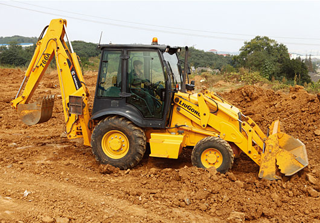
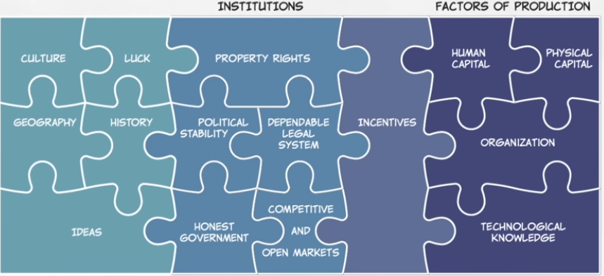
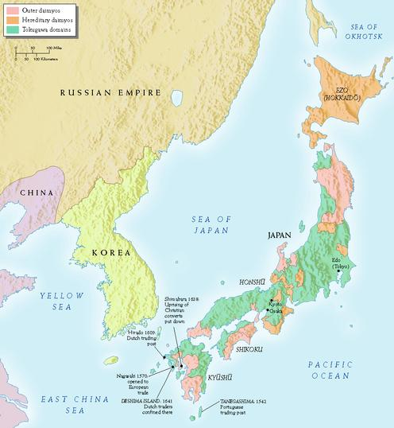
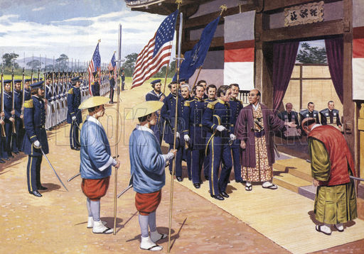
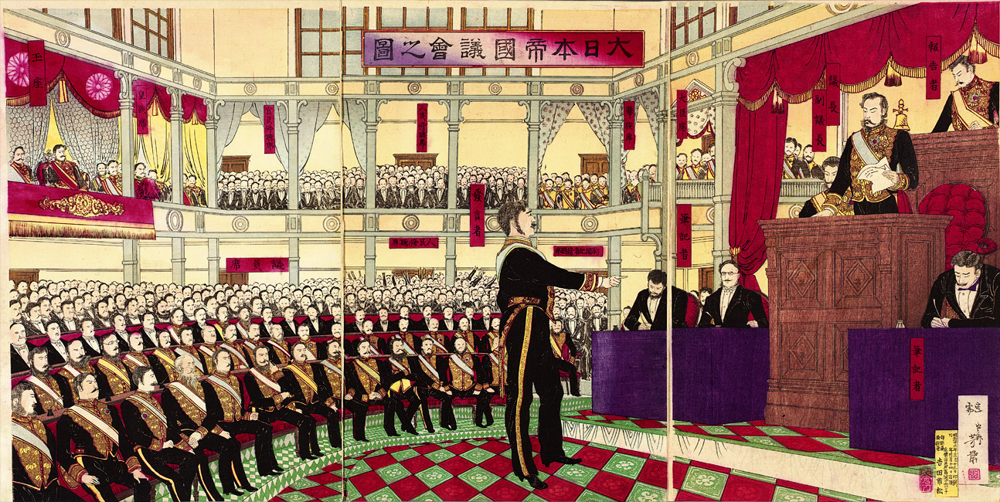
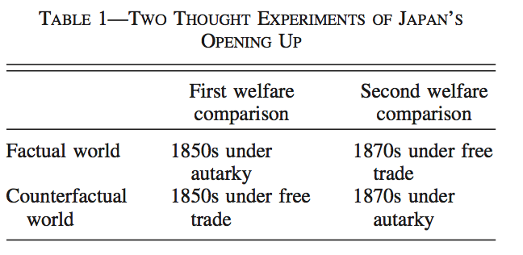

```{r setup, include=FALSE}
options(htmltools.dir.version = FALSE)
knitr::opts_chunk$set(echo=F,
                      message=F,
                      warning=F,
                      fig.retina = 3,
                      fig.align = "center")
library("tidyverse")
library("ggrepel")
library("fontawesome")
xaringanExtra::use_tile_view()
xaringanExtra::use_tachyons()
xaringanExtra::use_freezeframe()
xaringanExtra::use_progress_bar()

update_geom_defaults("label", list(family = "Fira Sans Condensed"))
update_geom_defaults("text", list(family = "Fira Sans Condensed"))

set.seed(256)

theme_slides <- theme_light() + 
  theme(
    text = element_text(family = "Fira Sans", size = 24)
  )

```

class: title-slide

# 1.5 — Reflections on Comparative Advantage

## ECON 324 • International Trade • Spring 2023

### Ryan Safner<br> Associate Professor of Economics <br> <a href="mailto:safner@hood.edu"><i class="fa fa-paper-plane fa-fw"></i>safner@hood.edu</a> <br> <a href="https://github.com/ryansafner/tradeS23"><i class="fa fa-github fa-fw"></i>ryansafner/tradeS23</a><br> <a href="https://tradeS23.classes.ryansafner.com"> <i class="fa fa-globe fa-fw"></i>tradeS23.classes.ryansafner.com</a><br>
---
class: inverse

# Outline

## [The Sources of Comparative Advantage](#4)
## [Shortcomings of the Ricardian Model](#16)
## [Does Comparative Advantage Explain International Trade Patterns?](#22)

---

# Takeaways from the Ricardian Model

.left-column[
.center[

]
]

.right-column[
- Ricardian model works because of its assumptions

- Ricardo: countries trade because they have .hi[different comparative advantages]
  - Have different comparative advantages because of .hi-purple[different labor productivities]

- Ricardo followed a .hi-purple[labor theory of value]

- But what explains differences in labor productivities? it's (mostly) not innate differences!
]

---

class: inverse, center, middle

# The Sources of Comparative Advantage

---

# Sources of Comparative Advantage: Geography

- Geography, climate, natural resources

- Ricardo's example of wine vs. cloth in England vs. Portugal

.pull-left[
.center[

]
]
.pull-right[
.center[

]

]

---

# Sources of Comparative Advantage: Geography

- Geography, climate, natural resources

- Agriculture, tourism, etc.

.pull-left[
.center[

]
]
.pull-right[
.center[

]

]

---

# Sources: Factor Endowments

- Internationally mobile labor (immigration)

- Different countries have different capital/labor ratios (and land, etc.)

.pull-left[
.center[

]
]
.pull-right[
.center[

]

]

---

# Sources: Factor Endowments

- Labor is not homogenous! 

- High-skilled labor vs. low-skilled labor
  - capital-intensive vs. labor-intensive 

.pull-left[
.center[

]
]
.pull-right[
.center[

]

]

---

# Division of Labor Strikes Back

.pull-left[

- .hi-purple[Comparative advantage is often *endogeous*]: it can be .hi-purple[*created* by specialization]

- Ex ante similar countries become ex post different!

- .hi[Increasing returns] phenomena
  - .hi-purple[Economies of scale] can lower a country's opportunity cost *despite* no initial comparative advantage
]

.pull-right[
.center[

]
]

---

# Division of Labor Strikes Back

.left-column[
.center[


Adam Smith

1723-1790
]
]

.right-column[
.quitesmall[
> “The .hi[difference of natural talents] in different men is, in reality, .hi[much less than we are aware of]; and...is .hi[not upon many occasions so much the cause, as the effect of the division of labour.] The difference between the most dissimilar characters, between a philosopher and a common street porter, for example, seems to .hi[arise not so much from nature, as from habit, custom, and education.]...[F]or the first six or eight years of their existence, they were perhaps, very much alike...About that age, or soon after, they come to be employed in very different occupations. The difference of talents comes then to be taken notice of, and widens by degrees, till at last the vanity of the philosopher is willing to acknowledge scarce any resemblance. But .hi[without the disposition to truck, barter, and exchange, every man must have procured to himself every necessary and conveniency of life which he wanted.] All must have had the same duties to perform, and the same work to do, and .hi[there could have been no such difference of employment as could alone give occasion to any great difference of talents.]” (Book I, Chapter 1).

]

.source[Smith, Adam, 1776, [*An Enquiry into the Nature and Causes of the Wealth of Nations*](https://www.econlib.org/library/Smith/smWN.html)]

]

---

# Division of Labor Strikes Back

.pull-left[

- .hi[“Smithean view of trade”] (division of labor): we are similar but we are more productive when we specialize and exchange

- .hi[“Ricardian view of trade”] (comparative advantage): we can all benefit from trade when we are different

- Division of labor is the *cause* of comparative advantage, not the other way around!

]

.pull-right[
.center[
 
]
]

---

# Institutions

.pull-left[

- Productive countries have better institutions
  - Property rights
  - Flexible labor markets
  - Contract enforcement
  - Dispute resolution
  - Lack of corruption
  - Investments in education & training of human capital
]

.pull-right[
.center[


[From MR University](https://mru.org/courses/principles-economics-macroeconomics/solow-model-economic-growth)
]
]

---

# Labor Productivity, Institutions & Learning by Doing

.left-column[
.center[


James Bessen

1958-
]
]

.right-column[

.smallest[
> "By the early twentieth century, British textile equipment manufacturers were shipping power looms and other textile equipment around the globe. Mills in India, China, and elsewhere not only used the same equipment as British mills, but they were often run by experienced British managers aided by British master weavers and spinners and engineers. Nevertheless, their output per worker was far less than that of the English or American mills because their workers -- using the exact same machines -- lacked the same knowledge and skills. Western weavers were 6.5 times more productive. The English and American cotton textile industries held a sustained economic advantage for decades, despite paying much higher wages," (pp.18-19).

]

.source[Bessen, James, 2015, *Learning by Doing: The Real Connection between Innovation, Wages, and Wealth*, New Haven, CT: Yale University Press]

]

---

# Labor Productivity, Institutions & Learning by Doing

.left-column[
.center[


James Bessen

1958-
]
]

.right-column[
.smallest[
> "[T]he technical knowledge needed to install, manage, and operate this technology, along with the necessary institutiosn and organizations to allow large numbers of workers to acquire this knowledge, did not appear in these countries for many decades. Cotton textile workers in China, India, and Japan in 1910 had the same machines as those in England, but their productivity was far less than that of the English or American workers because they lacked the same knowledge and skills. Even when English managers ran mills in India and China, productivity tended to be low because the English managers had to adapt their knowledge to a different environment and culture.," (p.98).

]

.source[Bessen, James, 2015, *Learning by Doing: The Real Connection between Innovation, Wages, and Wealth*, New Haven, CT: Yale University Press]

]

---

class: inverse, center, middle

# Shortcomings of the Ricardian Model

---

# Labor Theory of Value

.pull-left[

- .hi-purple[Labor Theory of Value]

- Neoclassical Economics since the 1870s Marginalist revolution:
  - Value & price is determined by .hi[marginal utility]

- There are other factors of production!
$$Y=f(L,K,T)$$

]

.pull-right[
.center[

]
]

---

# Labor Theory of Value

.pull-left[

- An easy fix (from Fritz Machlup)

- Instead of labor productivity interpretation, interpret as .hi-purple[opportunity cost]

- Cost of a good $x$ is not amount of labor needed $(l_x)$, it is the amount of other goods given up to release resources to produce marginal $x$
  - Opportunity cost, relative price of $x$: $\frac{p_x}{p_y}$ is slope of PPF!

]

.pull-right[
.center[

]
]

---

# Extreme Specialization

.pull-left[

- In Ricardian model, trading countries .hi-purple[specialize in *only* producing a single good]

- Due to assumed constant returns, constant marginal product of labor

- This does not happen in real world!
  - Diminishing returns to any one factor, holding others constant
]

.pull-right[
.center[

]
]

---

# Domestic Distribution Effects?

.pull-left[

- Ignores effects of international trade on .hi-purple[distribution of income *within* countries]

- Workers just assumed to be homogenous $L$ that can move from any industry to any other
  - Perfect mobility

- In truth, relative price changes from trade will cause gains and losses to different domestic industries
]

.pull-right[
.center[

]
]

---

# Short Run Harms?

.pull-left[

- Trade can increase aggregate wealth, but .hi-purple[may leave some individuals worse off] (especially in short run)

- Suppose $A \iff B$ trade

- Then suppose transactions costs fall and $A \iff C$ trade *instead* of $A \iff B$
  - $B$ is worse off!
]

.pull-right[
.center[


.smaller[
Detroit, MI in 2013
]
]
]

---

# Intra-Industry Trade?

.pull-left[

- More and more trade these days is between .hi-purple[similar countries] trading very .hi-purple[similar goods]!

- e.g. U.S. and Japan export motorcycles to each other, versus U.S. exporting computers to Ukraine for wheat
]

.pull-right[
.center[


]
]

---

class: inverse, center, middle

# Does Comparative Advantage Explain International Trade Patterns?

---

# The Essential Prediction

.pull-left[

- .hi[Countries should tend to export goods in which their productivity is relatively high and import goods in which their productivity is relatively low.]
]

.pull-right[
.center[

]
]

---

# Evidence for Comparative Advantage?

<iframe src="https://ourworldindata.org/grapher/growth-of-income-and-trade" loading="lazy" style="width: 100%; height: 500px; border: 0px none;"></iframe>

---

# Evidence for Comparative Advantage?

.pull-left[

- Data and studies can show that trade and GDP level (or growth rate) are strongly correlated

- Major econometric problem: Simultaneous causation! Which causes the other?

- Need a .hi-purple[natural experiment] with an exogenous increase in amount of trade, and compare how economic output responds
]

.pull-right[
.center[


]
]

---

# Belassa (1963): UK and US Productivity vs. Exports

.pull-left[

- Bela Belassa compared UK & US productivity & exports across 28 manufacturing industries in 1951
- UK had lower productivity in nearly all sectors than U.S. (U.S. absolute advantage in everything)
- Yet, overall British exports around same level as U.S. exports
- Ricardian model predicts UK exports in industries in where U.S. has smaller productivity advantage

.source[Balassa, Bela, 1963, "An Empirical Demonstration of Classical Comparative Cost Theory", *Review of Economics and Statistics* 45(3): 231-238]

]

.pull-right[
```{r, balasa.data, echo=FALSE}
Balas<-data.frame(Industry=c("Woolen and Worsted","Shipbuilding and Repairing","Cement", "Structural Clay Products","Tanneries","Footwear, except rubber","Cotton spinning and weaving","Tools and implements","Tires and tubes","Knitting mills","Rayon, nylons, and silk", "Iron and steel foundries","Bolts, nuts, screws, rivets","Wirework","Outerwear and underwear","Soap,candles, and glycerine","Generators, motors, transformers","Rubber products, except tires and footwear","Blast furnaces","Radio","Steel works and rolling mills","Automobiles, trucks, and tractors","Basic industrial chemicals","Pulp, paper, and board","Metal-working machinery","Containers, paper and card","Agricultural machinery, except tractors","Paint and varnish"),
              Export=c(2.7,20.9,31.4,40.9,48.9,66.5,68.4,77.3,84.9,86.3,87.8,92.6,94.7,103.4,110.9,114.8,117.6,136.3,186.9,191.4,196.6,205.7,213.2,233.9,277.5,290.4,291.8,320.1),
              Productivity=c(185,111,116,197,168,171,249,190,241,187,226,202,256,244,170,249,239,250,408,400,269,466,372,338,221,428,429,363)
)

Balas$lproductivity<-log(Balas$Productivity)
Balas$lexport<-log(Balas$Export)
library("ggplot2")
ggplot(Balas, aes(x=Productivity,y=Export))+
  geom_point()+
  geom_smooth(method=lm)+
  labs(x = "Productivity (Index)",
       y = "Exports",
       caption = "Data used from Belassa (1963)")+
  theme_classic(base_family = "Fira Sans Condensed", base_size = 14)
```

]

---

# Ruoen and Manying (2002): China and Germany

.center[
Chinese & German labor productivity in 1995
]

| Industry | Chinese $\frac{Q}{L}$ as % of Germany | Total Chinese $Q$ as % of Germany |
|----|----------------:|----------------:|
| All manufacturing | 5.2 | 71.6 |
| Apparel | 19.7 | 802.2 |

.source[Ruoen, Ren and Bai Manying, 2002, ”China’s Manufacturing Industry in an International Perspective: A China-Germany Comparison,” *Economie internationale* 92(4): 103-130]

---

# Evidence from The Opening of Japan

.pull-left[
.center[

]
]

.pull-right[
.center[

]

]

Tokugawa Shogunate’s 1639 edicts of *National Seclusion* prohibits all Westerners (except some Dutch) from entering Japan during the Edo Period...

---

# Evidence from The Opening of Japan

.center[

]
...until 1853 when the U.S. under Commodore Matthew Perry forced Japan to open up to trade with the West via "gunboat diplomacy"

---

# Evidence from The Opening of Japan

.pull-left[

- Japan rapidly modernized and industrialized under the .hi-purple[Meiji Restoration]

- Immediately after opening up, engaged in free trade (for a short while)

- Sudden, discontinuous policy change, forced by exogenous events!

.source[Bernhofen, Daniel and John C. Brown, 2005, "An Empirical Assessment of the Comparative Advantage Gains from Trade: Evidence from Japan," *American Economic Review* 95(1): 208-225.]

]

.pull-right[
.center[

]
]

---

# Evidence from The Opening of Japan

.pull-left[

- Japan now able to *export* goods it has comparative advantage in: tea and silk

- Also can *import* cotton textiles and iron that is cheaper from Europe vs. producing in Japan

- Access to new European goods & techs: glass, boots, butter, woolens, muskets

.source[Bernhofen, Daniel and John C. Brown, 2005, "An Empirical Assessment of the Comparative Advantage Gains from Trade: Evidence from Japan," *American Economic Review* 95(1): 208-225.]
]

.pull-right[
.center[

]
]

---

# Evidence from The Opening of Japan

.smallest[
> “Three key features of the Japanese case make it an attractive .hi[natural experiment]. .hi[First, both shortly before and after its opening up in the late 1850s the economy arguably met the key assumptions of the neoclassical trade model]: competitive markets, product homogeneity, and price-taking behavior on international markets. Second, the free trade period used for empirical analysis--the late 1860s through the mid-1870s--predates the importation of foreign production technologies and the rapid transformation of the set of technologies available to the Japanese economy that characterized subsequent economic growth. It also occurs after non-tariff barriers to trade established during the initial opening up had been eliminated. .hi[In short, the opening up to international trade characterizes the main change in the economy during this period. Third, the opening up confronted the Japanese economy with a dramatic change in the vector of relative prices that it faced.] The Western powers so compromised Japan’s tariff autonomy that it had little leverage to cushion the affected sectors of its economy from these price shocks. .hi[Thus, within seven years the country went from nearly complete autarky to virtually free trade],” (p.209).

]

.source[Bernhofen, Daniel and John C. Brown, 2005, "An Empirical Assessment of the Comparative Advantage Gains from Trade: Evidence from Japan," *American Economic Review* 95(1): 208-225.]

---

# Evidence from The Opening of Japan

.pull-left[

- For 1851-1853: how much extra national Japanese income would be equal to the subsequent gains from trade?

.source[Bernhofen, Daniel and John C. Brown, 2005, "An Empirical Assessment of the Comparative Advantage Gains from Trade: Evidence from Japan," *American Economic Review* 95(1): 208-225.]
]

.pull-right[
.center[

]
]

---

# Evidence from The Opening of Japan

> “.hi[We find that the gains to the Japanese economy resulting from static comparative advantage were most likely no larger than 8 or 9 percent of Japan’s GDP at the time]. Our estimates indicate that .hi[significant changes in commodity prices do not necessarily translate into large welfare gains]. It also suggests caution in justifying free trade on the grounds of welfare gains based on static comparative advantage. .hi[Since the dynamic aspects of international trade probably have a much larger impact on national income], future empirical research on the nature and magnitude of these dynamic gains is indispensable.” (p.222).

.source[Bernhofen, Daniel and John C. Brown, 2005, "An Empirical Assessment of the Comparative Advantage Gains from Trade: Evidence from Japan," *American Economic Review* 95(1): 208-225.]

---

# Summing up Smithean-Ricardian Views of Trade

.pull-left[

- .hi[“Smithean view of trade”] (division of labor): we are similar but we are more productive when we specialize and exchange

- .hi[“Ricardian view of trade”] (comparative advantage): we can all benefit from trade when we are different

]

.pull-right[
.center[
 
]
]

---

# Morality of Trade & Analytic Egalitarianism

.pull-left[
.smallest[
- Ricardian view of trade emphasizes how our differences benefit all of us
  - .hi-purple[Diversity *with trade* is strength!]

- Smith & Ricardo were .hi[analytic egalitarians]: view all members of humanity as equals, all can participate in exchange and flourish
  - economics is universally applicable to all
  - class, race, other social divisions are distractions

- Read [How the Dismal Science Got its Name](https://www.econlib.org/library/Columns/LevyPeartdismal.html) (believe me, it’s not at all what you think!)
  - [Part II](https://www.econlib.org/library/Columns/LevyPeartdismal2.html); [Part III](https://www.econlib.org/library/Columns/LevyPeartdismal3.html); [Part IV](https://www.econlib.org/library/Columns/LevyPeartdismal4.html); [Part V](https://www.econlib.org/library/Columns/LevyPeartdismal5.html); [Part VI](https://www.econlib.org/library/Columns/LevyPeartdismal6.html)
  
]
]
.pull-right[
.center[
 
]
]

---

# A Ph.D-level Question to Ponder


.pull-left[

- .hi-purple[Does it make sense for two people/countries that have identical preferences, identical endowments (resources), and identical production technologies (PPFs) to trade?]

- How would Smith and Ricardo answer that (differently)?

]

.pull-right[
.center[


]
]
