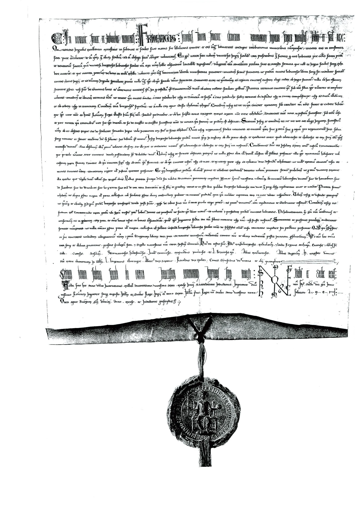
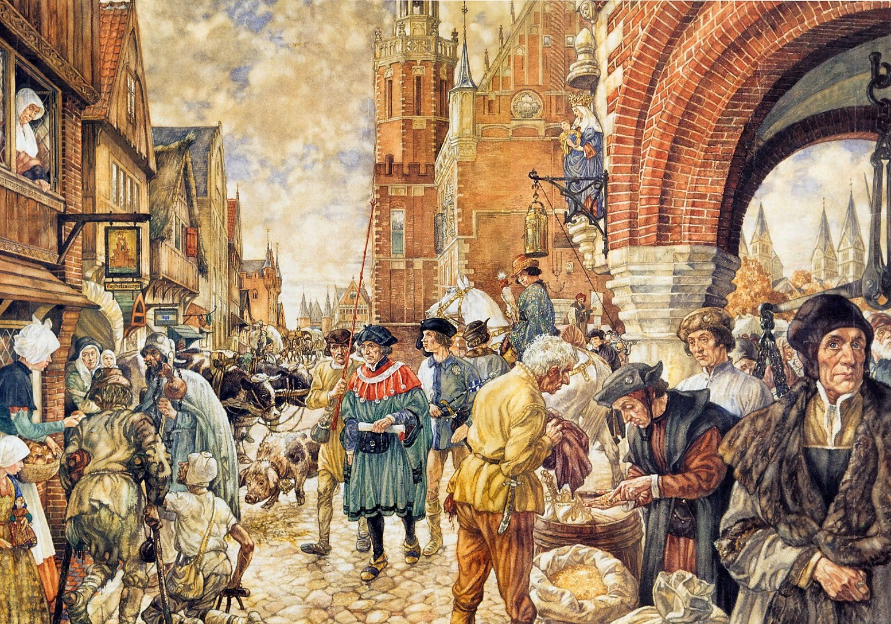
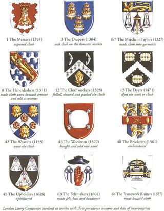
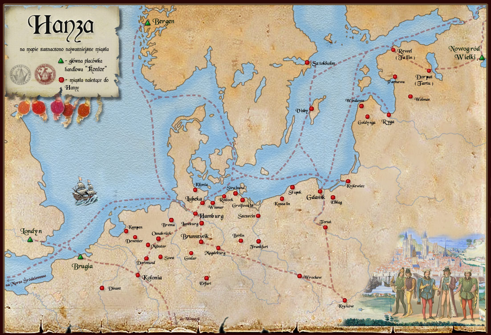
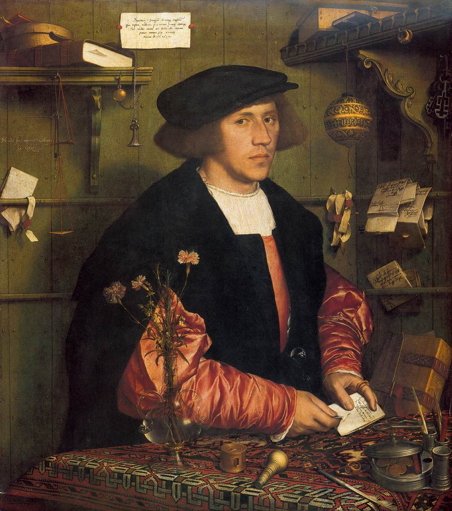
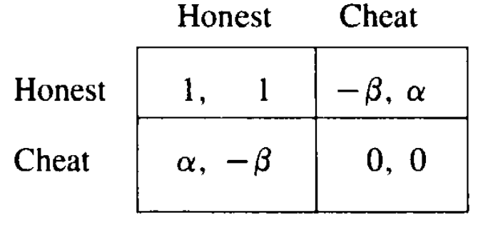

```{r setup, include=FALSE}
options(htmltools.dir.version = FALSE)
knitr::opts_chunk$set(echo=F,
                      message=F,
                      warning=F,
                      fig.retina=3,
                      fig.align="center")
library(tidyverse)
library(ggrepel)
library(mosaic)
set.seed(256)
update_geom_defaults("label", list(family = "Fira Sans Condensed"))
```

class: title-slide

# 2.3 — History of Trade I: Feudalism

## ECON 324 • International Trade • Spring 2023

### Ryan Safner<br> Associate Professor of Economics <br> <a href="mailto:safner@hood.edu"><i class="fa fa-paper-plane fa-fw"></i>safner@hood.edu</a> <br> <a href="https://github.com/ryansafner/tradeS23"><i class="fa fa-github fa-fw"></i>ryansafner/tradeS23</a><br> <a href="https://tradeS23.classes.ryansafner.com"> <i class="fa fa-globe fa-fw"></i>tradeS23.classes.ryansafner.com</a><br>

---
class: inverse

# Outline

### [The Beginning: Feudalism](#4)

### [Interlude: Some Game Theory](#37)

### [The Commercial Revolution & Revivial of International Trade (c.1100-c.1300)](#51)

---

# Unit 2 & an Intellectual History of Trade

.pull-left[
.smallest[
- Now that we know the major models and tools of trade policy, we want to examine what are the best arguments for and against free trade

- To do this, we dive into the history of trade and the intellectual history of trade arguments

- We will examine and discuss (on the discussion board) some papers about the development of trading institutions

- Bring it up to modern arguments against free trade, industrial policy, and then politics
]
]

.pull-right[
.center[

]
]
---

class: inverse, center, middle

# The Beginning: Feudalism

---

# Ancient Empires and Trade

.pull-left[
- “Globalization” is not a new idea

- Ancient Empires in Rome, China, India, North Africa, linked by “international” trade
]

.pull-right[
.center[

]
]

---

# The Fall of the Roman Empire

.center[

]

---

# European Feudalism (c.500-1500)

.pull-left[

- Why was feudalism such a stable equilibrium for about 1,000 years?

- How, when, and why did countries transition out of this equilibrium?
]

.pull-right[
.center[

]
]

---

# Formation of the Feudal System (c.500) I

.center[

]

---

# Formation of the Feudal System (c.500) II

.pull-left[
- Fall of Roman Empire and its dependencies by invasions of Germanic, Central Asian, later Scandinavian tribes 

- Lots of sources of violence: invaders, bandits, local disputes/feuds without central authority

]

.pull-right[
.center[

]
]

---

# Formation of the Feudal System (c.500) III

.pull-left[

- .hi[Patronage]: weaker individuals pledge themselves to strongmen (.hi-purple[lords]) who protect them from violence, dispense justice, resolve disputes, etc

- Most powerful warlords own large tracts of land that they can control

]

.pull-right[
.center[

]
]

---

# Formation of the Feudal System (c.500) IV

.pull-left[
- .hi[Feudalism]: most people who who *occupy* but *don't own* land hold it as **tenants** from sovereign in exchange for military (or other) service

- Wealth and power determined almost entirely by land-ownership

]

.pull-right[
.center[

]
]

---

# Formation of the Feudal System (c.500) IV

.pull-left[
- Lords own .hi-purple[manors] or .hi-purple[estates]
  - Constitute polities in themselves: entirely of political, economic, social, religious life for tenants

- Landowning elite have military power
  - Rent out land to tenants
  - Tenants constitute the elite's work force, and army - if needed

]

.pull-right[
.center[

]
]

---

# Formation of the Feudal System (c.500) V

.pull-left[
.smallest[
- Crystalized into a *very formal and ritualized* system of **oaths of** .hi-purple[fealty] to lords

- Reputation and honor are extremely valuable and depreciable assets
  - Being an "oathbreaker" deigns one as a social outcast (and is a virtual death sentence without protection from sovereign lords)

- Person would pledge .hi-purple[homage] to their superior, to literally *"become his man"* (*homme*)

- Lord would provide protection and justice in exchange for **knight-service**

]

]

.pull-right[
.center[

]
]

---

# Formation of the Feudal System (c.500) V

.pull-left[

- A political-military hierarchy that matched the landowner-tenant ownership hierarchy

- Lesser lords were .hi-purple[vassals] to their .hi-purple[liege] lord to whom they owe loyalty and service, all the way up to the .hi-purple[monarch]

]

.pull-right[
.center[

]
]

---

# Manorialism I

.pull-left[

- Nearly the entirety of Medieval life took place on the lord's .hi[manor] or .hi[fief]

- Subsistence agriculture by sharecropping tenants

- Tenants pay .hi[feudal dues] to their lord
  - often in-kind (fraction of agricultural surplus)
  - may be labor-service, military service, or (much later) **money rent**
]

.pull-right[
.center[

]
]

---

# Manorialism II

.pull-left[
.smaller[
- .hi-purple[No separation between political, economic, social, religious spheres of life]

- Lord of the manor is boss, political ruler, judge, policeman, godfather, sometimes religious leader

- All institutions are **personal** and **partial**, no separate existence of organizations from person
  - Who the lord *is*, their *identity*, matters for patronage!
  - No such thing as rule of law

]

]

.pull-right[
.center[

]
]

---

# The Economics of Sharecropping I

.pull-left[

- Consider two individuals: 

1. Farmer
2. Landowner 

- Farmer wants to farm the landowner's land and generate some surplus

- Farmer and Landowner must write a contract to agree on how to divide the surplus 

]

.pull-right[

.center[

]

]

---

# The Economics of Sharecropping II

.pull-left[

- Participation constraints:
  - Contract must pay farmer enough to be willing to farm
  - Contract must pay landowner enough to be willing to rent out land

]

.pull-right[

.center[

]

]

---

# The Economics of Sharecropping III

.pull-left[
.smallest[
- One extreme solution:

- Farmer pays a fixed fee up front, once paid, the farmer keeps all surplus

- Would have to be high enough to be worthwhile to the landlord

- Problems with this solution:
  1. requires high upfront cost to farmer (often poor, capital-constrained)
  2. imposes the entirety of the risk on the farmer (bad harvest, weather, invasion, theft)
]
]

.pull-right[

.center[

]

]

---

# The Economics of Sharecropping III

.pull-left[

- A .hi-purple[risk-sharing agreement]: worker pays a smaller (or no) upfront fee, and surplus output is shared between parties somehow
  - for sake of argument, suppose surplus is split 50-50

- Risk of a bad harvest is shared by the farmer and the landowner

]

.pull-right[

.center[

]

]

---

# The Economics of Sharecropping III

.pull-left[
.smallest[
- New .hi-purple[principle-agent problems] introduced:

1. Farmer has an incentive to *underreport* to landlord how much surplus they produce, effectively "stealing" more than their share
  - landowner must monitor farmer to reduce this possibility (and this is costly)

2. Farmer is effectively taxed (50%, in this example) on their output
  - has 50% less incentive to be productive than if they were 100% residual claimant
  - farmer will exert less effort since they get less of the output
]
]
.pull-right[

.center[

]

]

---

# The Economics of Sharecropping V

.pull-left[

- A tradeoff between risk-sharing and tax on effort/incentives to shirk

- Most real world sharecropping today is a mixture of fixed and variable components

]

.pull-right[

.center[

]

]

---

# The "Ideology" of Feudalism I

.pull-left[

- Everyone, including serfs, had important role to uphold in feudal society

> Serfs and freemen "worked for all" while a knight or baron "fought for all" and a churchman "prayed for all"; thus everyone had a place

]

.pull-right[
.center[

]
]

---

# The "Ideology" of Feudalism II

.pull-left[

- Forged in the crucible of a breakdown of empires and constant threat of violence and invasion

- Feudalism is primarily about stability and custom, preserving the social order, minimizing violence

- The *last thing* it's okay with is innovation, competition, experimentation, and rocking the boat
]

.pull-right[
.center[

]
]

---

# Religion and Feudalism

.pull-left[

- The one thing everyone shares is religion

- Catholic Church is dominant, both in Medieval ethics and politics, the only "international" institution

- All actions, exchanges, social and political power are justified as moral (Christian), legitimate, and upholding ancient privileges and customs 

]

.pull-right[
.center[

]
]
---

# The "Ideology" of Feudalism III

.left-column[
.center[

]
]

.right-column[

> ".hi[[T]he medieval way of determining the terms of exchange was by custom, usage, and law, not by negotiation between traders.] The division of labor was well developed by the Middle Ages, and there was a corollary exchange of products and services among specialized workers. But the .hi[use of custom and law to set the terms of trade was as fundamental to the medieval economy as the unity of its political and economic institutions]," (p.38).


.source[Rosenberg, Nathan and L.E. Birdzell, Jr, (1986) *How the West Grew Rich: The Economic Transformation of the Industrial World*]
]

---

# The "Ideology" of Feudalism IV

.left-column[
.center[

]
]

.right-column[
.smaller[
> ".hi[Exchange was also usually compulsory], in that the great majority of .hi[artisans and agricultural workers were obligated to supply their products and services on terms dictated by custom or law.] Agricultural workers were bound to the land in a system of serfdom, a .hi[hereditary status assumed at birth, and they had no right to select a more attractive occupation.] Townspeople were not given much more choice of occupation, for having a trade...depended on an apprenticeship, usually arranged by one's father....hi[A member of the guild had to work and sell on the guild terms; there was no right to decline business at the fixed rates]," (p.38).

]

.source[Rosenberg, Nathan and L.E. Birdzell, Jr, (1986) *How the West Grew Rich: The Economic Transformation of the Industrial World*]

]
---

# The "Ideology" of Feudalism V

.left-column[
.center[

]
]

.right-column[

> ".hi[The ideology of the system was epitomized in the phrases "just price" and "just wage."] Prices and wages expressed a moral judgment of worth. .hi[Supply and demand were morally irrelevant]...it was mainly in time of famine or siege that prices forced their way into [equating supply and demand]," (p.38).


.source[Rosenberg, Nathan and L.E. Birdzell, Jr, (1986) *How the West Grew Rich: The Economic Transformation of the Industrial World*]

]
---

# Opposition to Creative Destruction I

.left-column[
.center[


Virginia Postrel
]
]

.right-column[

> "[I]f every voluntary experiment must answer the question, 'Are you going to affect the way I live?' with a no, there can be no experiments, no new communities, no realized dreams. A city, an economy, or a culture is, despite the best efforts of stasists, fundamentally a 'natural' system. As a whole, it is beyond anyone’s control. Any individual effort at improvement changes not just the particular target but the broader system. In the process, there may be progress, but there will also be disruptions, adjustments, and losers," (p.204).

]

.source[Postrel, Virginia, (1998) *The Future and Its Enemies*]

---

# Opposition to Creative Destruction II

.left-column[
.center[


Virginia Postrel
]
]

.right-column[

> "Stasist institutions shift the burden of proof from the people who want to block new ideas to those who want to experiment. Such institutions seek not simply to compensate for or mitigate extreme side effects but, rather, to treat any change as suspect," (p.204).

]

.source[Postrel, Virginia, (1998) *The Future and Its Enemies*]

---

# Opposition to Creative Destruction III

.pull-left[
.center[

]
]

.pull-right[
.smallest[
> "There is a story, repeated by a number of Roman writers, that a man - characteristically unnamed - invented un-breakable glass and demonstrated it to Tiberius in anticipation of a great reward. The emperor asked the inventor whether anyone shared his secret and was assured that there was no one else; whereupon his head was promptly removed, lest, said Tiberius, gold be reduced to the value of mud," (147). 

]

.source[Finley, Moses I, (1965), "Technical Innovation and Economic Progress in the Ancient World," *Economic History Review* 18: 29–45]
]
---

# Opposition to Creative Destruction IV

.pull-left[
.center[

]
]

.pull-right[

- Queen Elizabeth I to William Lee's request to a *letter patent* for his stocking frame:

> "Thou aimest high, master Lee. Consider thou what the invention could do to my poor subjects. It would assuredly bring to them ruin by depriving them of employment, thus making them beggars," (quoted in Acemoglu and Robinson 2012, pp. 182-183). 

]

---

# The Towns and Trade III

.pull-left[
.center[

]
]

.pull-right[
.smallest[
- Towns are dominated by .hi[urban craft guilds]

- Another feudal group with major economic and political power

- Essentially cartels that restrict entry into trades
  - illegal to produce in an industry without being a guild member
  - production, exchange, and prices must be according to guild laws and regulations
  - require patronage and apprenticeships, etc.

- Alliance with monarchs (exclusive privileges in exchange for tax revenues)
]
]

.source[Ogilvie, Sheilagh, (2014), "The Economics of Guilds," *Journal of Economic Perspectives* 28(4): 169-192

Greif, Avner, (1989), "Reputation and Coalitions in Medieval Trade: Evidence on Maghribi Traders," *Journal of Economic History* 49(4): 857-882.

Greif, Avner, Paul Milgrom, and Barry R Weingast, (1994), "Coordination, Commitment, and Enforcement: The Case of the Merchant Guild," *Journal of Political Economy* 102(4): 745-776]

---

# The Crusades I

.pull-left[

- First Crusade 1095, goal of retaking the Holy Land from Arabs

- Lost Jerusalem to Saladin in 1187, never recaptured

- At least 9 crusades by 1291

]

.pull-right[
.center[

]
]

---

# The Crusades II

.pull-left[

- "Outremer" Crusader kingdoms in Levant for 200 years

- Last (in some form) until 1300

- Outlet for peasants, nobles, merchants, etc. fleeing hardships of Europe

- "International" institutions
  - Knights Templar
  - Knights Hospitalier

]

.pull-right[
.center[

]
]

---

# The Crusades III

.pull-left[

- Increase European interaction with rest of the world via Arabs (who trade with India and China)

- (Re)discovery of classical philosophy, mathematics, literature, art from Arabs (who retained it from Ancient Greece and Rome)

]

.pull-right[
.center[


]
]

---

class: inverse, center, middle

# Interlude: Some Game Theory

---

# Thomas Hobbes: State of Nature

.left-column[
.center[


Thomas Hobbes

1588-1679
]
]

.right-column[

> "In [the state of nature], there is no place for Industry; because the fruit thereof is uncertain; and consequently no Culture of the Earth...no Knowledge of the face of the Earth; no account of Time; no Arts; no Letters; no Society; and which is worst of all, continuall feare, and danger of violent death; .hi[And the life of man, solitary, poore, nasty, brutish, and short], (Ch. XVIII).
]

.source[Hobbes, Thomas, 1651, [*Leviathan: Or the Matter, Forme and Power of a Commonwealth, Ecclesiasticall and Civil*](https://www.gutenberg.org/files/3207/3207-h/3207-h.htm)]

---

# The Hobbesian Dilemma

.left-column[
.center[


Thomas Hobbes

1588-1679
]
]

.right-column[

> "For the Lawes of Nature (as Justice, Equity, Modesty, Mercy, and (in summe) Doing To Others, As Wee Would Be Done To,) if themselves, without the terrour of some Power, to cause them to be observed, are contrary to our naturall Passions, that carry us to Partiality, Pride, Revenge, and the like. And .hi[Covenants, without the Sword, are but Words, and of no strength to secure a man at all], (Ch. XVIII).
]

.source[Hobbes, Thomas, 1651, [*Leviathan: Or the Matter, Forme and Power of a Commonwealth, Ecclesiasticall and Civil*](https://www.gutenberg.org/files/3207/3207-h/3207-h.htm)]

---

# The Hobbesian Dilemma 

.pull-left[

- Consider society a .hi[prisoner's dilemma] for social cooperation or conflict:
  - $a$: everyone else obeys the law, but I don't
  - $b$: everyone obeys the law
  - $c$: no one obeys the law
  - $d$: I obey the law, but no one else does

]

.pull-right[
.center[

]
]

---

# The Hobbesian Dilemma 

.pull-left[

- .hi[Nash equilibrium]: everyone *defects*! 

- .hi-purple[Socially optimal equilibrium]: everyone *cooperates*

- Hobbes' insight: .hi-purple[no _individual_ has an incentive to cooperate when everyone defects!]

]

.pull-right[
.center[

]
]

---

# The Hobbesian Solution I

.center[

]

---

# The Hobbesian Solution

.pull-left[

- .hi-purple[The State is our commitment device]

- Citizens (in principle) sign a .hi[social contract], i.e. a ".hi[constitution]" that deliberately restricts their liberties

- In each of our interests to give up some liberties that restrict the liberties of others (e.g. theft, violence)

- In exchange, we empower .hi[the State as our agent] to punish those of us that fail to uphold the social contract

]

.pull-right[
.center[

]

]

---

# The State

.left-column[
.center[


Max Weber

1864-1920
]
]

.right-column[

> "[A] State is a human community that (successfully) claims the monopoly of the legitimate use of physical force within a given territory."
]

.source[Weber, Max, 1919, [*Politics as a Vocation*](http://anthropos-lab.net/wp/wp-content/uploads/2011/12/Weber-Politics-as-a-Vocation.pdf)]

---

# But There’s a Problem

.left-column[
.center[


James Madison

1751-1836
]
]

.right-column[

> "If men were angels, no government would be necessary. If angels were to govern men, neither external nor internal controls on government would be necessary. In framing a government which is to be administered by men over men, the great difficulty lies in this: you must first enable the government to control the governed; and in the next place oblige it to control itself," (Federalist 51).

]

.source[1788, [*The Federalist Papers*](https://avalon.law.yale.edu/18th_century/fed51.asp)]

---

# But There’s a Problem

- .hi[Madison's Paradox]: a State strong enough to protect rights is strong enough to violate them at its discretion

.center[

]

---

# The Problem in Game-Theoretic Form

.pull-left[
.center[


]
]

.pull-right[

- .hi-purple["Talk is cheap"]

- With perfect information, **promises** or **threats** will not change equilibrium if they are .hi-purple[not credible]

- Strategy must be .hi-purple[incentive-compatible], if game reaches the relevant decision, it must be in your interest to carry out your promise or threat!
]

---

# The Problem in Game-Theoretic Form

.pull-left[
.center[


]
]

.pull-right[

- Threats and promises can be .hi-purple[credible] with .hi[commitment]

- A .hi[commitment] changes the game in a way that forces you to carry out your promise or threat
  - tying your own hands makes you stronger!
]

---

# Credible Commitment

.center[


*Odysseus and the Sirens* by John William Waterhouse, Scene from Homer's *The Odyssey*

]

---

# Credible Commitment

.center[


*Odysseus and the Sirens* by John William Waterhouse, Scene from Homer's *The Odyssey*

]

---

class: inverse, center, middle

# The Commercial Revolution & Revivial of International Trade (c.1100-c.1300)

---

# The Revival of International Trade (c.1100) I

.center[

]

---

# The Commercial Revolution

.pull-left[

- Long distance trade in Medieval Europe based on exchange of goods brought from different parts of the world to central .hi[trade fairs]

.source[Milgrom, Paul R, Douglass C North, and Barry R Weingast, (1990), "The Role of Institutions in the Revival of Trade: The Law Merchant, Private Judges, and the Champagne Fairs," (Economics and Politics*2(1): 1-23]
]

.pull-right[
.center[

]
]

---

# Credible Commitments

.pull-left[
.smallest[
- .hi[Rulers] (kings, queens, emperor, lords) face certain incentives:
  - Trade is an attractive source of wealth (along with plundering and warfare)
  - Rulers have a strong incentive to create trading cities: potential .hi-purple[tax revenue]

- Often granted cities and merchants privileges and exemptions from feudal duties
  - Medieval towns as first proto-capitalist centers of specialization and trade 
]
]

.pull-right[
.center[

]
]

---

# Credible Commitments

.pull-left[
.smallest[
- Trade requires peace & stable property rights
  - Merchants, particularly **foreign** merchants, are easy pickings for a corrupt ruler

- After a ruler *promises* to protect trade, incentives arise for him/her to renege on promise! 
  - .hi-purple[How can rulers credibly commit to not confiscate the goods of foreigners?]

- Can trade exist with cours that are partial to **local** merchants over **foreign** merchants?
  - How can merchants be secure in their property and person?
  - Must have solved this problem!
]
]

.pull-right[
.center[

]
]

---

# Credible Commitments

.pull-left[
.smallest[
- The.hi[“Commercial Revolution”] of 1100s-1200s
  - large increase in international trade
  - made possible by new institutions and shifting political power

1. Medieval guilds, leagues of city-states

2. Coalition and reputation system

3. Merchant law
]
]

.pull-right[
.center[

]
]

---


# The Role of Medieval Guilds in *Promoting* Trade

.pull-left[

- We often think of Medieval guilds as just monopolies or cartels meant to **restrict** trade
  - This is true

- But in a way they also **promoted** trade
  - Were set up by merchants to reduce transactions costs
  - Solved credible commitment problems for rulers
]

.pull-right[
.center[

]

]

---

# The Hanseatic League

.center[


.smallest[
Most famous guild: Hanseatic League (German “Hansa”) of Northern Europe
]
]

---

# The Role of Medieval Guilds in *Promoting* Trade

.pull-left[

- Guilds were administrative bodies

- Ability to regulate trade within local region

- Guilds had chapters in each city, could gain access to all guild privileges abroad

- **Monitored** and provided **information** about merchant activity
  - Rulers (and merchants!) who cheated, broke promises, or were corrupt were widely publicized within guild 
]

.pull-right[
.center[

]

]

---

# The Role of Medieval Guilds in *Promoting* Trade

.pull-left[
.quitesmall[
- Guilds allowed merchants to .hi-purple[coordinate collective action] in punishing transgressors

- A .hi-purple[free rider problem] in punishment:
  - individual merchant doesn’t have incentive to punish
  - may have reason to get a corrupt bargain at expense of other merchants!

- Violating merchants would have their privileges revoked, or be expelled from guild

- Untrustworthy rulers would be .hi-purple[boycotted] by entire guild across Europe
  - Even a case of the Hanseatic League *going to war*!
  - 1358 Hansa embargo of Bruges

> “It was announced that any disobedience, whether by a town or an individual, was to be punished by perpetual exclusion from the Hansa”

]
]
.pull-right[
.center[

]

]

---

# The Role of Medieval Guilds in *Promoting* Trade

.pull-left[

- Threat of collective punishment enables rulers to .hi[credibly commit] to protect merchant rights
  - removes ruler’s temptation of a one-time expropriation
  - threatens infinite future punishment (think trigger strategy in game theory)

]

.pull-right[
.center[

]

]

---

# Reputation: A Repeated Prisoners' Dilemma

.pull-left[
- Long distance international trade took place in fairs, like the Champagne Fair

- Transactions at fairs: transfer of goods in exchange for promissory note to be paid *at next fair*
    - Ample room for dishonest merchants to trade

- No established commercial law or State enforcement of contracts
]

.pull-right[
.center[

]
]

---

# Reputation: A Repeated Prisoners' Dilemma

.pull-left[
- What prevents a merchant from cheating?
  - .hi-purple[Reputation] and threat of sanction by other merchants
  
.source[Milgrom, Paul R, Douglass C North, and Barry R Weingast, 1990, “The Role of Institutions in the Revival of Trade: The Law Merchant, Private Judges, and the Champagne Fairs,” *Economics and Politics* 2(1): 1-23]
]

.pull-right[
.center[

]
]

---

# Reputation: A Repeated Prisoners' Dilemma

.pull-left[

]

.pull-right[

- Essentially playing<sup>.magenta[1]</sup> an .hi-purple[infinitely repeated Prisoners' Dilemma]<sup>.magenta[2]</sup>
  - Cooperate = fulfill contract
  - Defect = don't buy, cheat, renege, hold up, opportunism

- Game theory of repeated games

.footnote[
<sup>.magenta[1]</sup> Where .hi-red[Buyer] can be a consumer or another firm

<sup>.magenta[2]</sup> "Infinitely" = game does not have a clear final turn.

]
]

---

# Reputation: A Repeated Prisoners' Dilemma

.pull-left[

]

.pull-right[

- .hi-purple["Grim" Trigger strategy]: Cooperate, but once the other party plays Defect for the first time, Defect for all future turns

]

Each player will always Cooperate iff:
$$\infty \text{-payoff stream of (C,C)} > \text{payoff of 1 (D,C)} + \infty \text{-payoff stream of (D,D)}$$

---

# Reputation: A Repeated Prisoners' Dilemma

.pull-left[
- If two specific merchants repeatedly interact, honesty can be sustained by trigger strategies
  
- Then why need a legal system? 
  - Merchants require *information* about other merchants and their histories
  - Role of third party

.source[Milgrom, Paul R, Douglass C North, and Barry R Weingast, 1990, “The Role of Institutions in the Revival of Trade: The Law Merchant, Private Judges, and the Champagne Fairs,” *Economics and Politics* 2(1): 1-23]

]

.pull-right[
.center[

]
]

---

# Reputation: A Repeated Prisoners' Dilemma

.pull-left[
.quitesmall[
- Milgrom, North, and Weingast (1990) model these interactions as a multi-stage repeated game (p.11)

1. Traders may (at a cost $Q>0$) ask LM (publicly reports whether any trader has any unpaid judgments) about their current partner
2. Two traders play a prisoners' dilemma (*Honest* or *Cheat*)
3. If LM was asked before (in stage 1), either player may *Appeal* outcome to LM at a cost $C>0$
4. If *Appealed*, LM awards damages $(J)$ to Plaintiff if he was Honest and his partner Cheated; otherwise nothing 
5. Defendant chooses to *Pay* $J$ or *Not*
6. Unpaid judgments recorded by LM
]

.center[

]
.source[Milgrom, Paul R, Douglass C North, and Barry R Weingast, 1990, “The Role of Institutions in the Revival of Trade: The Law Merchant, Private Judges, and the Champagne Fairs,” *Economics and Politics* 2(1): 1-23]

]

.pull-right[
.center[

]
]

---

# Reputation: A Repeated Prisoners' Dilemma

.pull-left[
.smaller[
- Milgrom, North, and Weingast (1990) model these interactions as a multi-stage repeated game (p.11)

- If costs of asking judge are not too high, and if players are sufficiently patient, can sustain honest trade
  - Merchant courts have strong incentive to be quick and efficient (promotes commerce)
  - State/local courts biased against foreigners, inefficient]

.source[Milgrom, Paul R, Douglass C North, and Barry R Weingast, 1990, “The Role of Institutions in the Revival of Trade: The Law Merchant, Private Judges, and the Champagne Fairs,” *Economics and Politics* 2(1): 1-23]

]

.pull-right[
.center[

]
]

---

# Merchant Law

.left-column[
.center[

]
]

.right-column[
.quitesmall[

- *International* merchants can't depend on weak and biased States to enforce *international* contracts!

- Merchants adopted their own "laws" and best practices to minimize transaction costs

- For-profit merchant courts emerge to settle disputes and enforce international contracts
  - More efficient, cheaper, and less partisan than Royal courts
  - Legal and jurisdictional competition

- Developed contract law and advanced legal instruments - debt, credit, loans, equity contracts

- This is a major basis of international commercial law today!

]

.source[Benson, Bruce, 1989. "The Spontaneous Evolution of Commercial Law," *Southern Economic Journal* 55(3): 644-661

Milgrom, Paul R, Douglass C North, and Barry R Weingast, (1990), "The Role of Institutions in the Revival of Trade: The Law Merchant, Private Judges, and the Champagne Fairs," (Economics and Politics*2(1): 1-23]
]
