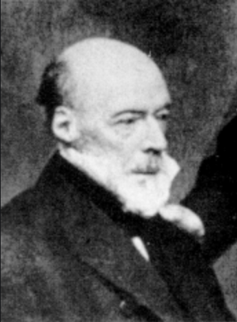
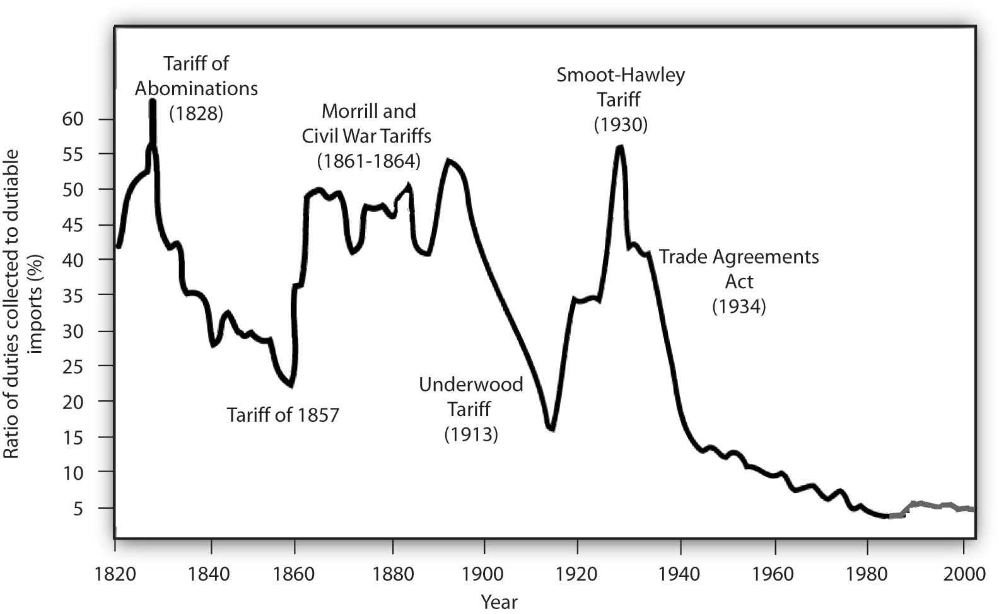
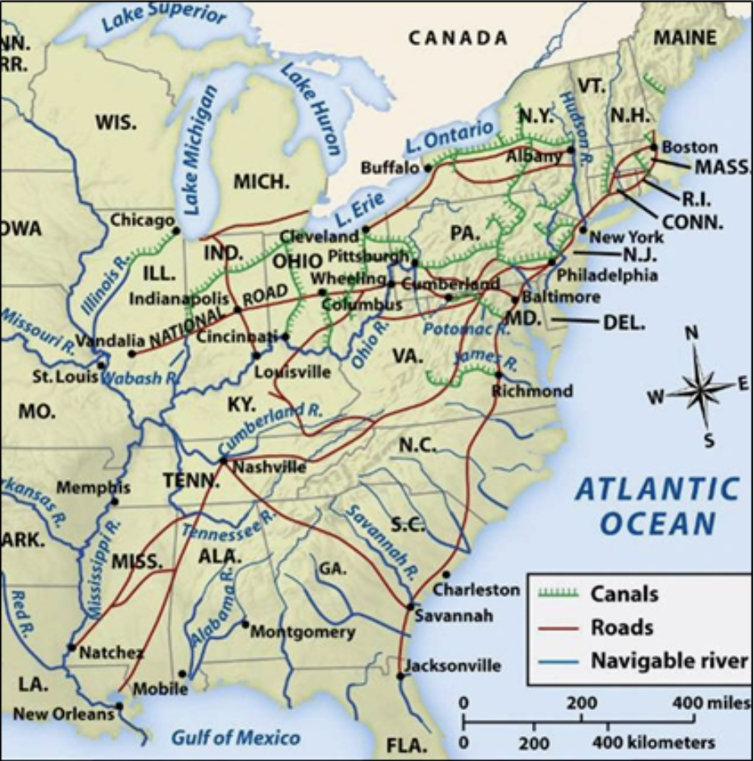

```{r setup, include=FALSE}
options(htmltools.dir.version = FALSE)
knitr::opts_chunk$set(echo=F,
                      message=F,
                      warning=F,
                      fig.retina=3,
                      fig.align="center")
library(tidyverse)
library(ggrepel)
library(mosaic)
set.seed(256)
update_geom_defaults("label", list(family = "Fira Sans Condensed"))
```

class: title-slide

# 2.5 — Better Protectionist Arguments

## ECON 324 • International Trade • Spring 2023

### Ryan Safner<br> Associate Professor of Economics <br> <a href="mailto:safner@hood.edu"><i class="fa fa-paper-plane fa-fw"></i>safner@hood.edu</a> <br> <a href="https://github.com/ryansafner/tradeS23"><i class="fa fa-github fa-fw"></i>ryansafner/tradeS23</a><br> <a href="https://tradeS23.classes.ryansafner.com"> <i class="fa fa-globe fa-fw"></i>tradeS23.classes.ryansafner.com</a><br>

---

class: inverse

# Outline

## [Torrens, Mill, and the Terms of Trade Argument](#3)

## [Hamilton, List, and Economic Nationalism](#25)

## [The Infant Industries Argument](#52)

## [Did The West Get Wealthy *Because of* Protection?](#62)
---

# Free Trade & Classical Economics

.pull-left[
.smallest[
- With the classical economists demolishing mercantilist policy, the ideology of the 19<sup>th</sup> century favored free trade

- However, free trade has rarely been good politics (we will see why soon)
  - Many tariffs & restrictions remained

- Mercantilism and protectionism have always been crude self-interest arguments at others’ expense

- Needed more sophisticated protectionist arguments to rebut economic theory
]
]
.pull-right[
.center[

]

]

---

# Free Trade & Classical Economics

.pull-left[
.smallest[
- A number of 19<sup>th</sup> and 20<sup>th</sup> century writers emerged challenging classical economics on trade

- Torrens/Mill and the “Terms of Trade” argument

- A nationalist-protectionist tradition:
  - Alexander Hamilton
  - Friedrich List

- .hi[Infant industries arguments] for *specific* protection
  - Political variant: national security argument
  - 20<sup>th</sup> century variant: increasing returns argument
  - New twist: protection against international disease?
]
]

.pull-right[
.center[

]

]

---

class: inverse, center, middle

# Torrens, Mill, and the Terms of Trade Argument

---

# Torrens-Mill and the Terms of Trade Argument

.left-column[
.center[


Col. Robert Torrens

1780—1864
]
]

.right-column[

.smallest[
- A Royal Marines officer, fought in Napoleonic Wars; became a member of Parliament and a colonial administrator
  - helped found South Australia as a colony
  - in favor of peaceful colonization as mutually beneficial, promote trade

- Classical economist, wrote with Ricardo, founding member of London’s Political Economy club
  - A fervent free-trader; argued for repeal of the Corn Laws
  - Came up with the term “territorial division of labor”
  - Arguably came up with principle of comparative advantage (3 years *before*, and *better than* Ricardo’s example)

- But later in 1840s, started having second thoughts?
]
]

---

# Torrens-Mill and the Terms of Trade Argument

.left-column[
.center[


Col. Robert Torrens

1780—1864
]
]

.right-column[

.smallest[
- 1844 book *The Budget, on Commercial and Colonial Policy*

- Two “heretical” arguments against unilateral free trade
  - convinced it created disadvantages for Britain

- Major cost of removing protectionism is the cost of transition from protection to free trade; requires a “cautious and skillful hand”

]
]

---

# Torrens-Mill and the Terms of Trade Argument

.left-column[
.center[


Col. Robert Torrens

1780—1864
]
]

.right-column[
.smallest[
1. The “terms of trade argument”
  - Reducing tariffs can harm a country’s terms of trade

2. In favor of the “principle of reciprocity” rather than unilateral free trade; what we now call .hi[strategic trade policy]
  - Goal: “to adopt, with all foreign powers, the principle of reciprocity”
  - Better to get countries to agree to reduce tariffs in unison
  - A single country reducing tariffs can hurt its terms of trade
  - thought that in the long run, this would lead to freer trade around the world
  - thought (correctly), that the British Empire had the influence to successfully engage in strategic trade policy
]
]

---

# Torrens-Mill and the Terms of Trade Argument

.left-column[
.center[


Col. Robert Torrens

1780—1864
]
]

.right-column[

> “[W]hen any particular country imposes import duties upon the productions of other countries, while those other countries continue to receive her products duty free, then such particular country draws to herself a larger proportion of the precious metals, maintains a higher range of general prices than her neighbours, and obtains, in exchange for the produce of a given quantity of her labour, the produce of a greater quantity of foreign labour.”

.source[Torrens, Robert, 1844, *The Budget, on Commercial and Colonial Policy*]
]

---

# Torrens-Mill and the Terms of Trade Argument

.left-column[
.center[


Col. Robert Torrens

1780—1864
]
]

.right-column[

.smallest[
- Example, suppose Britain and Cuba trade, and Cuba imposes tariffs against imports from Britain

> “[T]he ultimate incidence of the import duty imposed on British goods would be upon British producers. The wealth of England would be decreased by the amount of the duty—the wealth of Cuba would be increased by its amount.”

- Under a gold standard, gold would flow out of Britain into Cuba

- Torrens is more worried about the consequences of *this*, as he thinks it could lead to severe deflation, “national bankruptcy and revolution...the probable result.” 

> “A rise in the value of money [deflation] is one of the greatest evils which can occur”

]

.source[Torrens, Robert, 1844, *The Budget, on Commercial and Colonial Policy*]

]

---

# Torrens: Strategic Trade Policy & Reciprocity

.left-column[
.center[


Col. Robert Torrens

1780—1864
]
]

.right-column[

.smaller[
> “First,—to adopt, with respect to all foreign powers, the principle of reciprocity.—Second,—To lower the import duties upon the goods produced in countries receiving British goods upon terms equally favourable.—Third,—To impose high or prohibitive duties upon goods, the produce of countries imposing high or prohibitive duties upon British goods.—Fourth,—To admit, duty free, all raw materials employed in the process of reproduction.”

]

.source[Torrens, Robert, 1844, *The Budget, on Commercial and Colonial Policy*]

]

---

# Torrens: Strategic Trade Policy & Reciprocity

.left-column[
.center[


Col. Robert Torrens

1780—1864
]
]

.right-column[

> “[Reciprocity] would hold out to [foreign countries] a powerful inducement to act upon the principles of reciprocal freedom”

> “The sound principle of commercial policy is, to oppose foreign tariffs by retaliatory duties, and to lower our import duties in favour of those countries which may consent to trade with us on our terms of reciprocity”.

.source[Torrens, Robert, 1844, *The Budget, on Commercial and Colonial Policy*]

]

---

# Torrens: Strategic Trade Policy & Reciprocity

.left-column[
.center[


Col. Robert Torrens

1780—1864
]
]

.right-column[

> “If there be, in the science of commercial legislation, any one maxim to which it is imperative upon a statesman to conform, it is - AVOID SUDDEN CHANGE. Human industry, like the human constitution, adapts itself to the circumstances in which it has long been placed.”

]

---

# Torrens: A Cautious Free-Trader

.left-column[
.center[


Col. Robert Torrens

1780—1864
]
]

.right-column[
.smallest[
- Recognizes free trade benefits everyone, in general

> “Unrestricted interchange of commodities between different countries, would increase the wealth of the world.”

- But criticizes Parliament for letting Britain ruin its lead

> “[We have] deprived the country of the advantages which our manufacturing superiority would otherwise have secured [and this has] lowered the prices of British goods in foreign markets.”

]

.source[Torrens, Robert, 1844, *The Budget, on Commercial and Colonial Policy*]

]

---

# Response by the Classicals

.left-column[
.center[


Nassau Senior

1790-1864
]
]

.right-column[

> “Torrens assumes, first, that a country can exclude foreign commodities without diminishing the efficiency of its own labour...It is a great mistake to suppose that a country which rejects the territorial division of labour, suffers merely by the greater dearness of the commodities which it is forced to produce instead of importing them. It incurs a further, and in many instances greater, injury—in the general diminution of the efficiency of its own industry, occasioned by the misdirection of capital and the diminished division of labour.”

.source[Senior, Nassau, 1843, *Free Trade and Retaliation*]
]

---

# Response by the Classicals

.left-column[
.center[


Nassau Senior

1790-1864
]
]

.right-column[

> “We believe [Torrens’ claim that using tariffs can positively affect the terms of trade] to be true; but we believe it to be one of those barren truths from which no practical inferences can be drawn...In short, when he seriously urges us to act as if his hypothesis represented the actual state of things, we utterly dissent from, and repudiate his doctrine.”

.source[Senior, Nassau, 1843, *Free Trade and Retaliation*]
]

---

# John Stuart Mill’s Qualified Defense of Torrens

.left-column[
.center[


John Stuart Mill

1806-1873
]
]

.right-column[

.smallest[

- Mill shares concerns that foreign tariffs on imports from Britain are “the real source of alarm”
  - this harms British exports, and wages to British labor
  - encourages Parliament to spread free trade ideas to rest of the world (to lower tariffs)
  
> “[I question] whether any country, by its own legislative policy, can engross to itself a larger share of the benefits of foreign commerce than would fall to it in the natural or spontaneous course of trade.”

]

.source[Mill, John Stuart, 1844, “Of the Laws of Interchange between Nations and the Distribution of the Gains of Commerce among the Countries of the Commercial World” in *Essays on Some Unsettled Questions of Political Economy*]
]

---

# John Stuart Mill’s Qualified Defense of Torrens

.pull-left[
.smallest[
- Mill reasons that it is possible, but it depends on the elasticity of foreign supply for our imports
  - without using those words, as “price elasticity” has not been “discovered” yet

- Perfectly elastic foreign demand $\implies$ no terms of trade effect

- Non-perfectly elastic foreign demand $\implies$ a terms of trade effect

- Recall our discussion of a large vs. a small country putting a tariff on imports!
]
]

.pull-right[
.center[


]
]

---

# John Stuart Mill’s Qualified Defense of Torrens

.left-column[
.center[


John Stuart Mill

1806-1873
]
]

.right-column[

.smallest[

> “[T]he determining circumstances are of a nature so perfectly ascertainable, that it must be almost impossible to decide with any certainty, evan after the tax has been imposed, whether we have been gainers by it or losers...even on the most selfish principles, therefore, the benefits of such a tax is always extermely precarious...A protecting duty can never be a cause of gain, but always and necessarily of loss, to the country imposing it.”

]

.source[Mill, John Stuart, 1844, “Of the Laws of Interchange between Nations and the Distribution of the Gains of Commerce among the Countries of the Commercial World” in *Essays on Some Unsettled Questions of Political Economy*]
]

---

# John Stuart Mill’s Qualified Defense of Torrens

.left-column[
.center[


John Stuart Mill

1806-1873
]
]

.right-column[

.smaller[

> “[C]onsiderations of reciprocity...are of material importance when the repeal of duties...is discussed. A country cannot be expected to renounce the power of taxing foreigners, unless foreigners will in return practise towards itself the same forbearance. The only mode in which a country can save itself from being a loser by the duties imposed by other countries on its commodities, is to impose corresponding duties on theirs.”

]

.source[Mill, John Stuart, 1844, “Of the Laws of Interchange between Nations and the Distribution of the Gains of Commerce among the Countries of the Commercial World” in *Essays on Some Unsettled Questions of Political Economy*]
]

---

# John Stuart Mill’s Qualified Defense of Torrens

.left-column[
.center[


John Stuart Mill

1806-1873
]
]

.right-column[

.smallest[

> “It is evidently the common interest of all nations that each of them should abstain from every measure by which the aggregate wealth of the commercial world would be diminished, although of this smaller sum total [a country] might thereby be enabled to attract to itself a larger share.”

> “As is not unusual with [Torrens, he] to us to overstate the immediate cicumstances of the country”
]

.source[Mill, John Stuart, 1844, “Of the Laws of Interchange between Nations and the Distribution of the Gains of Commerce among the Countries of the Commercial World” in *Essays on Some Unsettled Questions of Political Economy*]
]

---


# The Torrens-Mill Theory

.pull-left[

- Developed two theories:

1. Under certain circumstances, lowering a (pre-existing) tariff can deteriorate a country’s terms of trade
2. A country lowering a tariff may suffer a net loss

- The first is clear, the second is speculative
  - would lowering a tariff lower TOT more than the gains from greater trade??
]

.pull-right[
.center[

]
]

---

# The Torrens-Mill Theory

.left-column[
.center[


.smallest[
Francis Ysidro Edgeworth

1845—1926
]
]
]


.right-column[

> “Mill obscures the subject by taking the measure of the gain of trade the alteration in the rate of exchange between exports and imports rather than the truer measure of advantage which the principles of consumers’ and producers’ rent [surplus!] afford”

.source[Edgeworth, Francis Y, 1894, “The Theory of International Values,” *Economic Journal* 4: 424-443]
]

---

# The Torrens-Mill Theory


.left-column[
.center[


.smallest[
Francis Ysidro Edgeworth

1845—1926
]
]
]

.right-column[
.center[

]
]

---

class: inverse, center, middle

# Hamilton, List, and Economic Nationalism

---

# Alexander Hamilton

.left-column[
.center[


.smallest[
Alexander Hamilton

1755—1804
]
]
]

.right-column[

- 1790 *Report on Manufactures* as (1<sup>st</sup>) U.S. Treasury Secretary
  - opens by arguing against Adam Smith
  - asserts that the U.S. must become a nation of manufacturing
  - U.S. must place protective tariffs on imported manufactures to stimulate domestic manufacturing — .hi-purple[import substitution]

]

---

# Alexander Hamilton

.left-column[
.center[


.smallest[
Alexander Hamilton

1755—1804
]
]
]

.right-column[

- 1790 *Report on Public Credit*
  - U.S. should assume all State debts from American Revolution as National debt
  - U.S. should adopt a National Bank
  - Tariffs on imported goods and alcohol to fund the government

]

---
# Alexander Hamilton

.left-column[
.center[


.smallest[
Alexander Hamilton

1755—1804
]
]
]

.right-column[
.smallest[
> “[New American industries are prevented by] the strong influence of habit and the spirit of imitation — the fear of want of success in untried enterprises — the intrinsic difficulties incident to first essays toward a competition with those who have previously attained to perfection in the business to be attempted — the bounties, permiums, and other artificial encouragements, with which foreign nations second the exertions of their own citizens in the branches, in which they are to be rivaled...[Overcoming these obstacles] may therefore require the incitement and patronage of government.”

]

.source[Hamilton, Alexander, 1790, *Report on Manufactures*]

]

---

# Thomas Jefferson

.left-column[
.center[


.smallest[
Thomas Jefferson

1743—1826
]
]
]

.right-column[

- Classical liberal, Smithean free trader

- Skeptical of large State power or activist interventions

- Envisioned U.S. as an agricultural, self-governing society

]

---

# Hamiltonian America

.left-column[
.center[


.smallest[
The Tariff of 1789
]
]
]

.right-column[

- In the end, America became Hamiltonian

- First Act of Congress was the Tariff of 1789:

> “Whereas it is necessary for that support of government, for the discharge of the debts of the United States, and the encouragement and protection of manufactures, that duties be laid on goods, wares and merchandise”

]

---

# Hamilton vs. Jefferson

.center[

<iframe width="980" height="550" src="https://www.youtube.com/embed/notJuFGXQ9w" frameborder="0" allow="accelerometer; autoplay; clipboard-write; encrypted-media; gyroscope; picture-in-picture" allowfullscreen></iframe>

Jefferson (Stephen Dillane) and Hamilton (Rufus Sewell) in HBO’s *John Adams*
]

---

# Hamilton vs. Jefferson

.center[

<iframe width="980" height="550" src="https://www.youtube.com/embed/dEUBn4VJNr8" frameborder="0" allow="accelerometer; autoplay; clipboard-write; encrypted-media; gyroscope; picture-in-picture" allowfullscreen></iframe>

Jefferson (Daveed Diggs, left) and Hamilton (Lin-Manuel Miranda, right) from *Hamilton*, "Cabinet Battle #1"
]

---

# Hamilton vs. Jefferson

.center[

<iframe width="980" height="550" src="https://www.youtube.com/embed/j-W0a6PewDM" frameborder="0" allow="accelerometer; autoplay; clipboard-write; encrypted-media; gyroscope; picture-in-picture" allowfullscreen></iframe>

“The Room Where it Happens”
]

---

# “The American System”

.left-column[
.center[


.smallest[
Henry Clay

1777—1852
]
]
]
.right-column[

- .hi[“The American System”] of political economy
  1. High tariff to protect New England manufacturing from European imports
  2. National bank
  3. Federal subsidies for “internal improvements” to settle the West
    - canals, roads, railroads
  
- Strong opposition to British lassiez-faire political economy
]

---

# “The American System”

.center[

]

---

# “The American System”

.center[

]

---

# “The American System”

.center[

]

---

# Friedrich List

.left-column[
.center[


.smallest[
Friedrich List

1789—1846
]
]
]

.right-column[
- Born in Germany, got in trouble and fled to the United States

- Impressed by the American system protecting infant industries in America

- Became perhaps the most famous protectionist

- 1841 *The National System of Political Economy*
  - Became the Bible of protectionists, as the *Wealth of Nations* was to free traders

]

---

# Friedrich List

.left-column[
.center[


.smallest[
The German Confederation
]
]
]

.right-column[
- Later returned to Germany

- A liberal and a nationalist (the two were related, in Central Europe at the time)
  - Nationalist & liberal [Revolutions of 1848](https://en.wikipedia.org/wiki/Revolutions_of_1848) against oppressive monarchy & empire

- The “German Confederation” was a series of about 30 states, would not become a unified country “Germany” until 1871

- List helped push for the 1834 Zollverein, the German Customs Union
  - created an economic union, lowered tariffs between German states
  - saw this as a unifying pan-German institution (in the pro-Prussia, anti-Austria style)

]

---

# Friedrich List

.left-column[
.center[


.smallest[
Friedrich List

1789—1846
]
]
]

.right-column[
.smallest[
- Criticized Adam Smith for being too cosmopolitan, putting the interests of the *world* first, not the interests of the *nation*
  - Though Smith *did* argue free trade would benefit *Britain* (as well as the world)

- Rejected Classical economic theory, focused more on historical study
  - a predecessor to the [German Historical school](https://en.wikipedia.org/wiki/Historical_school_of_economics) of economics
  
- List was concerned with .hi-turquoise[national economic power], not just the increase of wealth and prosperity

> “The power of producing wealth is...infinitely more important than wealth itself!”

.source[List, Friedrich, 1841, *The National System of Political Economy*]

]
]

---

# Friedrich List: Importance of *National* Orientation

.left-column[
.center[


.smallest[
Friedrich List

1789—1846
]
]
]

.right-column[

> “[A] nation would act unwisely to endeavour to promote the welfare of the whole human race at the expense of its particular strength, welfare, and independence. It is a dictate of the law of self-preservation to make its particular advancement in power and strength the first principles of its policy”

.source[List, Friedrich, 1841, *The National System of Political Economy*]

]

---

# Friedrich List: On Production

.left-column[
.center[


.smallest[
Friedrich List

1789—1846
]
]
]

.right-column[
.smallest[
- Thinks Classicals focused too much on consumption, government should focus on *production*
  - “[P]roduction renders consumption possible.”
  
- Largely endorsed mercantilist policies, privileging manufacturing

> “It may be stated as a principle that a nation is richer and more powerful, in proportion as it exports more manufactured products, imports more raw materials, and consumes more tropical commodities.”

.source[List, Friedrich, 1841, *The National System of Political Economy*]

]
]

---

# Friedrich List: On Protecting Manufacturing

.left-column[
.center[


.smallest[
Friedrich List

1789—1846
]
]
]

.right-column[
.smallest[

- Urged protectionist measures for manufacturing

> “The fact that manufacturing industry transforms into productive capital, wealth, and national powers, explains mainly why protection exerts so powerful an influence on national wealth.”

- Viewed the short run costs of protection more than worth it in the long run

.source[List, Friedrich, 1841, *The National System of Political Economy*]

]
]

---

# Friedrich List: Regulations Must be *Targeted*

.left-column[
.center[


.smallest[
Friedrich List

1789—1846
]
]
]

.right-column[
.smallest[

> “It is bad policy to regulate everything and to promote everything by employing social powers, where things may better regulate themselves and can be better promoted by private exertions; but it is no less bad policy to let those things alone which can only be promoted by interfering social power.”

]
.source[List, Friedrich, 1841, *The National System of Political Economy*]

]

---

# Friedrich List: On Protecting Manufacturing

.left-column[
.center[


.smallest[
Friedrich List

1789—1846
]
]
]

.right-column[
.smallest[

> “The nation must sacrific and give up a measure of material property in order to gain culture, skill, and powers of united production; it must sacrifice some present advantages in order to insure to itself future ones. It is true that protective duties at first increase the price of manufactured goods; but it is just as true...that in the course of time, the nation being enabled to build up a completely developed manufacturing power of its own, those goods are produced more cheaply at home than the price at which they can be imported from foreign parts. If therefore, a sacrifice of *value* is caused by protective duties, it is made good by the gain of a *power of production*, which not only secures to the nation an infinitely greater amount of material goods, but also industrial independence in case of war.”

]
.source[List, Friedrich, 1841, *The National System of Political Economy*]

]

---

# Friedrich List: On Protecting Manufacturing

.left-column[
.center[


.smallest[
Friedrich List

1789—1846
]
]
]

.right-column[
.smallest[

- This only works for specific circumstances:

> “The system of protection can be justified solely and only for the purpose of the *industrial development* of the nation...Measures of protection are justifiable only for the purpose of furthering and protecting the internal manufacturing power, and only in the case of nations which through an extensive and compact territory, large population, possession of natural resources, far advanced agriculture, a high degree of civilization and political development, are qualified to maintain an equal rank with the principal agricultural manufacturing commercial nations.”

]
.source[List, Friedrich, 1841, *The National System of Political Economy*]

]

---

# Friedrich List: On Protecting Manufacturing

.left-column[
.center[


.smallest[
Friedrich List

1789—1846
]
]
]

.right-column[
.smallest[

- List is *always* in favor of free trade in everything *except* manufactured goods

- Only thinks that large, powerful, temperate, advanced countries can extend their development by protecting manufacturing and industrializing

- Largely from his study of Britain and the United States as leading examples

- Sees the progress of great nations as a sequence from free trade to protectionism (for manufacturing), and then back to free trade

]
]

---

# Friedrich List: On Protecting Manufacturing

.left-column[
.center[


.smallest[
Friedrich List

1789—1846
]
]
]

.right-column[
.smallest[

> “History teaches us how nations which have been endowed by Nature with all resources which are requisite for the attainment of the highest grade of wealth and power, may and must...modify their [commercial] systems according to the measure of their own progress: in the first stage, adopting free trade with more advanced nations as a means of raising themselves from a state of barbarism, and of making advances in agriculture; in the second stage, promoting the growth of manufactures, fisheries, navigation, and foreign trade by means of commercial restrictions; and in the last stage, after reaching the highest degree of wealth and power, by gradually reverting to the principle of free trade and of unrestricted competition in the home as well as in foreign markets.”

]
.source[List, Friedrich, 1841, *The National System of Political Economy*]

]

---

# Friedrich List: On Protecting Manufacturing

.left-column[
.center[


.smallest[
Friedrich List

1789—1846
]
]
]

.right-column[
.smallest[

- But how do we know when we’re “ready” to stand on our own two feet and remove protection?
  - “[It is] ridiculous to allow a nation merely a *few years* for the task of bringing to perfection one great branch of national industry [under protection]”
]
.source[List, Friedrich, 1841, *The National System of Political Economy*]

]

---

# Following English *Practice*, Not Classical *Theory*

.left-column[
.center[


.smallest[
Friedrich List

1789—1846
]
]
]

.right-column[
.smallest[
- Classicals can *preach* all they want about Free Trade in the *abstract*, but *actual* British policy was still largely protectionist

- This protection is what made England wealthy

]

.quitesmall[
> “Had the English left everything to itself—'Laissez faire, laissez aller', as the popular economical school recommends—the [German] merchants of the Steelyard would be still carrying on their trade in London, the Belgians would be still manufacturing cloth for the English, England would have still continued to be the sheep-farm of the Hansards, just as Portugal became the vineyard of England, and has remained so till our days, owing to the stratagem of a cunning diplomatist. Indeed, it is more than probable that without her [highly protectionist] commercial policy England would never have attained to such a large measure of municipal and individual freedom as she now possesses, for such freedom is the daughter of industry and wealth.”

]
]
---

# Friedrich List: Free Trade is the Eventual Goal

.left-column[
.center[


.smallest[
Friedrich List

1789—1846
]
]
]

.right-column[
.smallest[

> “The system of protection, inasmuch as it forms the only means of placing those nations which are far behind [dominant England]...the system of protection regarded from this point of view appears to be the most efficient means of furthering the final union of nations, and hence also of promoting true freedom of trade...In order to allow freedom of trade to operate naturally, the less advanced nations must first be raised by artificial means to that stage of cultivation to which the English nation has been artifically elevated.”

]
.source[List, Friedrich, 1841, *The National System of Political Economy*]

]

---

class: inverse, center, middle

# The Infant Industries Argument

---

# The Infant Industries Argument

.pull-left[

.smallest[
- List is only perhaps the most popular historical figure making what economists call the .hi[“infant industries argument”]

- Promote .hi-purple[import substitution]: specific key industries should receive special protection (via tariffs, quotas, subsidies etc.) that discourage competition (from more efficient foreign imports)

- Eventually, once the industry matures (is no longer in the “infant” stage), it can stand on its own and compete with the rest of the world, protection can be lifted
]
]
.pull-right[
.center[

]

]

---

# The Infant Industries Argument

.pull-left[
.smallest[
- Economists have long been skeptical of this easily-abused argument

- How do we correctly identify these industries?
  - manufacturing, increasing returns industries
  - distorted by special interest politics, corruption

- How do we know *when* to *remove* protection?

- Once established, is it even *politically* feasible to remove protection once there are special interest groups entrenched?
]
]
.pull-right[
.center[

]
]

---

# Mill on the Infant Industries Argument

.left-column[
.center[


John Stuart Mill

1806-1873
]
]

.right-column[

- A single paragraph in Mill’s famous 1848 *Principles of Political Economy* textbook caused enormous controversy for decades

- Seemingly endorses the infant industry argument

]

---

# Mill on the Infant Industries Argument

.left-column[
.center[


John Stuart Mill

1806-1873
]
]

.right-column[

.quitesmall[
> “The only case in which, on mere principles of political economy, protecting duties can be defensible, is when they are imposed temporarily (especially in a young and rising nation) in hopes of naturalizing a foreign industry, in itself perfectly suitable to the circumstances of the country. The superiority of one country over another in a branch of production often arises only from having begun it sooner. There may be no inherent advantage on one part, or disadvantage on the other, but only a present superiority of acquired skill and experience...But it cannot be expected that individuals should, at their own risk, or rather to their certain loss, introduce a new manufacture, and bear the burthen of carrying it on until the producers have been educated up to the level of those with whom the processes are traditional. A protecting duty, continued for a reasonable time, will sometimes be the least inconvenient mode in which the nation can tax itself for the support of such an experiment. But the protection should be confined to cases in which there is good ground of assurance that the industry which it fosters will after a time be able to dispense with it; nor should the domestic producers ever be allowed to expect that it will be continued to them beyond the time necessary for a fair trial of what they are accomplishing.”

]
.source[Mill, John Stuart, 1848, *Principles of Political Economy*]
]

---

# Mill on the Infant Industries Argument

.left-column[
.center[


John Stuart Mill

1806-1873
]
]

.right-column[

- Caused quite a scandal, other economists denounced Mill’s one paragraph

- Mill became horrified when he saw how protectionists were distorting this paragraph to justify all kinds of high tariffs in the U.S., Canada, Australia in 1860s

- Mill: “[This is] an organized system of pillage of the many by the few”

- Mill maintained that the infant industry argument was still valid *in theory*

]

---

# Mill on the Infant Industries Argument

.left-column[
.center[


John Stuart Mill

1806-1873
]
]

.right-column[
> “But I confess that I almost despair of this general understanding [of the limits of the argument] being ever practically established. I find that in Australia, protection is not advocated in this form or for this purpose, but that the vulgarest and most exploded fallacies are revived in its support.”

.source[Mill, John Stuart, 1848, *Principles of Political Economy*]
]

---

# Mill on the Infant Industries Argument

.left-column[
.center[


John Stuart Mill

1806-1873
]
]

.right-column[

- Later moderated his position, thinking the best policy is not in fact a tariff, but a production subsidy (not an *export* subsidy)

.smallest[
> “Though I still think that the introduction of a foreign industry is often worth a sacrifice, and that a temporary protecting duty, if it were to remain temporary, would probably be the best shape in which that sacrific can be  made, I am inclined to believe that it is safer to make it by an annual grant from the public treasury, which is not nearly so likely to be continued indefinitely, to prop up an industry which has not so thriven as to be able to dispense with it.”

]

.source[Mill, John Stuart, 1848, *Principles of Political Economy*]
]
---

# Bastable on the Infant Industries Argument

.left-column[
.center[


Charles F. Bastable

1855-1945
]
]

.right-column[
.smallest[
> “[The infant industry argument] is the most plausible case which can be made for protection.”

- But it can not be successful merely if government protects an industry, then lets it stand on its own, and it succeeds

- A more precise requirement than Mill:

> “Will the certain and immediate loss, resulting from protection, be outweighed by the future gains from the new industry?”

- Bastable thought practically that this was very unlikely, and this 

> “strongly impress us with the belief that this special case is in reality no exception to the rule of freedom in international trade”

]

.source[Mill, John Stuart, 1848, *Principles of Political Economy*]
]

---

# The Infant Industry Argument, Summing Up

.pull-left[
.smallest[
- .hi[Infant industry argument]: target protection on a specific industry (via tariffs) to promote .hi-purple[import-substitition], once the industry has matured, remove protection

- An accepted *theoretical* exception to free trade, on cost-benefit grounds

- Practically hard to identify and politically hard to do successfully

- .hi[Mill test]: would the industry survive after protection is removed?

- .hi[Bastable test]: will the long run benefits exceed the short run costs?
]
]
.pull-right[
.center[

]
]

---

class: inverse, center, middle

# Did The West Get Wealthy *Because of* Protection?

---

# Did The West Get Wealthy *Because of* Protection?

.pull-left[
.smallest[
- It turns out that during most of the formative periods of U.K. and U.S. history, both countries still had pretty high tariffs, despite proclaiming “free trade”

- Causality is difficult to tease out, but this is the period where these countries became the wealthiest in the world

- This has caused (and still causes) some to argue that protectionism *causes* growth, and that we *should* adopt protectionism to grow.

- .hi-purple[Did these countries get wealthy *from* protectionism? Or wealthy *despite* protectionism?]
]
]
.pull-right[
.center[


.smallest[
U.S. Tariff History
]
]
]

---

# Did The West Get Wealthy *Because of* Protection?

.pull-left[

- Doug Irwin’s paper, “Interpreting the Tariff–Growth Correlationof the Late 19th Century”

- Positive correlation between countries’ economic growth (1870-1913) and their average tariff rate (in 1870)

.source[Irwin, Douglas A, 2002, “Interpreting the Tariff–Growth Correlationof the Late 19th Century,” *AEA Papers and Proceedings* 165-169]
]
.pull-right[
.center[

]
]

---

# Did The West Get Wealthy *Because of* Protection?

.pull-left[
.smaller[
- Most of the countries with high tariffs (Argentina, Canada, United States, Australia) grow from agricultural & commodity exports (beef, wheat, timber, etc)

- Import tariffs are mostly about .hi-purple[import substitution], hoping to stimulate an infant industry that would otherwise compete with imports (like *manufacturing*)

- Implies these countries *did not grow* because of import substitution!
]

.source[Irwin, Douglas A, 2002, “Interpreting the Tariff–Growth Correlationof the Late 19th Century,” *AEA Papers and Proceedings* 165-169]
]
.pull-right[
.center[

]
]

---


# Did The West Get Wealthy *Because of* Protection?

.pull-left[

.smallest[
> “[S]everal individual country experiences in the late 19th century are not consistent with the view that import substitution promoted growth. For example, the two most rapidly expanding, high-tariff countries of the period  (Argentina and Canada) grew because capital imports helped stimulate export-led growth in agricultural-staples products, not because of protectionist trade policies,” (p.165).

]

.source[Irwin, Douglas A, 2002, “Interpreting the Tariff–Growth Correlationof the Late 19th Century,” *AEA Papers and Proceedings* 165-169]
]
.pull-right[
.center[

]
]

---

# Did The West Get Wealthy *Because of* Protection?

.pull-left[

- Positive relationship between land/labor ratio and tariff rates:
  - land-abundant, labor-scarce nations using tariffs for government revenue

- Tariffs (on imports) often were used as a primary source of government revenue
  - before income tax (on labor) existed

.source[Irwin, Douglas A, 2002, “Interpreting the Tariff–Growth Correlationof the Late 19th Century,” *AEA Papers and Proceedings* 165-169]
]
.pull-right[
.center[

]
]

---

# Did The West Get Wealthy *Because of* Protection?

.pull-left[

.smallest[

> “[M]ost land-abundant countries (such as Argentina and Canada) imposed high tariffs to raise government revenue, and  revenue tariffs have a different structure than protective tariffs. The fact that labor-scarce, land-abundant countries  had a high potential for growth and also tended to impose high revenue-generating tariffs confounds the inference that high tariffs were responsible for their strong economic per-formance during this period,” (p.165).

]

.source[Irwin, Douglas A, 2002, “Interpreting the Tariff–Growth Correlationof the Late 19th Century,” *AEA Papers and Proceedings* 165-169]
]

.pull-right[
.center[

]
]