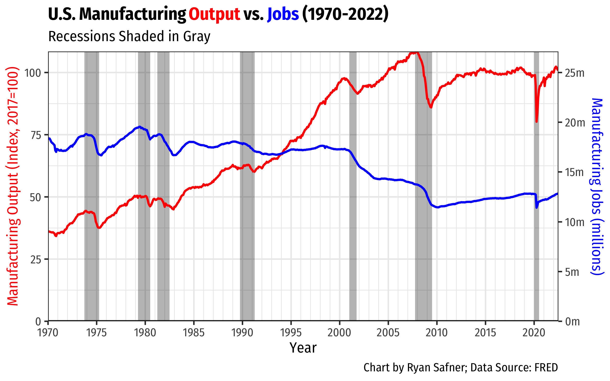

```{r setup, include=FALSE}
options(htmltools.dir.version = FALSE)
knitr::opts_chunk$set(echo=F,
                      message=F,
                      warning=F,
                      fig.retina=3,
                      fig.align="center")
library(tidyverse)
library(ggrepel)
library(mosaic)
set.seed(256)
update_geom_defaults("label", list(family = "Fira Sans Condensed"))
```

class: title-slide

# 3.2 — Globalization & Its Discontents

## ECON 324 • International Trade • Spring 2023

### Ryan Safner<br> Associate Professor of Economics <br> <a href="mailto:safner@hood.edu"><i class="fa fa-paper-plane fa-fw"></i>safner@hood.edu</a> <br> <a href="https://github.com/ryansafner/tradeS23"><i class="fa fa-github fa-fw"></i>ryansafner/tradeS23</a><br> <a href="https://tradeS23.classes.ryansafner.com"> <i class="fa fa-globe fa-fw"></i>tradeS23.classes.ryansafner.com</a><br>

---

class: inverse

# Outline

## [The Benefits and Costs of Globalization, In Essence](#3)

## [The Politics of “Neoliberalism”](#17)

## [Gripes With Neoliberalism](#35)

## [Some Optimism](#61)

---
class: inverse, center, middle

# The Benefits and Costs of Globalization, In Essence

---

# The Effects of the Division of Labor

.center[

]

---

# The Effects of the Division of Labor

.pull-left[

| Year | U.S. Population | % working on farms |
|------|----------------:|-------------------:|
| 1790 | 4,000,000       | 90% |
| 1900 | 76,000,000      | 40% |
| 2015 | 326,000,000     | <1% |

.source[Source: [U.S. Department of Agriculture Economic Research Service](https://www.ers.usda.gov/topics/farm-economy/farm-labor/)]
]

.pull-right[
.center[

]
]

---

# Creative Destruction I

.left-column[
.center[


Joseph Schumpeter

1883-1950
]
]

.right-column[

> "Industrial mutation--if I may use that biological term—that .hi[incessantly revolutionizes the economic structure from within], incessantly destroying the old one, incessantly creating a new one.  This .hi[process of Creative Destruction is the essential fact about capitalism].  It is what capitalism consists in and what every capitalist concern has got to live in" (p.83).

]

.source[Schumpeter, Joseph A, (1947), *Capitalism, Socialism, and Democracy*]

---

# Creative Destruction: Examples

.pull-left[
.center[

]
]
.pull-right[
.center[

]
]

---

# Creative Destruction: Example II

.center[

]

---

# Creative Destruction: Example III

.center[


59 years of progress
]

---

# Creative Destruction: Would You Want to Stop This?

<iframe width="980" height="550" src="https://www.youtube.com/embed/IVs0Yr3GbRk" frameborder="0" allow="accelerometer; autoplay; clipboard-write; encrypted-media; gyroscope; picture-in-picture" allowfullscreen></iframe>

---

# But Successful *Economies* Create a *Political* Problem

.pull-left[

- .hi[Markets serve consumers] (.hi-purple[consumer sovereignty]), *not* workers or producers!

- Successful market economies .hi-purple[produce wealth] and .hi-purple[destroy jobs]

- Economic growth $\equiv$ more output with fewer inputs!

- A .hi[political problem]: how do producers permit the *destructive* side of creative destruction?

]

.pull-right[

.center[


]
]

---

# But Successful *Economies* Create a *Political* Problem

.pull-left[

- .hi[Moral dilemmas]:
  - Do we have a moral obligation to insulate workers from the pain of competition that is no fault of their own?
  - How do we secure the gains from trade and innovation without punishing the workers who lose their jobs?

]

.pull-right[

.center[


]
]

---

# Recall The Specific Factors Model

.center[


.source[Source: Feenstra & Taylor (2017)]
]

---

# Recall The Specific Factors Model

.center[


.source[Source: Feenstra & Taylor (2017)]
]

---

# Recall The Specific Factors Model

.center[


.source[Source: Feenstra & Taylor (2017)]
]

---

# Recall The Specific Factors Model

.pull-left[
.smallest[
- Again, .hi-purple[changes in trade fall mainly upon the fixed/specific factors of production]
  - Increase in relative prices (exports) benefit fixed factor producing exports
  - Decrease in relative prices (imports) harm fixed factor competing with imports

- .hi-purple[Mobile factors face ambiguous change]
  - Can move from low-income industries to high-income industries

- .hi[Policy implication]: if governments wish to protect domestic groups from adverse trade shocks, increase mobility and non-specific skills/uses
  - make labor, capital, land markets *more flexible* to reduce shocks from trade on domestic workers, capital-, & land-owners

]
]
.pull-right[
.center[

]

]

---

class: inverse, center, middle

# The Politics of “Neoliberalism”

---

# The Politics of “Neoliberalism”

.pull-left[
.quitesmall[
- We’ve really focused on the world of .hi[“neoliberalism”], the system of international trade institutions and underlying philosophy
  - To many on the political left, “neoliberalism” is a dirty word
  - I use “neoliberalism” here as descriptive of the institutions and framework, not normative or moral

- Rightly or wrongly, people associate “neoliberalism” with:
  - institutions: trade agreements, the WTO, the U.N., development policy
  - attitudes: free markets, cosmpolitanism, multilateralism, centrism, technocracy
  - politics/ideology: Ronald Regan, Margaret Thatcher, New Labor (Tony Blair, David Cameron), Milton Friedman
]
]

.pull-right[
.center[

]
]

---

# The Politics of “Neoliberalism”

.pull-left[
- “Neoliberalism” is a boogeyman, very very hard to define
  - a term primarily used by its enemies
- Very few people have ever called themselves “neoliberals”

]

.pull-right[
.center[

]
]

---

# The Politics of “Neoliberalism”

.pull-left[
- “Neoliberalism” is a boogeyman, very very hard to define
  - a term primarily used by its enemies
- Very few people have ever called themselves “neoliberals”

]

.pull-right[
.center[

]
]

---

# The Politics of “Neoliberalism”

.pull-left[
- “Neoliberalism” is a boogeyman, very very hard to define
  - a term primarily used by its enemies
- Very few people have ever called themselves “neoliberals”

- Though some have recently tried to “take it back” 👉
]

.pull-right[
.center[


]
]

---


# The Politics of “Neoliberalism”

.pull-left[
- “Neoliberalism” is a boogeyman, very very hard to define
  - a term primarily used by its enemies
- Very few people have ever called themselves “neoliberals”

- Though some have recently tried to “take it back” 👉
]

.pull-right[
.center[


]
]

---

# Increasing Polarization: Two Tribes

- The culture war between two **tribes** (each are both normative and descriptive)

1. .hi[“Global*ism*”]: urban, cosmopolitan, citizen of the world, tolerant of other cultures/religions/minorities, often elite professional

2. .hi[Populism/Nationalism]: rural, parochial, attached to local/national culture and identity, anxiety over economic obsolescence, anxiety over cultural/social change
  - Left-populism: critique of international capital exploiting working class
  - Right-populism: critique of globalist elite/foreigners exploiting “the little guy”/natives
  
- This does not *neatly* map to the divide between politically liberal/progressive and conservative
  - But it increasingly has been

---

# Fair Warning

- The average economist is both in favor of globalization and sympathizes with globalism
  - A lot of people think economists are more conservative than the public, but the average economist is a moderate Democrat 
- A lot of straw man arguments

- This conversation will not be easy, but is one our nation must have

---

# Increasing Tribalism

.center[

]

---

# Increasing Tribalism

.center[

]

---

# Polarizing Around Issues

.pull-left[
.center[

]
]

.pull-right[
.smallest[
- Decades ago, many internal divisions within both the Republicans and Democratic parties on issues
  - conservative Democrats
  - liberal Republicans

- Today, issues have clear Democrat-side vs. Republican-side

- Politics becomes more ideological, meaning less compromise or deal-making

- Results: less governing gets done, more gridlock
]
]


---

# Polarizing Around Issues

.center[


Source: [Pew Research Center (2014)](https://www.people-press.org/2014/06/12/political-polarization-in-the-american-public/)
]

---

# Polarizing Around Issues

.center[


Source: [Pew Research Center (2014)](https://www.people-press.org/2014/06/12/political-polarization-in-the-american-public/)
]

---

# Polarizing Around Issues

.center[


Source: [Pew Research Center (2014)](https://www.people-press.org/2014/06/12/political-polarization-in-the-american-public/)
]

---

# Polarizing Around Issues

.center[


Source: [Facing History and Ourselves (2014)](https://www.facinghistory.org/educator-resources/current-events/explainer/political-polarization-united-states)
]

---

# Polarizing Around Issues

.center[
<iframe width="980" height="550" src="https://www.youtube.com/embed/tEczkhfLwqM" frameborder="0" allow="accelerometer; autoplay; encrypted-media; gyroscope; picture-in-picture" allowfullscreen></iframe>
]

---

# Why Twitter is so Toxic

.center[

]

.source[Brady, William J, Julian A Wills, et al., 2017, ["Emotion Shapes the Diffusion of Moralized Content in Social Networks"]((https://www.pnas.org/content/pnas/114/28/7313.full.pdf) *PNAS* 114(28): 7313--7318]

---

# Why Twitter is so Toxic

.center[

]

.source[Brady, William J, Julian A Wills, et al., 2017, ["Emotion Shapes the Diffusion of Moralized Content in Social Networks"]((https://www.pnas.org/content/pnas/114/28/7313.full.pdf) *PNAS* 114(28): 7313--7318]

---

# Why Twitter is so Toxic

.center[

]

.source[Brady, William J, Julian A Wills, et al., 2017, ["Emotion Shapes the Diffusion of Moralized Content in Social Networks"]((https://www.pnas.org/content/pnas/114/28/7313.full.pdf) *PNAS* 114(28): 7313--7318]

---

# The Decline of Trust in Government

.center[

]

.source[Source: [Pew Research Center (2015)](https://www.people-press.org/2015/11/23/1-trust-in-government-1958-2015/)
]

---

class: inverse, center, middle

# Gripes with Neoliberalism

---

# What Neoliberalism Hath Wrought

.pull-left[

- Opposition to the global, neoliberal system has historically been a position on the extreme political left
]

.pull-right[
.center[


]
]

---

# What Neoliberalism Hath Wrought

.pull-left[

- Opposition to the global, neoliberal system has historically been a position on the extreme political left

- Now it is also a position of the extreme political right
]

.pull-right[
.center[


]
]

---

# Gripes with Neoliberalism

.pull-left[
- Greater economic instability of globalization

- Rapid social and demographic change

- Social, political, and economic inequality (often within wealthy countries)

]

.pull-right[
.center[

]
]

---

# Gripes with Neoliberalism

.pull-left[

- From the political left:
  - mistrust of multinational corporations
  - wealthy, anti-democratic elite
  - national & international inequality
  - capital exploiting labor
  - environmental issues
]

.pull-right[
.center[

]
]

---

# Gripes with Neoliberalism

.pull-left[

- From the political right:
  - mistrust of immigrants
  - mistrust of international elite
  - mistrust of moral busybodies
  - anti-cosmopolitanism
  - nationalism
]

.pull-right[
.center[

]
]

---

# Legitimate Problems with Neoliberalism

.center[


[Milanovic, Branko, 2013, 13](http://documents.worldbank.org/curated/en/959251468176687085/pdf/wps6259.pdf)
]

---

# Legitimate Problems with Neoliberalism

.center[


[Milanovic, Branko, 2013, 13](http://documents.worldbank.org/curated/en/959251468176687085/pdf/wps6259.pdf)
]

---

# Legitimate Problems with Neoliberalism

.center[


Source: [Our World In Data: Inequality](http://ourworldindata.org/income-inequality/)
]

---

# Flashpoint: The Frailty of the European Union

.center[


Moody’s Credit Ratings: January 2014
]

---

# Flashpoint: The Frailty of the European Union

.center[


]

---

# Flashpoint: The Frailty of the European Union

.center[


[Source](http://factsmaps.com/debt-to-gdp-ratio-european-countries/)
]

---

# Flashpoint: The Frailty of the European Union

.center[


]

---

# Flashpoint: The Frailty of the European Union

.center[


Source: [WSJ, 2016: "Italy: The Next Stop on Populism’s Global March"](https://www.wsj.com/articles/italy-the-next-stop-on-populisms-global-march-1480436049)
]

---

# Flashpoint: The Frailty of the European Union

.center[


Source: [WSJ, 2018: "Why Italian Elections Matter"](https://www.wsj.com/articles/why-italian-elections-matter-a-new-type-of-populism-is-rising-1519834801)
]

---

# Gripes With EU Control

.left-column[
.center[


.smallest[
Boris Johnson
]]
]

.right-column[

.smallest[
> “The more the EU does, the less room there is for national decision-making. Sometimes these EU rules sound simply ludicrous, like the rule that you can’t recycle a teabag, or that children under eight cannot blow up balloons, or the limits on the power of vacuum cleaners. Sometimes they can be truly infuriating – like the time I discovered, in 2013, that there was nothing we could do to bring in better-designed cab windows for trucks, to stop cyclists being crushed. It had to be done at a European level, and the French were opposed.”

]

[BBC Op-Ed](https://www.telegraph.co.uk/opinion/2016/03/16/boris-johnson-exclusive-there-is-only-one-way-to-get-the-change/) by Boris Johnson, 15 March 2016
]

---

# Gripes With EU Control

.center[


- **June 2016**: Referendum on Leaving the European Union

.source[[BBC: Referendum Results](https://www.bbc.com/news/politics/eu_referendum/results)]
]

---

# Gripes With EU Control

.center[


- **June 2016**: Referendum on Leaving the European Union

.source[[BBC: Referendum Results](https://www.bbc.com/news/politics/eu_referendum/results)]

]

---

# Fears About Immigration

.pull-left[
.center[

]
]
--

.pull-right[
.center[

]
]

---

# The Moral Consequences of Economic Stagnation

.left-column[
.center[

]
]

.right-column[
.smallest[
- With economic growth, *everyone*'s income is rising, people tolerate inequalities more: .hi[a positive sum game]

- With stagnation, people view the economy and politics as a .hi-purple[zero-sum game]
  - Support more identity-based groups to fight for own group at (acknowleged) expense of other groups
  - Rise of extremist political parties, calls for redistribution
  - Loss of trust *across* different groups, more tribal

> “Any nation, even one with incomes as high as America's, will find the basic character of its society at risk if it allows its citizens' living standards to stagnate.”
]
]

---

# Demographic Changes and Cultural/Social Anxiety

.pull-left[
.center[


[Pew Research, 2016, "10 Demographic Trends that are Shaping the U.S. and the World"](http://pewresearch.org/fact-tank/2016/03/31/10-demographic-trends-that-are-shaping-the-u-s-and-the-world)
]
]

--

.pull-right[
.center[

]
]

---

# Demographic Changes and Cultural/Social Anxiety

.pull-left[
.center[


[Beyond Economics: Fears of Cultural Displacement Pushed the White Working Class to Trump](https://www.prri.org/research/white-working-class-attitudes-economy-trade-immigration-election-donald-trump)
]
]

.pull-right[
.center[


Source: [The Atlantic, 2017](https://www.theatlantic.com/politics/archive/2017/05/white-working-class-trump-cultural-anxiety/525771)
]
]

---

# Trump, Brexit, and Populism as Pure "Protest Vote"

.left-column[
.center[


Ian Bremmer

]
]

.right-column[

> “Many Americans were desperate not for “change,” as the word appears on professionally produced campaign posters. Real change. Actual change...You don’t have to defend Donald Trump to defend those who chose him...Trump is the purest distillation of a “protest vote” that either of the two major American political parties has ever produced...”

.source[Bremmer, Ian, 2017, [“In Defense of the Trump Voter”](In Defense of the Trump Voter)]
]

---

# Trump, Brexit, and Populism as Pure "Protest Vote"

.left-column[
.center[


Ian Bremmer

]
]

.right-column[

> “All of which have undermined trust among a large swathe of the American population. These failures have been compounded over years, while Congress and the White House have been controlled by both Democrats and Republicans; these failures belong to the American political establishment, not one party or the other. People in this country feel at best ignored, at worst actively lied to, by politicians, by the mainstream media, by corporate executives, by bankers, by public intellectuals. For many, a vote for Trump was a clear message that business as usual would not be tolerated.”

.source[Bremmer, Ian, 2017, [“In Defense of the Trump Voter”](In Defense of the Trump Voter)]
]

---

class: inverse, center, middle

# Some Optimism

---

# Pop Quiz: Do You Know the World Today?

1) In the last 20 years, the proportion of people living in *extreme poverty* has:

a) Almost doubled

b) Remained more or less the same

c) Almost halved

---

# Pop Quiz: Do You Know the World Today?

2) How many of the world’s 1-year-old children today have been vaccinated against some disease?

a) 80%

b) 50%

c) 20%

---
# Pop Quiz: Do You Know the World Today?

3) How did the number of deaths per year from natural disasters change over the last hundred years?

a) More than doubled

b) Remained more or less the same

c) Decreased to less than half

---
# Pop Quiz: Do You Know the World Today?

4) Where does the majority of the world population live?

a) Low income countries

b) Middle income countries

c) High income countries

---
# Pop Quiz: Do You Know the World Today?

5) Worldwide, 30 year old men have spent 10 years in school, on average. How many years have women of the same age spent in school?

a) 9 years

b) 6 years

c) 3 years

---
# Pop Quiz: Do You Know the World Today?

6) There are roughly seven billion people in the world today. Which map shows where people live? (Each figure represents 1 billion people.) 

  

---

# Pop Quiz: Do You Know the World Today?

7) In low income countries across the world, how many girls finish primary school?

a) 20%

b) 40%

c) 60%

---
# Pop Quiz: Do You Know the World Today?

8) How many people in the world have some access to electricity?

a) 20%

b) 50%

c) 80%

---
# Pop Quiz: Do You Know the World Today?

9) What is the life expectancy of the world population?

a) 50 years

b) 60 years

c) 70 years

---
# Pop Quiz: Do You Know the World Today?

10) What does the global income distribution look like?

  

---

# Do You Know the WOrld Today?

.center[


[Hans Rosling’s Gapminder Project](https://gapminder.org)
]

---

# Ignorance

.center[

]

.source[Source: [Our World in Data: Extreme Poverty](https://ourworldindata.org/extreme-poverty)]

---

# (In)equality *within* Countries: Lower in Wealthier Countries

<iframe src="https://ourworldindata.org/grapher/economic-inequality-gini-index" style="width: 100%; height: 600px; border: 0px none;"></iframe>

.source[Source: [Our World in Data: Income Inequality](https://ourworldindata.org/income-inequality)]

---

# (In)equality *within* Countries: But Changing Over Time

.center[

]

.source[Source: [Our World in Data: Income Inequality](https://ourworldindata.org/income-inequality)]

---

# (In)equality *Across* Countries Over Time

.center[

]

.source[Source: [Our World in Data: Income Inequality](https://ourworldindata.org/income-inequality)]

---

# The “Great Fact”

<iframe src="https://ourworldindata.org/grapher/maddison-data-gdp-per-capita-in-2011us-single-benchmark" loading="lazy" style="width: 100%; height: 500px; border: 0px none;"></iframe>

.source[Source: [Our World in Data: Economic Growth](https://ourworldindata.org/economic-growth)]

---

# The “Great Fact”

<iframe src="https://ourworldindata.org/grapher/average-real-gdp-per-capita-across-countries-and-regions" loading="lazy" style="width: 100%; height: 500px; border: 0px none;"></iframe>

.source[Source: [Our World in Data: Economic Growth](https://ourworldindata.org/economic-growth)]

---

# Where We ALL Began

.left-column[
.center[


Dierdre N. McCloskey

1942-
]
]

.right-column[
.smallest[

Two centuries ago the world’s economy stood at the present level of Chad or Bangladesh. In those good old days of 1800...the average human consumed in modern-day prices...roughly $3 a day, give or take a dollar or two...The only people much better off than the $3 average were lords or bishops or some few of the merchants. It had been this way for all of history, and for that matter all of pre-history. With her $3, the typical denizen of the earth could eat a few pounds of potatoes, a little milk, very occasionally a scrap of meat. A wool shawl. A year or two of elementary education, if exceptionally lucky. At birth she had a 50-50 chance of dying before she was 30 years old. Perhaps she was a cheerful sort, and was "happy" with illiteracy, disease, superstition, periodic starvation, and lack of prospects. After all, she had her family and faith and community, which interfered with every choice she made. But anyway she was desperately poor, and narrowly limited in human scope. (pp. 11-12)

]
]

.source[McCloskey, Diedre N, 2010, *The Bourgeois Dignity: Why Economics Can't Explain the Modern World*]

---

# We've Come SO Far

.left-column[
.center[


Dierdre N. McCloskey

1942-
]
]

.right-column[

.smallest[
> [Today] the world supports more than six-and-a-half times more people...the average person today earns and consumes almost ten times more goods and services than in 1800. Real income per person in the world has recently been doubling every generation, and is accelerating. Starvation worldwide therefore is at an all-time low, and falling. Literacy and life expectancy are at all-time highs, and rising. Liberty is spreading. Slavery is retreating, as is a patriarchy enslaving of women. In the richer countries, such as Norway, the average person earns fully 45 times more than in 1800, a startling $137 a day. The environment - a concern of a well-to-do bourgeoisie - is in such rich places improving. (pp. 11-12)

]

]
.source[McCloskey, Diedre N, 2010, *The Bourgeois Dignity: Why Economics Can't Explain the Modern World*, Chicago IL: University of Chicago Press]
